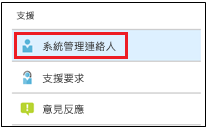

# 在系統管理入口網站中新增和驗證系統管理連絡人

Microsoft 受管理的電腦服務有多種方式可與客戶溝通。 為了簡化溝通並確保我們與正確的人員一起檢查，您必須移工一組系統管理連絡人。 Microsoft 受管理的電腦 IT 作業將會連絡這些人員，以便為您的租用戶協助疑難排解問題。

> [!IMPORTANT]
> 您可能已經在系統管理入口網站新增這些連絡人。 如果是的話，現在請再次確認連絡人清單使ˋ否正確，因為 Microsoft 受管理的電腦**必須**在發生嚴重事件時能夠連絡到他們。

## Azure Active Directory 存取 Microsoft 受管理電腦的系統管理入口網站

Microsoft 受管理電腦的系統管理入口網站要求存取入口網站的人員需要擁有以下其中一個 Azure Active Directory (AD) 角色：
- 全域系統管理員
- Intune 服務系統管理員
- 全域讀取者
- 服務支援系統管理員

全域系統管理員必須是在 Microsoft 受管理的電腦中註冊貴組織的人員。 所有五個角色在系統管理入口網站都擁有相同存取權，以初始化和檢視工作。 如需有關在 Azure AD 中指派這些角色的詳細資訊，請參閱[在 Azure Active Directory 中的系統管理員角色權限](https://docs.microsoft.com/azure/active-directory/users-groups-roles/directory-assign-admin-roles)。 

## 系統管理連絡人重點領域

系統管理連絡人必須是最佳人員或群組，可回答問題並做出不同重點領域的決策。 **Microsoft 受管理的電腦作業將會連絡這些系統管理連絡人，以解決客戶支援要求的問題。** 這些系統管理連絡人將會收到支援要求更新和新訊息的通知。 這些領域包括：

重點領域 | 相關問題
--- | ---
應用程式封裝 | 疑難排解應用程式封裝
裝置 | 裝置健康情況、透過 Microsoft 受管理的電腦裝置進行疑難排解
安全性 | 透過 Microsoft 受管理的電腦裝置疑難排解安全性問題
IT 技術支援 | 如果我們的支援人員將使用者票證交給 Microsoft 受管理的電腦支援領域之外 
其他 | 其他領域未涵蓋的問題

**無論您選擇誰做為這些連絡人，都必須擁有知識和授權，以便為您的 Microsoft 受管理的電腦環境做出決策。** 當您上線 Microsoft 受管理的電腦環境時，系統會提示您為本地技術支援和安全性新增連絡人。 

需要系統管理連絡人才能[提交支援要求](../service-description/support.md)。 您必須擁有針對支援要求之重點領域的系統管理連絡人。 

**若要新增系統管理連絡人**

1.  登入 [Microsoft 受管理電腦的入口網站](https://aka.ms/mwaasportal)。 

2.  在 [支援]**** 底下，選取 [系統管理連絡人]****。 

    

3. 選取 [新增]****。

    ![在系統管理入口網站 [匯出並重新整理] 左方的 [新增]按鈕](images/adminadd.png)

4.  選取 [重點領域]**** 並輸入連絡人資訊。 

    ![重點領域清單，例如 [其他]、[應用程式] 和 [安全性]](images/areaoffocus.png)

5. 每個重點領域的重複。 

## 開始使用 Microsoft 受管理電腦的步驟

1. 在系統管理入口網站中新增和驗證系統管理連絡人 (此主題)
2. [調整條件式存取](conditional-access.md)
3. [指派授權](assign-licenses.md)
4. [在裝置上安裝 Intune 公司入口網站](company-portal.md)
5. [啟用企業狀態漫遊](enterprise-state-roaming.md)
6. [設定 Microsoft 受管理的電腦裝置](set-up-devices.md)
7. [讓您的使用者準備好使用裝置](get-started-devices.md)
8. [將應用程式部署至裝置](deploy-apps.md)
