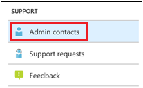

# 在系統管理入口網站中新增和驗證系統管理連絡人Add and verify admin contacts in the Admin portal

Microsoft 受管理的電腦服務有多種方式可與客戶溝通。There are several ways that Microsoft Managed Desktop service communicates with customers. 為了簡化溝通並確保我們與正確的人員一起檢查，您必須移工一組系統管理連絡人。To streamline communication and ensure we’re checking with the right people, you need to provide a set of admin contacts. Microsoft 受管理的電腦 IT 作業將會連絡這些人員，以便為您的租用戶協助疑難排解問題。Microsoft Managed Desktop IT Operations will contact these people for assistance troubleshooting issues for your tenant.

> [!IMPORTANT]
> 您可能已經在系統管理入口網站新增這些連絡人。You might have already added these contacts in the Admin portal. 如果是的話，現在請再次確認連絡人清單使ˋ否正確，因為 Microsoft 受管理的電腦 **必須** 在發生嚴重事件時能夠連絡到他們。If so, take a moment now to double-check that the contact list is accurate, since Microsoft Managed Desktop **must** be able to reach them if a severe incident occurs.

## Azure Active Directory 存取 Microsoft 受管理電腦的系統管理入口網站Azure Active Directory access for Microsoft Managed Desktop Admin portal

Microsoft 受管理電腦的系統管理入口網站要求存取入口網站的人員需要擁有以下其中一個 Azure Active Directory (AD) 角色：Microsoft Managed Desktop Admin portal requires that people accessing the portal have one of these Azure Active Directory (AD) roles:
- 全域系統管理員Global Administrator
- Intune 服務系統管理員Intune Service Administrator
- 全域讀取者Global Reader
- 服務支援系統管理員Service Support Administrator

全域系統管理員必須是在 Microsoft 受管理的電腦中註冊貴組織的人員。The Global Administrator must be the one to enroll your organization in Microsoft Managed Desktop. 所有五個角色在系統管理入口網站都擁有相同存取權，以初始化和檢視工作。All five roles have the same access within the Admin portal to initiate and view tasks. 如需有關在 Azure AD 中指派這些角色的詳細資訊，請參閱[在 Azure Active Directory 中的系統管理員角色權限](/azure/active-directory/users-groups-roles/directory-assign-admin-roles)。For more information on assigning these roles in Azure AD, see [Administrator role permissions in Azure Active Directory](/azure/active-directory/users-groups-roles/directory-assign-admin-roles). 

## 系統管理連絡人重點領域Admin contact areas of focus

系統管理連絡人必須是最佳人員或群組，可回答問題並做出不同重點領域的決策。Admin contacts should be the best person or group that can answer questions and make decisions for different areas of focus. **Microsoft 受管理的電腦作業將會連絡這些系統管理連絡人，以解決客戶支援要求的問題。****Microsoft Managed Desktop Operations will contact these Admin contacts for questions involving support requests filed by the customer.** 這些系統管理連絡人將會收到支援要求更新和新訊息的通知。These Admin contacts will receive notifications for support request updates and new messages. 這些領域包括：These areas include:

重點領域Area of focus | 相關問題For questions about
--- | ---
應用程式封裝App packaging | 疑難排解應用程式封裝Troubleshooting app packaging
裝置Devices | 裝置健康情況、透過 Microsoft 受管理的電腦裝置進行疑難排解Device health, troubleshooting with Microsoft Managed Desktop devices
安全性Security | 透過 Microsoft 受管理的電腦裝置疑難排解安全性問題Troubleshooting security issues with Microsoft Managed Desktop devices
IT 技術支援IT help desk | 當我們的支援人員在 Microsoft 受管理的桌面支援區域以外的使用者票據上進行轉交時in cases where our Support staff hands over user tickets outside of Microsoft Managed Desktop support areas 
其他Other | 其他領域未涵蓋的問題For issues not covered by other areas

**無論您選擇誰做為這些連絡人，都必須擁有知識和授權，以便為您的 Microsoft 受管理的電腦環境做出決策。****Whoever you choose for these contacts needs to have the knowledge and authority to make decisions for your Microsoft Managed Desktop environment.** 當您上線 Microsoft 受管理的電腦環境時，系統會提示您為本地技術支援和安全性新增連絡人。When you onboard your Microsoft Managed Desktop environment, you’re prompted to add contacts for your local Helpdesk and Security. 

需要系統管理連絡人才能[提交支援要求](../service-description/support.md)。Admin contacts are required when you [submit a Support request](../service-description/support.md). 您必須擁有針對支援要求之重點領域的系統管理連絡人。You’ll need to have an admin contact for the focus area of the Support request. 

**若要新增系統管理連絡人****To add admin contacts**

1.  登入 [Microsoft 受管理電腦的入口網站](https://aka.ms/mwaasportal)。Sign in to [Microsoft Managed Desktop admin portal](https://aka.ms/mwaasportal). 

2.  在 [支援] 底下，選取 [系統管理連絡人]。Under **Support**, select **Admin contacts**. 

    

3. 選取 [新增]。Select **Add**.

    ![在系統管理入口網站 [匯出並重新整理] 左方的 [新增]按鈕](../../media/adminadd.png)

4.  選取 [重點領域] 並輸入連絡人資訊。Select an **Area of focus** and enter the info for the contact. 

    ![重點領域清單，例如 [其他]、[應用程式] 和 [安全性]](../../media/areaoffocus.png)

5. 每個重點領域的重複。Repeat for each area of focus. 

## 開始使用 Microsoft 受管理電腦的步驟Steps to get started with Microsoft Managed Desktop

1. 在系統管理入口網站中新增和驗證系統管理連絡人 (此主題)Add and verify admin contacts in the Admin portal (this topic)
2. [調整條件式存取Adjust conditional access](conditional-access.md)
3. [指派授權Assign licenses](assign-licenses.md)
4. [在裝置上安裝 Intune 公司入口網站Install Intune Company Portal on on devices](company-portal.md)
5. [啟用企業狀態漫遊Enable Enterprise State Roaming](enterprise-state-roaming.md)
6. [設定 Microsoft 受管理的電腦裝置Set up Microsoft Managed Desktop devices](set-up-devices.md)
7. [讓您的使用者準備好使用裝置Get your users ready to use devices](get-started-devices.md)
8. [將應用程式部署至裝置Deploy apps to devices](deploy-apps.md)