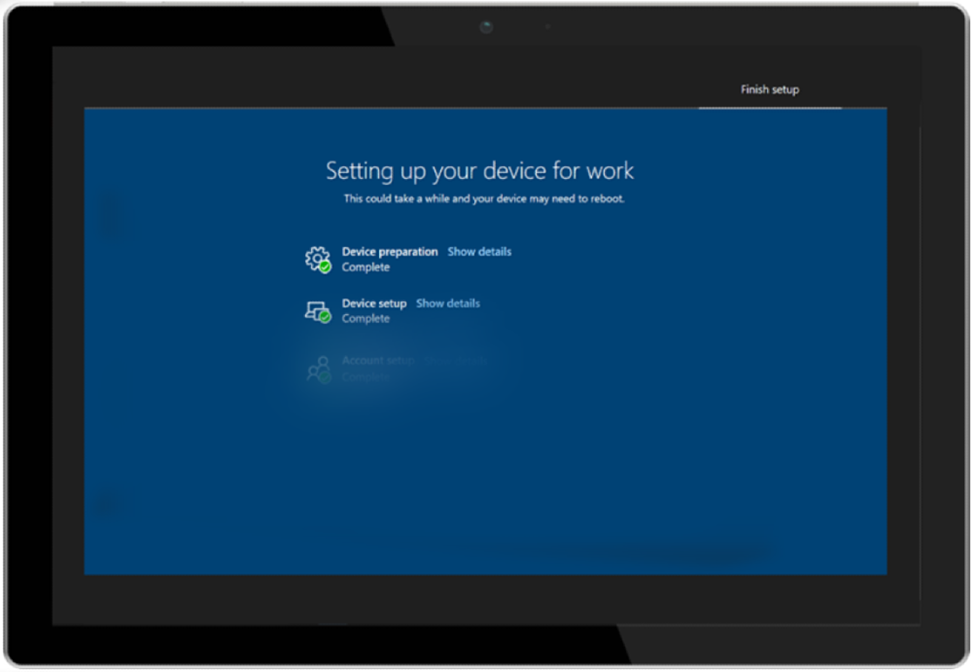

# 使用 Autopilot 和 [註冊狀態] 頁面的初次執行體驗First-run experience with Autopilot and the Enrollment Status Page

Microsoft 受管理的電腦會同時使用[Windows Autopilot](/windows/deployment/windows-autopilot/windows-autopilot)和 Microsoft Intune 的[註冊狀態頁面 (ESP) ](/windows/deployment/windows-autopilot/enrollment-status) ，為您的使用者提供最佳的初次執行體驗。Microsoft Managed Desktop uses both [Windows Autopilot](/windows/deployment/windows-autopilot/windows-autopilot) and Microsoft Intune's [Enrollment Status Page (ESP)](/windows/deployment/windows-autopilot/enrollment-status) to provide the best possible first-run experience to your users.

[註冊狀態] 頁面目前是公開預覽。The Enrollment Status Page is currently in public preview.

## 初始部署Initial deployment

若要提供 ESP 經驗，您必須在 Microsoft 受管理的電腦服務中註冊裝置。To provide the ESP experience, you must register devices in the Microsoft Managed Desktop service. 如需註冊的詳細資訊，請參閱 [自行註冊新裝置](../get-started/register-devices-self.md) 或 [取得協力廠商的步驟，以登錄裝置](../get-started/register-devices-partner.md)。For more about registration, see [Register new devices yourself](../get-started/register-devices-self.md) or [Steps for Partners to register devices](../get-started/register-devices-partner.md).

當裝置向服務註冊後，您可以透過[管理入口網站](https://portal.azure.com/)來歸檔支援票證，以啟用 Microsoft 受管理的電腦裝置的 ESP。Once your devices are registered with the service, you can enable ESP for your Microsoft Managed Desktop devices by filing a support ticket through the [Admin Portal](https://portal.azure.com/). 當您檔案票據時，我們會最初將 ESP 設定部署至測試群組。We will initially deploy the ESP configuration to the Test group when you file the ticket. 將其部署到其他後續的部署群組 (會在每24小時) 一開始、快及寬。It is deployed to the other subsequent deployment groups (First, Fast, and Broad) each 24 hours. 若要暫停部署，請 file 另一個票證要求作業保留。To pause the deployment, file another ticket asking Operations to hold.

## Autopilot 設定檔設定Autopilot profile settings

Microsoft 受管理的電腦會在用於使用者裝置的 Autopilot 設定檔中使用下列設定：Microsoft Managed Desktop uses these settings in the Autopilot profile used for your users' devices:

 

****

|設定Setting|值Value|
|---|---|
|部署模式Deployment mode|使用者驅動User Driven|
|加入 Azure AD asJoin to Azure AD as|Azure AD 已加入Azure AD joined|
|語言 (地區) Language (Region)|使用者選取User Select|
|自動設定鍵盤Automatically configure keyboard|否No|
|Microsoft 軟體授權條款Microsoft Software License Terms|隱藏Hide|
|隱私權設定Privacy settings|隱藏Hide|
|隱藏變更帳戶選項Hide change account options|顯示Show|
|使用者帳戶類型User account type|標準版Standard|
|允許白色 Glove OOBEAllow White Glove OOBE|是Yes|
|套用裝置名稱範本Apply device name template|是Yes|
|輸入名稱Enter a name|MMD-% RAND：11%MMD-%RAND:11%|
|

## 註冊狀態頁面設定Enrollment Status Page settings

Microsoft 受管理的電腦針對註冊狀態頁面體驗使用這些設定：Microsoft Managed Desktop uses these settings for the Enrollment Status Page experience:

 

****

|設定Setting|值Value|
|---|---|
|顯示應用程式與設定檔設定進度Show app and profile configuration progress|是Yes|
|安裝時間超過指定的分鐘數時顯示錯誤Show an error when installation takes longer than specified number of minutes|6060|
|發生時間限制錯誤時顯示自訂訊息Show custom message when time limit error occurs|是Yes|
|錯誤訊息Error message|是的，設定您的裝置所需的時間會比預期的少。Yes, It's taking a little longer to set up your device than expected. 按一下下方開始開始，我們會在背景中完成設定Click below to get started and we'll finish setting up in the background|
|允許使用者收集有關安裝錯誤的記錄Allow users to collect logs about installation errors|是Yes|
|僅顯示頁面至已布由全新體驗 (OOBE) 所布建的裝置Only show page to devices provisioned by out-of-box experience (OOBE)|是Yes|
|在安裝所有應用程式和設定檔之前封鎖裝置使用Block device use until all apps and profiles are installed|是Yes|
|當安裝錯誤發生時，允許使用者重設裝置Allow users to reset device if installation error occurs|是Yes|
|當安裝錯誤發生時，允許使用者使用裝置Allow users to use device if installation error occurs|是Yes|
|在這些必要的應用程式被指派給使用者/裝置之前，封鎖裝置的使用Block device use until these required apps are installed if they are assigned to the user/device|新式工作場所-時間修正Modern Workplace - Time Correction|
|

「註冊狀態」頁面經驗會出現三個階段。The Enrollment Status Page experience occurs in three phases. 如需詳細資訊，請參閱 [註冊狀態頁面追蹤資訊](/mem/intune/enrollment/windows-enrollment-status#enrollment-status-page-tracking-information)。For more, see [Enrollment Status Page tracking information](/mem/intune/enrollment/windows-enrollment-status#enrollment-status-page-tracking-information).

其經驗如下：The experience proceeds as follows:

1. Autopilot 體驗隨即啟動，且使用者輸入其認證。The Autopilot experience starts and the user enters their credentials.
2. 裝置會開啟 [註冊狀態] 頁面，並繼續進行裝置準備和裝置安裝階段。The device opens the Enrollment Status Page and proceeds through Device Preparation and Device Setup phases. 因為停用使用者 ESP，所以第三個步驟 (帳戶設定) *目前已略過* Microsoft 受管理的電腦設定。The third step (Account Setup) is *currently skipped* in the Microsoft Managed Desktop configuration because User ESP is disabled. 裝置重新開機。The device restarts.
3. 重新開機後，裝置會開啟與 **其他使用者** 的 Windows 登入頁面。After restart, the device opens the Windows sign-in page with **Other user**.
4. 使用者再次輸入他們的認證，桌面隨即開啟。The users enter their credentials again and the desktop opens.

> [!NOTE]
> 如果 Windows 10 版本為1903或更新版本，則只有在 ESP 中部署 Win32 應用程式。Win32 apps are only deployed during ESP if the Windows 10 version is 1903 or later.

## 預先布建部署的 AutopilotAutopilot for pre-provisioned deployment

> [!NOTE]
> Microsoft 受管理的電腦中預先布建部署的 Autopilot 目前是公開預覽。Autopilot for pre-provisioned deployment in Microsoft Managed Desktop is currently in public preview.

## 預先布建部署的額外必要條件 AutopilotAdditional prerequisites for Autopilot for pre-provisioned deployment

- 您必須已啟用 [註冊狀態] 頁面 (ESP) 。You must have Enrollment Status Page (ESP) enabled. 如需詳細資訊，請參閱 [初始部署](#initial-deployment)。For more information, see [Initial deployment](#initial-deployment).
- 裝置必須具有有線網路連接。Device must have a wired network connection.
- 如果您有在2020年8月之前使用 Microsoft 受管理的電腦入口網站註冊的裝置，請取消註冊，然後再次註冊。If you have devices that were registered using the Microsoft Managed Desktop portal before August 2020, de-register and register them again.
- 裝置必須有一個原廠映像，其中包含11月2020累積更新[19H1/19H2 2020.11 c](https://support.microsoft.com/topic/november-19-2020-kb4586819-os-builds-18362-1237-and-18363-1237-preview-25cbb849-74af-b8b8-29b8-68aa925e8cc3)或[20H1 2020.11 c](https://support.microsoft.com/topic/november-30-2020-kb4586853-os-builds-19041-662-and-19042-662-preview-8fb07fb8-a7dd-ea62-d65e-3305da09f92e) （如有適當安裝），或必須以最新的 Microsoft 受管理的電腦影像為 reimaged。Devices must must have a factory image that includes the November 2020 cumulative update [19H1/19H2 2020.11C](https://support.microsoft.com/topic/november-19-2020-kb4586819-os-builds-18362-1237-and-18363-1237-preview-25cbb849-74af-b8b8-29b8-68aa925e8cc3) or [20H1 2020.11C](https://support.microsoft.com/topic/november-30-2020-kb4586853-os-builds-19041-662-and-19042-662-preview-8fb07fb8-a7dd-ea62-d65e-3305da09f92e) as appropriate installed or must be reimaged with the latest Microsoft Managed Desktop image.
- 實體裝置必須支援 TPM 2.0 和裝置證明。Physical devices must support TPM 2.0 and device attestation. 不支援虛擬機器。Virtual machines aren't supported. 預先布建程式使用 Windows Autopilot 自我部署功能，因此需要使用 TPM 2.0。The pre-provisioning process uses Windows Autopilot self-deploying capabilities, so TPM 2.0 is required. TPM 證明程式也需要存取一組 HTTPS URLs，這組 HTTPS 對於每個 TPM 提供者都是唯一的。The TPM attestation process also requires access to a set of HTTPS URLs that are unique for each TPM provider. 如需詳細資訊，請參閱[Windows Autopilot 網路需求](/mem/autopilot/networking-requirements#tpm)中的 Autopilot 自行部署模式和 Autopilot 預先布建部署的專案。For more information, see the entry for Autopilot self-deploying mode and Autopilot pre-provisioned deployment in [Windows Autopilot networking requirements](/mem/autopilot/networking-requirements#tpm).

## 預先布建部署的 Autopilot 中的事件順序Sequence of events in Autopilot for pre-provisioned deployment

1. 必要時，IT 系統管理員 reimages 或重設裝置。IT Admin reimages or resets the device if needed.
2. IT 系統管理員會引導裝置、達到現成的體驗，然後按 Windows 鍵五次。IT Admin boots the device, reaches the out-of-box-experience, and presses the Windows key five times.
3. IT 系統管理員會選取 [Windows Autopilot 布建]，然後選取 [**繼續**]。IT Admin selects Windows Autopilot Provisioning and then selects **Continue**. 在 [Windows Autopilot 設定] 畫面上，會顯示裝置的相關資訊。On the Windows Autopilot configuration screen, information will be displayed about the device.
4. IT 系統管理員 **會選取 [** 布建]，以啟動布建處理常式。IT admin selects **Provision** to start the provisioning process.
5. 裝置啟動 ESP，並透過裝置準備工作和設定階段進行。Device starts ESP and goes through device preparation and setup phases. 在裝置設定階段中，您會視 ESP 設定檔) 的確切設定而定，顯示 (**的應用程式安裝 x** 。During the device setup phase, you'll see **App installation x of x** displayed (depending on the exact configuration of the ESP profile).
6. 因為我們停用使用者 ESP，所以在 Microsoft 受管理的電腦設定中，目前已略過 [帳戶設定] 步驟。The account setup step is currently skipped in the Microsoft Managed Desktop configuration, since we disable User ESP.
7. 裝置重新開機。The device restarts.

重新開機之後，裝置會顯示綠色的狀態畫面，並提供重新 **封裝** 按鈕。After it restarts, the device will show the green status screen, with a **Reseal** button.

> [!IMPORTANT]
> 已知問題：Known issues:
>
> - 在 Autopilot 預先布建的部署重新封裝功能之後，ESP 不會再次執行。ESP does not run again after the Autopilot for pre-provisioned deployment reseal function.
> - Autopilot 用於預先布建的部署時，未重新命名裝置。Device are not being renamed by Autopilot for pre-provisioned deployment. 裝置只會在經過 ESP 使用者流程之後重新命名。The device will only be renamed after going through the ESP user flow.

## 變更為 Autopilot 和註冊狀態頁面設定Change to Autopilot and Enrollment Status Page settings

如果 Microsoft 受管理的電腦所使用的安裝程式不完全符合您的需求，您可以透過系統[管理入口網站](https://portal.azure.com/)來進行支援票證的檔。If the setup used by Microsoft Managed Desktop doesn't exactly match your needs, you can  file a support ticket through the [Admin Portal](https://portal.azure.com/). 以下是您可能需要的設定類型的一些範例：Here are some examples of the types of configuration you might need:

### Autopilot 設定變更Autopilot settings change

您可能想要要求其他的裝置名稱範本。You might want to request a different device name template. 不過，您無法變更部署模式、加入 Azure AD As、隱私權設定或使用者帳戶類型。You cannot, however, change Deployment Mode, Join to Azure AD As, Privacy Settings, or User Account Type.

### 註冊狀態頁面設定變更Enrollment Status Page settings change

- [當安裝時間超過指定的分鐘數] 設定時，會顯示 [錯誤] 的較長分鐘數。A longer number of minutes for the "Show an error when installation takes longer than specified number of minutes" setting.
- 顯示的錯誤訊息The error message displayed
- 新增或移除「封鎖裝置使用之前，請先安裝這些必要的應用程式，否則會指派給使用者/裝置」設定中的應用程式。Adding or removing applications in the "Block device use until these required apps are installed if they are assigned to the user/device" setting.

## 必要的應用程式Required applications

- 您必須以新式的工作場所 *裝置群組* 測試、優先、快速及廣泛的目標為目標應用程式。You must target applications in the Modern Workplace *device groups* Test, First, Fast, and Broad. 必須在「系統」內容中安裝應用程式。Applications must install in the "System" context. 在指派給所有群組之前，請務必先使用 Test 群組中的 ESP 完成測試。Make sure to complete testing with ESP in the Test group before you assign them to all groups.
- 任何應用程式都不應該需要重新開機裝置。No applications should require the device to restart. 建議您在建立應用程式套件時，將應用程式設定為「無任何作用」（如果需要重新開機）。We recommend that applications be set to "Do nothing" when you build the application package if they will require a restart.
- 僅在使用者登入裝置時立即需要的核心應用程式中，才限制必要的應用程式。Limit required applications to only the core applications that a user needs immediately when they sign in to the device.
- 保留所有低於 1 GB 的應用程式總大小，以避免應用程式安裝階段超時。Keep the total size of all applications collectively under 1 GB to avoid timeouts during the application installation phase.
- 理想狀況下，應用程式不應有任何相依性。Ideally, apps should not have any dependencies. 如果您的應用程式 *必須* 有相依性，請務必在 ESP 評估中進行設定、測試及驗證。If you have apps that *must* have dependencies, be sure you configure, test, and validate them as part of your ESP evaluation.
- 不需要 "user" 內容的應用程式 (例如，Teams) 可以包含在 ESP 的公開預覽中。No applications that require the "user" context (for example, Teams) can be included in the public preview of ESP.
