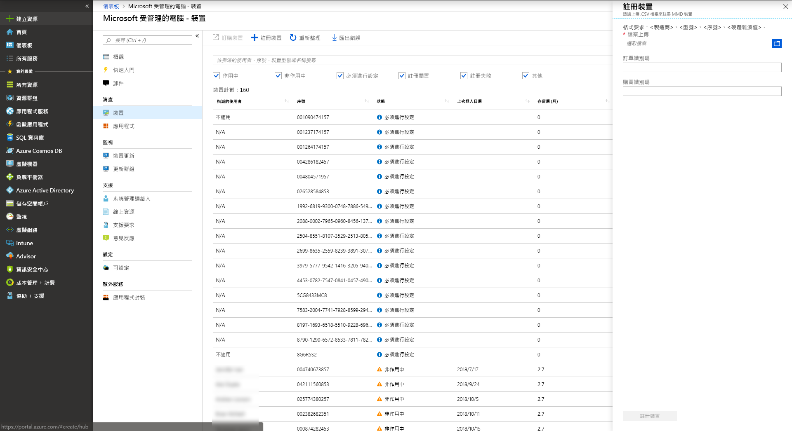

# <a name="register-devices-in-microsoft-managed-desktop"></a>Microsoft 受管理電腦中註冊裝置

>[!NOTE]
>本主題說明您註冊裝置上您自己的步驟。 中[註冊裝置的合作夥伴的 Microsoft 受管理電腦中](register-devices-partner.md)會說明協力廠商的程序。

Microsoft 受管理的電腦可搭配全新的裝置，或者您可以重新使用您可能已有的裝置 （這會需要，您重新影像它們）。 您可以在 Azure 入口網站上使用 Microsoft 受管理電腦中註冊裝置，或使用 API 獲得的彈性。

## <a name="prepare-to-register-devices"></a>準備註冊裝置

如果您已經尚未取得您想要使用、 檢查[Microsoft 受管理的電腦裝置](../service-description/device-list.md)以及與以採購裝置合作夥伴合作，的裝置支援的裝置。

不論您正在使用全新的裝置，或者重新使用現有的項目，來註冊 Microsoft 受管理的電腦，您需要準備的**以逗號分隔 (CSV) 檔案**。 此檔案應包含每個裝置的下列資訊：

>[!NOTE]
>這種格式是只自助註冊。 合作夥伴應使用的格式已記錄在[登錄中的協力廠商的 Microsoft 受管理電腦的裝置](register-devices-partner.md)。

這些值用於顯示用途，並不需要完全相符之裝置的屬性。
- 裝置製造商 (範例： SpiralOrbit) 
- 裝置型號 (範例： ContosoABC)
- 裝置序號

硬體雜湊必須完全符合。
- 硬體雜湊

若要取得硬體雜湊您可以從您的 OEM 或協力廠商尋求協助，或針對每個裝置遵循下列步驟：

1.  以系統管理權限開啟 PowerShell 命令提示字元。
2.  執行`Install-Script -Name Get-WindowsAutoPilotInfo`
3.  執行`powershell -ExecutionPolicy Unrestricted Get-WindowsAutopilotInfo -OutputFile <path>\hardwarehash.csv`


或者，您可以在全新的裝置上遵循下列步驟 （之前第一次經由 OOBE）：

1. 在不同裝置上，插入 USB 磁碟機。
2. 以系統管理權限開啟 PowerShell 命令提示字元。
3. 執行`Save-Script -Name Get-WindowsAutoPilotInfo -Path <pathToUsb>`
4. 在目標裝置上，開啟，但不是會啟動安裝程式的經驗。 如果您不小心開始的安裝體驗，您必須重設或重新裝置。
5. 插入的 USB 磁碟機，並按下 SHIFT + f10 時會顯示功能表。
6. 以系統管理權限，開啟 PowerShell 命令提示字元，然後執行`cd <pathToUsb>`。
7. 執行`Set-ExecutionPolicy -ExecutionPolicy Unrestricted`
8. 執行`.\Get-WindowsAutoPilotInfo -OutputFile <path>\hardwarehash.csv`
3. 移除的 USB 磁碟機，然後關閉該裝置，藉由執行`shutdown -s -t 0`

>[!IMPORTANT]
>不 power 目標裝置上一次直到您已經完成註冊為它。 

>[!NOTE]
>以方便您使用，您可以下載這個 CSV 檔案的[範本](https://github.com/MicrosoftDocs/microsoft-365-docs/raw/public/microsoft-365/managed-desktop/get-started/downloads/device-registration-sample-partner.xlsx)。

您的檔案必須包含**完全相同的欄名**為其中一個範例 （製造商、 型號、 等），但您自己的資料列的資料。 如果您使用的範本，在編輯 [記事本] 之類的文字中開啟，並且考慮離開的所有資料列 1 單獨中的，只輸入資料，資料列 2 中下, 面。 
    
  ```
 Manufacturer,Model,Serial Number,Hardware Hash
  SpiralOrbit,ContosoABC,000000000000,dGhpc2RldmljZWlzYW5tbWRkZXZpY2U
  
  
  ```

>[!NOTE]
>如果您忘記變更其中一個範例資料，將會失敗註冊。   


## <a name="register-devices-by-using-the-azure-portal"></a>使用 Azure 入口網站來註冊裝置

從 Microsoft 受管理電腦的 [ [Azure 入口網站](https://aka.ms/mmdportal)中，選取 [在左側的導覽窗格中的**裝置**。 選取 [ **+ 註冊裝置**;飛出視窗中開啟：

[](images/register-devices-flyin-sterile.png)


[//]: # (可惜這不是，則為 true。我們可以移除此附註-但現在離開它，直到我們有機會關於該聊天室。)

<!--Registering any existing devices with Managed Desktop will completely re-image them; make sure you've backed up any important data prior to starting the registration process.-->


請遵循下列步驟：

1. 在 [**檔案上傳**，提供您先前建立的 CSV 檔案的路徑。
2. （選用） 您可以新增**順序識別碼**或**購買識別碼**自己追蹤的目的。 沒有這些值的格式需求。
3. 選取 [**註冊的裝置**]。 系統會將裝置新增至您的**裝置] 刀鋒視窗中**，標示為 [**擱置中註冊**裝置的清單。 註冊通常採用小於 10 分鐘，並成功時裝置將會顯示為**使用者準備**這很好，等待使用者開始使用。


您可以監視進度的主要**Microsoft 受管理電腦的 [裝置**] 頁面上的裝置註冊。 報告那里可能的狀態包括：

| 狀態 | 描述 |
|---------------|-------------|
| 註冊暫止 | 註冊未尚未完成。 請稍後再回來。 |
| 註冊失敗 | 無法完成註冊。 如需詳細資訊，請參閱[疑難排解](register-devices-self.md#troubleshooting)。 |
| 準備使用者 | 註冊成功，而且裝置已準備好要傳遞給使用者。 Microsoft 受管理的電腦會逐步引導其第一次 」 設定，因此不需要為您進行任何進一步的準備工作。 |
| Active | 裝置已經傳送給使用者，他們必須註冊您的租用戶。 這也表示他們定期使用裝置。 |
| 非使用中 | 裝置已經傳送給使用者，他們必須註冊您的租用戶。 不過，他們有不適用於裝置最近 （過去 7 天）。  | 


## <a name="register-devices-by-using-an-api"></a>使用 API 來註冊裝置

REST API 就可讓您更大的彈性和重複性與經常不同的裝置註冊。 目前，若要使用 API，請尋求協助從您的 Microsoft 連絡人加入這項功能的預覽。


## <a name="troubleshooting"></a>疑難排解

| 錯誤訊息 | 詳細資料 |
|---------------|-------------|
| 找不到裝置 | 我們無法註冊此裝置，因為我們找不到相符項目提供的製造商、 模型，或序號。 與您的裝置供應商確認這些值。 |
| 找不到裝置 | 我們無法取消註冊此裝置，因為不存在於您的組織。 不再需要的動作。 |
| 不正確的硬體雜湊 | 您提供此裝置的硬體雜湊格式不正確。 請仔細檢查硬體雜湊，然後重新提交。 |
| 已註冊的裝置 | 此裝置已登錄至您的組織。 不再需要的動作。 |
| 另一個組織所宣告的裝置 | 此裝置已經被另一個組織所宣告。 請與您的裝置供應商。 |
| 未預期的錯誤 | 無法自動處理您的要求。 連絡支援人員，並提供 「 要求識別碼：<requestId> |


