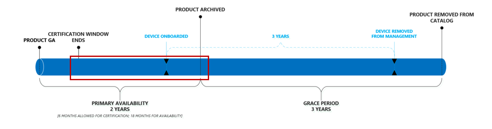

# Microsoft 受管理的桌面產品生命週期Microsoft Managed Desktop product lifecycle

Microsoft 受管理的桌面權益使用者可確保他們始終使用提供最佳效能、可靠性、設計及安全性功能的裝置 (例如, 支援 Windows Hello 等功能)。Microsoft Managed Desktop benefits end-users assuring that they always use devices that offer the best performance, reliability, design, and security capabilities (such as support for features like Windows Hello). 為了達到此目的, Microsoft 受管理的桌面會維護持續更新的[已核准裝置](device-list.md)的簡短目錄。To accomplish this, Microsoft Managed Desktop maintains a short catalog of continuously updated [approved devices](device-list.md). 
 
本主題會詳細說明從已核准的目錄中新增及移除裝置時的裝置生命週期。This topic details the lifecycle of devices as they are added and removed from the approved catalog. 

> [!NOTE]
> 在本主題中, 我們將在「裝置」和「產品」之間進行區分。In this topic, we'll make a distinction between a "device" and a "product." 根據「裝置」, 我們指的是一個個別的特定電腦。By “device,” we mean one individual, specific computer. 例如, 「序號碼1234」、「帳單的膝上型電腦」、「共用 VM XYZ」參照特定的裝置。For example, “Serial number 1234”, “Bill’s laptop”, “Shared VM XYZ” refer to specific devices. 不過, 「產品」指的是裝置的集合或系列。A “product”, however, refers to a collection or family of devices. 例如, 「Fabrikam 膝上型電腦」、「Adatum ZX450 膝上型電腦」等等。這一點很重要, 因為產品會新增至[核准的清單](device-list.md)或目錄, 而裝置則會註冊至 Microsoft 受管理的電腦。For example, “Fabrikam Laptop”, “Adatum ZX450 Laptop”, etc. This is important because products are added to our [approved list](device-list.md), or catalog, and devices are what get enrolled into Microsoft Managed Desktop.

## 產品生命週期Product lifecycle

 一般來說, 產品會在下列生命週期階段中移動:Generally, products move through these lifecycle phases:

- [產品版本與評估Product release and evaluation](#product-release-and-evaluation)
- [產品主要可用性期間Product primary availability period](#product-primary-availability-period)
- [產品寬限期Product grace period](#product-grace-period)
- [產品退休Product retirement](#product-retirement)

整個順序如下圖所示:The entire sequence is depicted in this illustration:

產品保留在目錄中最多24個月, 但是*裝置*會維持在管理下的個別註冊日期為3年。Products remain on the catalog for up to 24 months, but *devices* remain under management for 3 years based on their individual enrollment dates. 實際上, 每個產品都有三個重要的日期, 但是每個裝置只有一個。Effectively, each product has three important dates, but each device has only one. 對於產品, 這三個日期都是根據*核准日期*來計算, 因此我們會在核准時發佈這些日期, 因此您可以隨時對產品的整個生命週期進行適當的查看和規劃。For products, all three of these dates are calculated based on the *approval date*, and therefore we publish these dates upon approval so that you can always look ahead and plan appropriately for the product's entire lifecycle.

下表顯示理論產品的範例日期:This table shows example dates for a theoretical product:

|ProductProduct  |核准日期Approved date  |主要可用性結束End of primary availability  |Eligiblity 的結尾End of eligiblity  |
|---------|---------|---------|---------|
|Fabrikam 膝上型電腦Fabrikam Laptop    | 1/1/20171/1/2017 | 6/1/20196/1/2019 | 6/1/20226/1/2022 |
|Adatum 膝上型電腦Adatum Laptop   | 1/1/20181/1/2018 | 6/1/20206/1/2020 | 6/1/20236/1/2023  |

下表顯示理論*裝置*的範例日期:This table shows example dates for theoretical *devices*:

|裝置識別碼Device ID  |註冊日期Enrollment date  |退休日期Retirement date  |
|---------|---------|---------|
|膝上型電腦 #123412Laptop #123412     |  2/3/20182/3/2018       |  2/3/20212/3/2021       |
|桌面 #321513Desktop #321513     | 6/2/20186/2/2018        |  6/2/20216/2/2021       |

## 產品版本與評估Product release and evaluation

當製造商公開發行產品時, 產品生命週期便會開始:The product lifecycle starts when a manufacturer publicly releases the product:

在此階段中, Microsoft 受管理的桌面工程小組會做為產品的評估和認證。During this stage, the Microsoft Managed Desktop engineering team does their evaluation and certification of a product. 此小組會評估與 Windows 的可靠性和效能等事項, 以及與硬體基準、市場 sentiment 以及清查和管道準備的相容性等專案。The team evaluates things like reliability and performance with Windows, compliance with a hardware baseline, market sentiment, and inventory and channel readiness, among other things. 此程式通常需要大約6周的時間。This process typically takes approximately 6 weeks.
  
Microsoft 受管理的桌面只會評估其前6個月內的認證的裝置。Microsoft Managed Desktop will only evaluate devices for certification within their first 6 months of availability. 這可確保我們永遠致力於最新的硬體產生。This ensures that we’re always focusing our efforts on the latest generation of hardware.
 
在這個階段結束時, Microsoft 受管理的桌面會將產品新增至[核准清單](device-list.md), 有效地釋放產品以供客戶註冊。At the end of this phase, Microsoft Managed Desktop adds the product to the [approved list](device-list.md), effectively releasing the product for customer enrollments. 不論裝置認證的日期為何, 其**核准的日期**都將追溯至產品擁有的正式供貨日期。Regardless of the date when a device is certified, its **approved date** is be back-dated to the products own general availability date. 

## 產品主要可用性期間Product primary availability period

此期間是產品可用性的核心:This period is the core of product availability:

在此期間內註冊的任何裝置都會從 Microsoft 受管理的桌面取得完整的三年支援 (如藍色時程表所示)。Any device enrolled during this period receives the full three years of support from Microsoft Managed Desktop (as shown by the blue timeline). 此期間會持續到結束日期設為從一般可用日期起的24個月。This period lasts until an end date set to 24 months from the general availability date.

您可以將此期間視為有效的「開啟註冊」, 因此若要最大化 Microsoft 受管理電腦的值, 您應該針對您的採購模型及所選產品在此期間內。You can think of this period as effectively “open enrollment”, so to maximize the value of Microsoft Managed Desktop, you should target your procurement models and selected products to fall within this period. 一小的範例是, 客戶應該避免使用主要可用性的最後一個月份的產品來結算2年的外滾期間, 大多數的裝置將不會收到完整的三年 Microsoft 受管理的桌面管理 (請參閱[寬限period](#product-grace-period)以取得詳細資訊)。As a small example, a customer should avoid settling on a two-year roll-out period using a product that is in its final month of primary availability – most of those devices will not receive the full three years of Microsoft Managed Desktop management (see [grace period](#product-grace-period) for more information).  

## 產品寬限期Product grace period

產品寬限期是一年三年後的主要可用性。The product grace period is a three-year period following primary availability. 此階段可讓您註冊來自支援的產品系列的裝置, 但仍保留公司, 以確保 Microsoft 受管理的桌面對現代硬體和裝置效能的承諾。This phase allows you to enroll devices that are from a supported product family, but still hold firm to the promises of Microsoft Managed Desktop regarding modern hardware and device performance. 此階段適用于在瞭解 Microsoft 受管理的電腦之前進行採購決策的客戶。This phase is ideal for customers who have made procurement decisions before knowing about Microsoft Managed Desktop. 

如果您在註冊 Microsoft 受管理的電腦之前, 最近購買過大量的已核准裝置, 您仍然可以註冊它們, 但是您將不會收到完整的三年管理。If you've recently bought a number of approved devices prior to enrolling with Microsoft Managed Desktop, you can still enroll them, but you won’t receive a full three years of management. 相反地, 它們會因退休日期而不相符, 不管他們何時註冊。Instead, they’ll fall out of compliance on the retirement date, regardless of when they were enrolled. 在幕後, Microsoft 受管理的桌面會將這些裝置視為在主要可用性的最後一天註冊。Behind the scenes, Microsoft Managed Desktop will treat these devices as if they were enrolled on the last day of primary availability. 在此圖中, 您可以在下列情況中看到藍屏和綠色裝置都結束于同一天, 但在註冊時有一年的差異:In this illustration, you can see this scenario by noting that both the blue and green device end on the same day, despite their one-year difference in enrollment:

上表中的 Fabrikam 膝上型電腦範例說明這種情況:The Fabrikam Laptop example from the previous table illustrates this situation: 

|ProductProduct  |核准日期Approved date  |主要可用性結束End of primary availability  |Eligiblity 的結尾End of eligiblity  |
|---------|---------|---------|---------|
|Fabrikam 膝上型電腦Fabrikam Laptop    | 6/1/20176/1/2017 | 6/1/20196/1/2019 | 6/1/20226/1/2022 |

就像客戶一樣, 您可以在6/1/2022 之前註冊 Fabrikam 膝上型電腦, 直到您在6/1/2019 上註冊它們時, 才會被視為。As a customer, you can enroll Fabrikam Laptops all the way until 6/1/2022 – however they will all be treated as though you enrolled them on 6/1/2019. 如果您在6/1/2021 上註冊 Fabrikam 膝上型電腦, 您只需要一年的管理。If you enroll a Fabrikam Laptop on 6/1/2021 you'll only get one year of management. 此原則可讓您從先前支援的產品提取部分生命週期, 而不是提前購買新的裝置。This policy allows you to extract partial lifecycles from products that were previously supported, rather than having to procure new devices prematurely. 

最後, 在此階段中, 裝置會從[裝置清單](device-list.md)中移除並移至封存的[裝置清單](archived-device-list.md)。Finally, during this phase the device is removed from the [device list](device-list.md) and moved to the [archived device list](archived-device-list.md).

## 產品退休Product retirement

產品退休是生命週期的最後階段。Product retirement is the final phase of the lifecycle. 在這個階段中, 無法在 Microsoft 受管理的電腦上註冊該產品類型的新裝置, 而且根據定義, 所有現有的裝置現在都超出允許的三年期限。In this phase, no new devices of that product type can be enrolled in Microsoft Managed Desktop and, by definition, all existing devices are now outside their allowed three-year term. 在這段時間內, Microsoft 受管理的桌面會將裝置從公用清單中徹底移除。During this time, Microsoft Managed Desktop will remove the device from the public list entirely. 在這個階段中, 如果您尚未知道取代, 您將會開始向下移動服務, 因為 Microsoft 受管理的桌面會開始向下延展到不符合規範的裝置。It’s also during this phase where, if you haven't already procured replacements, you'll start to see diminished services as Microsoft Managed Desktop starts to ramp down on the devices which are out of compliance. 

## 不相容的裝置Devices that are out of compliance

當 Microsoft 受管理的桌面管理允許的視窗已過, 裝置就不符合規範。A device is out of compliance when its allowed window for Microsoft Managed Desktop management has elapsed. 當裝置已達到三年的管理, 或從裝置目錄移除該產品類型時, 會發生這種情況, 這會先發生什麼情況。This occurs when the device has reached three years of management or when that product type is removed from the device catalog, whichever occurs first. 您應該一直瞄準您的採購週期, 如此一來, 新的裝置會在目前的裝置不相容的情況之前部署。You should always target your procurement cycles such that new devices are deployed prior to current devices going out of compliance.

Microsoft 受管理的桌面小組知道採購週期很長, 而且會圍繞長期執行的預算進行規劃。The Microsoft Managed Desktop team knows that procurement cycles are long and planned around long-running budgets. 為了確保您始終知道裝置人口的狀態, 我們提供一個[網站](https://aka.ms/mmdportal), 列出管理下的每個裝置、未來的退休日期, 以及指出其合規性的狀態。To ensure that you're always aware of the state of your device population, we provide a [website](https://aka.ms/mmdportal) that lists every device under management, its future retirement date, and a status indicating its compliance. 這表示您永遠會有裝置保留時間的最新資訊, 並可在任何採購規劃週期中利用報告。This means you always have the latest information regarding device age and can leverage the report in any procurement planning cycle. 

此外, 我們也會採取下列自動化動作, 以確保新裝置按時部署:In addition, the we will also take the following automated actions to ensure that new devices are deployed on time:

|時間表Timeline  |動作Action  |
|---------|---------|
|T-90T-90     | 我們會將此裝置標記為即將**過期**, 並在裝置清查網站上加上黃色標記。We'll flag this device as **expiring soon**, with a yellow marker on the device inventory website.  |
|T-60T-60     | 我們會使用裝置清查網站上的紅色標記, 將此裝置標記為 [已**過期**]。We'll flag this device as **expiring** with a red marker on the device inventory website.       |
|T-30T-30     | 我們會將訊息張貼至系統管理入口網站, 指出裝置的 imminently 已退出規範。We'll post a message to the Admin Portal saying that devices are imminently exiting compliance.       |
|零0     |  我們會調整系統管理入口網站, 表示裝置現在已過期將系統管理員重新導向裝置清單上的土地。We'll adjust the Admin Portal to say that devices are now expired redirect admins to land on the device list first.       |
|T + 30T+30     |  在部署新的裝置之前, 我們會降低系統管理入口網站的功能。We'll reduce Admin Portal functionality until new devices are deployed.       |
|T + 60T+60     |  在部署新的裝置之前, 我們會降低系統管理入口網站的功能。We'll reduce Admin Portal functionality until new devices are deployed.       |
|T + 90T+90     |  我們從管理移除裝置。We remove the device from management. 此時, 裝置只是您自己的責任, 您應該不會再認為它是安全的, 也不是最新的。At this point, the device is solely your own responsibility and you should no longer consider it secure nor up to date. 此外, 裝置也會處於未知狀態, 因為每個設定服務提供者會控制自己的設定。Also the device will be in an unknown state since each Configuration Service provider controls its own settings.|

