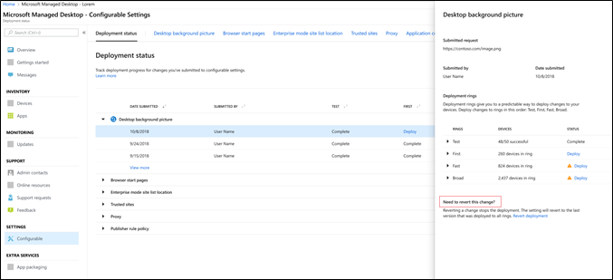

# 部署及追蹤組態設定-Microsoft 受管理的桌上型電腦Deploy and track configurable settings - Microsoft Managed Desktop

您變更設定類別和階段部署之後，您可以部署及部署狀態追蹤部署進度。此頁面會顯示每個可設定的摘要。開啟 [設定類別以查看每個部署及其詳細資料，來部署所做的變更]。After you make changes to your setting categories and stage a deployment, you can deploy and track progress for the deployment on Deployment status. This page shows a summary of each configurable setting. Open a setting category to see each deployment and their details, to deploy the changes. 

## 部署狀態Deployment statuses 

這些是您會看見的每個部署雕像。These are the statues you’ll see for each deployment.

狀態Status  | 說明Explanation 
--- | --- 
部署Deploy | 您的變更正在等待部署至這個響鈴。Your change is waiting to be deployed to this ring.
進行中In progress | 變更會套用到此響鈴的裝置。The change is being applied to devices in this ring. 
完整Complete | 變更會套用到此響鈴的裝置。The change is being applied to devices in this ring. 
失敗Failed | 變更失敗 10%的響鈴的裝置上以便部署已停止。The change failed on a 10 percent of devices in the ring, so the deployment was stopped.   支援要求將會自動開啟 Microsoft 受管理的桌上型電腦每日操作來疑難排解部署。A support request will be automatically opened with Microsoft Managed Desktop operations to troubleshoot the deployment. 
CsdeviceupdateconfigurationReverted | 變更已還原成已成功部署至所有部署鈴響的最後一個修訂。The change was reverted to the last change that was successfully deployed to all deployment rings.

## 部署的變更Deploy changes

我們將這些指示中顯示桌面背景圖片。您已分段部署之後，您部署從部署狀態的變更。We’ll show Desktop background picture in these instructions. After you’ve staged a deployment, you deploy changes from Deployment status. 

**若要部署的變更****To deploy changes**

1. 登入[Microsoft 受管理的桌上型電腦管理入口網站](http://aka.ms/mwaasportal)Sign in to [Microsoft Managed Desktop Admin portal](http://aka.ms/mwaasportal)
2. [**設定**] 下選取 [**可設定**]。Under **Settings**, select **Configurable**.
3. 在**部署狀態**工作區中，選取您想要部署的設定，然後選取要部署分段的部署。In **Deployment status** workspace, select the setting you want to deploy, and then select the staged deployment to deploy.
4. 選取其中一個部署鈴響部署變更的**部署**。Select **Deploy** to deploy the change to one of the deployment rings.

Microsoft 受管理的桌上型電腦建議部署至部署鈴響順序如下： 測試、 第一個、 快速且然後廣泛。Microsoft Managed Desktop recommends deploying to deployment rings in this order: Test, First, Fast, and then Broad. 

當每一個環內完成變更時、 狀態變更為**完成**。When changes complete in each ring, the status changes to **Complete**.

## 回復部署Revert deployment

我們將這些指示中顯示桌面背景圖片。We’ll show Desktop background picture in these instructions. 

您已部署變更後，您可以回復從**部署狀態**。當您將回復為**進行中**或**完成**的變更時，會停止目前的部署。設定還原至最後一個已部署至所有鈴響的版本。After you’ve deployed a change, you can revert from **Deployment status**. When you revert a change that is **In progress** or **Complete**, the current deployment stops. The setting will revert to the last version that was deployed to all rings. 

**若要將回復變更****To revert a change**
1. 登入[Microsoft 受管理的桌上型電腦管理入口網站](http://aka.ms/mwaasportal)Sign in to [Microsoft Managed Desktop Admin portal](http://aka.ms/mwaasportal)
2. [**設定**] 下選取 [**可設定**]。Under **Settings**, select **Configurable**.
3. 在**部署狀態**工作區中，選取想要還原，的設定，然後選取要還原分段的部署。In **Deployment status** workspace, select the setting you want to revert, and then select the staged deployment to revert.
4. **必須回復此變更**，請選取 [**還原部署**。Under **Need to revert this change**, select **Revert deployment**.

 

## 其他資源Additional resources
- [組態設定概觀 （英文)Configurable settings overview](config-setting-overview.md)
- [可設定的設定參考 （英文)Configurable settings reference](config-setting-ref.md) 