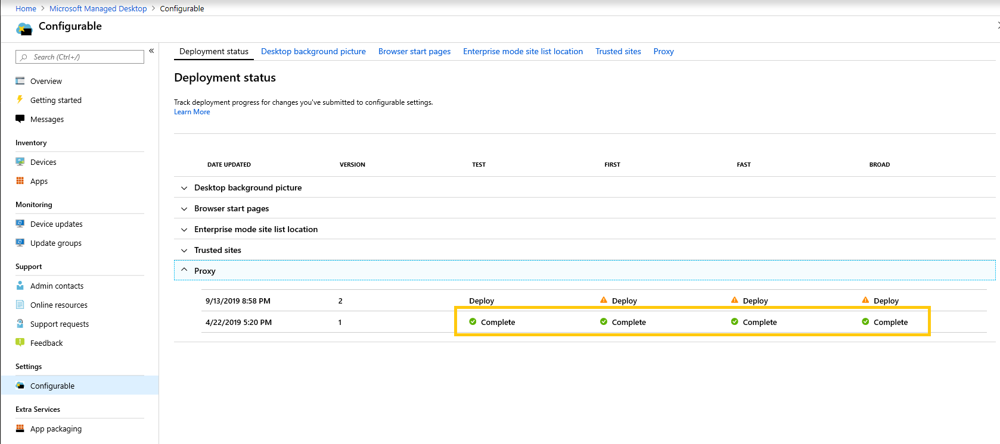

# 部署及追蹤可設定的設定-Microsoft 受管理的電腦Deploy and track configurable settings - Microsoft Managed Desktop

變更您的設定類別及階段部署之後，部署狀態頁面可讓您開始將設定部署至群組。After you make changes to your setting categories and stage a deployment, the Deployment status page allows you to begin deploying your settings to groups. 此頁面會顯示每個可設定設定的摘要。This page shows a summary of each configurable setting. 開啟設定類別後，您就可以將設定部署至群組，並追蹤這些部署的進度。By opening a setting category you can deploy settings to groups and track the progress of these deployments.

## 部署狀態Deployment statuses

您會看到每個部署的狀態。These are the statuses you’ll see for each deployment.

狀態Status | 說明Explanation
--- | ---
部署Deploy | 您的變更等候部署至此群組。Your change is waiting to be deployed to this group.
進行中。In progress | 變更會套用到此群組中的使用中裝置。The change is being applied to active devices in this group.
已完成Complete | 在此群組中所有作用中裝置上的變更已完成。The change completed on all active devices in this group.
失敗Failed | 變更群組中的10% 作用中裝置時失敗，所以部署已停止。The change failed on a 10 percent of active devices in the group, so the deployment was stopped.   系統會自動開啟支援要求，以進行部署的疑難排解 Microsoft 受管理的電腦作業。A support request will be automatically opened with Microsoft Managed Desktop operations to troubleshoot the deployment.
恢復Reverted | 變更已還原為已成功部署至所有部署群組的最後變更。The change was reverted to the last change that was successfully deployed to all deployment groups.

## 部署變更Deploy changes

在這些指示中，我們會顯示桌面背景圖片。We’ll show Desktop background picture in these instructions. 在分段部署之後，您可以從 [部署狀態] 頁面部署變更。After you’ve staged a deployment, you deploy changes from the Deployment status page.

**若要部署變更****To deploy changes**

1. 登入 [Microsoft 端點管理員](https://endpoint.microsoft.com/)，並流覽至 [**裝置**] 功能表Sign in to [Microsoft Endpoint Manager](https://endpoint.microsoft.com/) and navigate to the **Devices** menu
2. 尋找 [Microsoft 受管理的電腦] 區段中，選取 [**設定**]。Look for the Microsoft Managed Desktop section, select **Settings**.
3. 在 [ **部署狀態** ] 工作區中，選取您要部署的設定，然後選取要部署的分段部署。In **Deployment status** workspace, select the setting you want to deploy, and then select the staged deployment to deploy.
4. 選取 [ **部署** ]，將變更部署至其中一個部署群組。Select **Deploy** to deploy the change to one of the deployment groups.

> [!NOTE]
> 橙色的警告圖示會指出有一個舊的群組可供部署，因此建議您在順序中執行。The orange caution icon indicates there is a previous group available for deployment as it’s recommended to roll out in order.

<!-- Needs picture updated to show MEM  -->

建議依照此順序部署至部署群組： Test、First、Fast 及寬泛。We recommend deploying to deployment groups in this order: Test, First, Fast, and then Broad. 

每個群組中的變更完成時，狀態變更為 [ **完成**]。When changes complete in each group, the status changes to **Complete**.

<!-- Needs picture updated to show MEM  -->

## 還原部署Revert deployment

在您部署變更之後，您可以從 **部署狀態** 還原。After you’ve deployed a change, you can revert from **Deployment status**. 當您還原 **進行中** 或 **完成** 的變更時，目前的部署會停止。When you revert a change that is **In progress** or **Complete**, the current deployment stops. 設定會還原為所有群組部署的最後一個版本。The setting will revert to the last version that was deployed to all groups.

我們將使用桌面背景圖片做為範例，顯示還原變更的步驟。We’ll show the steps to revert a change using the Desktop background picture as an example. 

**還原變更****To revert a change**

1. 登入 [Microsoft 端點管理員](https://endpoint.microsoft.com/)，並流覽至 [**裝置**] 功能表Sign in to [Microsoft Endpoint Manager](https://endpoint.microsoft.com/) and navigate to the **Devices** menu
2. 尋找 [Microsoft 受管理的電腦] 區段中，選取 [**設定**]。Look for the Microsoft Managed Desktop section, select **Settings**.
3. 在 [ **部署狀態** ] 工作區中，選取您要還原的設定，然後選取要還原的分段部署。In **Deployment status** workspace, select the setting you want to revert, and then select the staged deployment to revert.
4. 在 [ **需要回復此變更嗎？**] 下，選取 [ **還原部署**]。Under **Need to revert this change?**, select **Revert deployment**.

<!-- Needs picture updated to show MEM  -->

## 其他資源Additional resources

- [可設定的設定概述Configurable settings overview](config-setting-overview.md)
- [可設定的設定參考Configurable settings reference](config-setting-ref.md) 
