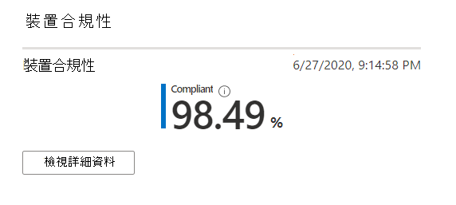

# 裝置合規性報告

此視圖顯示符合 Microsoft Intune 中設定之相容性原則的 Microsoft 受管理桌面裝置百分比。

選取 [**查看詳細資料**]，以查看所有 Microsoft 受管理桌面裝置的特定資訊，或只查看不符合合規性原則的裝置。 使用下拉式功能表在這些視圖之間切換。 若要顯示在此視圖中，裝置必須是實體機器，且已于過去30天內與 Intune 同步。

![包含所有裝置或非相容裝置的索引標籤的詳細資料窗格。 顯示詳細的架構，包括序號碼、裝置名稱、符合性狀態，以及其他資訊。 [下載完整資料] 按鈕底部。](../../media/mmd-device-compliance-detail.png)

在此視圖中，選取 [**下載完整資料**] 以匯出具有相同資訊的逗點分隔檔案。 在匯出檔案中，顯示為**架構**的區域會顯示為欄。