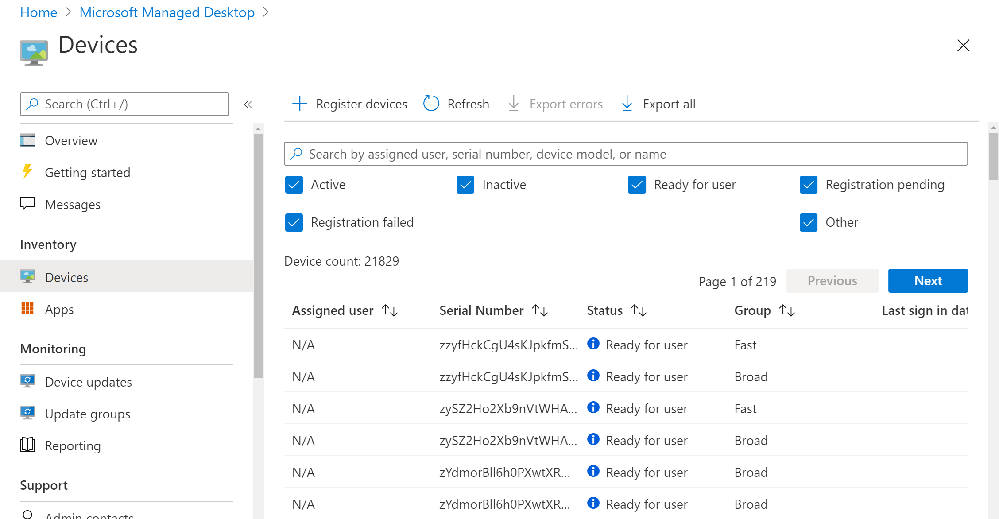

# 裝置庫存報告Device inventory report

在 [ **裝置** ] 視圖中，您可以選取 [ **全部匯出** ] 索引標籤，以下載包含此資訊的逗點分隔檔案：In the **Devices** view, you can select the **Export all** tab to download a comma-delimited file including this information:

- 序號Serial Number
- 裝置名稱Device Name
- 裝置上次簽入Device Last check-in
- 管理者Managed By
- 製造商Manufacturer
- ModelModel
- 作業系統OS
- 作業系統授權OS License
- 作業系統版本OS Version
- 擁有權Ownership
- 登記日期Enrollment Date
- 震鈴名稱Ring Name
- 儲存體 GB （GB 可用）Storage - Free in GB
- 儲存體-單位 GB 的總數Storage - Total in GB
- 由使用者 UPN 註冊Enrolled by User UPN
- 指派的使用者Assigned User
- 狀態Status
-  (月的年齡) Age (Months)
- 設定檔Profile
- 登入的使用者Logged in Users
- TPM 版本TPM version
- 已啟用安全啟動Secure Boot Enabled
- 主要磁片類型Primary Disk Type
- 實體記憶體總數Total Physical Memory

