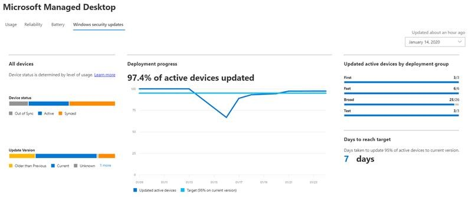

# Windows 安全性更新深入解析Windows security update insights
此視圖提供 Microsoft 受管理桌面裝置之安全性更新狀態的概覽。This view provides an overview of the status of security updates for your Microsoft Managed Desktop devices. 

若要查看使用狀況資料，請選取 [ <strong>Windows 安全性更新</strong> ] 索引標籤。To view usage data, select the <strong>Windows security updates</strong> tab.

## 裝置狀態Device status

若要讓 Windows Update 更新裝置，必須將其連線至網際網路，而且至少需要六個小時才能進行休眠，其中兩個必須是連續。For devices to be updated by Windows Update, they must be connected to the Internet and not hibernating for a minimum of six hours, two of which must be continuous. 只要裝置連線但未休眠，它就會被視為「使用中」。As long as a device is connected and not hibernating, it's considered to be "in use." 雖然不符合這些需求的裝置可能會更新，但符合這些需求的裝置會更新最高的可能性。Although it's possible that a device that doesn't meet these requirements will be updated, devices that meet them have the highest likelihood of being updated. 

我們會使用下列條款，在 Windows Update 內容中歸類裝置活動：We categorize device activity in the context of Windows Update with these terms:

- <strong>Active：</strong> 符合最小使用量準則的裝置 (六個小時、兩個) 連續的安全性更新版本，以及 Microsoft Intune 至少每五天簽入<strong>Active:</strong> Devices that have met the minimum usage criteria (six hours, two continuous) for the most recent security update release and have checked in with Microsoft Intune at least every five days
- 已<strong>同步處理：</strong>過去28天內，已使用 Intune 簽入的裝置<strong>Synced:</strong> Devices that have checked in with Intune within the last 28 days
- 不<strong>同步：</strong>過去28天內，<i>未</i>以 Intune 簽入的裝置<strong>Out of sync:</strong> Devices that have <i>not</i> checked in with Intune in the last 28 days

## 更新版本狀態Update version status

Microsoft 每月的第二個星期二發行安全性更新。Microsoft releases security updates every second Tuesday of the month. 每個發行版本本都會針對已知的安全性弱點新增重要的更新。Each release adds important updates for known security vulnerabilities. Microsoft 受管理的桌上型電腦可確保每月更新95% 的受管理裝置的最新可用安全性更新。Microsoft Managed Desktop ensures that 95% of its managed devices are updated with the latest available security update every month. 安全性更新有時會在其他時間發行，以迫切解決新的威脅。Security updates are sometimes released at other times to urgently address new threats. Microsoft 受管理的桌面以類似的方式部署這些更新。Microsoft Managed Desktop deploys these updates in a similar fashion.

我們會使用下列條款來分類安全性更新版本的狀態：We categorize the status of security update versions with these terms:

- <strong>Current：</strong> 目前月內發行更新的裝置<strong>Current:</strong> Devices that are running the update released in the current month
- <strong>舊：</strong> 執行上個月發行之更新的裝置<strong>Previous:</strong> Devices running the update that was released in the previous month
- <strong>舊：</strong> 在前一個月之前，執行已發行之任何安全性更新的裝置<strong>Older:</strong> Devices running any security update released prior to the previous month

您應該會看到 <strong>較舊</strong> 類別中的一些裝置--大或增加的人口可能表示您應該向 Microsoft Managed Desktop 報告的系統性問題，我們可以進行調查。You should see few devices in the <strong>Older</strong> category--a large or growing population probably indicates a systemic problem that you should report to Microsoft Managed Desktop so we can investigate.

## 部署進度Deployment progress

在每個安全性更新發行週期開始時，Microsoft 受管理的桌面會拍攝裝置人口的快照，並在該人口的95% 的位置設定其部署目標。At the beginning of each security update release cycle, Microsoft Managed Desktop takes a snapshot of the device population and sets its deployment target at 95% of that population. 「 <strong>部署進度</strong> 」區域會顯示一項歷史趨勢，每日更新，追蹤每個版本的更新部署符合此目標的程度。The <strong>Deployment progress</strong> area shows a historical trend, updated daily, tracking how closely the update deployment meets this target for each release. 此圖只會顯示具有主動狀態的裝置。This graph only shows devices with Active status.

您可以使用右上角的下拉式功能表，查看先前更新週期的資料。You can view this data for previous update cycles by using the dropdown menu in the upper right. 您在此功能表中選取的期間會套用至整個頁面上的所有資訊。The period you select in this menu applies to all of the information on the whole page.

<strong>更新的使用中裝置 [依部署群組</strong>] 區域會顯示每個 Microsoft 受管理桌面部署群組的更新安裝進度，以提供不同的視圖。The <strong>Updated active devices by deployment group</strong> area offers a different view by showing the progress of the update installation for each of the Microsoft Managed Desktop deployment groups.

[ <strong>到達目標天數</strong> ] 區域會顯示要使用目前的安全性更新來更新之總裝置數目的95% 時所花費的時間。The <strong>Days to reach target</strong> area displays how long it took for 95% of the total number of devices to be updated with the current security update. 進行部署時，此區域會顯示 <strong>仍更新</strong> ，直到選取的更新到達95% 目標為止。While deployment is underway, this area displays <strong>Still updating</strong> until the 95% target is reached for the selected update.

## 裝置詳細資料區域Device details area

儀表板底部是顯示裝置之詳細資訊的表格，包括 [裝置狀態](#device-status) 和 [更新版本狀態](#update-version-status)。The bottom of the dashboard is a table showing detailed information for your devices, including the [Device status](#device-status) and the [Update version status](#update-version-status). 您可以搜尋此清單，或按任何列出的值加以篩選。You can search this list or filter it by any listed value.

