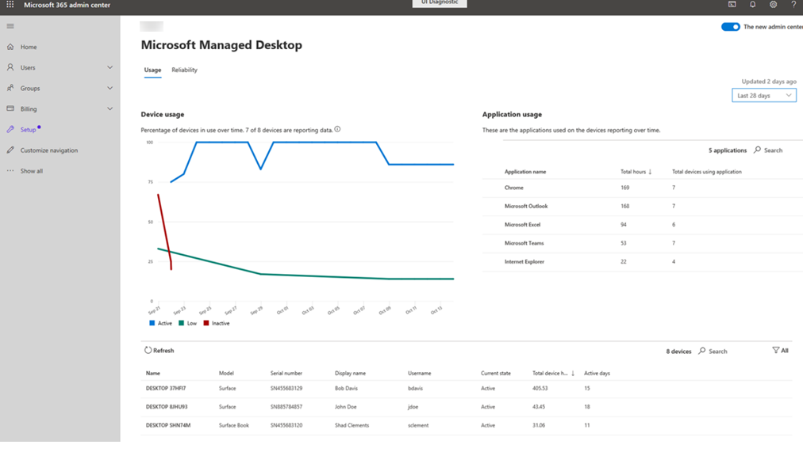

# 使用情況深入解析Usage insights
此 view 為您的 Microsoft 受管理的電腦裝置提供使用方式度量。This view provides usage metrics for your Microsoft Managed Desktop devices. 在這些情況下，如果應用程式正在執行中且處於焦點，便會被視為「使用中」。For these purposes, an app is considered "in use" if it is running and in focus.

若要查看使用狀況資料，請選取 [ **使用狀況** ] 索引標籤。To view usage data, select the **Usage** tab.

## 裝置使用量Device usage

在 [ **裝置使用量** ] 區域中，我們會顯示隨時間變化的報告裝置使用量層級，以及已註冊的裝置數目報告資料。In the **Device usage** area, we display the usage level of reporting devices over time, as well as how many registered devices are reporting data. 針對此頁面上顯示的所有資料，您可以使用右上角的下拉式功能表變更最近14天或28天中報告的資料的間隔。For all data displayed on this page, you can change the interval to view reported data in either the last 14 or 28 days by using the drop-down menu in the upper right.

我們會使用下列條款來分類使用方式層級：We categorize the usage level with these terms:

- **Active：** 使用方式至少為55小時**Active:** at least 55 hours of usage
- **低：** 使用方式介於8到55小時之間**Low:** between 8 and 55 hours of usage
- **非** 使用中：使用不到8小時**Inactive:** less than 8 hours of usage

## 應用程式使用Application usage

[ **應用程式使用量** ] 區域會以使用順序及受管理裝置的各自使用時間，來詳述應用程式。The **Application usage** area details the applications in order of usage and their respective hours of usage for your managed devices. 它也會顯示使用指定之應用程式的受管理裝置總數。It also shows the total number of managed devices using a given application. 選取 [ **搜尋** ] 以找出尚未列出的特定應用程式。Select **Search** to find a specific application if it isn't already listed.

## 裝置詳細資料Device details
詳細資料區域提供特定裝置的資訊，包括總裝置時數和時段內的使用中天數。The detail area provides information on specific devices, including total device hours and number of active days over the time period. 使用篩選器，將視圖限制為「使用中」、「非使用中」或「未報告」使用模式的裝置。Use the filters to limit the view to those devices with a “Active”, “Inactive”, or “Low” usage pattern or those that are “Not Reporting”. 
