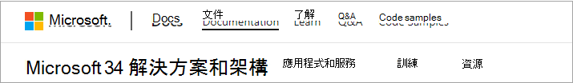
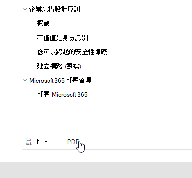
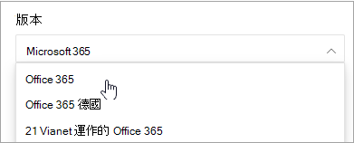
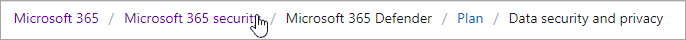
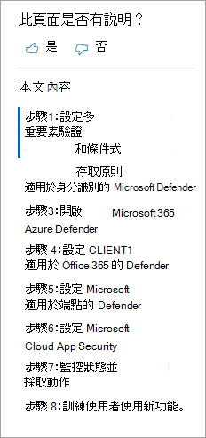
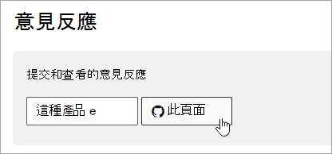

# Microsoft 365 文檔導覽指南Microsoft 365 docs navigation guide

本主題提供一些提示和技巧，以導覽 Microsoft 365 技術檔空間。This topic provides some tips and tricks for navigating the Microsoft 365 technical documentation space.  

## 中樞頁面Hub page

您可以在 [Microsoft 365 hub] 頁面上找到 [https://aka.ms/microsoft365docs](https://aka.ms/microsoft365docs) ，也就是尋找相關 Microsoft 365 內容的進入點。The Microsoft 365 hub page can be found at [https://aka.ms/microsoft365docs](https://aka.ms/microsoft365docs) and is the entry point for finding relevant Microsoft 365 content.

您可以從 Microsoft 365 技術檔組內每頁頂端的頁首，選取 [ **microsoft 365** ]，以流覽回到此頁面：You can always navigate back to this page by selecting **Microsoft 365** from the header at the top of every page within the Microsoft 365 technical documentation set:

## 離線檔Offline documentation

如果您想要在離線系統上查看 Microsoft 365 檔，您可以在 Microsoft 365 技術檔中的任何位置建立 PDF。If you would like to view the Microsoft 365 documentation on an offline system, you can create a PDF wherever you are in the Microsoft 365 technical documentation.

如果您想要建立 PDF，請選取位於每個目錄底部的 [ **下載 pdf** ] 連結。If you'd like to create a PDF, select the **Download PDF** link found at the bottom of every table of contents.

## TOC 搜尋TOC search 
在 docs.microsoft.com 中，您可以使用頂端的 [篩選搜尋] 方塊來搜尋目錄中的內容：On docs.microsoft.com, you can search the content in the table of contents by using the filter search box at the top:

## 版本篩選Version filter
Microsoft 365 技術檔會提供其他產品的內容，包括由 21 Vianet (中國) 所運作的 Office 365 德國和 Office 365。The Microsoft 365 technical documentation provides content for additional products, including Office 365 Germany and Office 365 operated by 21 Vianet (China). 這些版本之間的功能可能會不同，因此內容本身有時也會不同。Features can vary between these versions, and as such, sometimes the content itself can vary.

您可以使用版本篩選，確定您看到的是 Microsoft 365 的適當版本內容：You can use the version filter to ensure that you are seeing content for the appropriate version of Microsoft 365:

## 麵包 屑Breadcrumbs

軌跡瀏覽可以位於頁首及目錄上方，並指出目前的文章位於目錄中的何處。Breadcrumbs can be found below the header and above the table of contents, and indicate where the current article is located in the table of contents.  這不僅有助於將內容設定為您正在讀取的內容類型，也可讓您流覽目錄樹的目錄：Not only does this help set the context to what type of content you're reading, but it also allows you to navigate back up the table of contents tree:

## 文章區段導覽Article section navigation

右手導覽窗格可讓您快速流覽至文章中的區段，以及識別您的文章內的位置。The right-hand navigation pane allows you to quickly navigate to sections within an article, as well as identify your location within the article.  

## 提交檔意見反應Submit docs feedback

如果您在文章中發現問題，您可以向下滾動頁面底部，然後選取 **內容意見** 反應，將意見提交給 SQL 內容小組以取得該專案。If you find something wrong within an article, you can submit feedback to the SQL Content team for that article by scrolling down to the bottom of the page and selecting **Content feedback**.

## 參與 Microsoft 365 檔Contribute to Microsoft 365 documentation

您知道，您可以自行編輯 docs.microsoft.com 上的內容嗎？Did you know that you could edit the content on docs.microsoft.com yourself? 如果您這麼做，您不僅可以改進我們的檔，還會將其貸記為頁面的參與者。If you do so, not only will our documentation improve, but you'll also be credited as a contributor to the page. 若要立即開始，請參閱：To get started, see:

- [Microsoft 檔投稿人指南Microsoft Docs contributor guide](https://docs.microsoft.com/contribute/)

## 後續步驟Next steps

- 開始使用 [Microsoft 365 技術檔](index.yml)。Get started with the [Microsoft 365 technical documentation](index.yml).
