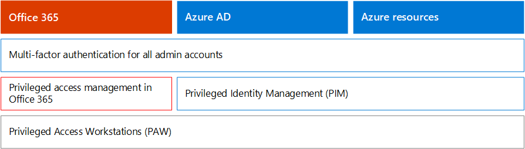

# 適用於商務決策者 (Bdm) 的 Microsoft 365 安全性Microsoft 365 Security for Business Decision Makers (BDMs)

本文討論的一些最常見的威脅與攻擊案例目前面臨的組織對於其 Microsoft 365 環境，並建議降低這些風險的動作。This article discusses some of the most common threat and attack scenarios currently faced by organizations for their Microsoft 365 environments, and recommended actions for mitigating these risks. 雖然 Microsoft 365 隨附各種預先設定的安全性功能，它也需要您為客戶採取來保護您自己的身分識別、 資料及裝置用來存取雲端服務的責任。While Microsoft 365 comes with a wide array of pre-configured security features, it also requires you as the customer to take responsibility to secure your own identities, data, and devices used to access cloud services. 本指南已 Kozeta 資料交換 （Microsoft 雲端安全性架構師） 和 Thiagaraj Sundararajan （Microsoft 資深顧問） 所開發。This guidance was developed by Kozeta Beam (Microsoft Cloud Security Architect) and Thiagaraj Sundararajan (Microsoft Senior Consultant).

本文章會依優先順序的工作，以保護用來管理最重要的服務和資產，例如您的租用戶、 電子郵件，以及 SharePoint 這些帳戶開始。This article is organized by priority of work, starting with protecting those accounts used to administer the most critical services and assets, such as your tenant, e-mail, and SharePoint. 為達到安全性，並搭配下列的試算表可讓您可以追蹤自己的進度與專案關係人及小組整個組織提供有條理的方式： [Microsoft 365 安全性的 Bdm 試算表](https://github.com/MicrosoftDocs/microsoft-365-docs/raw/public/microsoft-365/downloads/Microsoft-365-BDM-security-recommendations-spreadsheet.xlsx)。It  provides a methodical way for approaching security and works together with the following spreadsheet so you can track your progress with stakeholders and teams across your organization: [Microsoft 365 security for BDMs spreadsheet](https://github.com/MicrosoftDocs/microsoft-365-docs/raw/public/microsoft-365/downloads/Microsoft-365-BDM-security-recommendations-spreadsheet.xlsx). 

Microsoft 提供您要自動分析您根據您的一般活動的安全性狀態在租用戶中的安全分數工具指派分數，以及改進建議提供安全性。Microsoft provides you with the Secure Score tool within your tenant to automatically analyze your security posture based on your regular activities, assign a score, and provide security improvement recommendations. 暫停之前本文中建議的動作，請記下您目前的分數和建議。Before taking the actions recommended in this article, take note of your current score and recommendations. 本文中建議的動作將會增加您的分數。The actions recommended in this article will increase your score. 目標是未以達到最大的分數，但要注意的機會來保護您的環境中的方式，而不造成負面影響使用者產能。The goal is not to achieve the max score, but to be aware of opportunities to protect your environment in a way that do not negatively affect productivity for your users. 請參閱 [Microsoft 安全分數](mtp/microsoft-secure-score.md)。See [Microsoft Secure Score](mtp/microsoft-secure-score.md).

一件事之前開始。One more thing before we get started . .. .. 請確定已[開啟的 Office 365 稽核記錄檔](../compliance/search-the-audit-log-in-security-and-compliance.md)。be sure to [turn on the Office 365 audit log](../compliance/search-the-audit-log-in-security-and-compliance.md). 更新版本中，您需要調查事件或外洩事件，您會需要此資料。You’ll need this data later, in the event you need to investigate an incident or a breach. 

## 保護特殊權限的帳戶Protect privileged accounts

我們建議您為第一個步驟中，確保環境中的重要帳戶為這些帳戶具有存取和權限來管理和變更重要服務和資源，而產生負面影響整個組織中，指定額外的保護層如果危害。As a first step, we recommend ensuring critical accounts in the environment are given an extra layer of protection as these accounts have access and permissions to manage and alter critical services and resources which can negatively impact the entire organization, if compromised. 保護特殊權限的帳戶是下列其中一個最有效的方法，以防止攻擊者提升入侵帳戶的權限至系統管理一個搜尋項目。Protecting privileged accounts is one of the most effective ways to protect against an attacker who seeks to elevate the permissions of a compromised account to an administrative one. 

|建議Recommendation  |E3E3 |E5E5  |
|---------|---------|---------|
|強制執行所有系統管理帳戶的多重要素驗證 (MFA)。Enforce multi-factor authentication (MFA) for all administrative accounts.||| 
|實作 Azure Active Directory (Azure AD) 特殊權限 Identity Management (PIM) 套用剛時間特殊權限存取 Azure AD 和 Azure 的資源。Implement Azure Active Directory (Azure AD) Privileged Identity Management (PIM) to apply just-in-time privileged access to Azure AD and Azure resources. 您也可以找出誰可以存取，並檢閱特殊權限的存取。You can also discover who has access and review privileged access.|         | |
|在 Office 365 來管理 Office 365 中的特殊權限的系統管理工作更精細的存取控制中實作特殊權限的存取管理。Implement privileged access management in Office 365 to manage granular access control over privileged admin tasks in Office 365. |         | |
|設定及管理服務使用特殊權限存取工作站 （爪）。Configure and use Privileged Access Workstations (PAW) to administer services. 不使用相同的工作站瀏覽網際網路並檢查不相關的管理帳戶的電子郵件。Do not use the same workstations for browsing the Internet and checking email not related to your administrative account.|  | | 

下圖說明這些功能。The following diagram illustrates these capabilities.

其他建議：Additional recommendations:
- 請確定從內部部署同步處理的帳戶未被指派為雲端服務的系統管理員角色。Ensure accounts that are synchronized from on-premises are not assigned admin roles for cloud services. 這有助於防止攻擊者利用系統管理存取雲端服務的內部部署帳戶。This helps prevent an attacker from leveraging on-premises accounts to gain administrative access to cloud services. 
- 確定服務帳戶未被指派系統管理員角色。Ensure service accounts are not assigned admin roles. 這些帳戶通常不會監視，並設定不會過期的密碼。These accounts are often not monitored and set with passwords that do not expire. 首先，確保 AADConnect 和 ADFS 服務帳戶不是全域系統管理員預設。Start by ensuring the AADConnect and ADFS services accounts are not Global Admins by default.
- 移除系統管理員帳戶的授權。Remove licenses from admin accounts. 除非有特定使用案例將授權指派給特定的系統管理員帳戶，從這些帳戶中移除授權。Unless there is a specific use case to assign licenses to specific admin accounts, remove licenses from these accounts. 

## 減少攻擊的風險Reduce the surface of attack

下一個區域中，焦點會減少受攻擊的面。The next focus area is reducing the surface of attack. 這可以完成與最少的人力和影響到您的使用者和服務。This can be accomplished with minimal effort and impact to your users and services. 藉由減少攻擊的表面區域，攻擊者會有較少的方式，來啟動您的組織攻擊。By reducing the surface area of attack, attackers have fewer ways to launch an attack against your organization.

以下為一些範例：Here are some examples:
- 停用 POP3、 IMAP 及 SMTP 通訊協定。Disable POP3, IMAP, and SMTP protocols. 大部分現代組織無法再使用這些較舊的通訊協定。Most modern organizations no longer use these older protocols. 即可放心地停用這些並只在必要時，允許例外狀況。You can safely disable these and allow exceptions only as needed. 
- 減少並租用戶中保留的全域系統管理員所需的絕對最小值。Reduce and keep the number of Global Admins in the tenant to the absolute minimum required. 直接，這可減少受攻擊面減為所有雲端應用程式。This directly reduces the surface area of attack for all Cloud applications. 
- 淘汰伺服器和應用程式的環境中不再使用。Retire servers and applications that are no longer used in your environment. 
- 實作停用和刪除不再使用的帳戶的程序。Implement a process for disabling and deleting accounts that are no longer used. 

## 防範已知的威脅Protect against known threats

已知威脅還包括惡意程式碼、 遭入侵的帳戶和網路釣魚。Known threats include malware, compromised accounts, and phishing. 某些保護，防範這些威脅可以用來實作快速不會直接影響您的使用者，而有些則要求更多的規劃和使用者訓練。Some protections against these threats can be implemented quickly with no direct impact to your users, while others require more planning and user training. 

|建議Recommendation  |E3E3  |E5E5  |
|---------|---------|---------|
|**設定多重要素驗證和使用建議的條件式存取原則，包括登入風險原則**。**Setup multi-factor authentication and use recommended conditional access policies, including sign-in risk policies**. Microsoft 建議您，並已測試的共同運作以保護所有雲端應用程式，包括 Office 365 和 Microsoft 365 服務的原則設定。Microsoft recommends and has tested a set of policies that work together to protect all cloud apps, including Office 365 and Microsoft 365 services. 請參閱[身分識別與裝置存取設定](../enterprise/microsoft-365-policies-configurations.md)。See [Identity and device access configurations](../enterprise/microsoft-365-policies-configurations.md). | ||
|**需要為所有使用者的多重要素驗證**。**Require multi-factor authentication for all users**. 如果您不需要實作建議的條件式存取原則所需的授權，至少需要多重要素驗證的所有使用者。If you don’t have the licensing required to implement the recommended conditional access policies, at a minimum require multi-factor authentication for all users.|||
|**引發防範惡意程式碼在郵件中的層級**。**Raise the level of protection against malware in mail**. Office 365 或 Microsoft 365 環境包含防範惡意程式碼，但您可以增加此保護封鎖附件的常用的惡意程式碼的檔案類型。Your Office 365 or Microsoft 365 environment includes protection against malware, but you can increase this protection by blocking attachments with file types that are commonly used for malware.|||
|**保護您的電子郵件從目標的網路釣魚攻擊**。**Protect your email from targeted phishing attacks**. 如果您已設定一或多個自訂的網域為您的 Office 365 或 Microsoft 365 環境，您可以設定目標的反網路釣魚保護。If you've configured one or more custom domains for your Office 365 or Microsoft 365 environment, you can configure targeted anti-phishing protection. ATP 防網路釣魚防護，Office 365 進階威脅防護，一部分可協助保護組織免於惡意模擬型網路釣魚攻擊和其他網路釣魚攻擊。ATP anti-phishing protection, part of Office 365 Advanced Threat Protection, can help protect your organization from malicious impersonation-based phishing attacks and other phishing attacks. 如果您未設定自訂的網域，您不需要執行這項操作。If you haven't configured a custom domain, you do not need to do this.| ||
|**保護電子郵件中的勒索軟體攻擊**。**Protect against ransomware attacks in email**. 勒索軟體採取立即存取您的資料加密檔案或鎖定的電腦畫面。Ransomware takes away access to your data by encrypting files or locking computer screens. 然後會嘗試從受害者勒索金錢，詢問 「 贖金，「 通常格式為 cryptocurrencies 像 Bitcoin，來存取返回您的資料。It then attempts to extort money from victims by asking for "ransom," usually in form of cryptocurrencies like Bitcoin, in exchange for returning access to your data. 您可以協助防禦勒索軟體，藉由建立一或多個郵件流程規則若要封鎖的檔案副檔名通常用於勒索軟體，或警告電子郵件接收這些附件的使用者。You can help defend against ransomware by creating one or more mail flow rules to block file extensions that are commonly used for ransomware, or to warn users who receive these attachments in email.|||
|**從不與您生意的國家/地區封鎖連線**。**Block connections from countries that you don’t do business with**. 建立 Azure AD 條件式存取原則來封鎖任何這些國家/地區，有效地建立您的租用戶周圍地理防火牆您引導過來的連線。Create an Azure AD conditional access policy to block any connections coming from these countries, effectively creating a geo firewall around your tenant.| ||

下圖說明這些功能。The following diagram illustrates these capabilities.

## 防範未知的威脅Protect against unknown threats

之後將額外的保護設定新增至您特殊權限的帳戶，並保護已知的攻擊，移動您注意到防範未知潛在威脅。After adding extra protections to your privileged accounts and protecting against known attacks, shift your attention to protecting against unknown threats. 多決定，以及進階而不斷演進使用創新新，組織的攻擊的未知的方法。The more determined and advanced adversaries use innovative and new, unknown methods to attack organizations. 使用 Microsoft 的算遙測的透過數十億的裝置、 應用程式和服務所收集的資料，我們就能在 Windows、 Office 365 和 Azure 零天的攻擊，防止執行進階威脅防護運用沙] 方塊中的環境中，和允許存取您的內容之前檢查其有效性。With Microsoft’s vast telemetry of data gathered over billions of devices, applications, and services, we are able to perform Advanced Threat Protection on Windows, Office 365, and Azure to prevent against Zero Day attacks, utilizing sand box environments, and checking validity before allowing access to your content. 

|建議Recommendation  |E3E3  |E5E5  |
|---------|---------|---------|
|**設定 Office 365 進階的威脅防護 (ATP)**:**Configure Office 365 Advanced Threat Protection (ATP)**: • ATP 安全附件•    ATP Safe Attachments • ATP 安全連結•   ATP Safe Links • ATP SharePoint、 OneDrive 及 Microsoft Teams• ATP for SharePoint, OneDrive, and Microsoft Teams • ATP 防網路釣魚保護•  ATP anti-phishing protection|         | |
|**設定 Microsoft Defender 進階威脅防護功能**：**Configure Microsoft Defender Advanced Threat Protection capabilities**: • Windows Defender 防毒軟體• Windows Defender Antivirus  • 惡意探索防護•    Exploit protection   • 攻擊縮減•   Attack surface reduction   • 硬體型隔離• Hardware-based isolation  • 控制資料夾存取權•  Controlled folder access     |         | |
|**使用 Microsoft Cloud App Security**可探索 SaaS 應用程式，並開始使用行為分析和異常偵測。**Use Microsoft Cloud App Security** to discover SaaS apps and begin to use behavior analytics and anomaly detection. |         | |

下圖說明這些功能。The following diagram illustrates these capabilities.

其他建議：Additional recommendations:
- 安全合作夥伴通道通訊，例如電子郵件使用 TLS。Secure partner channel communications like Emails using TLS.
- 開啟小組同盟合作夥伴，才能與您進行通訊。Open Teams Federation only to Partners you communicate with.
- 執行不 whitelist 寄件者網域，個別寄件者，或因為這可讓這些略過垃圾郵件和惡意程式碼檢查來源 Ip — 常見的作法與客戶自己公認的網域或多個電子郵件流程問題可能已被其他網域是核准清單報告。Do not whitelist sender domains, individual senders, or source IPs as this allows these to bypass spam and malware checks — A common practice with customers is whitelisting their own accepted domains or a number of other domains where email flow issues may have been reported. 請勿在垃圾郵件和連線篩選] 清單中加入網域，因為這可能會略過所有垃圾郵件檢查。Do not add domains in the Spam and Connection Filtering list as this potentially bypasses all spam checks. 
- 啟用輸出垃圾郵件通知-啟用通訊群組清單內部服務台或 IT 系統管理員小組回報垃圾郵件如果任何內部使用者寄出電子郵件從外部輸出垃圾郵件通知。Enable outbound spam notifications — Enable outbound spam notifications to a distribution list internally to the Helpdesk or IT Admin team to report if any of the internal users are sending out Spam emails externally. 這可能是帳戶已遭洩露的指標。This could be an indicator that the account has been compromised.
- 停用所有使用者的遠端 PowerShell-遠端 PowerShell 主要由系統管理員用來存取 Office 365 服務系統管理用途或 API 的程式設計存取。Disable Remote PowerShell for all users — Remote PowerShell is mainly used by Admins to access Office 365 services for administrative purposes or programmatic API access. 我們建議您停用此選項，以避免偵察，除非有業務需求對其進行存取的非系統管理使用者。We recommended disabling this option for non-Admin users to avoid reconnaissance unless they have a business requirement to access it. 
- 封鎖對 Microsoft Azure 管理入口網站所有的非系統管理員的存取。Block access to the Microsoft Azure Management portal to all non-administrators. 您可以建立條件式存取規則，以封鎖所有使用者，但系統管理員來完成這項作業。You can accomplish this by creating a conditional access rule to block all users, with the exception of admins. 

## 假設資料外洩Assume breach

雖然 Microsoft 會採用每個可能的考量，以避免潛在威脅及攻擊，我們建議努力下"假設資料外洩 」 想法。While Microsoft takes every possible measure to prevent against threats and attacks, we recommend always working under the “Assume Breach” mindset. 即使攻擊者具有 managed 來插入到環境中，我們需要確認它們都是從環境無法 exfiltrate 資料或識別資訊。Even if an Attacker has managed to intrude into the environment, we need to make sure they are unable to exfiltrate data or identity information from the environment. 基於這個理由，建議您啟用如身分證號碼、 信用卡號碼、 其他個人資訊和其他組織層級的機密資訊的敏感資料外洩防護。For this reason, we recommend enabling protection against sensitive data leaks such as Social Security numbers, credit cards numbers, additional personal information, and other organizational level confidential information. 

"假設資料外洩 」 想法需要實作零信任網路策略，這表示使用者不完全信任，只是因為它們是內部網路。The “Assume Breach” mindset requires implementing a zero trust network strategy, which means users are not fully trusted just because they are internal to the network. 可以做哪些使用者授權的一部分，為指定的條件，而這類條件符合時，某些控制項強制執行。Instead, as part of authorization of what users can do, sets of conditions are specified, and when such conditions are met, certain controls are enforced. 裝置健全狀況狀態、 所存取的應用程式、 正在執行的作業與使用者風險，可能包含條件。Conditions may include device health status, application being accessed, operations being performed and user risk. 例如，裝置註冊動作應該一律會觸發 MFA 驗證，以確保沒有魯治裝置會新增至您的環境。For example, a device enrollment action should always trigger MFA authentication to ensure no rouge devices are added to your environment. 

零的信任網路策略也需要您知道您的資訊儲存位置，並套用適當的分類、 保護及保留的控制項。A zero trust network strategy also requires that you know where your information is stored and apply appropriate controls for classification, protection, and retention. 若要有效保護您最重要且機密的資產您必須先識別這些的所在位置，並採取庫存，可能相當困難。To effectively protect your most critical and sensitive assets you need to first identify where these are located and take inventory, which can be challenging. 接下來，使用您的組織定義的控管策略。Next, work with your organization to define a governance strategy. 定義組織和設定原則、 標籤和條件的分類結構描述需要仔細規劃和準備。Defining a classification schema for an organization and configuring policies, labels, and conditions requires careful planning and preparation. 請務必了解這不是 IT 驅動程序。It is important to realize that this is not an IT driven process. 請務必使用您的法律和法規遵循小組，以開發適當的分類和標籤貴組織的資料結構描述。Be sure to work with your legal and compliance team to develop an appropriate classification and labeling schema for your organization’s data.

Microsoft 365 資訊保護功能可協助您了解哪些資訊您擁有的資訊，其中儲存，以及哪些資訊需要額外的保護。Microsoft 365 information protection capabilities can help you discover what information you have, where it is stored, and which information requires additional protection. 資訊保護是連續的處理程序和 Microsoft 365 功能會將您提供的可視性使用者使用和散佈敏感資訊的方式，您目前儲存資訊，其中流通。Information protection is a continuous process and Microsoft 365 capabilities provide you with visibility into how users are using and distributing sensitive information, where your information is currently stored, and where it flows. 您也可以查看如何處理的資訊的使用者才能確定管制的適當的標籤和保護會套用。You can also see how users handling information that is regulated to be sure the appropriate labels and protections are applied.

|建議Recommendation |E3E3|E5E5 |
|---------|---------|---------|
|**檢閱並最佳化您的條件式存取和相關的原則，以符合您的目標為零的信任網路**。**Review and optimize your conditional access and related policies to align with your objectives for a zero trust network**. 保護免於已知的威脅，包括實作一組[建議的原則](../enterprise/microsoft-365-policies-configurations.md)。Protecting against known threats includes implementing a set of [recommended policies](../enterprise/microsoft-365-policies-configurations.md). 檢閱這些原則，以確保您可以保護您的應用程式和資料獲得存取您網路的駭客免於實作。Review your implementation of these policies to ensure you’re protecting your apps and data against hackers who have gained access to your network. 請注意，適用於 Windows 10 建議的 Intune 應用程式保護原則可讓 Windows 資訊保護 (WIP)。Note that the recommended Intune app protection policy for Windows 10 enables Windows Information Protection (WIP). WIP 提供保護，避免意外的應用程式和服務，例如電子郵件，您的組織資料外洩社交媒體、 部署及公用雲端。WIP protects against accidental leaks of your organization data through apps and services, like email, social media, and the public cloud. |         ||
|**停用外部電子郵件轉寄功能**。**Disable external email forwarding**. 存取使用者信箱的駭客可以藉由設定來自動轉寄電子郵件信箱竊取您的郵件。Hackers who gain access to a user's mailbox can steal your mail by setting the mailbox to automatically forward email. 這可能會發生，即使不使用者的認知。This can happen even without the user's awareness. 您可以防止發生這藉由設定郵件流程規則。You can prevent this from happening by configuring a mail flow rule.| ||
|**停用匿名外部行事曆共用**。**Disable anonymous external calendar sharing**. 預設允許外部的匿名行事曆共用。By default external anonymous calendar sharing is allowed. [停用行事曆共用](https://docs.microsoft.com/exchange/sharing/sharing-policies/modify-a-sharing-policy)若要降低潛在的敏感資訊外洩。[Disable calendar sharing](https://docs.microsoft.com/exchange/sharing/sharing-policies/modify-a-sharing-policy) to reduce potential leaks of sensitive information.| ||
|**設定資料外洩防護原則的敏感資料**。**Configure data loss prevention policies for sensitive data**. 探索及保護機密資料，例如信用卡號碼、 社會安全號碼與銀行帳戶號碼在 Office 365 安全性與合規性中心建立資料外洩防護原則。Create a Data Loss Prevention Policy in the Office 365 Security and Compliance center to discover and protect sensitive data such as credit card numbers, Social Security numbers and bank account numbers. Office 365 資料外洩防護原則中包含您可以使用許多預先定義的敏感資訊類型。Office 365 includes many predefined sensitive information types you can use in data loss prevention policies. 您也可以建立您的環境自訂的敏感資料您自己的敏感資訊類型。You can also create your own sensitive information types for sensitive data that is custom to your environment. |||
|**實作資料分類和資訊保護原則**。**Implement data classification and information protection policies**. 在 Office 365 中實作敏感度標籤，並使用這些分類，並將保護套用至敏感資料。Implement sensitivity labels in Office 365 and use these to classify and apply protection to sensitive data. 您也可以使用這些標籤中的資料外洩防護原則。You can also use these labels in data loss prevention policies. 如果您使用 Azure 資訊保護標籤，我們建議您避免在其他系統管理中心中建立新的標籤。If you are using Azure Information Protection labels, we recommend that you avoid creating new labels in other admin centers.|         ||
|**協力廠商應用程式和服務使用雲端 App 安全性中的保護資料**。**Protect data in third-party apps and services by using Cloud App Security**. 設定跨協力廠商雲端應用程式，例如 Salesforce、] 方塊中或投寄箱保護敏感資訊的 Cloud App Security 原則。Configure Cloud App Security policies to protect sensitive information across third-party cloud apps, such as Salesforce, Box, or Dropbox. 您可以使用敏感資訊類型和 Office 365 中建立的 Cloud App Security 原則敏感度標籤，並套用這些跨 SaaS 應用程式。You can use sensitive information types and the sensitivity labels you created in Office 365 in Cloud App Security policies and apply these across your SaaS apps.   Microsoft Cloud App Security 可讓您以強制執行各種自動化程序。Microsoft Cloud App Security allow you to enforce a wide range of automated processes. 原則可設為提供連續的相容性掃描，legal 的 eDiscovery 工作，DLP 敏感共用的內容公開，等等。Policies can be set to provide continuous compliance scans, legal eDiscovery tasks, DLP for sensitive content shared publicly, and more. Cloud App Security 可監視任何超過 20 個中繼資料篩選 （例如，存取層級，檔案類型） 為基礎的檔案類型。Cloud App Security can monitor any file type based on more than 20 metadata filters (for example, access level, file type). |         ||
|**使用[Microsoft Defender ATP](https://docs.microsoft.com/windows/security/threat-protection/microsoft-defender-atp/information-protection-in-windows-overview)來識別是否使用者儲存其 Windows 裝置上的敏感資訊**。**Use [Microsoft Defender ATP](https://docs.microsoft.com/windows/security/threat-protection/microsoft-defender-atp/information-protection-in-windows-overview) to identify if users store sensitive information on their Windows devices**. |         ||
|**使用[AIP 掃描程式](https://docs.microsoft.com/azure/information-protection/deploy-aip-scanner)以識別及分類跨伺服器和檔案共用的資訊**。**Use [AIP Scanner](https://docs.microsoft.com/azure/information-protection/deploy-aip-scanner) to identify and classify information across servers and file shares**. 使用 AIP 報告工具，來檢視結果，並採取適當的動作。Use the AIP reporting tool to view the results and take appropriate actions.|         ||

下圖說明這些功能。The following diagram illustrates these capabilities.

## 持續監視和稽核Continuous monitoring and auditing

最後，但不至少持續監視和稽核以及 Windows 和裝置的 Microsoft 365 環境很重要確保能夠快速偵測並修復任何入侵。Last, but not least Continuous Monitoring and Auditing of the Microsoft 365 environment along with the Windows and Devices is critical to making sure you are able to quickly detect and remediate any intrusions. 例如安全分數、 資訊安全中心，以及 Microsoft 智慧型 Graph 的進階分析工具提供將您的租用戶的重要資訊和連結數量龐大的威脅智慧及安全性資料，以提供您獲致前所未有威脅保護及偵測。Tools such as Secure Score, Security Center, and Microsoft Intelligent Graph’s advanced analytics provide invaluable information into your tenant and link massive amounts of threat intelligence and security data to provide you unparalleled threat protection and detection.

|建議Recommendation |E3E3 |E5E5 |
|---------|---------|---------|
|確定已開啟的**Office 365 稽核記錄**。Ensure the **Office 365 audit log** is turned on.|||
|**檢閱安全分數每週**— 安全分數是一個中央位置來存取您的 Office 365 租用戶的安全性狀態，並採取動作根據安全分數的建議。**Review Secure Score weekly** — Secure score is a central location to access the Security status of your Office 365 tenant and take actions based on Secure score recommendations. 建議您執行這項檢查每週。It is recommended to perform this check weekly.|||
|使用**Office 365 ATP**工具：Use **Office 365 ATP** tools: • 威脅調查及回應功能• Threat investigation and response capabilities  • 自動化調查及回應•    Automated investigation and response |         ||
|使用**Microsoft Defender ATP**:Use **Microsoft Defender ATP**:  •[端點偵測及回應](https://docs.microsoft.com/windows/security/threat-protection/microsoft-defender-atp/overview-endpoint-detection-response)•  [Endpoint detection and response](https://docs.microsoft.com/windows/security/threat-protection/microsoft-defender-atp/overview-endpoint-detection-response)   • 自動化的調查並修復安全分數• Automated investigation and remediation Secure score  •[進階狩獵](https://docs.microsoft.com/windows/security/threat-protection/microsoft-defender-atp/advanced-hunting-overview)•  [Advanced hunting](https://docs.microsoft.com/windows/security/threat-protection/microsoft-defender-atp/advanced-hunting-overview)  |         ||
|使用**Microsoft Cloud App Security**來偵測異常行為之間雲端應用程式以識別勒索軟體，危害使用者或劣等應用程式、 分析高風險的使用狀況及自動修復，以限制組織的風險。Use **Microsoft Cloud App Security** to detect unusual behavior across cloud apps to identify ransomware, compromised users or rogue applications, analyze high-risk usage and remediate automatically to limit the risk to your organization.|         ||
|使用**Microsoft Azure 護衛巨像**] 或 [您目前的 SIEM 工具來監視威脅的整個環境。Use **Microsoft Azure Sentinel** or your current SIEM tool to monitor for threats across your environment. |         ||
|監視及防範威脅針對您內部部署 Active Directory 環境中\*\*部署[Azure ATP](https://docs.microsoft.com/azure-advanced-threat-protection/what-is-atp) \*\* 。**Deploy [Azure ATP](https://docs.microsoft.com/azure-advanced-threat-protection/what-is-atp)** to monitor and protect against threats targeted to your on-premises Active Directory environment.   |         | |
|使用**Azure 資訊安全中心**來之間混合式部署與雲端工作負載監視威脅。Use the **Azure Security Center** to monitor for threats across hybrid and cloud workloads. Azure 資訊安全中心包含功能的免費層和已支付根據資源小時或交易的功能的標準層。Azure Security Center includes a free tier of capabilities and a standard tier of capabilities that are paid for based on resource hours or transactions.|         |         |

下圖說明這些功能。The following diagram illustrates these capabilities.

建議您監視動作的頂端：Top recommended monitoring actions:
- **檢閱 Microsoft 安全分數每週**— 安全分數是一個中央位置存取您的 Office 365 租用戶的安全性狀態，以及根據上方建議採取動作。**Review Microsoft Secure Score weekly** — Secure score is a central location to access the security status of your Office 365 tenant and to take actions based on top recommendations. 建議您執行這項檢查每週。It is recommended to perform this check weekly. 安全分數包含建議透過 Azure AD，Intune、 Cloud App Security，和 Microsoft Defender 進階威脅防護，以及 Office 365。Secure Score includes recommendations from across Azure AD, Intune, Cloud App Security, and Microsoft Defender Advanced Threat Protection, as well as Office 365. 
- **檢閱每週風險登入**-使用 Azure AD 系統管理中心來檢閱有風險的登入每週。**Review risky logins weekly** — Use the Azure AD admin center to review risky sign-ins weekly. 建議的身分識別與裝置存取規則集包含的原則以強制執行密碼變更有風險的登入。The recommended identity and device access ruleset includes a policy to enforce password change on risky sign-ins.  
- **檢閱最上層惡意程式碼和 phished 使用者每週**— 使用 Office 進階威脅防護威脅總管檢閱已設定目標與惡意程式碼和釣魚程式的主要使用者並了解為什麼這些使用者會受到影響的根本原因。**Review top malware and phished users weekly** — Use Office Advanced Threat Protection Threat Explorer to review top users targeted with malware and phish and to find out the root cause of why these users are affected.
