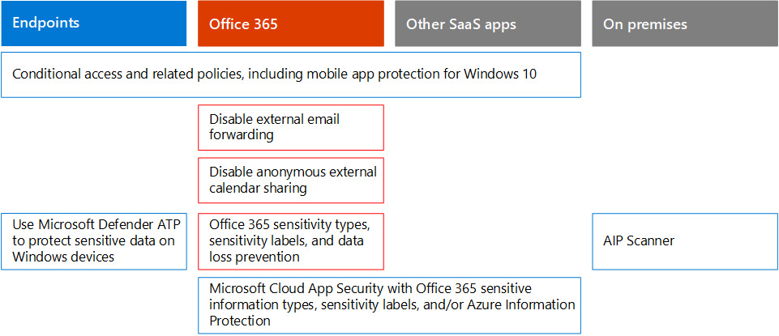

# Microsoft 365 商務決策者（Bdm）的安全性

本文將討論目前針對其 Microsoft 365 環境所面臨之組織的一些最常見威脅和攻擊案例，以及緩解這些風險的建議動作。 雖然 Microsoft 365 隨附大量預先設定的安全性功能，但也需要您做為客戶，以保護用來存取雲端服務的身分識別、資料和裝置。 本指南是由 Kozeta 橫樑（Microsoft Cloud Security 建築師）和 Thiagaraj Sundararajan （Microsoft 資深顧問）所開發。

本文是以工作的優先順序來組織，從保護用來管理最重要服務和資產（如租使用者、電子郵件和 SharePoint）的帳戶開始。 它會為接近安全性和使用下列試算表的方式提供一種方法，讓您可以追蹤整個組織中的專案關係人與小組的進度： [Microsoft 365 bdm 試算表的安全性](https://github.com/MicrosoftDocs/microsoft-365-docs/raw/public/microsoft-365/downloads/Microsoft-365-BDM-security-recommendations-spreadsheet.xlsx)。 

Microsoft 會在您的租使用者中提供安全評分工具，以根據您的定期活動自動分析安全性狀態、指派分數，並提供安全性改進建議。 在執行本文中建議的動作之前，請注意您目前的分數和建議。 本文中建議的動作可增加您的分數。 目標不會達到最大分數，但若要瞭解如何保護您的環境，請務必以不會對使用者生產力造成負面影響的方式來保護您的環境。 請參閱 [Microsoft 安全分數](mtp/microsoft-secure-score.md)。

再開始之前一件事。 . . 請務必[開啟審核記錄](../compliance/search-the-audit-log-in-security-and-compliance.md)檔。 您稍後需要此資料，您必須調查事件或遭到破壞。 

## 保護特權帳戶

在第一個步驟中，我們建議您在環境中確保重要的帳戶有額外的保護層，因為這些帳戶具有管理及變更重要服務和資源的許可權，而且可能會對整個組織造成負面影響（如果遭到破壞）。 保護「特權帳戶」是一種最有效的方法，可讓使用者尋找將已遭破壞之帳戶的許可權提升為系統管理許可權的攻擊者。 

|建議  |E3 |E5  |
|---------|---------|---------|
|針對所有系統管理帳戶強制執行多重要素驗證（MFA）。||| 
|執行 Azure Active Directory （Azure AD）特權身分識別管理（PIM）以套用即時的許可權存取 Azure AD 和 Azure 資源。 您也可以發現誰具有存取權，並審查有特殊許可權的存取權。|         | |
|實施「特殊存取權管理」，以管理 Office 365 中的版權管理工作的細微存取控制。 |         | |
|設定及使用特殊許可權存取工作站（PAW）管理服務。 請勿使用相同的工作站流覽網際網路，以及檢查與您的系統管理員帳戶無關的電子郵件。|  | | 

下圖說明這些功能。

其他建議：
- 確定未將雲端服務的系統管理員角色指派給內部部署同步處理的帳戶。 這有助於防止攻擊者利用內部部署帳戶來取得雲端服務的管理存取權。 
- 確定沒有為服務帳戶指派系統管理員角色。 這些帳戶通常不會受到監視，而且無法使用未到期的密碼加以設定。 請先確認 AADConnect 和 ADFS 服務帳戶預設不是全域系統管理員。
- 從系統管理員帳戶移除授權。 除非有特定的用例可將授權指派給特定的系統管理員帳戶，否則請從這些帳戶中移除授權。 

## 減少攻擊面

下一個重點領域是減少攻擊面。 這可讓您的使用者和服務的工作量和影響降到最低。 透過減少攻擊的週邊區域，攻擊者可減少對組織發動攻擊的方式。

以下為一些範例：
- 停用 POP3、IMAP 和 SMTP 通訊協定。 大多數的現代組織不再使用這些舊版的通訊協定。 您可以安全地停用這些例外狀況，並只在需要時才允許例外狀況。 
- 將租使用者的全域管理員數目降至最低，並保留為絕對最低需求。 這會直接降低所有雲端應用程式的攻擊面。 
- 停用您環境中不再使用的伺服器和應用程式。 
- 執行停用和刪除不再使用之帳戶的程式。 

## 抵禦已知威脅

已知威脅包括惡意程式碼、已遭破壞的帳戶和網路釣魚。 某些針對這些威脅的保護可以快速實施，不會對使用者造成直接影響，其他人則需要更多的規劃和使用者訓練。 

|建議  |E3  |E5  |
|---------|---------|---------|
|**設定多重要素驗證，並使用建議的條件式存取原則，包括登入風險原則**。 Microsoft 建議並測試一組共同運作的原則，以保護所有 cloud app （包括 Office 365 和 Microsoft 365 服務）。 請參閱身分[識別與裝置存取](../enterprise/microsoft-365-policies-configurations.md)設定。 | ||
|**所有使用者都需要多重要素驗證**。 如果您沒有必要的授權來執行建議的條件式存取原則，至少需要所有使用者的多重要素驗證。|||
|**提升郵件中惡意程式碼的保護層級**。 您的 Office 365 或 Microsoft 365 環境包括防範惡意程式碼，但是您可以使用常見於惡意程式碼的檔案類型來封鎖附件，以提升這種保護。|||
|**保護您的電子郵件免受目標網路釣魚攻擊**。 如果您已為 Office 365 或 Microsoft 365 環境設定一或多個自訂網域，您可以設定目標的反網路釣魚防護。 ATP 反網路釣魚保護，部分的 Office 365 高級威脅防護，可協助保護您的組織免受惡意模擬型網路釣魚攻擊和其他網路釣魚攻擊。 若尚未設定自訂網域，您不需要執行此動作。| ||
|抵禦**電子郵件中的勒索軟體攻擊**。 勒索軟體會以加密檔案或鎖定電腦畫面的方式，來避開資料的存取權。 然後，它會要求「ransom」（通常是以 Bitcoin 形式的 cryptocurrencies），在 exchange 中傳回資料的存取權，嘗試從受害者 extort 金錢。 您可以建立一或多個郵件流程規則來封鎖勒索軟體常用的副檔名，或警告使用電子郵件接收這些附件的使用者，以協助抵禦勒索軟體。|||
|**封鎖與您沒有生意的國家/地區的**連線。 建立 Azure AD 條件式存取原則，以封鎖來自這些國家/地區的任何連線，有效地在您的租使用者周圍建立地理防火牆。| ||

下圖說明這些功能。

## 針對未知威脅進行防護

在您為特權帳戶新增額外的保護，並防範已知的攻擊後，請轉向您的注意，以防範未知的威脅。 更確定和高級的敵人使用創新及新的未知方法來攻擊組織。 透過使用 Microsoft 豐富的資料遙測功能（透過十億種裝置、應用程式和服務來收集），我們可以在 Windows、Office 365 和 Azure 上執行高級威脅防護，以防止零天的攻擊、利用沙灘 box 環境，以及檢查有效性，再允許存取您的內容。 

|建議  |E3  |E5  |
|---------|---------|---------|
|**設定 Office 365 高級威脅防護（ATP）**： * ATP 安全附件 * ATP 安全連結 * SharePoint、OneDrive 和 Microsoft 小組的 ATP * ATP 反網路釣魚保護|         | |
|**設定 Microsoft Defender 高級威脅防護功能**： * Windows Defender 防毒程式  * Exploit protection   * 攻擊面減少   * 以硬體為基礎的隔離  * 受控制的資料夾存取     |         | |
|**使用 Microsoft Cloud App Security**探索 SaaS 的應用程式，並開始使用行為分析和反常偵測。 |         | |

下圖說明這些功能。

其他建議：
- 使用 TLS 來保護夥伴通道通訊，例如電子郵件。
- 只開啟與您通訊的合作夥伴的團隊同盟。
- 不要以白名單寄件者網域、個別寄件者或來源 Ip 為准，這可讓使用者略過垃圾郵件和惡意程式碼檢查-這是一種常見的做法是，客戶會 whitelisting 他們自己的公認的網域或其他許多可報告電子郵件流程問題的網域。 請勿在垃圾郵件和連線篩選清單中新增網域，因為這可能會略過所有垃圾郵件檢查。 
- 啟用輸出垃圾郵件通知—在內部的通訊群組清單中啟用輸出垃圾郵件通知，以報告任何內部使用者是否有任何內部使用者正在對外傳送垃圾郵件。 這可能是因為帳戶已受損的指標。
- 停用所有使用者的遠端 PowerShell —遠端 PowerShell 主要是由系統管理員用來存取服務，以供管理或以程式設計 API 存取的目的。 建議您停用此選項，讓非系統管理員使用者避免偵測，除非他們有業務需求可以存取。 
- 封鎖所有非管理員對 Microsoft Azure 管理入口網站的存取權。 若要做到這一點，您可以建立一個條件式存取規則來封鎖所有使用者，但系統管理員例外。 

## 假設遭到破壞

雖然 Microsoft 採取每一種可能的措施以避免威脅和攻擊，我們還是建議您在「承擔破壞」的思維方式下，永遠運作。 即使攻擊者已管理 intrude 進入環境，我們還是需要確定他們無法從環境中 exfiltrate 資料或身分識別資訊。 基於這個理由，我們建議您針對敏感性資料洩漏（如社會保險號碼、信用卡號碼、其他個人資訊和其他組織層級的機密資訊）啟用防護。 

「假設「破壞」的思維方式需要實施「零信任網路」策略，這表示使用者並非完全信任，只是因為它們是網路內部。 相反地，在驗證使用者可以執行的工作時，會指定條件集，並在符合這類條件時，強制執行某些控制項。 條件可能包括裝置健康狀態、正在存取的應用程式、要執行的作業和使用者風險。 例如，裝置註冊動作應該會觸發 MFA 驗證，以確保不會將任何 rouge 裝置新增至您的環境。 

「零信任網路」策略也需要您知道資訊的儲存位置，並套用適當的控制項以進行分類、保護及保留。 若要有效保護您最重要及機密的資產，您必須先找出這些資產所在的位置並進行清查，這可能是挑戰性。 接下來，請與您的組織合作以定義控管策略。 定義組織的分類架構，以及設定原則、標籤和條件時，需要進行周密的規劃與準備工作。 請務必知道這不是 IT 導向的處理常式。 請務必與您的法律和合規性小組合作，為組織的資料開發適當的分類和標籤架構。

Microsoft 365 資訊保護功能可協助您探索您有哪些資訊、儲存的位置，以及哪些資訊需要額外的保護。 資訊保護是連續的程式，而 Microsoft 365 功能可讓您深入瞭解使用者使用及散佈機密資訊的方式、資訊的目前儲存位置，以及資料流程的位置。 您也可以瞭解使用者如何處理已管制的資訊，以確定套用適當的標籤和保護。

|建議 |E3|E5 |
|---------|---------|---------|
|**檢查和優化您的條件式存取和相關原則，以符合零信任網路的目標**。 防範已知威脅包括實施一組建議的[原則](../enterprise/microsoft-365-policies-configurations.md)。 請複查這些原則的實施，以確保您保護應用程式和資料，以防範已取得您網路存取權的駭客。 請注意，建議使用 Windows 10 的 Intune 應用程式保護原則，以啟用 Windows 資訊保護（WIP）。 WIP 可防止透過應用程式和服務（例如電子郵件、社交媒體和公用雲端）意外洩漏組織資料。 |         ||
|**停用外部電子郵件轉發**。 取得使用者信箱存取權的駭客可將信箱設定為自動轉寄電子郵件，以竊取您的郵件。 即使沒有使用者的認知，也可能會發生這種情況。 您可以設定郵件流程規則，避免發生這種情況。| ||
|**停用匿名外部行事曆共用**。 預設允許外部匿名日曆共用。 [停用行事曆共用](https://docs.microsoft.com/exchange/sharing/sharing-policies/modify-a-sharing-policy)，以減少機密資訊的可能洩漏。| ||
|**設定敏感性資料的資料遺失防護原則**。 在安全性&amp;與合規性中心建立資料遺失防護原則，以探索和保護機密資料，例如信用卡號碼、社會保險號碼和銀行帳戶號碼。 Microsoft 365 包含許多您可以在資料遺失防護原則中使用的預先定義的機密資訊類型。 您也可以為環境所自訂的機密資料，建立您自己的敏感資訊類型。 |||
|**實施資料分類和資訊保護原則**。 實施敏感度標籤，並使用它們來分類及套用敏感性資料的保護。 您也可以在資料遺失防護原則中使用這些標籤。 如果您使用的是 Azure 資訊保護標籤，建議您避免在其他系統管理中心中建立新標籤。|         ||
|**使用 Cloud App Security 來保護協力廠商應用程式和服務中的資料**。 設定 Cloud App Security 原則，以保護跨越協力廠商雲端應用程式（例如 Salesforce、Box 或 Dropbox）的敏感資訊。 您可以使用您在雲端 App 安全性原則中建立的敏感資訊類型和敏感度標籤，並在您的 SaaS 應用程式中套用這些標籤。   Microsoft Cloud App Security 可讓您強制執行大量的自動化程式。 原則可以設定為提供連續的合規性掃描、法律 eDiscovery 工作、公開的機密內容和 DLP 等。 Cloud App Security 可以根據超過20個中繼資料篩選器（例如，access 層級、檔案類型）監控任何檔案類型。 |         ||
|**使用[MICROSOFT Defender ATP](https://docs.microsoft.com/windows/security/threat-protection/microsoft-defender-atp/information-protection-in-windows-overview)來識別使用者是否要在其 Windows 裝置上儲存敏感資訊**。 |         ||
|**使用[AIP 掃描器](https://docs.microsoft.com/azure/information-protection/deploy-aip-scanner)來識別和分類跨伺服器和檔案共用的資訊**。 使用 AIP 報告工具來查看結果並採取適當的動作。|         ||

下圖說明這些功能。

## 連續監控和審計

最後，但不是最少連續監控和審核 Microsoft 365 環境和 Windows 和裝置，都是確保您能夠快速偵測並修復任何入侵的重要因素。 安全分數、安全性中心及 Microsoft 智慧型 Graph 的高級分析等工具，可讓您的租使用者寶貴資訊，並連結大量威脅情報和安全性資料，以提供無與倫比的威脅防護和偵測。

|建議 |E3 |E5 |
|---------|---------|---------|
|確定已開啟**審核記錄**。|||
|**每週複查安全得分**：安全評分是一個集中的位置，可存取您公司的安全性狀態，並根據安全得分建議採取行動。 建議您每週執行一次檢查。|||
|使用**Office 365 ATP**工具： * 威脅調查和回應功能  * 自動化調查和回應 |         ||
|使用**Microsoft DEFENDER ATP**：  *    [端點偵測和回應](https://docs.microsoft.com/windows/security/threat-protection/microsoft-defender-atp/overview-endpoint-detection-response)   * 自動化調查和修正安全分數  *    [高級搜尋](https://docs.microsoft.com/windows/security/threat-protection/microsoft-defender-atp/advanced-hunting-overview)  |         ||
|使用**Microsoft Cloud App Security**來偵測各 Cloud 應用程式的異常行為，以找出勒索軟體、受損的使用者或惡意應用程式、分析高風險的使用狀況，並自動修正，以限制組織面臨的風險。|         ||
|使用**Microsoft Azure Sentinel**或您目前的 SIEM 工具，監控整個環境的威脅。 |         ||
|**部署[Azure ATP](https://docs.microsoft.com/azure-advanced-threat-protection/what-is-atp) **以監視和保護針對內部部署 Active Directory 環境的威脅。   |         | |
|使用**Azure 安全性中心**監控混合式和雲端工作負載中的威脅。 Azure 安全性中心包含一種免費的功能，以及根據資源時間或交易所支付的標準功能層級。|         |         |

下圖說明這些功能。

建議的最佳監視動作：
- **每週查看 Microsoft 安全分數**-安全評分是存取租使用者安全性狀態的中心位置，並根據主要建議採取行動。 建議您每週執行一次檢查。 安全評分包括跨 Azure AD、Intune、雲端 App 安全性和 Microsoft Defender 高級威脅防護，以及 Office 365 的建議。 
- **每週查看有風險**的登入：使用 Azure AD 系統管理中心每週查看危險的登入。 建議的身分識別與裝置存取規則集包括一個原則，可對危險登入強制變更密碼。  
- **每週查看主要惡意程式碼和 phished 使用者**—使用 Office 高級威脅防護威脅瀏覽器，以查看主要具有惡意程式碼和網路釣魚的使用者，並找出這些使用者受到影響的根本原因。
