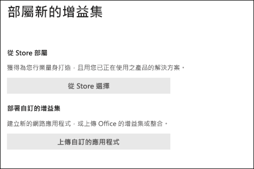

# 啟用報告網路釣魚增益集Enable the Report Phishing add-in

[!INCLUDE [Microsoft 365 Defender rebranding](../includes/microsoft-defender-for-office.md)]

> [!NOTE]
> 如果您是使用 Exchange Online 信箱的 Microsoft 365 組織中的系統管理員，建議您在安全性 & 合規性中心使用提交入口網站。If you're an admin in a Microsoft 365 organization with Exchange Online mailboxes, we recommend that you use the Submissions portal in the Security & Compliance Center. 如需詳細資訊，請參閱 [使用系統管理員提交將可疑的垃圾郵件、網路釣魚、URLs 和檔案提交給 Microsoft](admin-submission.md)。For more information, see [Use Admin Submission to submit suspected spam, phish, URLs, and files to Microsoft](admin-submission.md).

「Outlook」和「Outlook」 (上的「outlook」和「Outlook」的報告訊息和報告網路增益集（以前稱為 Outlook Web App）) 可讓使用者輕鬆報告誤報， (正確的電子郵件會標示為壞的) 或 false 的電子郵件， (錯誤的電子郵件可供 Microsoft 及其公司的分析使用。The Report Message and Report Phishing add-ins for Outlook and Outlook on the web (formerly known as Outlook Web App) enable people to easily report false positives (good email marked as bad) or false negatives (bad email allowed) to Microsoft and its affiliates for analysis.

Microsoft 會使用這些提交來改善電子郵件防護技術的有效性。Microsoft uses these submissions to improve the effectiveness of email protection technologies. 例如，假設有人使用「報告網路釣魚增益集」報告許多郵件。For example, suppose that people are reporting many messages using the Report Phishing add-in. 此資訊會顯示在[安全性儀表板](security-dashboard.md)及其他報告中。This information surfaces in the [Security Dashboard](security-dashboard.md) and other reports. 貴組織的安全性小組可以使用此資訊來表示可能需要更新防網路釣魚原則。Your organization's security team can use this information as an indication that anti-phishing policies might need to be updated.

您可以安裝報告訊息或報告網路釣魚增益集。You can install either the Report Message or Report Phishing add-in. 如果您想要讓使用者報告垃圾郵件和網路釣魚郵件，請在您的組織中部署報告訊息增益集。If you want your users to report both spam and phishing messages, deploy the Report Message add-in in your organization. 如需詳細資訊，請參閱 [Enable The Report Message 增益集](enable-the-report-message-add-in.md)。For more information, see [Enable the Report Message add-in](enable-the-report-message-add-in.md).

報告網路釣魚增益集提供的選項可報告僅網路釣魚郵件。The Report Phishing add-in provides the option to report only phishing messages. 系統管理員可以為組織啟用「報告網路釣魚增益集」，個別使用者可以自行自行安裝。Admins can enable the Report Phishing add-in for the organization, and individual users can install it for themselves.

如果您是個別的使用者，您可以 [為自己啟用報告網路釣魚增益集](#get-the-report-phishing-add-in-for-yourself)。If you're an individual user, you can [enable the Report Phishing add-in for yourself](#get-the-report-phishing-add-in-for-yourself).

如果您是全域系統管理員或 Exchange Online 系統管理員，且 Exchange 設定成使用 OAuth 驗證，您可以 [為組織啟用報告網路釣魚增益集](#get-and-enable-the-report-phishing-add-in-for-your-organization)。If you're a global administrator or an Exchange Online administrator, and Exchange is configured to use OAuth authentication, you can [enable the Report Phishing add-in for your organization](#get-and-enable-the-report-phishing-add-in-for-your-organization). 現在，您可以透過 [集中式部署](../../admin/manage/centralized-deployment-of-add-ins.md)來使用報表網路釣魚 Add-In。The Report Phishing Add-In is now available through [Centralized Deployment](../../admin/manage/centralized-deployment-of-add-ins.md).

## 開始之前有哪些須知？What do you need to know before you begin?

- 報告網路釣魚增益集會與大部分的 Microsoft 365 訂閱及下列產品搭配運作：The Report Phishing add-in works with most Microsoft 365 subscriptions and the following products:

  - Outlook 網頁版Outlook on the web
  - Outlook 2013 SP1 或更新版本Outlook 2013 SP1 or later
  - Mac 版 Outlook 2016 或更新版本Outlook 2016 for Mac or later
  - Outlook 隨附于適用于企業的 Microsoft 365 應用程式Outlook included with Microsoft 365 apps for Enterprise
  - 適用于 iOS 和 Android 的 Outlook 應用程式Outlook app for iOS and Android

- 在內部部署 Exchange 組織中，共用信箱或信箱無法使用報表網路釣魚增益集。The Report Phishing add-in is not available for shared mailboxes or mailboxes in on-premises Exchange organizations.

- 您可以設定報告的郵件以複製或重新導向至您指定的信箱。You can configure reported messages to be copied or redirected to a mailbox that you specify. 如需詳細資訊，請參閱 [使用者報送原則](user-submission.md)。For more information, see [User submissions policies](user-submission.md).

- 您的現有網頁瀏覽器應該使用報表網路釣魚增益集。Your existing web browser should work with the Report Phishing add-in. 不過，如果您注意到增益集無法使用或如預期般運作，請嘗試其他瀏覽器。But, if you notice the add-in is not available or not working as expected, try a different browser.

- 若為組織安裝，必須設定組織使用 OAuth 驗證。For organizational installs, the organization needs to be configured to use OAuth authentication. 如需詳細資訊，請參閱 [判斷是否集中式部署的增益集可為您的組織運作](../../admin/manage/centralized-deployment-of-add-ins.md)。For more information, see [Determine if Centralized Deployment of add-ins works for your organization](../../admin/manage/centralized-deployment-of-add-ins.md).

- 管理員必須是全域系統管理員角色群組的成員。Admins need to be a member of the Global admins role group. 如需詳細資訊，請參閱[安全性與合規性中心中的權限](permissions-in-the-security-and-compliance-center.md)。For more information, see [Permissions in the Security & Compliance Center](permissions-in-the-security-and-compliance-center.md).

## 取得您自己的報表網路釣魚增益集Get the Report Phishing add-in for yourself

1. 移至 Microsoft AppSource <https://appsource.microsoft.com/marketplace/apps> ，並搜尋報表網路釣魚增益集。Go to the Microsoft AppSource at <https://appsource.microsoft.com/marketplace/apps> and search for the Report Phishing add-in.

2. 按一下 [ **立即取得**]。Click **GET IT NOW**.

3. 在出現的對話方塊中，複查使用條款和隱私權原則，然後按一下 [ **繼續**]。In the dialog that appears, review the terms of use and privacy policy, and then click **Continue**.

4. 使用您的工作或學校帳戶登入 (商務用) 或您的 Microsoft 帳戶 (個人用途) 。Sign in using your work or school account (for business use) or your Microsoft account (for personal use).

安裝並啟用增益集之後，您會看到下列圖示：After the add-in is installed and enabled, you'll see the following icons:

- 在 Outlook 中，圖示如下所示：In Outlook, the icon looks like this:

  

- 在 Outlook 網頁版中，圖示如下所示：In Outlook on the web, the icon looks like this:

  

## 取得及啟用組織的報表網路釣魚增益集Get and enable the Report Phishing add-in for your organization

> [!NOTE]
> 在您的組織中顯示增益集可能需要長達12小時。It could take up to 12 hours for the add-in to appear in your organization.

1. 在 Microsoft 365 系統管理中心中，移至 [**設定** \> **增益集**] 頁面 <https://admin.microsoft.com/AdminPortal/Home#/Settings/AddIns> ，如果看不到 [**載入** 宏] 頁面，請移至 [整合式應用程式] 頁面頂端的 [**設定** \> **整合式應用程式** \> **增益集**] 連結。 In the Microsoft 365 admin center, go to the go to the **Settings** \> **Add-ins** page at <https://admin.microsoft.com/AdminPortal/Home#/Settings/AddIns>, If you don't see the **Add-in** Page, go to the **Settings** \> **Integrated apps** \> **Add-ins** link on the top of the **Integrated apps** page.

2. 選取頁面頂端的 [ **部署增益集** ]，然後選取 **[下一步]**。Select **Deploy Add-in** at the top of the page, and then select **Next**.

   ![Microsoft 365 系統管理中心的 [服務和增益集] 頁面](../../media/ServicesAddInsPageNewM365AdminCenter.png)

3. 在出現的 **新增益集** 浮出視窗中，複查資訊，然後按 **[下一步]**。In the **Deploy a new add-in** flyout that appears, review the information, and then click **Next**.

4. 在下一個頁面上，按一下 **[從儲存區選擇**]。On the next page, click **Choose from the Store**.

   

5. 在出現的 [ **選取增益集** ] 頁面上，按一下 [ **搜尋** ] 方塊中的 [ **報告網路釣魚**]，然後按一下 [ **搜尋** ![ 搜尋] 圖示 ](../../media/search-icon.png) 。In the **Select add-in** page that appears, click in the **Search** box, enter **Report Phishing**, and then click **Search** . 在結果清單中，尋找 [ **報告網路釣魚** ]，然後按一下 [ **新增**]。In the list of results, find **Report Phishing** and then click **Add**.

6. 在出現的對話方塊中，複查授權和隱私權資訊，然後按一下 [ **繼續**]。In the dialog that appears, review the licensing and privacy information, and then click **Continue**.

7. 在出現的 [ **設定增益集** ] 頁面中，設定下列設定：In the **Configure add-in** page that appears, configure the following settings:

   - **指派的使用者**：選取下列其中一個值：**Assigned users**: Select one of the following values:

     - **所有人** (預設) **Everyone** (default)
     - **特定使用者/群組****Specific users / groups**
     - **就我自己****Just me**

   - **部署方法**：選取下列其中一個值：**Deployment method**: Select one of the following values:

     - **Fixed (預設)**：增益集會自動部署至指定的使用者，且無法加以移除。**Fixed (Default)**: The add-in is automatically deployed to the specified users and they can't remove it.
     - **可用**：使用者可以在 **Home** \> **Get 增益集** \> **管理管理** 的位置安裝增益集。**Available**: Users can install the add-in at **Home** \> **Get add-ins** \> **Admin-managed**.
     - **選用**：增益集會自動部署至指定的使用者，但是可以選擇加以移除。**Optional**: The add-in is automatically deployed to the specified users, but they can choose to remove it.

   當您完成時，按一下 [ **部署**]。When you're finished, click **Deploy**.

8. 在出現的 [ **部署報告網路釣魚** ] 頁面中，您會看到進度報告，接著會出現部署增益集的確認。In the **Deploy Report Phishing** page that appears, you'll see a progress report followed by a confirmation that the add-in was deployed. 閱讀資訊後，請按 **[下一步]**。After you read the information, click **Next**.

9. 在出現的 **宣告增益集** 頁面上，複查資訊，然後按一下 [ **關閉**]。On the **Announce add-in** page that appears, review the information, and then click **Close**.

## 瞭解如何使用報表網路釣魚增益集Learn how to use the Report Phishing add-in

已指派增益集的人員會看到下列圖示：People who have the add-in assigned to them will see the following icons:

- 在 Outlook 中，圖示如下所示：In Outlook, the icon looks like this:

  

- 在 Outlook 網頁版中，圖示如下所示：In Outlook on the web, the icon looks like this:

  

## 查看或編輯報表網路釣魚增益集的設定Review or edit settings for the Report Phishing add-in

1. 在 Microsoft 365 系統管理中心中，移至 [**設定** \> **增益集**] 頁面 <https://admin.microsoft.com/AdminPortal/Home#/Settings/AddIns> ，如果看不到 [**載入** 宏] 頁面，請移至 [整合式應用程式] 頁面頂端的 [**設定** \> **整合式應用程式** \> **增益集**] 連結。 In the Microsoft 365 admin center, go to the go to the **Settings** \> **Add-ins** page at <https://admin.microsoft.com/AdminPortal/Home#/Settings/AddIns>, If you don't see the **Add-in** Page, go to the **Settings** \> **Integrated apps** \> **Add-ins** link on the top of the **Integrated apps** page.

2. 尋找並選取 **報告網路釣魚** 增益集。Find and select the **Report Phishing** add-in.

3. 在 [ **編輯報告的網路釣魚** ] 浮出控制項中，視您的組織而定，會顯示、審閱及編輯設定。In the **Edit Report Phishing** flyout that appears, review, and edit settings as appropriate for your organization. 完成後，請按一下 **[儲存]**。When you're finished, click **Save**.

## 查看和審閱報告的郵件View and review reported messages

若要查看使用者向 Microsoft 報告的郵件，您可以使用下列選項：To review messages that users report to Microsoft, you have these options:

- 使用系統管理提交入口網站。Use the Admin Submissions portal. 如需詳細資訊，請參閱 [View user 報送 To Microsoft](admin-submission.md#view-user-submissions-to-microsoft)。For more information, see [View user submissions to Microsoft](admin-submission.md#view-user-submissions-to-microsoft).

- 建立郵件流程規則 (也稱為傳輸規則) 傳送報告郵件的副本。Create a mail flow rule (also known as a transport rule) to send copies of reported messages. 如需相關指示，請參閱 [使用郵件流程規則來查看您的使用者向 Microsoft 報告的內容](use-mail-flow-rules-to-see-what-your-users-are-reporting-to-microsoft.md)。For instructions, see [Use mail flow rules to see what your users are reporting to Microsoft](use-mail-flow-rules-to-see-what-your-users-are-reporting-to-microsoft.md).
