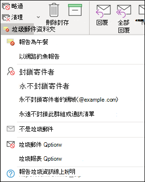
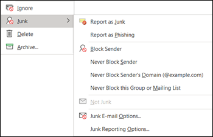
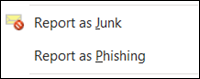

# <a name="install-and-use-the-junk-email-reporting-add-in-for-microsoft-outlook"></a>安裝和使用 Microsoft Outlook 的垃圾郵件回報增益集

[!INCLUDE [Microsoft 365 Defender rebranding](../includes/microsoft-defender-for-office.md)]

**適用於**
- [Exchange Online Protection](exchange-online-protection-overview.md)
- [適用於 Office 365 的 Microsoft Defender 方案 1 和方案 2](defender-for-office-365.md)
- [Microsoft 365 Defender](../defender/microsoft-365-defender.md)

> [!NOTE]
> 如果您目前並未使用垃圾郵件回報增益集，建議您改為 [報告訊息載入](enable-the-report-message-add-in.md) 宏或 [報告網路釣魚增益集](enable-the-report-phish-add-in.md) 。 如需詳細資訊，請參閱[回報訊息和檔案至 Microsoft](report-junk-email-messages-to-microsoft.md)。

Microsoft Outlook 的垃圾郵件回報增益集可讓使用者提交誤報為垃圾郵件的誤報 (已標示為垃圾郵件) 、false 負片 (錯誤電子郵件允許) 和網路釣魚郵件。 如果您的組織未使用 Exchange Online Protection (例如，內部部署 Exchange 或電子郵件服務（Exchange Online) 以外），則您的垃圾郵件報告提交不會影響您的垃圾郵件篩選。

本主題說明如何安裝和使用垃圾郵件回報增益集。

## <a name="what-do-you-need-to-know-before-you-begin"></a>開始之前有哪些須知？

- 若要安裝垃圾郵件回報增益集，請參閱本文稍後的 [安裝垃圾郵件回報增益集](#install-the-junk-email-reporting-add-in) 一節。

- 垃圾郵件回報增益集可與下列 Outlook 版本搭配使用：

  - Outlook 2013 或更新版本
  - Outlook 隨附于適用于企業的 Microsoft 365 應用程式

- 如需將郵件報告給 Microsoft 的詳細資訊，請參閱 [將郵件和檔案報告給 microsoft](report-junk-email-messages-to-microsoft.md)。

## <a name="use-the-junk-email-reporting-add-in-to-report-spam-and-phishing-messages"></a>使用垃圾郵件回報增益集來報告垃圾郵件和網路釣魚郵件

1. 對於收件匣或任何其他電子郵件資料夾（除了垃圾郵件）以外的郵件，請使用下列任何一種方法來報告垃圾郵件和網路釣魚郵件：

   - 選取郵件或開啟郵件。 在功能區的 [**首頁**] 或 [**訊息**] 索引標籤中，按一下 [**垃圾郵件**]，然後選取 [**報告為垃圾郵件**] 或 [**報表為網路**

     

   - 在郵件上按一下滑鼠右鍵，選取 [ **垃圾** 郵件]，然後選取 [ **報告為垃圾** 郵件] 或 [ **報表為網路釣魚**]。

     

   - 選取多封郵件，以滑鼠右鍵按一下，然後選取 [ **報告為垃圾** 郵件] 或 [ **報表為網路釣魚**]。

     

2. 在出現的對話方塊中，閱讀資訊，然後按一下 [ **報告**]。 如果您變更主意，請按一下 [ **不報告**]。

   

   

3. 選取的郵件會傳送至 Microsoft 進行分析，並：

   - 移至 [垃圾郵件] 資料夾（如果已舉報為垃圾郵件）。
   - 已刪除，如果已報告為網路釣魚。

   若要確認郵件已提交，請開啟 **[寄件備份]** 資料夾，以檢視已提交的郵件。

## <a name="use-the-junk-email-reporting-add-in-to-report-non-spam-and-phishing-messages-from-the-junk-email-folder"></a>使用垃圾郵件回報增益集來報告垃圾郵件資料夾中的非垃圾郵件和網路釣魚郵件

1. 在 [垃圾郵件] 資料夾中，使用下列任何一種方法來報告垃圾郵件誤報或網路釣魚郵件：

   - 選取郵件或開啟郵件。 在功能區的 [**首頁**] 或 [**訊息**] 索引標籤中，按一下 [**非垃圾郵件**]，然後選取 [**報告為非垃圾郵件**] 或 [**報表為網路**

     ![從 [垃圾郵件] 資料夾中的功能區報告不是垃圾郵件或網路釣魚電子郵件](../../media/junk-email-reporting-junk-folder-ribbon.png)

   - 在郵件上按一下滑鼠右鍵，按一下 [ **垃圾** 郵件]，然後選取 [ **報告為非垃圾郵件** ] 或 [ **報表為網路釣魚**]。

     ![在 [垃圾郵件] 資料夾中，以滑鼠右鍵按一下不報告垃圾郵件或網路釣魚電子郵件](../../media/junk-email-reporting-junk-folder-right-click.png)

   - 選取多封郵件，以滑鼠右鍵按一下，然後選取 [ **報告為非垃圾郵件** ] 或 [ **報表為網路釣魚**]。

     ![在 [垃圾郵件] 資料夾中，以滑鼠右鍵按一下不限垃圾郵件或網路釣魚電子郵件](../../media/junk-email-reporting-junk-folder-right-click-multiple.png)

2. 在出現的對話方塊中，閱讀資訊，然後按一下 [ **報告**]。 如果您變更主意，請按一下 [ **不報告**]。

   ![[報告為非垃圾郵件] 對話方塊](../../media/junk-email-reporting-report-as-not-junk-dialog.png)

   

3. 選取的郵件會傳送至 Microsoft 進行分析，並：

   - 移至 [垃圾郵件] 資料夾（如果已舉報為垃圾郵件）。
   - 已刪除，如果已報告為網路釣魚。

   若要確認郵件已提交，請開啟 **[寄件備份]** 資料夾，以檢視已提交的郵件。

## <a name="install-the-junk-email-reporting-add-in"></a>安裝垃圾郵件回報增益集

- 您必須具備安裝增益集之電腦的系統管理員許可權。

- 移至 <https://www.microsoft.com/download/details.aspx?id=18275> 並下載適用于您的 Office 版本的 .msi 檔案，以供您尋找的位置：

  - **32** 位： `Junk Reporting Add-in for Office 2007, 2010, 2013, and 2016 (32-bit).msi`
  - **64** 位： `Junk Reporting Add-in for Office 2007, 2010, 2013, and 2016 (64-bit).msi`

- 針對 Outlook 2013 或更新版本，唯一的必要條件是 Microsoft .NET Framework 2.0。 在 Windows 10 中，您不會從下載安裝 .NET Framework 2.0。

### <a name="install-the-junk-email-reporting-add-in-using-the-setup-wizard"></a>使用安裝精靈安裝垃圾郵件回報增益集

1. 在您的電腦上，關閉 Outlook。

2. 在 Windows 10 中，確認已啟用 .NET Framework 2.0。 如需相關指示，請參閱 [Enable the .Net Framework 3.5 In Control Panel](/dotnet/framework/install/dotnet-35-windows-10#enable-the-net-framework-35-in-control-panel)。

3. 找到您已下載的 .msi 檔案，然後按兩下它。

4. 在 **[歡迎使用 Microsoft 垃圾郵件回報增益集安裝程式]** 頁面上，按 **[下一步]**。

5. 閱讀授權合約，如果您同意條款，請按一下 [ **我接受授權合約中的條款** ]，然後按 **[下一步]**。

6. 當精靈完成時，請按一下 **[完成]**。

請啟動 Outlook。

請在 Outlook 功能區上尋找 **[垃圾郵件]** 按鈕。您現在可以選取 [收件匣] 中的垃圾郵件並按一下 **[回報垃圾郵件]** 按鈕，即可向 Microsoft 回報垃圾郵件。

選擇 **[垃圾郵件]** 旁的向下箭號取得更多選項，例如您要向 Microsoft 回報網路釣魚詐騙郵件時使用的 **[回報為網路釣魚]**。在您的垃圾郵件資料夾中，如果電子郵件誤報為垃圾郵件，您也可以選取 **[回報非垃圾郵件]**。

### <a name="install-the-junk-email-reporting-add-in-using-silent-mode"></a>使用無訊息模式安裝垃圾郵件回報增益集

1. 在您的電腦上，關閉 Outlook。

2. 在 Windows 10 中執行下列命令，以安裝 .NET Framework 2.0：

   ```dos
   DISM /Online /Enable-Feature /FeatureName:NetFx3 /All
   ```

3. 若要在沒有任何使用者互動的情況下安裝增益集，請開啟命令提示字元，並使用下列語法：

   ```dos
   msiexec /qn /i "<PathToMSIFile>\<MSIFile>" [MaxMessageSelection=<1-50>] [BccEmailAddress="<EmailAddress1>; <EmailAddress2>"...]
   ```

   - `MaxMessageSelection` 指定您可以為單一提交選取的郵件數目上限。 有效的值介於1到50。 預設值為 15。

   - `BccEmailAddress` 指定將接收所有使用者提交之複本的其他密件副本收件者。 預設值是空白的 (沒有其他的密件副本收件者) 。

   本範例會從指定的路徑，使用預設設定，從指定的路徑安裝64位版本的增益集。

   ```dos
   msiexec /qn /i "C:\Downloads\Junk Reporting Add-in for Office 2007, 2010, 2013, and 2016 (64-bit).msi"
   ```

   此範例會從指定的路徑，使用下列其他設定，安裝32位版本的增益集：

   - 單一提交可選取最多20封郵件。
   - junkreports@contoso.com 和 hollyd@treyresearch.net 接收所有提交的密件副本副本。

   ```dos
   msiexec /qn /i "C:\Downloads\Junk Reporting Add-in for Office 2007, 2010, 2013, and 2016 (32-bit).msi" MaxMessageSelection=20 BccEmailAddress="junkreports@contoso.com; hollyd@treyresearch.net"
   ```

### <a name="how-do-you-know-this-worked"></a>如何知道這是否正常運作？

若要確認您是否已成功安裝垃圾郵件回報增益集，請在 Outlook 中執行下列任一步驟：

- 選取郵件或開啟郵件。 在功能區的 [ **首頁** ] 或 [ **訊息** ] 索引標籤中，按一下 [ **垃圾郵件**]，然後確認下列選項可供使用：

  - **報告為垃圾郵件**
  - **以網路釣魚報告**
  - **垃圾報告選項**
  - **報告垃圾資訊線上說明**

  

- 以滑鼠右鍵按一下郵件，選取 [ **垃圾** 郵件]，然後確認下列選項可供使用：

  - **報告為垃圾郵件**
  - **以網路釣魚報告**
  - **垃圾報告選項**
  - **報告垃圾資訊線上說明**

  

- 選取多封郵件，以滑鼠右鍵按一下，並確認下列選項可供使用：

  - **報告為垃圾郵件**
  - **以網路釣魚報告**

  

- 在 [ **垃圾郵件** ] 資料夾中執行先前的動作，並確認先前的 **垃圾** 申報選項現在 **不是垃圾** 郵件。

  ![從 [垃圾郵件] 資料夾中的功能區報告不是垃圾郵件或網路釣魚電子郵件](../../media/junk-email-reporting-junk-folder-ribbon.png)

  ![在 [垃圾郵件] 資料夾中，以滑鼠右鍵按一下不報告垃圾郵件或網路釣魚電子郵件](../../media/junk-email-reporting-junk-folder-right-click.png)

  ![在 [垃圾郵件] 資料夾中，以滑鼠右鍵按一下不限垃圾郵件或網路釣魚電子郵件](../../media/junk-email-reporting-junk-folder-right-click-multiple.png)

## <a name="uninstall-the-junk-email-reporting-add-in"></a>解除安裝垃圾郵件回報增益集

在您關閉 Outlook 後，請使用下列任何程式卸載垃圾郵件回報增益集：

- **控制台**：按下 Windows 鍵 + R。在開啟的 [ **執行** ] 對話方塊中，輸入， `control appwiz.cpl` 然後按一下 **[確定]**。

  在清單中尋找並選取 **Microsoft 垃圾郵件回報增益集** ，然後按一下 [ **卸載**]。

- **Windows Installer 封裝**：尋找或下載適當的 .msi 檔案，然後按兩下該檔案。

  - **32** 位： `Junk Reporting Add-in for Office 2007, 2010, 2013, and 2016 (32-bit).msi`

  - **64** 位： `Junk Reporting Add-in for Office 2007, 2010, 2013, and 2016 (64-bit).msi`

  在出現的對話方塊中，選取 [ **移除 Outlook 的 Microsoft 垃圾郵件回報增益集** ]，然後按 **[下一步]**。

- **無訊息模式**：尋找或下載適當的 .msi 檔案。 在 [命令提示字元] 視窗中，以 .msi 檔案的位置取代， \<PathToFile\> 並執行下列其中一個命令：

  - **32** 位：

    ```dos
    msiexec /x "<PathToFile>\Junk Reporting Add-in for Office 2007, 2010, 2013, and 2016 (32-bit).msi" /qn MSIRESTARTMANAGERCONTROL="DisableShutdown"
    ```

  - **64** 位：

    ```dos
    msiexec /x "<PathToFile>\Junk Reporting Add-in for Office 2007, 2010, 2013, and 2016 (64-bit).msi" /qn MSIRESTARTMANAGERCONTROL="DisableShutdown"
    ```

當您在卸載後開啟 Outlook 時，[垃圾郵件]、[非垃圾郵件] 和 [網路釣魚報告] 選項都應該消失。

## <a name="troubleshooting-the-junk-email-reporting-add-in"></a>疑難排解垃圾郵件回報增益集

在新增垃圾郵件報告 Add-In 後，您可能會遇到 Outlook 的問題。 本節說明您可能會遇到的問題，以及解決這些問題的秘訣。

### <a name="troubleshooting-for-users"></a>使用者疑難排解

您會遇到下列一或多項問題：

- 按一下 **[回報垃圾郵件]** 沒有作用
- 選取電子郵件後，Outlook 停止回應
- 由於「無法傳遞」回覆，回報的垃圾郵件無法傳遞

若要修正此問題，請執行下列步驟：

1. 關閉並重新啟動 Outlook。
2. 建立及傳送測試郵件，並確認收件者收到郵件。
3. 如果問題仍然存在，請與您的系統管理員聯繫。

如需其他可用於將郵件提交至 Microsoft 的方法，請參閱 [將郵件和檔案報告給 microsoft](report-junk-email-messages-to-microsoft.md)。

### <a name="troubleshooting-for-admins"></a>管理員的疑難排解

#### <a name="problem-an-error-message-continually-appears-that-asks-users-to-contact-their-system-administrator"></a>問題：不斷出現錯誤訊息，詢問使用者是否要聯繫其系統管理員

1. 驗證或將登錄機 `LoggingLevel` 碼設定為 "Verbose" 值：

   - **32 位 Outlook on 32 Bit Windows**：

     ```text
     Windows Registry Editor Version 5.00

     [HKEY_LOCAL_MACHINE\Software\Microsoft\Junk Email Reporting\Addins]
     "LoggingLevel"="Verbose"
     ```

   - **32 位 Outlook on 64 Bit Windows**：

     ```text
     Windows Registry Editor Version 5.00

     [HKEY_LOCAL_MACHINE\Software\Wow6432Node\Microsoft\Junk Email Reporting\Addins]
     "LoggingLevel"="Verbose"
     ```

   - **64 位 Outlook**：

     ```text
     Windows Registry Editor Version 5.00

     [HKEY_LOCAL_MACHINE\Software\Microsoft\Junk E-mail Reporting\Addins]
     "LoggingLevel"="Verbose"
     ```

2. 重新開機 Outlook，並要求使用者在看到錯誤訊息時向後報告回來。

3. 收集下列位置中的記錄資訊：

   `%LOCALAPPDATA%\Microsoft\Junk Email Reporting Add-in\SpamReporterAddinLog.txt`

4. 連絡 Exchange Online Protection 技術支援人員，並提供這項記錄資訊。

#### <a name="problem-users-selected-not-to-receive-a-confirmation-prompt-when-they-report-messages-and-now-they-want-the-prompt-back"></a>問題：選取的使用者在報告郵件時，不會收到確認提示，而且現在想要回復提示

1. 建立 `ConfirmReportJunk` 值為 "True" 的登錄機碼：

   ```text
   Windows Registry Editor Version 5.00

   HKEY_CURRENT_USER\Software\Microsoft\Junk E-mail Reporting\Preferences]
   "ConfirmReportJunk"="True"
   ```

2. 重新啟動 Outlook。