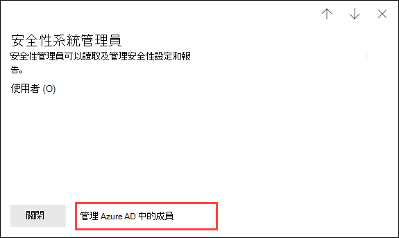

# Microsoft 365 合規性中心和 Microsoft 365 安全性中心中的權限Permissions in the Microsoft 365 compliance center and Microsoft 365 security center

[!INCLUDE [Microsoft 365 Defender rebranding](../includes/microsoft-defender-for-office.md)]

**適用於****Applies to**
- [Exchange Online ProtectionExchange Online Protection](exchange-online-protection-overview.md)
- [適用於 Office 365 的 Microsoft Defender 方案 1 和方案 2Microsoft Defender for Office 365 plan 1 and plan 2](defender-for-office-365.md)
- [Microsoft 365 DefenderMicrosoft 365 Defender](../defender/microsoft-365-defender.md)

您的組織需要管理跨所有 Microsoft 365 服務的安全性與合規性案例。Your organization needs to manage security and compliance scenarios that span all the Microsoft 365 services. 您需要靈活地為組織 IT 群組中的合適人員提供正確的管理員權限。And you need the flexibility to give the right admin permissions to the right people in your organization's IT group. 透過使用 Microsoft 365 安全性中心或 Microsoft 365 合規性中心，您可以集中管理與安全性或合規性相關的所有工作權限。By using the Microsoft 365 security center or Microsoft 365 compliance center, you can manage permissions centrally for all tasks related to security or compliance.

在全域管理員新增這些系統管理員角色後，系統管理員就可以存取 Microsoft 365 中所有服務的功能和資料，例如 Microsoft 365 安全性中心、Microsoft 365 合規性中心、Azure、Office 365 和企業行動力 + 安全性。After a global administrator adds users to these admin roles, these admin will have access to features and data that span all services in Microsoft 365, such as the Microsoft 365 security center, Microsoft 365 compliance center, Azure, Office 365, and Enterprise Mobility + Security.

## 什麼是 Microsoft 365 角色What the Microsoft 365 roles are

Microsoft 365 合規性中心和Microsoft 365 安全性中心中出現的角色是 Azure Active Directory 角色。The roles that appear in the Microsoft 365 compliance center and Microsoft 365 security center are Azure Active Directory roles. 這些角色的設計符合組織 IT 群組中的各個職位，進而能輕鬆地為人員提供完成工作所需的所有權限。These roles are designed to align with job functions in your organization's IT group, making it easy to give a person all the permissions necessary to get their job done.

****

|角色Role|描述Description|
|---|---|
|**全域管理員****Global administrator**|可以存取所有 Microsoft 365 服務中的所有系統管理功能。Access to all administrative features in all Microsoft 365 services. 只有全域管理員才能指派其他系統管理員角色。Only global administrators can assign other administrator roles. 如需詳細資訊，請參閱[全域系統管理員／公司系統管理員](/azure/active-directory/roles/permissions-reference#global-administrator--company-administrator)。For more information, see [Global Administrator / Company Administrator](/azure/active-directory/roles/permissions-reference#global-administrator--company-administrator).|
|**合規性資料管理員****Compliance data administrator**|可以追蹤 Microsoft 365 中的組織資料，確保其受到保護，並深入了解任何問題以協助降低風險。Keep track of your organization's data across Microsoft 365, make sure it's protected, and get insights into any issues to help mitigate risks. 如需詳細資訊，請參閱[合規性資料系統管理員](/azure/active-directory/roles/permissions-reference#compliance-data-administrator)。For more information, see [Compliance Data Administrator](/azure/active-directory/roles/permissions-reference#compliance-data-administrator).|
|**合規性系統管理員****Compliance administrator**|可幫助您的組織遵守任何法規要求、管理電子文件探索案例，並維護 Microsoft 365 各個位置、身分和應用程式的資料監管原則。Help your organization stay compliant with any regulatory requirements, manage eDiscovery cases, and maintain data governance policies across Microsoft 365 locations, identities, and apps. 如需詳細資訊，請參閱 [合規性系統管理員](/azure/active-directory/roles/permissions-reference#compliance-administrator)。For more information, see [Compliance Administrator](/azure/active-directory/roles/permissions-reference#compliance-administrator).|
|**安全性操作員****Security operator**|可檢視、調查和回應 Microsoft 365 使用者、裝置和內容所受的主動威脅。View, investigate, and respond to active threats to your Microsoft 365 users, devices, and content. 如需詳細資訊，請參閱 [安全性運算子](/azure/active-directory/roles/permissions-reference#security-operator)。For more information, see [Security Operator](/azure/active-directory/roles/permissions-reference#security-operator).|
|**安全性讀取者****Security reader**|可檢視和調查 Microsoft 365 使用者、裝置和內容所受的主動威脅，但是 (與安全性運算子不同) 他們沒有透過採取行動而回應的權限。View and investigate active threats to your Microsoft 365 users, devices, and content, but (unlike the Security operator) they do not have permissions to respond by taking action. 如需詳細資訊，請參閱 [安全性讀取者](/azure/active-directory/roles/permissions-reference#security-reader)。For more information, see [Security Reader](/azure/active-directory/roles/permissions-reference#security-reader).|
|**安全性系統管理員****Security administrator**|可透過管理安全性原則、檢視 Microsoft 365 各項產品的安全性分析和報告，以及在威脅環境中保持最新速度，來控制組織的整體安全性。Control your organization's overall security by managing security policies, reviewing security analytics and reports across Microsoft 365 products, and staying up-to-speed on the threat landscape. 如需詳細資訊，請參閱 [安全性系統管理員](/azure/active-directory/roles/permissions-reference#security-administrator)。For more information, see [Security Administrator](/azure/active-directory/roles/permissions-reference#security-administrator).|
|**全域讀取者****Global reader**|**全域系統管理員** 角色的唯讀版本。The read-only version of the **Global administrator** role. 在 Microsoft 365 中檢視所有設定和管理資訊。View all settings and administrative information across Microsoft 365. 如需詳細資訊，請參閱 [全域讀取者](/azure/active-directory/roles/permissions-reference#global-reader)。For more information, see [Global Reader](/azure/active-directory/roles/permissions-reference#global-reader).|
|

## 全域管理員可在 Azure Active Directory 中管理角色Global administrators can manage roles in Azure Active Directory

在 Microsoft 365合規性中心和 Microsoft 365 安全性中心選取角色時，即可檢視其指派。In the Microsoft 365 compliance center and Microsoft 365 security center, when you select a role, you can view its assignments. 但若要管理這些指派，您需要移至 Azure Active Directory。But to manage those assignments, you need to go to the Azure Active Directory.

如需詳細資訊，請參閱[在 Azure Active Directory 中檢視和指派系統管理員角色](/azure/active-directory/users-groups-roles/directory-manage-roles-portal)。For more information, see [View and assign administrator roles in Azure Active Directory](/azure/active-directory/users-groups-roles/directory-manage-roles-portal).

## 在服務而非 Azure Active Directory 中管理角色Managing roles in a service instead of Azure Active Directory

在 Microsoft 365 合規性中心和Microsoft 365 安全性中心中出現的角色也會出現在這些角色有權限的服務中。The roles that appear in the Microsoft 365 compliance center and Microsoft 365 security center also appear in the services where they have permissions. 例如，您可以在安全性與合規性中心看到這些角色。For example, you can see these roles in the Security & Compliance Center.

如需要關於安全性與合規性中心如何使用這些角色的詳細資訊，請參閱[安全性與合規性中心裡的權限](permissions-in-the-security-and-compliance-center.md)。For information about how these roles are used in the Security & Compliance Center, see [Permissions in the Security & Compliance Center](permissions-in-the-security-and-compliance-center.md).

### 打破繼承Breaking inheritance

請務必了解，您在 Azure Active Directory 中管理這些角色時，您也是在為「所有」Microsoft 365 服務集中管理這些角色。It's important to understand that you when you manage these roles in Azure Active Directory, you're doing so centrally for **all** Microsoft 365 services. 但是，當您在特定服務中 (例如安全性與合規性中心) 中管理角色時，您只是管理「該特定服務」的角色。However, when you manage a role in a specific service, such as the Security & Compliance Center, you're managing the role for **only** that specific service. 服務中角色的指派和權限會覆寫授予 Azure Active Directory 角色的任何權限。The assignments and permissions for a role in a service override any permissions granted to the Azure Active Directory role.

這可以相當實用。This can be useful. 例如，如果將某人指派為安全性系統管理員角色，則他們沒有管理事件的權限。For example, if a person is assigned to the Security administrator role, they don't have permissions to manage incidents. 但是，您可以使用適用於端點的 Microsoft Defender 中的權限，來授與他們該服務中事件管理的特定權限。But you can use the permissions in Microsoft Defender for Endpoint to give them the specific permission for incident management in that service.

## 在哪裡可找到每個 Microsoft 365 服務的角色資訊Where to find role information for each Microsoft 365 service

透過將使用者指派為其中一個 Microsoft 365 合規性或安全性系統管理員角色，您可以授與該使用者授予一系列的 Microsoft 365 服務權限。By assigning a user to one of the Microsoft 365 compliance or security admin roles, you give that user permissions to a range of Microsoft 365 services. 使用以下連結來尋找每個服務中，角色特定權限的詳細資訊。Use the links below to find more information about the specific permissions for a role in each service.

****

|Microsoft 365 服務Microsoft 365 service|角色資訊Role info|
|---|---|
|Office 365 與 Microsoft 365 商務方案中的系統管理員角色Admin roles in Office 365 and Microsoft 365 for business plans|[Microsoft 365 系統管理員角色Microsoft 365 admin roles](../../admin/add-users/about-admin-roles.md)|
|Azure Active Directory (Azure AD) 與 Azure AD Identity ProtectionAzure Active Directory (Azure AD) and Azure AD Identity Protection|[Azure AD 系統管理員角色Azure AD admin roles](/azure/active-directory/users-groups-roles/directory-assign-admin-roles)|
|適用於身分識別的 Microsoft DefenderMicrosoft Defender for Identity|[適用於身分識別的 Microsoft Defender 角色群組Microsoft Defender for Identity role groups](/azure-advanced-threat-protection/atp-role-groups)|
|Azure 資訊保護Azure Information Protection|[Azure AD 系統管理員角色Azure AD admin roles](/azure/active-directory/users-groups-roles/directory-assign-admin-roles)|
|合規性管理員Compliance Manager|[合規性管理員](../../compliance/compliance-manager-setup.md#set-user-permissions-and-assign-roles) (英文)[Compliance Manager](../../compliance/compliance-manager-setup.md#set-user-permissions-and-assign-roles)|
|Exchange OnlineExchange Online|[Exchange 角色型存取控制Exchange role-based access control](/exchange/permissions-exo/permissions-exo)|
|IntuneIntune|[Intune 角色型存取控制Intune role-based access control](/intune/role-based-access-control)|
|受管理的電腦Managed Desktop|[Azure AD 系統管理員角色Azure AD admin roles](/azure/active-directory/users-groups-roles/directory-assign-admin-roles)|
|Microsoft Cloud App SecurityMicrosoft Cloud App Security|[角色型存取控制Role-based access control](/cloud-app-security/manage-admins)|
|安全性與合規性中心Security & Compliance Center|[Microsoft 365 系統管理員角色Microsoft 365 admin roles](permissions-in-the-security-and-compliance-center.md)|
|Privileged Identity ManagementPrivileged Identity Management|[Azure AD 系統管理員角色Azure AD admin roles](/azure/active-directory/users-groups-roles/directory-assign-admin-roles)|
|安全分數Secure Score|[Azure AD 系統管理員角色Azure AD admin roles](/azure/active-directory/users-groups-roles/directory-assign-admin-roles)|
|SharePoint OnlineSharePoint Online|[Azure AD 系統管理員角色Azure AD admin roles](/azure/active-directory/users-groups-roles/directory-assign-admin-roles) 
 [關於 Office 365 中的 SharePoint 系統管理員角色About the SharePoint admin role in Office 365](/sharepoint/sharepoint-admin-role)|
|Teams/商務用 SkypeTeams/Skype for Business|[Azure AD 系統管理員角色Azure AD admin roles](/azure/active-directory/users-groups-roles/directory-assign-admin-roles)|
|適用於端點的 Microsoft DefenderMicrosoft Defender for Endpoint|[適用於端點的 Microsoft Defender 角色式存取控制Microsoft Defender for Endpoint role-based access control](/windows/security/threat-protection/windows-defender-atp/rbac-windows-defender-advanced-threat-protection)|
|

## 即將推出Coming soon

我們仍在努力建立 Microsoft 365 合規性中心和 Microsoft 365 安全性中心中的權限。We're still working on permissions in the Microsoft 365 compliance center and Microsoft 365 security center. 例如，我們目前正努力支援以下功能：For example, we're currently working on support for the ability to:

- 在 Microsoft 365 合規性中心和Microsoft 365 安全性中心中管理角色，而不需移至 Azure Active Directory。Manage roles in the Microsoft 365 compliance center and Microsoft 365 security center, instead of going to Azure Active Directory.
- 透過新增或移除特定權限來自訂角色。Customize roles by adding or removing specific permissions.
- 使用您所選權限來建立自訂角色。Create custom roles with permissions that you choose.