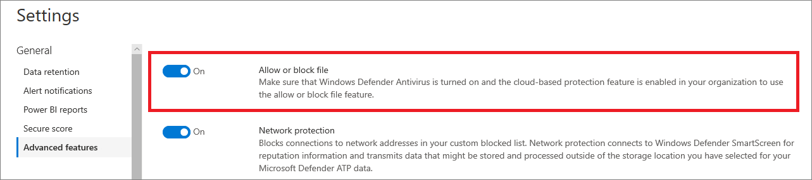

# 在 Defender for Endpoint 中設定高級功能Configure advanced features in Defender for Endpoint

**適用於：****Applies to:**
- [適用於端點的 Microsoft DefenderMicrosoft Defender for Endpoint](https://go.microsoft.com/fwlink/p/?linkid=2154037)
- [Microsoft 365 DefenderMicrosoft 365 Defender](https://go.microsoft.com/fwlink/?linkid=2118804)

[!INCLUDE [Microsoft 365 Defender rebranding](../../includes/microsoft-defender.md)]

> 想要體驗 Defender for Endpoint？Want to experience Defender for Endpoint? [注册免費試用版。Sign up for a free trial.](https://www.microsoft.com/microsoft-365/windows/microsoft-defender-atp?ocid=docs-wdatp-advancedfeats-abovefoldlink)

根據您使用的 Microsoft 安全產品，有些高級功能可能可讓您將 Defender 與的端點整合。Depending on the Microsoft security products that you use, some advanced features might be available for you to integrate Defender for Endpoint with.

## 啟用高級功能Enable advanced features

1. 在功能窗格中，選取 [**喜好設定**] [  >  **高級功能**]。In the navigation pane, select **Preferences setup** > **Advanced features**.
2. 選取您要設定的高級功能，並 **在開啟** 和 **關閉** 之間切換設定。Select the advanced feature you want to configure and toggle the setting between **On** and **Off**.
3. 按一下 [ **儲存喜好** 設定]。Click **Save preferences**.

使用下列高級功能，以更好地抵禦潛在的惡意檔案，並在安全性調查期間取得更佳的洞察力。Use the following advanced features to get better protected from potentially malicious files and gain better insight during security investigations.

## 自動調查Automated investigation

開啟此功能以利用服務的自動化調查和修正功能。Turn on this feature to take advantage of the automated investigation and remediation features of the service. 如需詳細資訊，請參閱 [自動化調查](automated-investigations.md)。For more information, see [Automated investigation](automated-investigations.md).

## 即時回應Live response

開啟此功能，讓具有適當許可權的使用者可以在裝置上啟動即時回應會話。Turn on this feature so that users with the appropriate permissions can start a live response session on devices.

如需角色指派的詳細資訊，請參閱 [建立與管理角色](user-roles.md)。For more information about role assignments, see [Create and manage roles](user-roles.md).

## 伺服器的即時回應Live response for servers
開啟此功能，讓具有適當許可權的使用者可以在伺服器上啟動即時回應會話。Turn on this feature so that users with the appropriate permissions can start a live response session on servers.

如需角色指派的詳細資訊，請參閱 [建立與管理角色](user-roles.md)。For more information about role assignments, see [Create and manage roles](user-roles.md).

## Live response 未簽署的腳本執行Live response unsigned script execution

啟用此功能可讓您在即時回應會話中執行未簽署的腳本。Enabling this feature allows you to run unsigned scripts in a live response session.

## 永遠修正 PUAAlways remediate PUA
可能有害的應用程式 (PUA) 是一種軟體類別，可導致您的機器執行緩慢、顯示未預期的廣告，或是最壞的軟體安裝可能是意外或不需要的軟體。Potentially unwanted applications (PUA) are a category of software that can cause your machine to run slowly, display unexpected ads, or at worst, install other software which might be unexpected or unwanted. 

開啟此功能，以便在租使用者中的所有裝置上修正 (PUA) 可能有害的應用程式，即使裝置上未設定 PUA 保護也是一樣。Turn on this feature so that potentially unwanted applications (PUA) are remediated on all devices in your tenant even if PUA protection is not configured on the devices. 這有助於防止使用者不小心在其裝置上安裝不需要的應用程式。This will help protect users from inadvertently installing unwanted applications on their device. 關閉時，修正取決於裝置設定。When turned off, remediation is dependent on the device configuration. 

## 限制範圍內裝置群組的關聯Restrict correlation to within scoped device groups
這種設定可用於本機 SOC 作業只想要將警示關聯限制為可以存取之裝置群組的情況。This configuration can be used for scenarios where local SOC operations would like to limit alert correlations only to device groups that they can access. 開啟此設定，就不會再視為單一事件，由跨裝置群組的警示所組成的事件。By turning this setting on, an incident composed of alerts that cross device groups will no longer be considered a single incident. 然後，本機 SOC 便可對該事件採取動作，因為他們有權存取相關的其中一個裝置群組。The local SOC can then take action on the incident because they have access to one of the device groups involved. 不過，全域 SOC 會透過設備群組（而不是一個事件）看到數種不同的事件。However, global SOC will see several different incidents by device group instead of one incident. 建議您不要開啟此設定，除非這麼做超過整個組織內的事件關聯的優點We do not recommend turning this setting on unless doing so outweighs the benefits of incident correlation across the entire organization
>[!NOTE]
>變更此設定只會影響未來的警示關聯。Changing this setting impacts future alert correlations only.

## 在封鎖模式中啟用 EDREnable EDR in block mode
端點偵測和回應 (EDR) 在封鎖模式中時，即使 Microsoft Defender 防毒軟體是以被動模式執行，也可以保護惡意的惡意資料。Endpoint detection and response (EDR) in block mode provides protection from malicious artifacts, even when Microsoft Defender Antivirus is running in passive mode. 開啟時，以封鎖模式 EDR 會封鎖在裝置上偵測到的惡意的偽像或行為。When turned on, EDR in block mode blocks malicious artifacts or behaviors that are detected on a device. block 模式中的 EDR 會在幕後運作，以修正偵測到破壞後偵測到的惡意作品。EDR in block mode works behind the scenes to remediate malicious artifacts that are detected post breach.

## 自動解析修正的警示Autoresolve remediated alerts

針對在 Windows 10 或之後建立的承租人，版本1809會預設設定自動調查和修正功能，以解決自動分析結果狀態為「沒有發現威脅」或「修正」的警示。For tenants created on or after Windows 10, version 1809, the automated investigation and remediation capability is configured by default to resolve alerts where the automated analysis result status is "No threats found" or "Remediated".  如果您不想要自動解決的提醒，您必須手動關閉該功能。If you don't want to have alerts auto-resolved, you'll need to manually turn off the feature.

> [!TIP]
> 針對在該版本之前建立的承租人，您必須從 [ [高級功能](https://securitycenter.windows.com/preferences2/integration) ] 頁面手動開啟此功能。For tenants created prior to that version, you'll need to manually turn this feature on from the [Advanced features](https://securitycenter.windows.com/preferences2/integration) page.

> [!NOTE]
>
> - 自動解決動作的結果可能會影響以裝置上所找到之主動警示為基礎的裝置風險等級計算。The result of the auto-resolve action may influence the Device risk level calculation which is based on the active alerts found on a device.
> - 如果安全作業分析員手動將警示的狀態設定為「正在進行中」或「已解析」，則自動解析功能不會覆寫。If a security operations analyst manually sets the status of an alert to "In progress" or "Resolved" the auto-resolve capability will not overwrite it.

## 允許或封鎖檔Allow or block file

只有當您的組織符合這些需求時，才可使用封鎖：Blocking is only available if your organization fulfills these requirements:

- 使用 Microsoft Defender 防毒軟體作為使用中的反惡意程式碼解決方案，並Uses Microsoft Defender Antivirus as the active antimalware solution and,
- 已啟用雲端式保護功能The cloud-based protection feature is enabled

這項功能可讓您在網路中封鎖可能有害的檔案。This feature enables you to block potentially malicious files in your network. 封鎖檔會使其無法在組織中的裝置上讀取、寫入或執行。Blocking a file will prevent it from being read, written, or executed on devices in your organization.

在下列情況開啟 **允許或封鎖** 檔案：To turn **Allow or block** files on:

1. 在功能窗格中，選取 [**設定**  >  **高級功能**  >  **允許或封鎖檔**]。In the navigation pane, select **Settings** > **Advanced features** > **Allow or block file**.

1. 切換設定為 **開啟** 或 **關閉**。Toggle the setting between **On** and **Off**.

    

1. 選取頁面底部的 [ **儲存喜好** 設定]。Select **Save preferences** at the bottom of the page.

開啟此功能後，您可以透過檔案的設定檔頁面面上的 [**新增指示器**] 索引標籤來 [封鎖](respond-file-alerts.md#allow-or-block-file)檔案。After turning on this feature, you can [block files](respond-file-alerts.md#allow-or-block-file) via the **Add Indicator** tab on a file's profile page.

## 自訂網路指示器Custom network indicators

開啟此功能可讓您為 IP 位址、網域或 URLs 建立指示器，以根據您的自訂指示器清單，判斷是否允許或封鎖這些指標。Turning on this feature allows you to create indicators for IP addresses, domains, or URLs, which determine whether they will be allowed or blocked based on your custom indicator list.

若要使用此功能，裝置必須執行 Windows 10 版本1709或更新版本。To use this feature, devices must be running Windows 10 version 1709 or later. 他們也應以封鎖模式進行網路保護，以及反惡意程式碼平臺的版本4.18.1906.3 或更新版本， [請參閱 KB 4052623](https://go.microsoft.com/fwlink/?linkid=2099834)。They should also have network protection in block mode and version 4.18.1906.3 or later of the antimalware platform [see KB 4052623](https://go.microsoft.com/fwlink/?linkid=2099834).

如需詳細資訊，請參閱 [管理指示器](manage-indicators.md)。For more information, see [Manage indicators](manage-indicators.md).

> [!NOTE]
> 網路保護會利用信譽服務處理要求的位置，這些位置可能位於您為您的 Defender for Endpoint data 所選取的位置以外。Network protection leverages reputation services that process requests in locations that might be outside of the location you have selected for your Defender for Endpoint data.

## 防篡改保護Tamper protection
在某些網路攻擊中，不良的演員會嘗試停用電腦上的安全性功能，例如防防毒保護。During some kinds of cyber attacks, bad actors try to disable security features, such as anti-virus protection, on your machines. 不良的演員，例如停用您的安全性功能，以更輕鬆地存取資料、安裝惡意程式碼，或利用您的資料、身分識別及裝置。Bad actors like to disable your security features to get easier access to your data, to install malware, or to otherwise exploit your data, identity, and devices.

防篡改保護實質上會鎖定 Microsoft Defender 防毒軟體，並防止您的安全性設定透過應用程式和方法進行變更。Tamper protection essentially locks Microsoft Defender Antivirus and prevents your security settings from being changed through apps and methods.

如果您的組織使用 Microsoft Defender 防毒軟體和雲端型防護，則可以使用此功能。This feature is available if your organization uses Microsoft Defender Antivirus and Cloud-based protection is enabled. 如需詳細資訊，請參閱[使用下一代技術在 Microsoft Defender 防毒軟體中透過雲端提供的保護](cloud-protection-microsoft-defender-antivirus.md)。For more information, see [Use next-generation technologies in Microsoft Defender Antivirus through cloud-delivered protection](cloud-protection-microsoft-defender-antivirus.md).

使防篡改保護保持開啟，以避免安全性解決方案及其基本功能的不想要的變更。Keep tamper protection turned on to prevent unwanted changes to your security solution and its essential features.

## 顯示使用者詳細資料Show user details

開啟此功能，讓您能看到儲存在 Azure Active Directory 中的使用者詳細資料。Turn on this feature so that you can see user details stored in Azure Active Directory. 詳細資料包括調查使用者帳戶實體時，使用者的圖片、名稱、標題及部門資訊。Details include a user's picture, name, title, and department information  when investigating user account entities. 您可以在下列視圖中尋找使用者帳戶資訊：You can find user account information in the following views:

-  安全性操作儀表板Security operations dashboard
- 警示佇列Alert queue
- 裝置詳細資料頁面Device details page

如需詳細資訊，請參閱 [調查使用者帳戶](investigate-user.md)。For more information, see [Investigate a user account](investigate-user.md).

## 商務用 Skype 整合Skype for Business integration

啟用商務用 Skype 整合功能可讓您使用商務用 Skype、電子郵件或電話與使用者進行通訊。Enabling the Skype for Business integration gives you the ability to communicate with users using Skype for Business, email, or phone. 當您需要與使用者通訊並減輕風險時，這會很便利。This can be handy when you need to communicate with the user and mitigate risks.

> [!NOTE]
> 當裝置與網路隔離時，會有一個快顯視窗，您可以在其中選擇啟用 Outlook 和 Skype 通訊，以便在使用者與網路中斷連線的情況下，與使用者通訊。When a device is being isolated from the network, there's a pop-up where you can choose to enable Outlook and Skype communications which allows communications to the user while they are disconnected from the network. 此設定適用于裝置處於隔離模式時 Skype 和 Outlook 通訊。This setting applies to Skype and Outlook communication when devices are in isolation mode.

## Microsoft Defender 用於身分識別整合Microsoft Defender for Identity integration

與 Microsoft Defender 身分識別的整合，可讓您直接在 Microsoft Identity security 產品中直接旋轉。The integration with Microsoft Defender for Identity allows you to pivot directly into another Microsoft Identity security product. Microsoft Defender for Identity 會以其他有關可疑已遭破壞之帳戶和相關資源之深入瞭解的觀點來增強調查。Microsoft Defender for Identity augments an investigation with additional insights about a suspected compromised account and related resources. 透過啟用這項功能，您就可以透過從識別的觀點來切換網路，來充實裝置型調查功能。By enabling this feature, you'll enrich the device-based investigation capability by pivoting across the network from an identify point of view.

> [!NOTE]
> 您必須具有適當的授權，才能啟用此功能。You'll need to have the appropriate license to enable this feature.

## Office 365威脅智慧連接Office 365 Threat Intelligence connection

只有當您具有使用中 Office 365 E5 或威脅情報附加元件時，才可使用此功能。This feature is only available if you have an active Office 365 E5 or the Threat Intelligence add-on. 如需詳細資訊，請參閱 Office 365 企業版 E5 產品頁面。For more information, see the Office 365 Enterprise E5 product page.

當您開啟此功能時，您可以將 Microsoft Defender 中 Office 365 的資料合併成 Microsoft Defender 資訊安全中心，以跨 Office 365 信箱及 Windows 裝置進行全面的安全性調查。When you turn this feature on, you'll be able to incorporate data from Microsoft Defender for Office 365 into Microsoft Defender Security Center to conduct a comprehensive security investigation across Office 365 mailboxes and Windows devices.

> [!NOTE]
> 您必須具有適當的授權，才能啟用此功能。You'll need to have the appropriate license to enable this feature.

若要在 Office 365 威脅情報中接收上下文相關的裝置整合，您必須在安全性 & 規範儀表板中啟用 [Endpoint for Endpoint] 設定。To receive contextual device integration in Office 365 Threat Intelligence, you'll need to enable the Defender for Endpoint settings in the Security & Compliance dashboard. 如需詳細資訊，請參閱 [威脅調查和回應](/microsoft-365/security/office-365-security/office-365-ti)。For more information, see [Threat investigation and response](/microsoft-365/security/office-365-security/office-365-ti).

## Microsoft 威脅專家目標攻擊通知Microsoft Threat Experts - Targeted Attack Notifications

除了兩個 Microsoft 威脅專家元件，已設定目標攻擊通知是在正式發行時。Out of the two Microsoft Threat Expert components, targeted attack notification is in general availability. 專家隨選功能仍在預覽中。Experts-on-demand capability is still in preview. 如果您已套用預覽，且已核准您的應用程式，您只能使用專家隨選功能。You can only use the experts-on-demand capability if you have applied for preview and your application has been approved. 您可以從 Microsoft 威脅專家透過您的端點入口網站的 [警示] 儀表板，以及透過電子郵件（如果您設定它）來接收目標攻擊通知。You can receive targeted attack notifications from Microsoft Threat Experts through your Defender for Endpoint portal's alerts dashboard and via email if you configure it.

> [!NOTE]
> Microsoft 威脅專家的 Defender for Endpoint 的功能可與[Enterprise Mobility + Security](https://www.microsoft.com/cloud-platform/enterprise-mobility-security)的 E5 授權搭配使用。The Microsoft Threat Experts capability in Defender for Endpoint is available with an E5 license for [Enterprise Mobility + Security](https://www.microsoft.com/cloud-platform/enterprise-mobility-security).
## Microsoft Cloud App SecurityMicrosoft Cloud App Security

啟用此設定時，會將 Defender 的端點信號轉寄至 Microsoft Cloud App Security，以提供 Cloud 應用程式使用的深入瞭解。Enabling this setting forwards Defender for Endpoint signals to Microsoft Cloud App Security to provide deeper visibility into cloud application usage. 轉寄的資料會儲存並處理雲端 App 安全性資料所在的相同位置。Forwarded data is stored and processed in the same location as your Cloud App Security data.

> [!NOTE]
> 在執行 Windows 10 的裝置上，將會有[Enterprise Mobility + Security](https://www.microsoft.com/cloud-platform/enterprise-mobility-security)的 E5 授權、版本 1709 (os 組建16299.1085 （含[KB4493441](https://support.microsoft.com/help/4493441)) 、Windows 10、版本 1803 (os 組建17134.704 搭配[KB4493464](https://support.microsoft.com/help/4493464)) 、Windows 10、版本 1809 (os 組建17763.379 搭配[KB4489899](https://support.microsoft.com/help/4489899)) （或更新版本）。This feature will be available with an E5 license for [Enterprise Mobility + Security](https://www.microsoft.com/cloud-platform/enterprise-mobility-security) on devices running Windows 10, version 1709 (OS Build 16299.1085 with [KB4493441](https://support.microsoft.com/help/4493441)), Windows 10, version 1803 (OS Build 17134.704 with [KB4493464](https://support.microsoft.com/help/4493464)), Windows 10, version 1809 (OS Build 17763.379 with [KB4489899](https://support.microsoft.com/help/4489899)), or later Windows 10 versions.

## Microsoft 安全分數Microsoft Secure Score

在 Microsoft 365 security center 中，將 microsoft Defender for Endpoint 信號轉寄給 microsoft 安全評分。Forwards Microsoft Defender for Endpoint signals to Microsoft Secure Score in the Microsoft 365 security center. 開啟此功能可讓 Microsoft 安全分數看到裝置的安全性狀況。Turning on this feature gives Microsoft Secure Score visibility into the device's security posture. 轉寄的資料會與您的 Microsoft 安全分數資料儲存在相同的位置。Forwarded data is stored and processed in the same location as your Microsoft Secure Score data.

### 從 Microsoft Defender for Identity 入口網站啟用 Microsoft Defender for Endpoint 整合Enable the Microsoft Defender for Endpoint integration from the Microsoft Defender for Identity portal

若要在 Microsoft Defender for Identity 中接收與內容相關的設備整合，您也需要啟用 Microsoft Defender for Identity 入口網站中的功能。To receive contextual device integration in Microsoft Defender for Identity, you'll also need to enable the feature in the Microsoft Defender for Identity portal.

1. 使用全域系統管理員或安全性管理員角色，登入 [Microsoft Defender 的身分識別入口網站](https://portal.atp.azure.com/) 。Log in to the [Microsoft Defender for Identity portal](https://portal.atp.azure.com/) with a Global Administrator or Security Administrator role.

2. 按一下 [ **建立您的實例**]。Click **Create your instance**.

3. 將 Integration 設定切換為 [ **開啟** ]，然後按一下 [ **儲存**]。Toggle the Integration setting to **On** and click **Save**.

完成這兩個入口網站的整合步驟之後，您可以在 [裝置詳細資料] 或 [使用者詳細資料] 頁面看到相關的警示。After completing the integration steps on both portals, you'll be able to see relevant alerts in the device details or user details page.

## Web 內容篩選Web content filtering
封鎖包含有害內容之網站的存取，並追蹤所有網域中的 web 活動。Block access to websites containing unwanted content and track web activity across all domains. 若要指定您要封鎖的 web 內容類別別，請建立 [web 內容篩選原則](https://security.microsoft.com/preferences2/web_content_filtering_policy)。To specify the web content categories you want to block, create a [web content filtering policy](https://security.microsoft.com/preferences2/web_content_filtering_policy). 在部署 [Microsoft Defender For Endpoint security 基準](https://devicemanagement.microsoft.com/#blade/Microsoft_Intune_Workflows/SecurityBaselineSummaryMenu/overview/templateType/2)時，確保您具有封鎖模式中的網路保護。Ensure you have network protection in block mode when deploying the [Microsoft Defender for Endpoint security baseline](https://devicemanagement.microsoft.com/#blade/Microsoft_Intune_Workflows/SecurityBaselineSummaryMenu/overview/templateType/2).

## 與 Microsoft 規範中心共用端點警示Share endpoint alerts with Microsoft Compliance Center
將端點安全性警示和其會審狀態轉寄給 Microsoft 規範中心，讓您能夠使用預警增強內幕風險管理原則，並在內部風險造成損害之前加以修正。Forwards endpoint security alerts and their triage status to Microsoft Compliance Center, allowing you to enhance insider risk management policies with alerts and remediate internal risks before they cause harm. 轉寄的資料會處理並儲存在與 Office 365 資料相同的位置。Forwarded data is processed and stored in the same location as your Office 365 data.

在「內幕風險管理」設定中設定 [安全性原則違規指示器](/microsoft-365/compliance/insider-risk-management-settings#indicators) 後，就會與適用使用者的「內部使用者風險管理」共用端點警示。After configuring the [Security policy violation indicators](/microsoft-365/compliance/insider-risk-management-settings#indicators) in the insider risk management settings, Defender for Endpoint alerts will be shared with insider risk management for applicable users.

## Microsoft Intune 連接Microsoft Intune connection

可以將 Endpoint for 端點與[Microsoft Intune](/intune/what-is-intune)整合，以[啟用裝置風險的條件式存取](/intune/advanced-threat-protection#enable-windows-defender-atp-in-intune)。Defender for Endpoint can be integrated with [Microsoft Intune](/intune/what-is-intune) to [enable device risk-based conditional access](/intune/advanced-threat-protection#enable-windows-defender-atp-in-intune). 當您 [開啟此功能](configure-conditional-access.md)時，您可以使用 Intune 與 Intune 共用 Defender 裝置資訊，進而增強原則的執行能力。When you [turn on this feature](configure-conditional-access.md), you'll be able to share Defender for Endpoint device information with Intune, enhancing policy enforcement.

> [!IMPORTANT]
> 您必須在 Intune 和 Defender for Endpoint 上啟用整合，才能使用此功能。You'll need to enable the integration on both Intune and Defender for Endpoint to use this feature. 如需特定步驟的詳細資訊，請參閱 [在 Defender For Endpoint 中設定條件式存取](configure-conditional-access.md)。For more information on specific steps, see [Configure Conditional Access in Defender for Endpoint](configure-conditional-access.md).

只有在下列情況下，才可使用此功能：This feature is only available if you have the following:

- 企業行動力 + 安全性 E3 的授權租使用者，以及 Windows e5 (或 Microsoft 365 企業版 e5) A licensed tenant for Enterprise Mobility + Security E3, and Windows E5 (or Microsoft 365 Enterprise E5)
- 使用 Intune 管理 Windows 10 裝置的作用中 Microsoft Intune 環境會[連接 Azure AD](/azure/active-directory/devices/concept-azure-ad-join/)。An active Microsoft Intune environment, with Intune-managed Windows 10 devices [Azure AD-joined](/azure/active-directory/devices/concept-azure-ad-join/).

### 條件式存取原則Conditional Access policy

當您啟用 Intune 整合時，Intune 會自動建立傳統的條件式存取 (CA) 原則。When you enable Intune integration, Intune will automatically create a classic Conditional Access (CA) policy. 這項傳統 CA 原則是設定狀態報表至 Intune 的必要條件。This classic CA policy is a prerequisite for setting up status reports to Intune. 不應該刪除。It should not be deleted.

> [!NOTE]
> Intune 所建立的傳統 CA 原則與新式條件式 [存取原則](/azure/active-directory/conditional-access/overview/)不同，用來設定端點。The classic CA policy created by Intune is distinct from modern [Conditional Access policies](/azure/active-directory/conditional-access/overview/), which are used for configuring endpoints.

## 裝置探索Device discovery
協助您找出連接至公司網路的非管理裝置，不需要額外裝置或繁瑣的處理常式變更。Helps you find unmanaged devices connected to your corporate network without the need for extra appliances or cumbersome process changes. 使用架裝置，您可以在網路中尋找未受管理的裝置，並評估漏洞和風險。Using onboarded devices, you can find unmanaged devices in your network and assess vulnerabilities and risks. 如需詳細資訊，請參閱 [Device discovery](device-discovery.md)。For more information, see [Device discovery](device-discovery.md).

> [!NOTE]
> 您永遠可以套用篩選器，以從裝置庫存清單中排除未受管理的裝置。You can always apply filters to exclude unmanaged devices from the device inventory list. 您也可以在 API 查詢上使用 [上架狀態] 欄，以篩選出未受管理的裝置。You can also use the onboarding status column on API queries to filter out unmanaged devices. 

## 預覽功能Preview features

瞭解適用于 Defender 的端點預覽版本中的新功能。Learn about new features in the Defender for Endpoint preview release. 開啟預覽體驗，嘗試即將推出的功能。Try upcoming features by turning on the preview experience.

您將可以存取即將推出的功能，您可以在其中提供意見反應，以協助改善整體體驗，使其成為一般可用功能。You'll have access to upcoming features, which you can provide feedback on to help improve the overall experience before features are generally available.

## 相關主題Related topics

- [更新資料保留設定Update data retention settings](data-retention-settings.md)
- [設定警示通知Configure alert notifications](configure-email-notifications.md)
