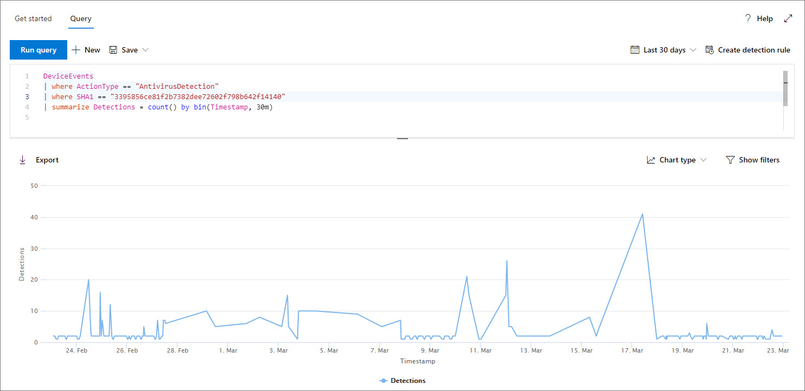

# <a name="work-with-advanced-hunting-query-results"></a>使用高級搜尋查詢結果

[!INCLUDE [Microsoft 365 Defender rebranding](../../includes/microsoft-defender.md)]

**適用於：**
- [適用於端點的 Microsoft Defender](https://go.microsoft.com/fwlink/?linkid=2154037)

>想要體驗 Defender for Endpoint？ [註冊免費試用版。](https://www.microsoft.com/microsoft-365/windows/microsoft-defender-atp?ocid=docs-wdatp-advancedhunting-abovefoldlink)

雖然您可以建立您的 [高級搜尋](advanced-hunting-overview.md) 查詢以傳回非常精確的資訊，但您也可以使用查詢結果，以深入瞭解並調查特定活動和指示器。 您可以對查詢結果採取下列動作：

- 以表格或圖表形式查看結果
- 匯出資料表和圖表
- 深入查看詳細實體資訊
- 直接從結果中調整您的查詢或套用篩選

## <a name="view-query-results-as-a-table-or-chart"></a>以資料表或圖表形式查看查詢結果
根據預設，高級搜尋會將查詢結果顯示為表格式資料。 您也可以將相同的資料顯示為圖表。 「高級搜尋支援下列各項：

| 檢視類型 | 描述 |
| -- | -- |
| **Table** | 以表格格式顯示查詢結果 |
| **直條圖** | 在 X 軸上轉譯一系列的唯一專案，成為其高度代表其他欄位數值的分隔號 |
| **堆疊直條圖** | 會在 X 軸上轉譯一系列的唯一專案，成為堆疊分隔號，其高度代表一個或多個其他欄位的數值 |
| **圓形圖** | 會呈現代表唯一專案的剖圓形圖。 每個圓形圖的大小代表來自其他欄位的數值。 |
| **環形圖表** | 會呈現代表唯一專案的剖弧形。 每個弧線的長度代表來自其他欄位的數值。 |
| **折線圖** | 會為一系列的唯一專案繪製數值，並連接繪製值 |
| **散佈圖** | 繪製一系列唯一專案的數值 |
| **面積圖** | 繪製一系列獨特專案的數值，並填滿所繪製的值底下的區段 |

### <a name="construct-queries-for-effective-charts"></a>構造有效圖表的查詢
在呈現圖表時，高級搜尋會自動識別感興趣的資料行以及要匯總的數值。 若要取得有意義的圖表，請建立您的查詢以傳回您想要查看的特定值。 以下是一些範例查詢和結果圖表。

#### <a name="alerts-by-severity"></a>警示（按嚴重性）
使用 `summarize` 運算子可取得您要繪製圖表之值的數值計數。 下列查詢會使用 `summarize` 接線員依嚴重性取得警示數目。

```kusto
DeviceAlertEvents
| summarize Total = count() by Severity
```
當您轉譯結果時，直條圖會將每個嚴重性值顯示為個別的資料行：


 *嚴重性顯示為欄圖表的警示欄查詢結果。*

#### <a name="alert-severity-by-operating-system"></a>依作業系統的警示嚴重性
您也可以使用 `summarize` 運算子來準備從多個欄位繪製圖表值的結果。 例如，您可能想要瞭解如何在作業系統之間散佈警示嚴重性 (OS) 。 

下列查詢會使用一個 `join` 運算子從資料表中拉入 OS 資訊 `DeviceInfo` ，然後使用 `summarize` 來計數和欄中的值 `OSPlatform` `Severity` ：

```kusto
DeviceAlertEvents
| join DeviceInfo on DeviceId
| summarize Count = count() by OSPlatform, Severity
```
這些結果是使用堆疊欄圖表的最佳顯示方式：


 *依作業系統及嚴重性顯示為堆疊* 圖表的通知圖表查詢結果。

#### <a name="top-ten-device-groups-with-alerts"></a>具有警示的前10個裝置群組
如果您正在處理的值清單並不有限，您可以使用 `Top` 運算子，只繪製大多數實例的值。 例如，若要取得最大警示的前10個裝置群組，請使用下列查詢：

```kusto
DeviceAlertEvents
| join DeviceInfo on DeviceId
| summarize Count = count() by MachineGroup
| top 10 by Count
```
使用圓形圖模式，以有效顯示各主要群組的散佈方式：


 *跨裝置群組的警示散佈*

#### <a name="malware-detections-over-time"></a>一段時間的惡意程式碼偵測
使用 `summarize` 運算子搭配 `bin()` 函數，您可以檢查是否有一段時間的特定指示器相關的事件。 下列查詢會將 EICAR.TXT 測試檔案的偵測計算30分鐘內，以顯示該檔案的偵測中的波峰：

```kusto
DeviceEvents
| where ActionType == "AntivirusDetection"
| where SHA1 == "3395856ce81f2b7382dee72602f798b642f14140"
| summarize Detections = count() by bin(Timestamp, 30m)
```
下方的折線圖會明確強調時間週期，以及測試惡意程式碼的更多偵測： 


 *顯示一段時間內的測試惡意程式碼* 的偵測數目。


## <a name="export-tables-and-charts"></a>匯出資料表和圖表
執行查詢後，請選取 [ **匯出** ]，將結果儲存至本機檔案。 您所選擇的查看會決定結果的匯出方式：

- **表格視圖** --查詢結果會以表格形式匯出為 Microsoft Excel 活頁簿
- **任何圖表** --查詢結果會匯出為所呈現圖表的 JPEG 圖像

## <a name="drill-down-from-query-results"></a>從查詢結果向下切入
若要在查詢結果中查看實體的詳細資訊，例如裝置、檔案、使用者、IP 位址和 URLs，只要按一下實體識別碼即可。 這會開啟所選實體的詳細設定檔頁面面。

若要快速檢查查詢結果中的記錄，請選取對應的資料列，以開啟 [檢查記錄] 面板。 面板會根據選取的記錄提供下列資訊：

- **資產** -主要資產（ (信箱、裝置和使用者）的摘要視圖，可在記錄中找到) ，並豐富可用資訊，例如風險和暴露程度。
- **處理樹狀目錄** ：針對含處理常式資訊的記錄所產生的圖表，以及使用可用的內容資訊，將其豐富。一般說來，傳回多個資料列的查詢可能會產生更豐富的程式樹。
- **所有詳細資料** --列出記錄中欄的所有值

## <a name="tweak-your-queries-from-the-results"></a>從結果調整您的查詢
以滑鼠右鍵按一下結果集中的值，以快速強化您的查詢。 您可以使用下列選項來執行這些動作：

- 明確尋找選取的值 (`==`)
- 從查詢排除選取的值 (`!=`)
- 取得更多可將值新增至查詢的進階運算子，例如 `contains`、`starts with` 和 `ends with` 


## <a name="filter-the-query-results"></a>篩選查詢結果
顯示在右窗格中的篩選器提供結果集的摘要。 每一欄在窗格中都有自己的區段，每個欄會列出該欄位中的值，以及實例數目。

`+` `-` 在您要包含或排除的值上選取 [或] 按鈕，以精煉您的查詢。 然後選取 [ **執行查詢**]。


一旦套用篩選來修改查詢，然後執行查詢，結果就會相應更新。

## <a name="related-topics"></a>相關主題
- [進階搜捕概觀](advanced-hunting-overview.md)
- [了解查詢語言](advanced-hunting-query-language.md)
- [使用共用查詢](advanced-hunting-shared-queries.md)
- [了解結構描述](advanced-hunting-schema-reference.md)
- [套用查詢最佳做法](advanced-hunting-best-practices.md)
- [自訂偵測概觀](overview-custom-detections.md)
