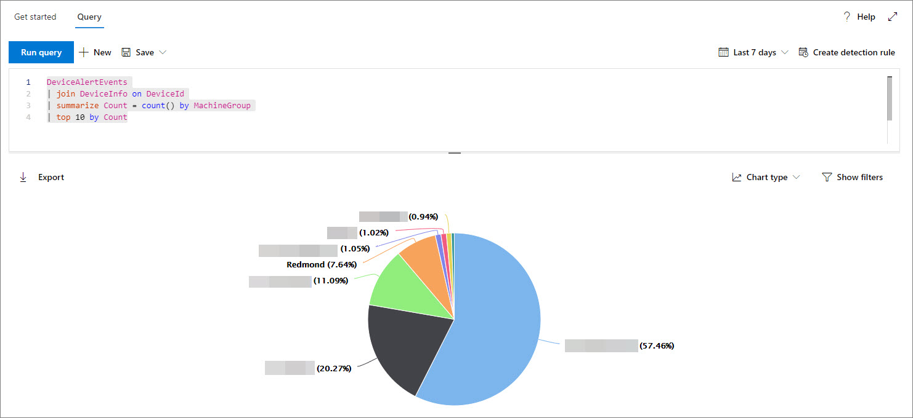

# <a name="work-with-advanced-hunting-query-results"></a><span data-ttu-id="8a5e4-104">使用高級搜尋查詢結果</span><span class="sxs-lookup"><span data-stu-id="8a5e4-104">Work with advanced hunting query results</span></span>

[!INCLUDE [Microsoft 365 Defender rebranding](../../includes/microsoft-defender.md)]

<span data-ttu-id="8a5e4-105">**適用於：**</span><span class="sxs-lookup"><span data-stu-id="8a5e4-105">**Applies to:**</span></span>
- [<span data-ttu-id="8a5e4-106">適用於端點的 Microsoft Defender</span><span class="sxs-lookup"><span data-stu-id="8a5e4-106">Microsoft Defender for Endpoint</span></span>](https://go.microsoft.com/fwlink/?linkid=2154037)

><span data-ttu-id="8a5e4-107">想要體驗 Defender for Endpoint？</span><span class="sxs-lookup"><span data-stu-id="8a5e4-107">Want to experience Defender for Endpoint?</span></span> [<span data-ttu-id="8a5e4-108">註冊免費試用版。</span><span class="sxs-lookup"><span data-stu-id="8a5e4-108">Sign up for a free trial.</span></span>](https://www.microsoft.com/microsoft-365/windows/microsoft-defender-atp?ocid=docs-wdatp-advancedhunting-abovefoldlink)

<span data-ttu-id="8a5e4-109">雖然您可以建立您的 [高級搜尋](advanced-hunting-overview.md) 查詢以傳回非常精確的資訊，但您也可以使用查詢結果，以深入瞭解並調查特定活動和指示器。</span><span class="sxs-lookup"><span data-stu-id="8a5e4-109">While you can construct your [advanced hunting](advanced-hunting-overview.md) queries to return very precise information, you can also work with the query results to gain further insight and investigate specific activities and indicators.</span></span> <span data-ttu-id="8a5e4-110">您可以對查詢結果採取下列動作：</span><span class="sxs-lookup"><span data-stu-id="8a5e4-110">You can take the following actions on your query results:</span></span>

- <span data-ttu-id="8a5e4-111">以表格或圖表形式查看結果</span><span class="sxs-lookup"><span data-stu-id="8a5e4-111">View results as a table or chart</span></span>
- <span data-ttu-id="8a5e4-112">匯出資料表和圖表</span><span class="sxs-lookup"><span data-stu-id="8a5e4-112">Export tables and charts</span></span>
- <span data-ttu-id="8a5e4-113">深入查看詳細實體資訊</span><span class="sxs-lookup"><span data-stu-id="8a5e4-113">Drill down to detailed entity information</span></span>
- <span data-ttu-id="8a5e4-114">直接從結果中調整您的查詢或套用篩選</span><span class="sxs-lookup"><span data-stu-id="8a5e4-114">Tweak your queries directly from the results or apply filters</span></span>

## <a name="view-query-results-as-a-table-or-chart"></a><span data-ttu-id="8a5e4-115">以資料表或圖表形式查看查詢結果</span><span class="sxs-lookup"><span data-stu-id="8a5e4-115">View query results as a table or chart</span></span>
<span data-ttu-id="8a5e4-116">根據預設，高級搜尋會將查詢結果顯示為表格式資料。</span><span class="sxs-lookup"><span data-stu-id="8a5e4-116">By default, advanced hunting displays query results as tabular data.</span></span> <span data-ttu-id="8a5e4-117">您也可以將相同的資料顯示為圖表。</span><span class="sxs-lookup"><span data-stu-id="8a5e4-117">You can also display the same data as a chart.</span></span> <span data-ttu-id="8a5e4-118">「高級搜尋支援下列各項：</span><span class="sxs-lookup"><span data-stu-id="8a5e4-118">Advanced hunting supports the following views:</span></span>

| <span data-ttu-id="8a5e4-119">檢視類型</span><span class="sxs-lookup"><span data-stu-id="8a5e4-119">View type</span></span> | <span data-ttu-id="8a5e4-120">描述</span><span class="sxs-lookup"><span data-stu-id="8a5e4-120">Description</span></span> |
| -- | -- |
| <span data-ttu-id="8a5e4-121">**Table**</span><span class="sxs-lookup"><span data-stu-id="8a5e4-121">**Table**</span></span> | <span data-ttu-id="8a5e4-122">以表格格式顯示查詢結果</span><span class="sxs-lookup"><span data-stu-id="8a5e4-122">Displays the query results in tabular format</span></span> |
| <span data-ttu-id="8a5e4-123">**直條圖**</span><span class="sxs-lookup"><span data-stu-id="8a5e4-123">**Column chart**</span></span> | <span data-ttu-id="8a5e4-124">在 X 軸上轉譯一系列的唯一專案，成為其高度代表其他欄位數值的分隔號</span><span class="sxs-lookup"><span data-stu-id="8a5e4-124">Renders a series of unique items on the x-axis as vertical bars whose heights represent numeric values from another field</span></span> |
| <span data-ttu-id="8a5e4-125">**堆疊直條圖**</span><span class="sxs-lookup"><span data-stu-id="8a5e4-125">**Stacked column chart**</span></span> | <span data-ttu-id="8a5e4-126">會在 X 軸上轉譯一系列的唯一專案，成為堆疊分隔號，其高度代表一個或多個其他欄位的數值</span><span class="sxs-lookup"><span data-stu-id="8a5e4-126">Renders a series of unique items on the x-axis as stacked vertical bars whose heights represent numeric values from one or more other fields</span></span> |
| <span data-ttu-id="8a5e4-127">**圓形圖**</span><span class="sxs-lookup"><span data-stu-id="8a5e4-127">**Pie chart**</span></span> | <span data-ttu-id="8a5e4-128">會呈現代表唯一專案的剖圓形圖。</span><span class="sxs-lookup"><span data-stu-id="8a5e4-128">Renders sectional pies representing unique items.</span></span> <span data-ttu-id="8a5e4-129">每個圓形圖的大小代表來自其他欄位的數值。</span><span class="sxs-lookup"><span data-stu-id="8a5e4-129">The size of each pie represents numeric values from another field.</span></span> |
| <span data-ttu-id="8a5e4-130">**環形圖表**</span><span class="sxs-lookup"><span data-stu-id="8a5e4-130">**Donut chart**</span></span> | <span data-ttu-id="8a5e4-131">會呈現代表唯一專案的剖弧形。</span><span class="sxs-lookup"><span data-stu-id="8a5e4-131">Renders sectional arcs representing unique items.</span></span> <span data-ttu-id="8a5e4-132">每個弧線的長度代表來自其他欄位的數值。</span><span class="sxs-lookup"><span data-stu-id="8a5e4-132">The length of each arc represents numeric values from another field.</span></span> |
| <span data-ttu-id="8a5e4-133">**折線圖**</span><span class="sxs-lookup"><span data-stu-id="8a5e4-133">**Line chart**</span></span> | <span data-ttu-id="8a5e4-134">會為一系列的唯一專案繪製數值，並連接繪製值</span><span class="sxs-lookup"><span data-stu-id="8a5e4-134">Plots numeric values for a series of unique items and connects the plotted values</span></span> |
| <span data-ttu-id="8a5e4-135">**散佈圖**</span><span class="sxs-lookup"><span data-stu-id="8a5e4-135">**Scatter chart**</span></span> | <span data-ttu-id="8a5e4-136">繪製一系列唯一專案的數值</span><span class="sxs-lookup"><span data-stu-id="8a5e4-136">Plots numeric values for a series of unique items</span></span> |
| <span data-ttu-id="8a5e4-137">**面積圖**</span><span class="sxs-lookup"><span data-stu-id="8a5e4-137">**Area chart**</span></span> | <span data-ttu-id="8a5e4-138">繪製一系列獨特專案的數值，並填滿所繪製的值底下的區段</span><span class="sxs-lookup"><span data-stu-id="8a5e4-138">Plots numeric values for a series of unique items and fills the sections below the plotted values</span></span> |

### <a name="construct-queries-for-effective-charts"></a><span data-ttu-id="8a5e4-139">構造有效圖表的查詢</span><span class="sxs-lookup"><span data-stu-id="8a5e4-139">Construct queries for effective charts</span></span>
<span data-ttu-id="8a5e4-140">在呈現圖表時，高級搜尋會自動識別感興趣的資料行以及要匯總的數值。</span><span class="sxs-lookup"><span data-stu-id="8a5e4-140">When rendering charts, advanced hunting automatically identifies columns of interest and the numeric values to aggregate.</span></span> <span data-ttu-id="8a5e4-141">若要取得有意義的圖表，請建立您的查詢以傳回您想要查看的特定值。</span><span class="sxs-lookup"><span data-stu-id="8a5e4-141">To get meaningful charts, construct your queries to return the specific values you want to see visualized.</span></span> <span data-ttu-id="8a5e4-142">以下是一些範例查詢和結果圖表。</span><span class="sxs-lookup"><span data-stu-id="8a5e4-142">Here are some sample queries and the resulting charts.</span></span>

#### <a name="alerts-by-severity"></a><span data-ttu-id="8a5e4-143">警示（按嚴重性）</span><span class="sxs-lookup"><span data-stu-id="8a5e4-143">Alerts by severity</span></span>
<span data-ttu-id="8a5e4-144">使用 `summarize` 運算子可取得您要繪製圖表之值的數值計數。</span><span class="sxs-lookup"><span data-stu-id="8a5e4-144">Use the `summarize` operator to obtain a numeric count of the values you want to chart.</span></span> <span data-ttu-id="8a5e4-145">下列查詢會使用 `summarize` 接線員依嚴重性取得警示數目。</span><span class="sxs-lookup"><span data-stu-id="8a5e4-145">The query below uses the `summarize` operator to get the number of alerts by severity.</span></span>

```kusto
DeviceAlertEvents
| summarize Total = count() by Severity
```
<span data-ttu-id="8a5e4-146">當您轉譯結果時，直條圖會將每個嚴重性值顯示為個別的資料行：</span><span class="sxs-lookup"><span data-stu-id="8a5e4-146">When rendering the results, a column chart displays each severity value as a separate column:</span></span>

<span data-ttu-id="8a5e4-147">
 *嚴重性顯示為欄圖表的警示欄查詢結果。*</span><span class="sxs-lookup"><span data-stu-id="8a5e4-147">
*Query results for alerts by severity displayed as a column chart*</span></span>

#### <a name="alert-severity-by-operating-system"></a><span data-ttu-id="8a5e4-148">依作業系統的警示嚴重性</span><span class="sxs-lookup"><span data-stu-id="8a5e4-148">Alert severity by operating system</span></span>
<span data-ttu-id="8a5e4-149">您也可以使用 `summarize` 運算子來準備從多個欄位繪製圖表值的結果。</span><span class="sxs-lookup"><span data-stu-id="8a5e4-149">You could also use the `summarize` operator to prepare results for charting values from multiple fields.</span></span> <span data-ttu-id="8a5e4-150">例如，您可能想要瞭解如何在作業系統之間散佈警示嚴重性 (OS) 。</span><span class="sxs-lookup"><span data-stu-id="8a5e4-150">For example, you might want to understand how alert severities are distributed across operating systems (OS).</span></span> 

<span data-ttu-id="8a5e4-151">下列查詢會使用一個 `join` 運算子從資料表中拉入 OS 資訊 `DeviceInfo` ，然後使用 `summarize` 來計數和欄中的值 `OSPlatform` `Severity` ：</span><span class="sxs-lookup"><span data-stu-id="8a5e4-151">The query below uses a `join` operator to pull in OS information from the `DeviceInfo` table, and then uses `summarize` to count values in both the `OSPlatform` and `Severity` columns:</span></span>

```kusto
DeviceAlertEvents
| join DeviceInfo on DeviceId
| summarize Count = count() by OSPlatform, Severity
```
<span data-ttu-id="8a5e4-152">這些結果是使用堆疊欄圖表的最佳顯示方式：</span><span class="sxs-lookup"><span data-stu-id="8a5e4-152">These results are best visualized using a stacked column chart:</span></span>

<span data-ttu-id="8a5e4-153">
 *依作業系統及嚴重性顯示為堆疊* 圖表的通知圖表查詢結果。</span><span class="sxs-lookup"><span data-stu-id="8a5e4-153">
*Query results for alerts by OS and severity displayed as a stacked chart*</span></span>

#### <a name="top-ten-device-groups-with-alerts"></a><span data-ttu-id="8a5e4-154">具有警示的前10個裝置群組</span><span class="sxs-lookup"><span data-stu-id="8a5e4-154">Top ten device groups with alerts</span></span>
<span data-ttu-id="8a5e4-155">如果您正在處理的值清單並不有限，您可以使用 `Top` 運算子，只繪製大多數實例的值。</span><span class="sxs-lookup"><span data-stu-id="8a5e4-155">If you're dealing with a list of values that isn’t finite, you can use the `Top` operator to chart only the values with the most instances.</span></span> <span data-ttu-id="8a5e4-156">例如，若要取得最大警示的前10個裝置群組，請使用下列查詢：</span><span class="sxs-lookup"><span data-stu-id="8a5e4-156">For example, to get the top ten device groups with the most alerts, use the query below:</span></span>

```kusto
DeviceAlertEvents
| join DeviceInfo on DeviceId
| summarize Count = count() by MachineGroup
| top 10 by Count
```
<span data-ttu-id="8a5e4-157">使用圓形圖模式，以有效顯示各主要群組的散佈方式：</span><span class="sxs-lookup"><span data-stu-id="8a5e4-157">Use the pie chart view to effectively show distribution across the top groups:</span></span>

<span data-ttu-id="8a5e4-158">
 *跨裝置群組的警示散佈*</span><span class="sxs-lookup"><span data-stu-id="8a5e4-158">
*Pie chart showing distribution of alerts across device groups*</span></span>

#### <a name="malware-detections-over-time"></a><span data-ttu-id="8a5e4-159">一段時間的惡意程式碼偵測</span><span class="sxs-lookup"><span data-stu-id="8a5e4-159">Malware detections over time</span></span>
<span data-ttu-id="8a5e4-160">使用 `summarize` 運算子搭配 `bin()` 函數，您可以檢查是否有一段時間的特定指示器相關的事件。</span><span class="sxs-lookup"><span data-stu-id="8a5e4-160">Using the `summarize` operator with the `bin()` function, you can check for events involving a particular indicator over time.</span></span> <span data-ttu-id="8a5e4-161">下列查詢會將 EICAR.TXT 測試檔案的偵測計算30分鐘內，以顯示該檔案的偵測中的波峰：</span><span class="sxs-lookup"><span data-stu-id="8a5e4-161">The query below counts detections of an EICAR test file at 30 minute intervals to show spikes in detections of that file:</span></span>

```kusto
DeviceEvents
| where ActionType == "AntivirusDetection"
| where SHA1 == "3395856ce81f2b7382dee72602f798b642f14140"
| summarize Detections = count() by bin(Timestamp, 30m)
```
<span data-ttu-id="8a5e4-162">下方的折線圖會明確強調時間週期，以及測試惡意程式碼的更多偵測：</span><span class="sxs-lookup"><span data-stu-id="8a5e4-162">The line chart below clearly highlights time periods with more detections of the test malware:</span></span> 

<span data-ttu-id="8a5e4-163">
 *顯示一段時間內的測試惡意程式碼* 的偵測數目。</span><span class="sxs-lookup"><span data-stu-id="8a5e4-163">
*Line chart showing the number of detections of a test malware over time*</span></span>


## <a name="export-tables-and-charts"></a><span data-ttu-id="8a5e4-164">匯出資料表和圖表</span><span class="sxs-lookup"><span data-stu-id="8a5e4-164">Export tables and charts</span></span>
<span data-ttu-id="8a5e4-165">執行查詢後，請選取 [ **匯出** ]，將結果儲存至本機檔案。</span><span class="sxs-lookup"><span data-stu-id="8a5e4-165">After running a query, select **Export** to save the results to local file.</span></span> <span data-ttu-id="8a5e4-166">您所選擇的查看會決定結果的匯出方式：</span><span class="sxs-lookup"><span data-stu-id="8a5e4-166">Your chosen view determines how the results are exported:</span></span>

- <span data-ttu-id="8a5e4-167">**表格視圖** --查詢結果會以表格形式匯出為 Microsoft Excel 活頁簿</span><span class="sxs-lookup"><span data-stu-id="8a5e4-167">**Table view** — the query results are exported in tabular form as a Microsoft Excel workbook</span></span>
- <span data-ttu-id="8a5e4-168">**任何圖表** --查詢結果會匯出為所呈現圖表的 JPEG 圖像</span><span class="sxs-lookup"><span data-stu-id="8a5e4-168">**Any chart** — the query results are exported as a JPEG image of the rendered chart</span></span>

## <a name="drill-down-from-query-results"></a><span data-ttu-id="8a5e4-169">從查詢結果向下切入</span><span class="sxs-lookup"><span data-stu-id="8a5e4-169">Drill down from query results</span></span>
<span data-ttu-id="8a5e4-170">若要在查詢結果中查看實體的詳細資訊，例如裝置、檔案、使用者、IP 位址和 URLs，只要按一下實體識別碼即可。</span><span class="sxs-lookup"><span data-stu-id="8a5e4-170">To view more information about entities, such as devices, files, users, IP addresses, and URLs, in your query results, simply click the entity identifier.</span></span> <span data-ttu-id="8a5e4-171">這會開啟所選實體的詳細設定檔頁面面。</span><span class="sxs-lookup"><span data-stu-id="8a5e4-171">This opens a detailed profile page for the selected entity.</span></span>

<span data-ttu-id="8a5e4-172">若要快速檢查查詢結果中的記錄，請選取對應的資料列，以開啟 [檢查記錄] 面板。</span><span class="sxs-lookup"><span data-stu-id="8a5e4-172">To quickly inspect a record in your query results, select the corresponding row to open the Inspect record panel.</span></span> <span data-ttu-id="8a5e4-173">面板會根據選取的記錄提供下列資訊：</span><span class="sxs-lookup"><span data-stu-id="8a5e4-173">The panel provides the following information based on the selected record:</span></span>

- <span data-ttu-id="8a5e4-174">**資產** -主要資產（ (信箱、裝置和使用者）的摘要視圖，可在記錄中找到) ，並豐富可用資訊，例如風險和暴露程度。</span><span class="sxs-lookup"><span data-stu-id="8a5e4-174">**Assets** — A summarized view of the main assets (mailboxes, devices, and users) found in the record, enriched with available information, such as risk and exposure levels</span></span>
- <span data-ttu-id="8a5e4-175">**處理樹狀目錄** ：針對含處理常式資訊的記錄所產生的圖表，以及使用可用的內容資訊，將其豐富。一般說來，傳回多個資料列的查詢可能會產生更豐富的程式樹。</span><span class="sxs-lookup"><span data-stu-id="8a5e4-175">**Process tree** — A chart generated for records with process information and enriched using available contextual information; in general, queries that return more columns can result in richer process trees.</span></span>
- <span data-ttu-id="8a5e4-176">**所有詳細資料** --列出記錄中欄的所有值</span><span class="sxs-lookup"><span data-stu-id="8a5e4-176">**All details** — Lists all the values from the columns in the record</span></span>

## <a name="tweak-your-queries-from-the-results"></a><span data-ttu-id="8a5e4-177">從結果調整您的查詢</span><span class="sxs-lookup"><span data-stu-id="8a5e4-177">Tweak your queries from the results</span></span>
<span data-ttu-id="8a5e4-178">以滑鼠右鍵按一下結果集中的值，以快速強化您的查詢。</span><span class="sxs-lookup"><span data-stu-id="8a5e4-178">Right-click a value in the result set to quickly enhance your query.</span></span> <span data-ttu-id="8a5e4-179">您可以使用下列選項來執行這些動作：</span><span class="sxs-lookup"><span data-stu-id="8a5e4-179">You can use the options to:</span></span>

- <span data-ttu-id="8a5e4-180">明確尋找選取的值 (`==`)</span><span class="sxs-lookup"><span data-stu-id="8a5e4-180">Explicitly look for the selected value (`==`)</span></span>
- <span data-ttu-id="8a5e4-181">從查詢排除選取的值 (`!=`)</span><span class="sxs-lookup"><span data-stu-id="8a5e4-181">Exclude the selected value from the query (`!=`)</span></span>
- <span data-ttu-id="8a5e4-182">取得更多可將值新增至查詢的進階運算子，例如 `contains`、`starts with` 和 `ends with`</span><span class="sxs-lookup"><span data-stu-id="8a5e4-182">Get more advanced operators for adding the value to your query, such as `contains`, `starts with` and `ends with`</span></span> 


## <a name="filter-the-query-results"></a><span data-ttu-id="8a5e4-184">篩選查詢結果</span><span class="sxs-lookup"><span data-stu-id="8a5e4-184">Filter the query results</span></span>
<span data-ttu-id="8a5e4-185">顯示在右窗格中的篩選器提供結果集的摘要。</span><span class="sxs-lookup"><span data-stu-id="8a5e4-185">The filters displayed in the right pane provide a summary of the result set.</span></span> <span data-ttu-id="8a5e4-186">每一欄在窗格中都有自己的區段，每個欄會列出該欄位中的值，以及實例數目。</span><span class="sxs-lookup"><span data-stu-id="8a5e4-186">Every column has its own section in the pane, each of which lists the values found in that column, and the number of instances.</span></span>

<span data-ttu-id="8a5e4-187">`+` `-` 在您要包含或排除的值上選取 [或] 按鈕，以精煉您的查詢。</span><span class="sxs-lookup"><span data-stu-id="8a5e4-187">Refine your query by selecting the `+` or `-` buttons on the values that you want to include or exclude.</span></span> <span data-ttu-id="8a5e4-188">然後選取 [ **執行查詢**]。</span><span class="sxs-lookup"><span data-stu-id="8a5e4-188">Then select **Run query**.</span></span>


<span data-ttu-id="8a5e4-190">一旦套用篩選來修改查詢，然後執行查詢，結果就會相應更新。</span><span class="sxs-lookup"><span data-stu-id="8a5e4-190">Once you apply the filter to modify the query and then run the query, the results are updated accordingly.</span></span>

## <a name="related-topics"></a><span data-ttu-id="8a5e4-191">相關主題</span><span class="sxs-lookup"><span data-stu-id="8a5e4-191">Related topics</span></span>
- [<span data-ttu-id="8a5e4-192">進階搜捕概觀</span><span class="sxs-lookup"><span data-stu-id="8a5e4-192">Advanced hunting overview</span></span>](advanced-hunting-overview.md)
- [<span data-ttu-id="8a5e4-193">了解查詢語言</span><span class="sxs-lookup"><span data-stu-id="8a5e4-193">Learn the query language</span></span>](advanced-hunting-query-language.md)
- [<span data-ttu-id="8a5e4-194">使用共用查詢</span><span class="sxs-lookup"><span data-stu-id="8a5e4-194">Use shared queries</span></span>](advanced-hunting-shared-queries.md)
- [<span data-ttu-id="8a5e4-195">了解結構描述</span><span class="sxs-lookup"><span data-stu-id="8a5e4-195">Understand the schema</span></span>](advanced-hunting-schema-reference.md)
- [<span data-ttu-id="8a5e4-196">套用查詢最佳做法</span><span class="sxs-lookup"><span data-stu-id="8a5e4-196">Apply query best practices</span></span>](advanced-hunting-best-practices.md)
- [<span data-ttu-id="8a5e4-197">自訂偵測概觀</span><span class="sxs-lookup"><span data-stu-id="8a5e4-197">Custom detections overview</span></span>](overview-custom-detections.md)
