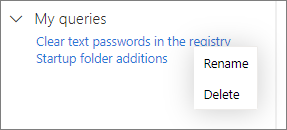

# 在進階搜捕中使用共用查詢Use shared queries in advanced hunting

[!INCLUDE [Microsoft 365 Defender rebranding](../../includes/microsoft-defender.md)]

適用於：**Applies to:**
- [適用於端點的 Microsoft DefenderMicrosoft Defender for Endpoint](https://go.microsoft.com/fwlink/p/?linkid=2154037)

>想要體驗 Defender for Endpoint？Want to experience Defender for Endpoint? [註冊免費試用版。Sign up for a free trial.](https://www.microsoft.com/microsoft-365/windows/microsoft-defender-atp?ocid=docs-wdatp-advancedhunting-abovefoldlink)

您可以在同一個組織的多位使用者之間共用[進階搜捕](advanced-hunting-overview.md)查詢。[Advanced hunting](advanced-hunting-overview.md) queries can be shared among users in the same organization. 您也可以在 GitHub 尋找公開的查詢。You can also find queries shared publicly on GitHub. 這些查詢可讓您快速地執行特定威脅搜捕案例，而不需要從頭開始撰寫查詢。These queries let you quickly pursue specific threat hunting scenarios without having to write queries from scratch.

## 儲存、修改及共用查詢Save, modify, and share a query
您可以儲存新的或現有的查詢，以便只有組織中的其他使用者能存取或共用。You can save a new or existing query so that it is only accessible to you or shared with other users in your organization.

1. 輸入新的查詢或從 [ **共用查詢** ] 或 [我的 **查詢**] 中載入現有的查詢。Type a new query or load an existing one from under **Shared queries** or **My queries**.

2. 選取 **[儲存]** 或 [ **另** 存新檔] 選項。Select **Save** or **Save as** from the save options. 若要避免覆寫現有的查詢，請選擇 [ **另存** 新檔]。To avoid overwriting an existing query, choose **Save as**.

3. 輸入查詢的名稱。Enter a name for the query.

   

4. 選取您要儲存查詢的資料夾。Select the folder where you'd like to save the query.
    - **共用查詢** -共用給組織中的所有使用者**Shared queries** — shared to all users in your organization
    - **我的查詢** —只有您可以存取**My queries** — accessible only to you
    
5. 選取 [儲存]。Select **Save**.

## 刪除或重新命名查詢Delete or rename a query
1. 以滑鼠右鍵按一下您要重新命名或刪除的查詢。Right-click on a query you want to rename or delete.

    

2. 選取 [刪除] 並確認刪除。Select **Delete** and confirm deletion. 或選取 [重新命名]，並為查詢提供新名稱。Or select **Rename** and provide a new name for the query.

## 建立查詢的直接連結Create a direct link to a query
若要產生連結，以直接在高級搜尋查詢編輯器中開啟查詢，請完成查詢並選取 [ **共用] 連結**。To generate a link that opens your query directly in the advanced hunting query editor, finalize your query and select **Share link**.

## 存取 GitHub 儲存庫中的查詢Access queries in the GitHub repository  
Microsoft 安全研究人員會定期在 [GitHub 上的指定公開儲存庫](https://github.com/Microsoft/WindowsDefenderATP-Hunting-Queries)中共用進階搜捕查詢。Microsoft security researchers regularly share advanced hunting queries in a [designated public repository on GitHub](https://github.com/Microsoft/WindowsDefenderATP-Hunting-Queries). 這個儲存庫開放個人提出貢獻。This repository is open to contributions. 若要貢獻，請[免費加入 GitHub ](https://github.com/)。To contribute, [join GitHub for free](https://github.com/). 

>[!TIP]
>Microsoft 安全研究人員也會提供進階搜捕查詢，您可以用來尋找與新興威脅相關聯的活動和指標。Microsoft security researchers also provide advanced hunting queries that you can use to locate activities and indicators associated with emerging threats. 這些查詢是由 Microsoft Defender 安全性中心中的[威脅分析](threat-analytics.md)報告提供。These queries are provided as part of the [threat analytics](threat-analytics.md) reports in Microsoft Defender Security Center.

## 相關主題Related topics
- [進階搜捕概觀Advanced hunting overview](advanced-hunting-overview.md)
- [了解查詢語言Learn the query language](advanced-hunting-query-language.md)
- [使用查詢結果工作Work with query results](advanced-hunting-query-results.md)
- [了解結構描述Understand the schema](advanced-hunting-schema-reference.md)
- [套用查詢最佳做法Apply query best practices](advanced-hunting-best-practices.md)
- [自訂偵測概觀Custom detections overview](overview-custom-detections.md)
