# 使用 Microsoft Intune 部署適用于 Android 的 Microsoft Defender 端點Deploy Microsoft Defender for Endpoint for Android with Microsoft Intune 

[!INCLUDE [Microsoft 365 Defender rebranding](../../includes/microsoft-defender.md)]

**適用於：****Applies to:**
- [適用於端點的 Microsoft DefenderMicrosoft Defender for Endpoint](https://go.microsoft.com/fwlink/p/?linkid=2154037)
- [Microsoft 365 DefenderMicrosoft 365 Defender](https://go.microsoft.com/fwlink/?linkid=2118804)

> 想要體驗 Microsoft Defender for Endpoint？Want to experience Microsoft Defender for Endpoint? [註冊免費試用版。Sign up for a free trial.](https://www.microsoft.com/microsoft-365/windows/microsoft-defender-atp?ocid=docs-wdatp-exposedapis-abovefoldlink) 

瞭解如何在 Intune 公司入口網站註冊的裝置上部署適用于 Android 的 Endpoint 的 Defender。Learn how to deploy Defender for Endpoint for Android on Intune Company Portal enrolled devices. 如需 Intune 裝置註冊的詳細資訊，請參閱  [註冊裝置](https://docs.microsoft.com/mem/intune/user-help/enroll-device-android-company-portal)。For more information about Intune device enrollment, see  [Enroll your device](https://docs.microsoft.com/mem/intune/user-help/enroll-device-android-company-portal).

> [!NOTE]
> **適用于 Android 的 Endpoint 的 Defender 現在已可在 [Google Play](https://play.google.com/store/apps/details?id=com.microsoft.scmx)上使用****Defender for Endpoint for Android is now available on [Google Play](https://play.google.com/store/apps/details?id=com.microsoft.scmx)**  
> 您可以從 Intune 連線到 Google，以跨裝置管理員和 Android Enterprise entrollment 模式，為端點應用程式部署 Defender。You can connect to Google Play from Intune to deploy Defender for Endpoint app across Device Administrator and Android Enterprise entrollment modes.
應用程式的更新是透過 Google Play 自動進行。Updates to the app are automatic via Google Play.

## 在裝置管理員註冊的裝置上部署Deploy on Device Administrator enrolled devices

**在 Intune 公司入口網站上部署適用于 Android 的 Endpoint 的 Defender-裝置管理員註冊裝置****Deploy Defender for Endpoint for Android on Intune Company Portal - Device Administrator enrolled devices**

瞭解如何在 Intune 公司入口網站上為 Android 部署 Defender （裝置管理員註冊的裝置）。Learn how to deploy Defender for Endpoint for Android on Intune Company Portal - Device Administrator enrolled devices. 

### 新增為 Android store 應用程式Add as Android store app

1. 在 [Microsoft 端點](https://go.microsoft.com/fwlink/?linkid=2109431) 管理員系統管理中心中，移至 [ **應用程式** \> **Android 應用** 程式 \> **新增 \> android store app** ]，然後選擇 [ **選取**]。In [Microsoft Endpoint Manager admin center](https://go.microsoft.com/fwlink/?linkid=2109431) , go to **Apps** \> **Android Apps** \> **Add \> Android store app** and choose **Select**.

   

2. 在 [ **新增應用程式** ] 頁面上，于 [ *應用程式資訊* ] 區段中輸入：On the **Add app** page and in the *App Information* section enter: 

   - **Name****Name** 
   - **描述****Description**
   - **發行者** 為 Microsoft。**Publisher** as Microsoft.
   - **應用商店 url** 為 https://play.google.com/store/apps/details?id=com.microsoft.scmx 端點應用程式 GOOGLE Play Store url (Defender) **App store URL** as https://play.google.com/store/apps/details?id=com.microsoft.scmx (Defender for Endpoint app Google Play Store URL) 

   其他欄位是選用的。Other fields are optional. 選取 **[下一步]**。Select **Next**.

   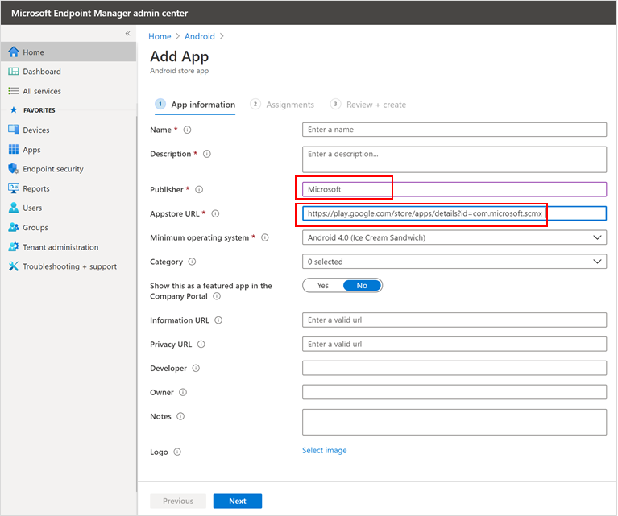

3. 在 [ *工作分派* ] 區段中，移至 [ **必要** ] 區段，然後選取 [ **新增群組]。**In the *Assignments* section, go to the **Required** section and select **Add group.** 然後，您可以選擇要將其設定為適用于 Android 應用程式的 Defender for Endpoint 的使用者群組 (s) 。You can then choose the user group(s) that you would like to target Defender for Endpoint for Android app. 選擇 [選取]，然後 **按一下** **[下一步]**Choose **Select** and then **Next**.

    >[!NOTE]
    >選取的使用者群組應該包含 Intune 登記的使用者。The selected user group should consist of Intune enrolled users.

    > [!div class="mx-imgBorder"]

    > 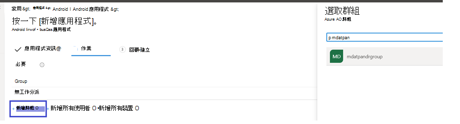

4. 在 [ **複查 + 建立** ] 區段中，確認輸入的所有資訊正確無誤，然後選取 [ **建立**]。In the **Review+Create** section, verify that all the information entered is correct and then select **Create**.

    在幾分鐘內，即可成功建立端點應用程式，並在頁面的右上角顯示通知。In a few moments, the Defender for Endpoint app would be created successfully, and a notification would show up at the top-right corner of the page.

    

5. 在顯示的 [應用程式資訊] 頁面中，選取 [ **監視** ] 區段中的 [ **裝置安裝狀態** ]，以確認裝置安裝已成功完成。In the app information page that is displayed, in the **Monitor** section, select **Device install status** to verify that the device installation has completed successfully.

    > [!div class="mx-imgBorder"]
    > 

### 完成上架和支票狀態Complete onboarding and check status

1. 一旦已在裝置上安裝適用于 Android 的 Endpoint 的 Defender，您就會看到應用程式圖示。Once Defender for Endpoint for Android has been installed on the device, you'll see the app icon.

    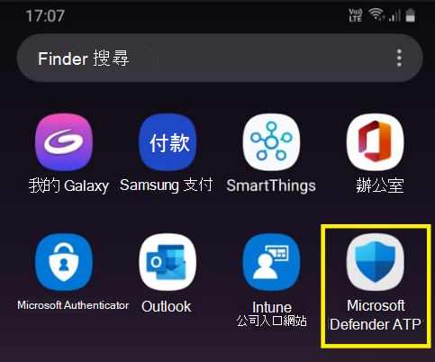

2. 點擊 [Microsoft Defender ATP 應用程式] 圖示，然後依照螢幕指示完成安裝應用程式。Tap the Microsoft Defender ATP app icon and follow the on-screen instructions to complete onboarding the app. 詳細資料包含使用者對 Android 的 Defender for Endpoint 所需的 Android 許可權的使用者認可。The details include end-user acceptance of Android permissions required by Defender for Endpoint for Android.

3. 成功上架後，裝置會在 Microsoft Defender 安全中心的 [裝置] 清單上開始顯示。Upon successful onboarding, the device will start showing up on the Devices list in Microsoft Defender Security Center.

    

## 在 Android 企業註冊裝置上部署Deploy on Android Enterprise enrolled devices

適用于 Android 的 Defender for Android 支援 Android 企業註冊裝置。Defender for Endpoint for Android supports Android Enterprise enrolled devices.

如需 Intune 支援之註冊選項的詳細資訊，請參閱 [註冊選項](https://docs.microsoft.com/mem/intune/enrollment/android-enroll)。For more information on the enrollment options supported by Intune, see [Enrollment Options](https://docs.microsoft.com/mem/intune/enrollment/android-enroll).

**目前，具有工作設定檔和公司所擁有的完整管理使用者裝置註冊的個人擁有裝置可支援部署。****Currently, Personally owned devices with work profile and Corporate-owned fully managed user device enrollments are supported for deployment.**

## 將適用于 Android 的 Microsoft Defender 端點新增為受管理的 Google Play 應用程式Add Microsoft Defender for Endpoint for Android as a Managed Google Play app

請遵循下列步驟，將 Microsoft Defender for Endpoint 應用程式新增至您的受管理 Google Play。Follow the steps below to add Microsoft Defender for Endpoint app into your managed Google Play.

1. 在 [Microsoft 端點管理員管理中心](https://go.microsoft.com/fwlink/?linkid=2109431) 中，移至 [ **應用程式** \> **Android 應用** 程式] [ \> **新增** 並選取 **受管理的 Google Play app**]。In [Microsoft Endpoint Manager admin center](https://go.microsoft.com/fwlink/?linkid=2109431) , go to **Apps** \> **Android Apps** \> **Add** and select **Managed Google Play app**.

    > [!div class="mx-imgBorder"]
    > 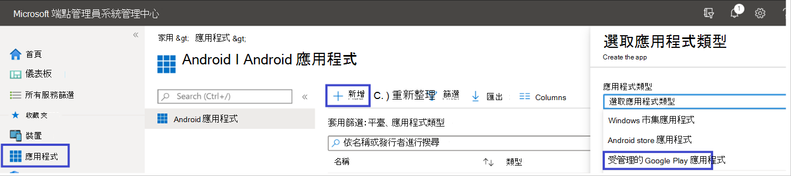

2. 在隨後載入的 [受管理的 Google Play] 頁面上，移至 [搜尋] 方塊並查閱 **Microsoft Defender。**On your managed Google Play page that loads subsequently, go to the search box and lookup **Microsoft Defender.** 您的搜尋應該會在受管理的 Google Play 中顯示 Microsoft Defender for Endpoint 應用程式。Your search should display the Microsoft Defender for Endpoint app in your Managed Google Play. 在 [應用程式搜尋結果] 中，按一下 [Microsoft Defender for Endpoint 應用程式]。Click on the Microsoft Defender for Endpoint app from the Apps search result.

    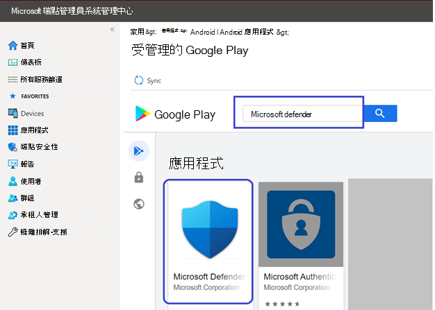

3. 在接下來的 [應用程式描述] 頁面中，您應該可以查看 Defender for Endpoint 上的應用程式詳細資料。In the App description page that comes up next, you should be able to see app details on Defender for Endpoint. 複查頁面上的資訊，然後選取 [ **核准**]。Review the information on the page and then select **Approve**.

    > [!div class="mx-imgBorder"]
    > 

4. 您將會看到供該 Defender for Endpoint 取得的許可權，讓其能夠運作。You'll be presented with the permissions that Defender for Endpoint obtains for it to work. 請加以檢查，然後選取 [ **核准**]。Review them and then select **Approve**.

    

5. 您將會看到 [核准設定] 頁面。You'll be presented with the Approval settings page. 頁面會確認您的喜好設定，以處理適用于 Android 的 Defender for Endpoint 的新應用程式許可權可能要求。The page confirms your preference to handle new app permissions that Defender for Endpoint for Android might ask. 查看選項，然後選取您的喜好選項。Review the choices and select your preferred option. 選取 **[完成]**。Select **Done**.

    依預設，受管理的 Google 播放會 *在應用程式要求新許可權時選取 [保留已核准*]By default, managed Google Play selects *Keep approved when app requests new permissions*

    > [!div class="mx-imgBorder"]
    > ![[通知] 索引標籤](images/ffecfdda1c4df14148f1526c22cc0236.png)

6. 進行許可權處理選取之後，請選取 [ **同步** 處理]，將 Microsoft Defender for Endpoint 同步處理至您的應用程式清單。After the permissions handling selection is made, select **Sync** to sync Microsoft Defender for Endpoint to your apps list.

    > [!div class="mx-imgBorder"]
    > ![[同步處理] 頁面](images/34e6b9a0dae125d085c84593140180ed.png)

7. 同步處理會在幾分鐘內完成。The sync will complete in a few minutes.

    

8. 在 [Android 應用程式] 畫面中選取 [重新整理 **] 按鈕，** 並在 [應用程式] 清單中顯示 MICROSOFT Defender ATP。Select the **Refresh** button in the Android apps screen and Microsoft Defender ATP should be visible in the apps list.

    > [!div class="mx-imgBorder"]
    > 

9. 適用于 Endpoint 的 Defender 可透過 Intune 支援受管理裝置的應用程式佈建原則。Defender for Endpoint supports App configuration policies for managed devices via Intune. 您可以利用這項功能，autogrant) 適用的 Android (許可權，因此，使用者不需要接受這些許可權 (s) 。This capability can be leveraged to autogrant applicable Android permission(s), so the end user does not need to accept these permission(s).

    1. 在 [ **應用程式** ] 頁面中，移至 **Policy > App Configuration Policy > 新增 > 受管理的裝置**。In the **Apps** page, go to **Policy > App configuration policies > Add > Managed devices**.

       

    1. 在 [ **建立應用程式佈建原則** ] 頁面中，輸入下列詳細資料：In the **Create app configuration policy** page, enter the following details:
    
        - 名稱： Microsoft Defender ATP。Name: Microsoft Defender ATP.
        - 選擇 [ **Android 企業** ] 做為 [平臺]。Choose **Android Enterprise** as platform.
        - 選擇 [ **僅工作設定檔** ] 做為配置檔案類型。Choose **Work Profile only** as Profile Type.
        - 按一下 [**選取應用程式**]，選擇 [ **Microsoft Defender ATP**]，然後選取 **[確定]** ，然後按一下 **[**Click **Select App**, choose **Microsoft Defender ATP**, select **OK** and then **Next**.
    
        > [!div class="mx-imgBorder"]
        > ![[建立應用程式佈建原則] 頁面的影像](images/android-create-app.png)

    1. 在 [ **設定** ] 頁面中，移至 [許可權] 區段，按一下 [新增] 以查看支援的許可權清單。In the **Settings** page, go to the Permissions section click on Add to view the list of supported permissions. 在 [新增許可權] 區段中，選取下列許可權：In the Add Permissions section, select the following permissions:

       - 外部儲存體 (讀取) External storage (read)
       - 外部儲存體 (寫入) External storage (write)

       然後選取 **[確定]**。Then select **OK**.

       > [!div class="mx-imgBorder"]
      > 

    1. 現在您應該會看到列出的許可權，而且現在您可以在 **許可權狀態** 下拉式清單中選擇 [autogrant] 來 autogrant，然後選取 **[下一步]**。You should now see both the permissions listed and now you can autogrant both by choosing autogrant in the **Permission state** drop-down and then select **Next**.

       > [!div class="mx-imgBorder"]
       > 

    1. 在 [ **工作分派** ] 頁面中，選取要指派此應用程式佈建原則的使用者群組。In the **Assignments** page, select the user group to which this app config policy would be assigned to. 按一下 [ **選取要包含的群組** ]，然後選取適當的群組，然後選取 **[下一步]**。Click **Select groups to include** and selecting the applicable group and then selecting **Next**.  在這裡選取的群組通常是您要為其指派 Microsoft Defender for Endpoint Android 應用程式的相同群組。The group selected here is usually the same group to which you would assign Microsoft Defender for Endpoint Android app. 

       > [!div class="mx-imgBorder"]
       > 
    

     1. 在 [ **複查** ] 接下來的 [建立] 頁面中，複查所有資訊，然後選取 [ **建立**]。In the **Review + Create** page that comes up next, review all the information and then select **Create**.  
    
        「用於 Defender for Endpoint autogranting 的應用程式設定原則」儲存許可權現在會指派給選取的使用者群組。The app configuration policy for Defender for Endpoint autogranting the storage permission is now assigned to the selected user group.

        > [!div class="mx-imgBorder"]
        > 

10. 在 [ \> **屬性** \> **指派** \> **編輯**] 清單中，選取 [Microsoft Defender ATP 應用程式]。Select **Microsoft Defender ATP** app in the list \> **Properties** \> **Assignments** \> **Edit**.

    

11. 將 app 指派為 *所需* 的應用程式至使用者群組。Assign the app as a *Required* app to a user group. 在下一次透過公司入口網站進行裝置同步處理期間，會自動將其安裝在 *工作設定檔* 中。It is automatically installed in the *work profile* during the next sync of the device via Company Portal app. 若要完成此工作分派，請流覽至 *必要* 的區段 [ \> **新增群組]，** 選取 [使用者] 群組，然後按一下 [ **選取**]。This assignment can be done by navigating to the *Required* section \> **Add group,** selecting the user group and click **Select**.

    > [!div class="mx-imgBorder"]
    > ![[編輯應用程式] 頁面的圖像](images/ea06643280075f16265a596fb9a96042.png)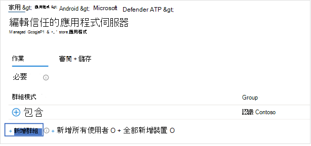

12. 在 [ **編輯應用程式** ] 頁面中，複查以上輸入的所有資訊。In the **Edit Application** page, review all the information that was entered above. 然後選取 [ **複查 + 儲存** ]，然後再次 **儲存** 以開始工作分派。Then select **Review + Save** and then **Save** again to commence assignment.

### 自動設定 Always on VPNAuto Setup of Always-on VPN 
適用于 Endpoint 的 Defender 是透過 Intune 支援受管理裝置的裝置設定原則。Defender for Endpoint supports Device configuration policies for managed devices via Intune. 這項功能可用於在 Android 企業註冊的裝置上 **自動安裝 Always ON VPN** ，因此使用者在上架時，不需要設定 vpn 服務。This capability can be leveraged to **Auto setup of Always-on VPN** on Android Enterprise enrolled devices, so the end user does not need to set up VPN service while onboarding.
1.  在 [**裝置**] 上，根據您的裝置註冊類型，選取 [設定配置 **檔**]，根據您的  >    >    >  裝置註冊類型，**在** 下列其中一項下建立設定檔平臺On **Devices**, select **Configuration Profiles** > **Create Profile** > **Platform** > **Android Enterprise** Select **Device restrictions** under one of the following, based on your device enrollment type 
- **完全管理、專用及 Corporate-Owned 的工作設定檔****Fully Managed, Dedicated, and Corporate-Owned Work Profile**
- **個人擁有的工作設定檔****Personally owned Work Profile**

選取 [建立]。Select **Create**.
 
   > 
    
2. **配置設定** 提供 **名稱** 和 **描述** ，以唯一識別設定設定檔。**Configuration Settings** Provide a **Name** and a **Description** to uniquely identify the configuration profile. 

   > 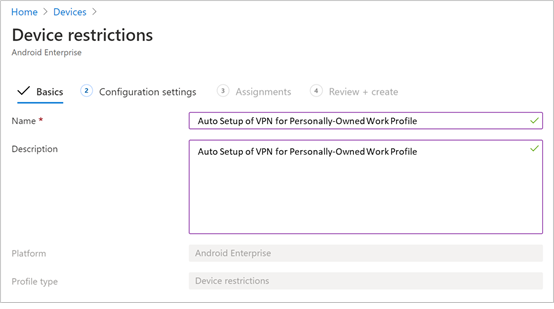
   
 3. 選取 **連通性** 及設定 VPN：Select **Connectivity** and configure VPN:
- 啟用 **Always ON vpn** 設定工作設定檔中的 vpn 用戶端，可在可能時自動連線並重新連接至 VPN。Enable **Always-on VPN** Setup a VPN client in the work profile to automatically connect and reconnect to the VPN whenever possible. 在指定的裝置上，只有一個 VPN 用戶端可以設定為 always on VPN，所以請務必將一個以上的 [永不間斷] VPN 原則部署到單一裝置。Only one VPN client can be configured for always-on VPN on a given device, so be sure to have no more than one always-on VPN policy deployed to a single device. 
- 在 VPN 用戶端下拉式清單中選取 **自訂** vpn 在此案例中，是用來提供 Web 保護功能的 Endpoint VPN 的 Defender。Select **Custom** in VPN client dropdown list Custom VPN in this case is Defender for Endpoint VPN which is used to provide the Web Protection feature. 
    > [!NOTE]
    > 為了能夠運作此 VPN 的自動設定，必須在使用者的裝置上安裝 Microsoft Defender ATP 應用程式。Microsoft Defender ATP app must be installed on user’s device, in order to functioning of auto setup of this VPN.

- 輸入 Google Play store 中 Microsoft Defender ATP 應用程式的 **套件識別碼** 。Enter **Package ID** of the Microsoft Defender ATP app in Google Play store. 若為 Defender 應用程式 URL https://play.google.com/store/apps/details?id=com.microsoft.scmx ，PACKAGE ID 為 **.com。 scmx**For the Defender app URL https://play.google.com/store/apps/details?id=com.microsoft.scmx, Package ID is **com.microsoft.scmx**  
- **鎖定模式** 未設定 (預設) **Lockdown mode** Not configured (Default) 

     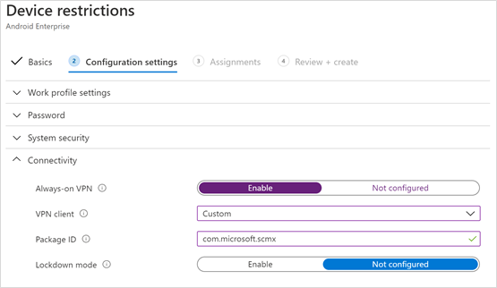
   
4. **工作分派** 在 [ **工作分派**]   頁面中，選取要指派此應用程式佈建原則的使用者群組。**Assignment** In the **Assignments** page, select the user group to which this app config policy would be assigned to. 按一下 [選取要包含的 **群組** ]，然後選取適當的群組，然後按 **[下一步]**。Click **Select groups** to include and selecting the applicable group and then click **Next**. 在這裡選取的群組通常是您要為其指派 Microsoft Defender for Endpoint Android 應用程式的相同群組。The group selected here is usually the same group to which you would assign Microsoft Defender for Endpoint Android app. 

     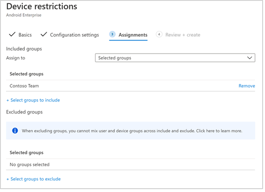

5. 在 [ **複查** ] 接下來的 [建立] 頁面中，複查所有資訊，然後選取 [ **建立**]。In the **Review + Create** page that comes up next, review all the information and then select **Create**. 裝置設定檔現在會指派給選取的使用者群組。The device configuration profile is now assigned to the selected user group.    

    

## 完成上架和支票狀態Complete onboarding and check status

1. 按一下 [ **裝置安裝狀態**]，以確認 Android 的 Microsoft Defender 端點的安裝狀態。Confirm the installation status of Microsoft Defender for Endpoint for Android by clicking on the **Device Install Status**. 驗證裝置是否顯示在這裡。Verify that the device is displayed here.

    > [!div class="mx-imgBorder"]
    > 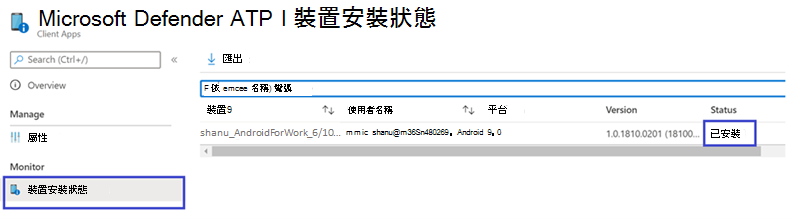

2. 在裝置上，您可以前往 **工作設定檔** 來驗證上架狀態。On the device, you can validate the onboarding status by going to the **work profile**. 確認已提供 [Defender for Endpoint]，且您已 **使用工作設定檔對個人擁有的裝置** 進行註冊。Confirm that Defender for Endpoint is available and that you are enrolled to the **Personally owned devices with work profile**.  如果您已註冊到 **公司所擁有的完整管理使用者裝置**，您可以在裝置上擁有單一設定檔，您可以在此裝置上確認可用的 Defender for Endpoint。If you are enrolled to a **Corporate-owned, fully managed user device**, you will have a single profile on the device where you can confirm that Defender for Endpoint is available.

    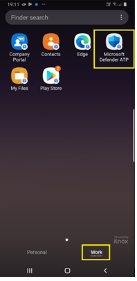

3. 安裝應用程式時，請開啟應用程式並接受許可權，然後您的上架應該會成功。When the app is installed, open the app and accept the permissions and then your onboarding should be successful.

    

4. 在此階段，裝置成功架到適用于 Android 的 Endpoint for Defender。At this stage the device is successfully onboarded onto Defender for Endpoint for Android. 您可以流覽至 [**裝置**] 頁面，以在 [Microsoft Defender Security Center](https://securitycenter.microsoft.com)上驗證這一點。You can verify this on the [Microsoft Defender Security Center](https://securitycenter.microsoft.com) by navigating to the **Devices** page.

    

## 相關主題Related topics
- [適用于 Android 的 Microsoft Defender 端點簡介Overview of Microsoft Defender for Endpoint for Android](microsoft-defender-endpoint-android.md)
- [針對 Android 功能設定 Microsoft Defender for Endpoint 功能Configure Microsoft Defender for Endpoint for Android features](android-configure.md)
