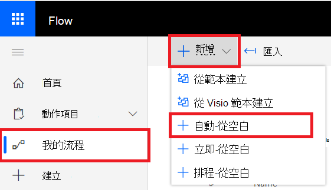

# Microsoft Power (過去的 Microsoft Flow) 和 Azure 功能Microsoft Power Automate (formerly Microsoft Flow), and Azure Functions

[!INCLUDE [Microsoft 365 Defender rebranding](../../includes/microsoft-defender.md)]

**適用於：****Applies to:**
- [適用於端點的 Microsoft DefenderMicrosoft Defender for Endpoint](https://go.microsoft.com/fwlink/p/?linkid=2154037)
- [Microsoft 365 DefenderMicrosoft 365 Defender](https://go.microsoft.com/fwlink/?linkid=2118804)

- 想要體驗適用於端點的 Microsoft Defender 嗎？Want to experience Microsoft Defender for Endpoint? [注册免費試用版。Sign up for a free trial.](https://www.microsoft.com/microsoft-365/windows/microsoft-defender-atp?ocid=docs-wdatp-exposedapis-abovefoldlink) 

自動化的安全性程式是每一項新式安全性運作中心的標準需求。Automating security procedures is a standard requirement for every modern Security Operations Center. 缺乏專業的網路 defenders 強制 SOC 以最有效率的方式運作，而且自動化也是必須的。The lack of professional cyber defenders forces SOC to work in the most efficient way and automation is a must. Microsoft Power 自動支援完全為該所建立的不同連接器。Microsoft Power Automate supports different connectors that were built exactly for that. 您可以在數分鐘內建立端對端程式自動化。You can build an end-to-end procedure automation within a few minutes.

Microsoft Defender API 具有許多功能的官方流程連接器。Microsoft Defender API has an official Flow Connector with many capabilities.

> [!NOTE]
> 如需有關高階 connector 授權必要條件的詳細資訊，請參閱 [優質連接器的授權](https://docs.microsoft.com/power-automate/triggers-introduction#licensing-for-premium-connectors)。For more details about premium connectors licensing prerequisites, see [Licensing for premium connectors](https://docs.microsoft.com/power-automate/triggers-introduction#licensing-for-premium-connectors).

## 使用範例Usage example

下列範例會示範如何建立每當租使用者在租使用者上發生新警示時所觸發的流程。The following example demonstrates how to create a Flow that is triggered any time a new Alert occurs on your tenant.

1. 登入 [Microsoft Power 自動功能](https://flow.microsoft.com)。Log in to [Microsoft Power Automate](https://flow.microsoft.com).

2. 從空白移至 [**我的流程**]  >  （**新增**  >  **）**。Go to **My flows** > **New** > **Automated-from blank**.

    

3. 選擇您流程的名稱，並搜尋「Microsoft Defender ATP Trigger」做為觸發器，然後選取新的警示觸發。Choose a name for your Flow, search for "Microsoft Defender ATP Triggers" as the trigger, and then select the new Alerts trigger.

    

現在，您已有一個流程會在每次發生新警示時觸發。Now you have a Flow that is triggered every time a new Alert occurs.

您現在只需要選擇下一個步驟。All you need to do now is choose your next steps.
例如，您可以隔離裝置的嚴重性為高，並傳送與其相關的電子郵件時，您可以隔離裝置。For example, you can isolate the device if the Severity of the Alert is High and send an email about it.
警示觸發器只會提供警示識別碼和電腦識別碼。The Alert trigger provides only the Alert ID and the Machine ID. 您可以使用連接器來展開這些實體。You can use the connector to expand these entities.

### 使用連接器取得警示實體Get the Alert entity using the connector

1. 選擇 [ **Microsoft DEFENDER ATP** ] 做為新步驟。Choose **Microsoft Defender ATP** for the new step.

2. 選擇 [ **警示-取得單一警示 API**]。Choose **Alerts - Get single alert API**.

3. 設定最後一個步驟中的 **警示識別碼** 做為 **輸入**。Set the **Alert ID** from the last step as **Input**.

    

### 在警示嚴重性很高時隔離裝置Isolate the device if the Alert's severity is High

1. 將 **條件** 新增為新步驟。Add **Condition** as a new step.

2. 檢查警示嚴重性是否 **等於** High。Check if the Alert severity **is equal to** High.

   如果是，請使用電腦識別碼和批註新增 **Microsoft DEFENDER ATP 隔離的電腦** 動作。If yes, add the **Microsoft Defender ATP - Isolate machine** action with the Machine ID and a comment.

    

3. 為有關預警和隔離的電子郵件新增步驟。Add a new step for emailing about the Alert and the Isolation. 有多個可輕鬆使用的電子郵件連接器，例如 Outlook 或 Gmail。There are multiple email connectors that are very easy to use, such as Outlook or Gmail.

4. 儲存您的流程。Save your flow.

您也可以建立執行高級搜尋查詢的 **排程** 流程，以及更多！You can also create a **scheduled** flow that runs Advanced Hunting queries and much more!

## 相關主題Related topic
- [Microsoft Defender for Endpoint APIsMicrosoft Defender for Endpoint APIs](apis-intro.md)
