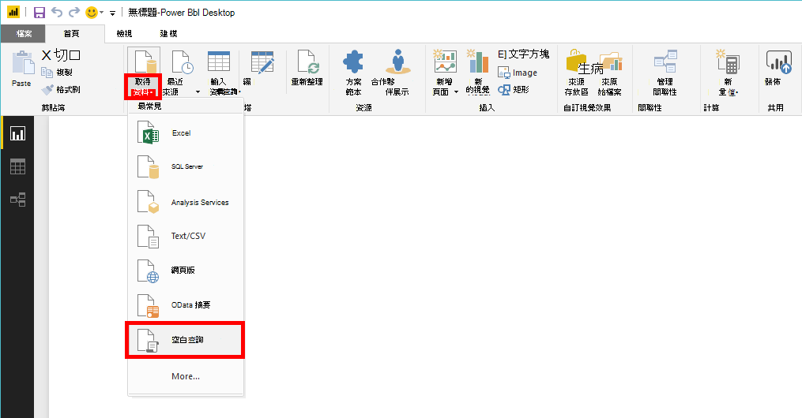
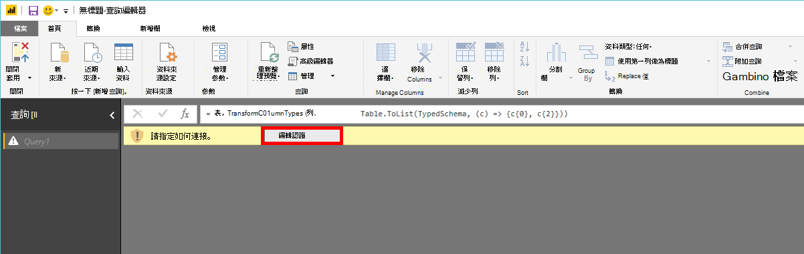
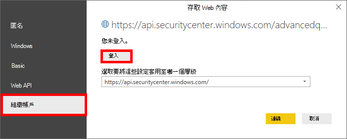
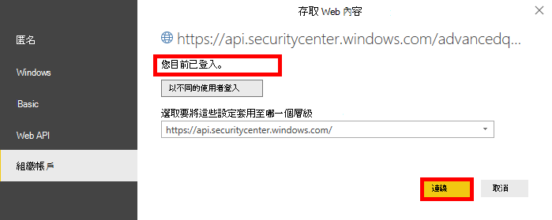

# <a name="create-custom-reports-using-power-bi"></a><span data-ttu-id="be18a-104">使用 Power BI 建立自訂報表</span><span class="sxs-lookup"><span data-stu-id="be18a-104">Create custom reports using Power BI</span></span>

[!INCLUDE [Microsoft 365 Defender rebranding](../../includes/microsoft-defender.md)]

<span data-ttu-id="be18a-105">**適用於：**</span><span class="sxs-lookup"><span data-stu-id="be18a-105">**Applies to:**</span></span>
- [<span data-ttu-id="be18a-106">適用於端點的 Microsoft Defender</span><span class="sxs-lookup"><span data-stu-id="be18a-106">Microsoft Defender for Endpoint</span></span>](https://go.microsoft.com/fwlink/p/?linkid=2154037)
- [<span data-ttu-id="be18a-107">Microsoft 365 Defender</span><span class="sxs-lookup"><span data-stu-id="be18a-107">Microsoft 365 Defender</span></span>](https://go.microsoft.com/fwlink/?linkid=2118804)


- <span data-ttu-id="be18a-108">想要體驗適用於端點的 Microsoft Defender 嗎？</span><span class="sxs-lookup"><span data-stu-id="be18a-108">Want to experience Microsoft Defender for Endpoint?</span></span> [<span data-ttu-id="be18a-109">注册免費試用版。</span><span class="sxs-lookup"><span data-stu-id="be18a-109">Sign up for a free trial.</span></span>](https://www.microsoft.com/microsoft-365/windows/microsoft-defender-atp?ocid=docs-wdatp-exposedapis-abovefoldlink) 

[!include[Microsoft Defender for Endpoint API URIs for US Government](../../includes/microsoft-defender-api-usgov.md)]

[!include[Improve request performance](../../includes/improve-request-performance.md)]

<span data-ttu-id="be18a-110">在本節中，您將會瞭解如何在「Power BI 的 Defender」 APIs 上建立報表。</span><span class="sxs-lookup"><span data-stu-id="be18a-110">In this section you will learn create a Power BI report on top of Defender for Endpoint APIs.</span></span>

<span data-ttu-id="be18a-111">第一個範例會示範如何將 Power BI 連接至高級搜尋 API，第二個範例會示範 OData APIs 的連線，例如機器動作或警示。</span><span class="sxs-lookup"><span data-stu-id="be18a-111">The first example demonstrates how to connect Power BI to Advanced Hunting API and the second example demonstrates a connection to our OData APIs, such as Machine Actions or Alerts.</span></span>

## <a name="connect-power-bi-to-advanced-hunting-api"></a><span data-ttu-id="be18a-112">連線 Power BI 的高級搜尋 API</span><span class="sxs-lookup"><span data-stu-id="be18a-112">Connect Power BI to Advanced Hunting API</span></span>

- <span data-ttu-id="be18a-113">開啟 Microsoft Power BI</span><span class="sxs-lookup"><span data-stu-id="be18a-113">Open Microsoft Power BI</span></span>

- <span data-ttu-id="be18a-114">按一下 [**取得資料**  >  **空白查詢**]</span><span class="sxs-lookup"><span data-stu-id="be18a-114">Click **Get Data** > **Blank Query**</span></span>

    

- <span data-ttu-id="be18a-116">按一下 [**高級編輯器**]</span><span class="sxs-lookup"><span data-stu-id="be18a-116">Click **Advanced Editor**</span></span>

    

- <span data-ttu-id="be18a-118">複製下列專案，然後將它貼到編輯器中：</span><span class="sxs-lookup"><span data-stu-id="be18a-118">Copy the below and paste it in the editor:</span></span>

```
    let 
        AdvancedHuntingQuery = "DeviceEvents | where ActionType contains 'Anti' | limit 20",

        HuntingUrl = "https://api.securitycenter.microsoft.com/api/advancedqueries",

        Response = Json.Document(Web.Contents(HuntingUrl, [Query=[key=AdvancedHuntingQuery]])),

        TypeMap = #table(
            { "Type", "PowerBiType" },
            {
                { "Double",   Double.Type },
                { "Int64",    Int64.Type },
                { "Int32",    Int32.Type },
                { "Int16",    Int16.Type },
                { "UInt64",   Number.Type },
                { "UInt32",   Number.Type },
                { "UInt16",   Number.Type },
                { "Byte",     Byte.Type },
                { "Single",   Single.Type },
                { "Decimal",  Decimal.Type },
                { "TimeSpan", Duration.Type },
                { "DateTime", DateTimeZone.Type },
                { "String",   Text.Type },
                { "Boolean",  Logical.Type },
                { "SByte",    Logical.Type },
                { "Guid",     Text.Type }
            }),

        Schema = Table.FromRecords(Response[Schema]),
        TypedSchema = Table.Join(Table.SelectColumns(Schema, {"Name", "Type"}), {"Type"}, TypeMap , {"Type"}),
        Results = Response[Results],
        Rows = Table.FromRecords(Results, Schema[Name]),
        Table = Table.TransformColumnTypes(Rows, Table.ToList(TypedSchema, (c) => {c{0}, c{2}}))

    in Table

```

- <span data-ttu-id="be18a-119">按一下 [**完成**]</span><span class="sxs-lookup"><span data-stu-id="be18a-119">Click **Done**</span></span>

- <span data-ttu-id="be18a-120">按一下 [**編輯認證**]</span><span class="sxs-lookup"><span data-stu-id="be18a-120">Click **Edit Credentials**</span></span>

    

- <span data-ttu-id="be18a-122">選取 **組織帳戶** 登  >  **入**</span><span class="sxs-lookup"><span data-stu-id="be18a-122">Select **Organizational account** > **Sign in**</span></span>

    

- <span data-ttu-id="be18a-124">輸入您的認證，並等候登入</span><span class="sxs-lookup"><span data-stu-id="be18a-124">Enter your credentials and wait to be signed in</span></span>

- <span data-ttu-id="be18a-125">按一下 [**連線**</span><span class="sxs-lookup"><span data-stu-id="be18a-125">Click **Connect**</span></span>

    

- <span data-ttu-id="be18a-127">現在，您的查詢結果會顯示為表格，而且您可以在其上開始建立視覺化效果！</span><span class="sxs-lookup"><span data-stu-id="be18a-127">Now the results of your query will appear as table and you can start build visualizations on top of it!</span></span>

- <span data-ttu-id="be18a-128">您可以複製此資料表、重新命名它，然後編輯內部的高級搜尋查詢，以取得任何您想要的資料。</span><span class="sxs-lookup"><span data-stu-id="be18a-128">You can duplicate this table, rename it and edit the Advanced Hunting query inside to get any data you would like.</span></span>

## <a name="connect-power-bi-to-odata-apis"></a><span data-ttu-id="be18a-129">連線 Power BI OData APIs</span><span class="sxs-lookup"><span data-stu-id="be18a-129">Connect Power BI to OData APIs</span></span>

- <span data-ttu-id="be18a-130">與上述範例唯一不同的是，編輯器中的查詢。</span><span class="sxs-lookup"><span data-stu-id="be18a-130">The only difference from the above example is the query inside the editor.</span></span> 

- <span data-ttu-id="be18a-131">複製下列專案，然後將它貼到編輯器中，以從您的組織中拉出所有 **機器動作** ：</span><span class="sxs-lookup"><span data-stu-id="be18a-131">Copy the below and paste it in the editor to pull all **Machine Actions** from your organization:</span></span>

```
    let

        Query = "MachineActions",

        Source = OData.Feed("https://api.securitycenter.microsoft.com/api/" & Query, null, [Implementation="2.0", MoreColumns=true])
    in
        Source

```

- <span data-ttu-id="be18a-132">您可以對 **警示** 和 **機器** 執行相同的作業。</span><span class="sxs-lookup"><span data-stu-id="be18a-132">You can do the same for **Alerts** and **Machines**.</span></span>

- <span data-ttu-id="be18a-133">您也可以使用查詢篩選的 OData 查詢，請參閱 [使用 OData 查詢](exposed-apis-odata-samples.md)</span><span class="sxs-lookup"><span data-stu-id="be18a-133">You also can use OData queries for queries filters, see [Using OData Queries](exposed-apis-odata-samples.md)</span></span>


## <a name="power-bi-dashboard-samples-in-github"></a><span data-ttu-id="be18a-134">Power BI GitHub 中的儀表板範例</span><span class="sxs-lookup"><span data-stu-id="be18a-134">Power BI dashboard samples in GitHub</span></span>
<span data-ttu-id="be18a-135">如需詳細資訊，請參閱[Power BI 報表範本](https://github.com/microsoft/MicrosoftDefenderATP-PowerBI)。</span><span class="sxs-lookup"><span data-stu-id="be18a-135">For more information see the [Power BI report templates](https://github.com/microsoft/MicrosoftDefenderATP-PowerBI).</span></span>

## <a name="sample-reports"></a><span data-ttu-id="be18a-136">範例報告</span><span class="sxs-lookup"><span data-stu-id="be18a-136">Sample reports</span></span>
<span data-ttu-id="be18a-137">查看 Microsoft Defender for Endpoint Power BI 報表範例。</span><span class="sxs-lookup"><span data-stu-id="be18a-137">View the Microsoft Defender for Endpoint Power BI report samples.</span></span> <span data-ttu-id="be18a-138">如需詳細資訊，請參閱 [流覽程式碼範例](/samples/browse/?products=mdatp)。</span><span class="sxs-lookup"><span data-stu-id="be18a-138">For more information, see [Browse code samples](/samples/browse/?products=mdatp).</span></span>


## <a name="related-topic"></a><span data-ttu-id="be18a-139">相關主題</span><span class="sxs-lookup"><span data-stu-id="be18a-139">Related topic</span></span>
- [<span data-ttu-id="be18a-140">APIs 的 Defender for Endpoint</span><span class="sxs-lookup"><span data-stu-id="be18a-140">Defender for Endpoint APIs</span></span>](apis-intro.md)
- [<span data-ttu-id="be18a-141">進階搜捕 API</span><span class="sxs-lookup"><span data-stu-id="be18a-141">Advanced Hunting API</span></span>](run-advanced-query-api.md)
- [<span data-ttu-id="be18a-142">使用 OData 查詢</span><span class="sxs-lookup"><span data-stu-id="be18a-142">Using OData Queries</span></span>](exposed-apis-odata-samples.md)
