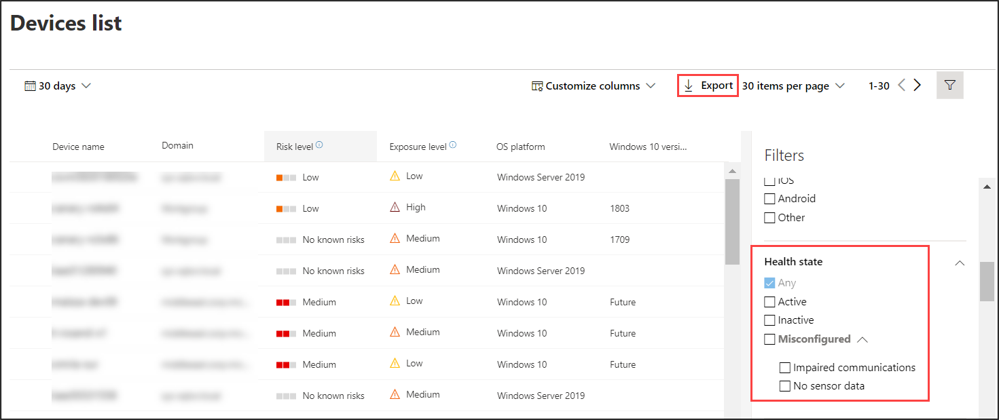

# 檢查 Microsoft Defender for Endpoint 中的感應器健康狀態

[!INCLUDE [Microsoft 365 Defender rebranding](../../includes/microsoft-defender.md)]

**適用於：**
- [適用於端點的 Microsoft Defender](https://go.microsoft.com/fwlink/p/?linkid=2154037)
- [Microsoft 365 Defender](https://go.microsoft.com/fwlink/?linkid=2118804)

>想要體驗 Defender for Endpoint？ [注册免費試用版。](https://www.microsoft.com/microsoft-365/windows/microsoft-defender-atp?ocid=docs-wdatp-checksensor-abovefoldlink)

在 [安全性作業] 儀表板上會找到 **具有感應器問題** 磚的裝置。 此磚提供有關個別裝置提供感應器資料和與適用於端點的 Defender 服務通訊的能力之資訊。 它報告需要注意的裝置數量，並協助您識別有問題的裝置並採取措施修正已知問題。

磚上有兩個狀態指示器，可提供無法正確報告給服務之裝置數目的相關資訊：
- 設定 **錯誤**-這些裝置可能會部分向 Defender for Endpoint service 報告感應器資料，而且可能會發生需要修正的設定錯誤。
- **非** 使用中-過去一個月內，已停止向 Defender for Endpoint service 報告的裝置超過7天。

按一下任一群組可將您導向至 [ **裝置] 清單**，並根據您的選擇加以篩選。

在 [ **裝置] 清單** 上，您可以依下列狀態篩選健康狀態清單：
- **主動-正在** 向 Defender for Endpoint service 報告的裝置。
- 設定 **錯誤**-這些裝置可能會部分向 Defender for Endpoint service 報告感應器資料，但有需要修正的設定錯誤。 設定錯誤的裝置可能存在以下一個或多個問題：
  - **沒有感應器資料** -裝置已停止傳送感應器資料。 裝置可以觸發有限的警示。
  - 受到影響的 **通訊**-與裝置通訊的功能遭到削弱。 傳送檔案進行深入分析、封鎖檔案、將裝置與網路隔離以及其他需要與裝置通訊的動作可能無法運行。
- **非** 使用中-已停止向 Defender for Endpoint service 報告的裝置。

您也可以使用 **匯出** 功能，以 CSV 格式下載整個清單。 如需篩選的詳細資訊，請參閱 [查看和組織裝置清單](machines-view-overview.md)。

>[!NOTE]
>以 CSV 格式匯出清單以顯示未篩選的資料。 CSV 檔案會包含組織中的所有裝置，不論該視圖本身所套用的篩選為何，也視您的組織規模大小而定，下載時間很長。

當您按一下設定不當或非使用的裝置時，您可以查看裝置詳細資料。

## 相關主題
- [修正用於端點的 Defender 中的狀況不良感應器](fix-unhealthy-sensors.md)
