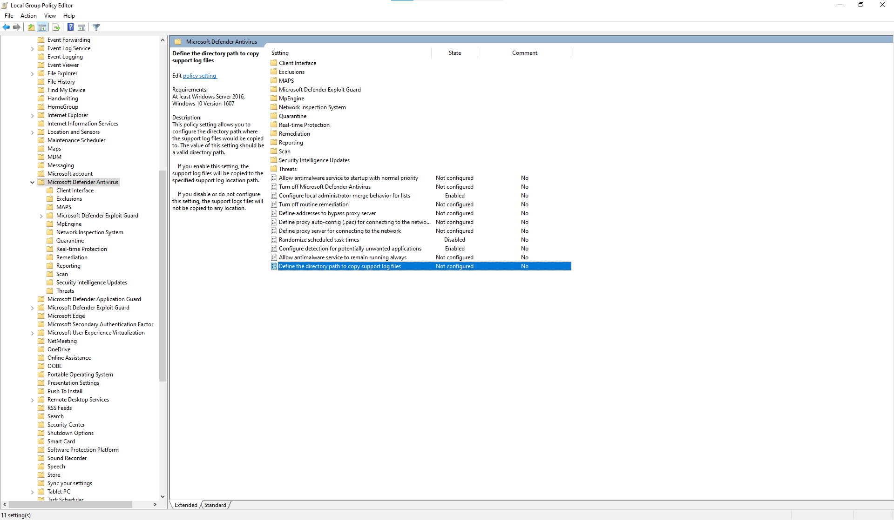

# <a name="collect-microsoft-defender-av-diagnostic-data"></a><span data-ttu-id="4be9b-104">收集 Microsoft Defender AV 診斷資料</span><span class="sxs-lookup"><span data-stu-id="4be9b-104">Collect Microsoft Defender AV diagnostic data</span></span>

[!INCLUDE [Microsoft 365 Defender rebranding](../../includes/microsoft-defender.md)]


<span data-ttu-id="4be9b-105">**適用於：**</span><span class="sxs-lookup"><span data-stu-id="4be9b-105">**Applies to:**</span></span>

- [<span data-ttu-id="4be9b-106">適用於端點的 Microsoft Defender</span><span class="sxs-lookup"><span data-stu-id="4be9b-106">Microsoft Defender for Endpoint</span></span>](/microsoft-365/security/defender-endpoint/)

<span data-ttu-id="4be9b-107">本文說明如何收集可供 Microsoft 支援人員和工程團隊使用的診斷資料，以協助疑難排解使用 Microsoft Defender AV 時可能遇到的問題。</span><span class="sxs-lookup"><span data-stu-id="4be9b-107">This article describes how to collect diagnostic data that can be used by Microsoft support and engineering teams to help troubleshoot issues you might encounter when using the Microsoft Defender AV.</span></span>

> [!NOTE]
> <span data-ttu-id="4be9b-108">作為調查或回應程式的一部分，您可以從裝置收集調查套件。</span><span class="sxs-lookup"><span data-stu-id="4be9b-108">As part of the investigation or response process, you can collect an investigation package from a device.</span></span> <span data-ttu-id="4be9b-109">方法如下： [從裝置收集調查套件](/windows/security/threat-protection/microsoft-defender-atp/respond-machine-alerts#collect-investigation-package-from-devices)。</span><span class="sxs-lookup"><span data-stu-id="4be9b-109">Here's how: [Collect investigation package from devices](/windows/security/threat-protection/microsoft-defender-atp/respond-machine-alerts#collect-investigation-package-from-devices).</span></span>

<span data-ttu-id="4be9b-110">在至少有兩個裝置出現相同問題時，請採取下列步驟取得 .cab 診斷檔案：</span><span class="sxs-lookup"><span data-stu-id="4be9b-110">On at least two devices that are experiencing the same issue, obtain the .cab diagnostic file by taking the following steps:</span></span>

1. <span data-ttu-id="4be9b-111">以下列方式開啟命令提示字元的系統管理員層級版本：</span><span class="sxs-lookup"><span data-stu-id="4be9b-111">Open an administrator-level version of the command prompt as follows:</span></span>

    <span data-ttu-id="4be9b-112">a.</span><span class="sxs-lookup"><span data-stu-id="4be9b-112">a.</span></span> <span data-ttu-id="4be9b-113">開啟 [ **開始** ] 功能表。</span><span class="sxs-lookup"><span data-stu-id="4be9b-113">Open the **Start** menu.</span></span>

    <span data-ttu-id="4be9b-114">b.</span><span class="sxs-lookup"><span data-stu-id="4be9b-114">b.</span></span> <span data-ttu-id="4be9b-115">輸入 **cmd**。</span><span class="sxs-lookup"><span data-stu-id="4be9b-115">Type **cmd**.</span></span> <span data-ttu-id="4be9b-116">在 **命令提示** 字元上按一下滑鼠右鍵，然後按一下 [以 **系統管理員身分執行**]。</span><span class="sxs-lookup"><span data-stu-id="4be9b-116">Right-click on **Command Prompt** and click **Run as administrator**.</span></span>

    <span data-ttu-id="4be9b-117">c.</span><span class="sxs-lookup"><span data-stu-id="4be9b-117">c.</span></span> <span data-ttu-id="4be9b-118">輸入系統管理員認證或核准提示。</span><span class="sxs-lookup"><span data-stu-id="4be9b-118">Enter administrator credentials or approve the prompt.</span></span>

2. <span data-ttu-id="4be9b-119">流覽至 Microsoft Defender 目錄。</span><span class="sxs-lookup"><span data-stu-id="4be9b-119">Navigate to the Microsoft Defender directory.</span></span> <span data-ttu-id="4be9b-120">此為預設值 `C:\Program Files\Windows Defender` 。</span><span class="sxs-lookup"><span data-stu-id="4be9b-120">By default, this is `C:\Program Files\Windows Defender`.</span></span>

> [!NOTE]
> <span data-ttu-id="4be9b-121">如果您正在執行 [更新的 Microsoft Defender 平臺版本](https://support.microsoft.com/help/4052623/update-for-microsoft-defender-antimalware-platform)，請 `MpCmdRun` 從下列位置執行： `C:\ProgramData\Microsoft\Windows Defender\Platform\<version>` 。</span><span class="sxs-lookup"><span data-stu-id="4be9b-121">If you're running an [updated Microsoft Defender Platform version](https://support.microsoft.com/help/4052623/update-for-microsoft-defender-antimalware-platform), please run `MpCmdRun` from the following location: `C:\ProgramData\Microsoft\Windows Defender\Platform\<version>`.</span></span>

3. <span data-ttu-id="4be9b-122">輸入下列命令，然後按 **enter**</span><span class="sxs-lookup"><span data-stu-id="4be9b-122">Type the following command, and then press **Enter**</span></span>  

    ```Dos
    mpcmdrun.exe -GetFiles
    ```
  
4. <span data-ttu-id="4be9b-123">會產生包含各種診斷記錄的 .cab 檔案。</span><span class="sxs-lookup"><span data-stu-id="4be9b-123">A .cab file will be generated that contains various diagnostic logs.</span></span> <span data-ttu-id="4be9b-124">會在命令提示字元的輸出中指定檔案的位置。</span><span class="sxs-lookup"><span data-stu-id="4be9b-124">The location of the file will be specified in the output in the command prompt.</span></span> <span data-ttu-id="4be9b-125">根據預設，位置是 `C:\ProgramData\Microsoft\Microsoft Defender\Support\MpSupportFiles.cab` 。</span><span class="sxs-lookup"><span data-stu-id="4be9b-125">By default, the location is `C:\ProgramData\Microsoft\Microsoft Defender\Support\MpSupportFiles.cab`.</span></span>

> [!NOTE]
> <span data-ttu-id="4be9b-126">若要將 cab 檔重新導向至不同的路徑或 UNC 共用，請使用下列命令： `mpcmdrun.exe -GetFiles -SupportLogLocation <path>`</span><span class="sxs-lookup"><span data-stu-id="4be9b-126">To redirect the cab file to a a different path or UNC share, use the following command: `mpcmdrun.exe -GetFiles -SupportLogLocation <path>`</span></span>  <br/><span data-ttu-id="4be9b-127">如需詳細資訊，請參閱 [將診斷資料重新導向至 UNC 共用](#redirect-diagnostic-data-to-a-unc-share)。</span><span class="sxs-lookup"><span data-stu-id="4be9b-127">For more information, see [Redirect diagnostic data to a UNC share](#redirect-diagnostic-data-to-a-unc-share).</span></span>

5. <span data-ttu-id="4be9b-128">將這些 .cab 檔案複製到可供 Microsoft 支援人員存取的位置。</span><span class="sxs-lookup"><span data-stu-id="4be9b-128">Copy these .cab files to a location that can be accessed by Microsoft support.</span></span> <span data-ttu-id="4be9b-129">例如，您可以將密碼保護的 OneDrive 資料夾與我們共用。</span><span class="sxs-lookup"><span data-stu-id="4be9b-129">An example could be a password-protected OneDrive folder that you can share with us.</span></span>

> [!NOTE]
><span data-ttu-id="4be9b-130">如果您有更新規範的問題，請使用 <a href="mailto:ucsupport@microsoft.com?subject=WDAV assessment issue&body=I%20am%20encountering%20the%20following%20issue%20when%20using%20Windows%20Defender%20AV%20in%20Update%20Compliance%3a%20%0d%0aI%20have%20provided%20at%20least%202%20support%20.cab%20files%20at%20the%20following%20location%3a%20%3Caccessible%20share%2c%20including%20access%20details%20such%20as%20password%3E%0d%0aMy%20OMS%20workspace%20ID%20is%3a%20%0d%0aPlease%20contact%20me%20at%3a">更新規範支援電子郵件範本</a>傳送電子郵件，並使用下列資訊填寫範本：</span><span class="sxs-lookup"><span data-stu-id="4be9b-130">If you have a problem with Update compliance, send an email using the <a href="mailto:ucsupport@microsoft.com?subject=WDAV assessment issue&body=I%20am%20encountering%20the%20following%20issue%20when%20using%20Windows%20Defender%20AV%20in%20Update%20Compliance%3a%20%0d%0aI%20have%20provided%20at%20least%202%20support%20.cab%20files%20at%20the%20following%20location%3a%20%3Caccessible%20share%2c%20including%20access%20details%20such%20as%20password%3E%0d%0aMy%20OMS%20workspace%20ID%20is%3a%20%0d%0aPlease%20contact%20me%20at%3a">Update Compliance support email template</a>, and fill out the template with the following information:</span></span>
>```
> I am encountering the following issue when using Microsoft Defender Antivirus in Update Compliance:
> I have provided at least 2 support .cab files at the following location:  
> <accessible share, including access details such as password>
>
>    My OMS workspace ID is:
>
>    Please contact me at:

## <a name="redirect-diagnostic-data-to-a-unc-share"></a><span data-ttu-id="4be9b-131">將診斷資料重新導向至 UNC 共用</span><span class="sxs-lookup"><span data-stu-id="4be9b-131">Redirect diagnostic data to a UNC share</span></span>
<span data-ttu-id="4be9b-132">若要在中央存放庫上收集診斷資料，您可以指定 SupportLogLocation 參數。</span><span class="sxs-lookup"><span data-stu-id="4be9b-132">To collect diagnostic data on a central repository, you can specify the SupportLogLocation parameter.</span></span>

```Dos
mpcmdrun.exe -GetFiles -SupportLogLocation <path>
```

<span data-ttu-id="4be9b-133">將診斷資料複製到指定的路徑。</span><span class="sxs-lookup"><span data-stu-id="4be9b-133">Copies the diagnostic data to the specified path.</span></span> <span data-ttu-id="4be9b-134">如果未指定路徑，則診斷資料會複製到支援記錄檔位置設定所指定的位置。</span><span class="sxs-lookup"><span data-stu-id="4be9b-134">If the path is not specified, the diagnostic data will be copied to the location specified in the Support Log Location Configuration.</span></span>

<span data-ttu-id="4be9b-135">使用 SupportLogLocation 參數時，會在目的地路徑中建立類似下列的資料夾結構：</span><span class="sxs-lookup"><span data-stu-id="4be9b-135">When the SupportLogLocation parameter is used, a folder structure like as follows will be created in the destination path:</span></span>

```Dos
<path>\<MMDD>\MpSupport-<hostname>-<HHMM>.cab
```

| <span data-ttu-id="4be9b-136">欄位</span><span class="sxs-lookup"><span data-stu-id="4be9b-136">field</span></span>  | <span data-ttu-id="4be9b-137">描述</span><span class="sxs-lookup"><span data-stu-id="4be9b-137">Description</span></span>   |
|:----|:----|
| <span data-ttu-id="4be9b-138">路徑</span><span class="sxs-lookup"><span data-stu-id="4be9b-138">path</span></span> | <span data-ttu-id="4be9b-139">命令列上指定的路徑，或從設定中檢索</span><span class="sxs-lookup"><span data-stu-id="4be9b-139">The path as specified on the command line or retrieved from configuration</span></span>
| <span data-ttu-id="4be9b-140">MMDD</span><span class="sxs-lookup"><span data-stu-id="4be9b-140">MMDD</span></span> | <span data-ttu-id="4be9b-141">收集診斷資料的月和日 (例如，0530) </span><span class="sxs-lookup"><span data-stu-id="4be9b-141">Month and day when the diagnostic data was collected (for example, 0530)</span></span>
| <span data-ttu-id="4be9b-142">主機 名</span><span class="sxs-lookup"><span data-stu-id="4be9b-142">hostname</span></span> | <span data-ttu-id="4be9b-143">收集診斷資料之裝置的主機名稱</span><span class="sxs-lookup"><span data-stu-id="4be9b-143">The hostname of the device on which the diagnostic data was collected</span></span>
| <span data-ttu-id="4be9b-144">HHMM</span><span class="sxs-lookup"><span data-stu-id="4be9b-144">HHMM</span></span> | <span data-ttu-id="4be9b-145">收集診斷資料的時數和分鐘 (例如，1422) </span><span class="sxs-lookup"><span data-stu-id="4be9b-145">Hours and minutes when the diagnostic data was collected (for example, 1422)</span></span>

> [!NOTE]
> <span data-ttu-id="4be9b-146">使用檔案共用時，請確定用來收集診斷套件的帳戶具有共用的寫入存取權。</span><span class="sxs-lookup"><span data-stu-id="4be9b-146">When using a file share please make sure that account used to collect the diagnostic package has write access to the share.</span></span>  

## <a name="specify-location-where-diagnostic-data-is-created"></a><span data-ttu-id="4be9b-147">指定診斷資料的建立位置</span><span class="sxs-lookup"><span data-stu-id="4be9b-147">Specify location where diagnostic data is created</span></span>

<span data-ttu-id="4be9b-148">您也可以使用群組原則物件 (GPO) ，指定要建立的診斷 .cab 檔案的位置。</span><span class="sxs-lookup"><span data-stu-id="4be9b-148">You can also specify where the diagnostic .cab file will be created using a Group Policy Object (GPO).</span></span> 

1. <span data-ttu-id="4be9b-149">開啟本機組策略編輯器，並在下列位置找到 SupportLogLocation GPO： `HKEY_LOCAL_MACHINE\SOFTWARE\Policies\Microsoft\Windows Defender\SupportLogLocation`</span><span class="sxs-lookup"><span data-stu-id="4be9b-149">Open the Local Group Policy Editor and find the SupportLogLocation GPO at: `HKEY_LOCAL_MACHINE\SOFTWARE\Policies\Microsoft\Windows Defender\SupportLogLocation`</span></span>
   
1. <span data-ttu-id="4be9b-150">選取 **[定義目錄路徑]，以複製支援記錄** 檔。</span><span class="sxs-lookup"><span data-stu-id="4be9b-150">Select **Define the directory path to copy support log files**.</span></span>

      
        
     ![[定義記錄檔的路徑] 設定的螢幕擷取畫面](images/GPO2-SupportLogLocationGPPage.png)  
3. <span data-ttu-id="4be9b-153">在原則編輯器內，選取 [ **已啟用**]。</span><span class="sxs-lookup"><span data-stu-id="4be9b-153">Inside the policy editor, select **Enabled**.</span></span>
       
4. <span data-ttu-id="4be9b-154">在 [ **選項** ] 欄位中，指定您要將支援記錄檔複製到其中的目錄路徑。</span><span class="sxs-lookup"><span data-stu-id="4be9b-154">Specify the directory path where you want to copy the support log files in the **Options** field.</span></span>
     <span data-ttu-id="4be9b-155"></span><span class="sxs-lookup"><span data-stu-id="4be9b-155"></span></span> 
5. <span data-ttu-id="4be9b-156">選取 **[確定]** **或**[套用]。</span><span class="sxs-lookup"><span data-stu-id="4be9b-156">Select **OK** or **Apply**.</span></span>

## <a name="see-also"></a><span data-ttu-id="4be9b-157">另請參閱</span><span class="sxs-lookup"><span data-stu-id="4be9b-157">See also</span></span>

- [<span data-ttu-id="4be9b-158">疑難排解 Microsoft Defender 防病毒報告</span><span class="sxs-lookup"><span data-stu-id="4be9b-158">Troubleshoot Microsoft Defender Antivirus reporting</span></span>](troubleshoot-reporting.md)