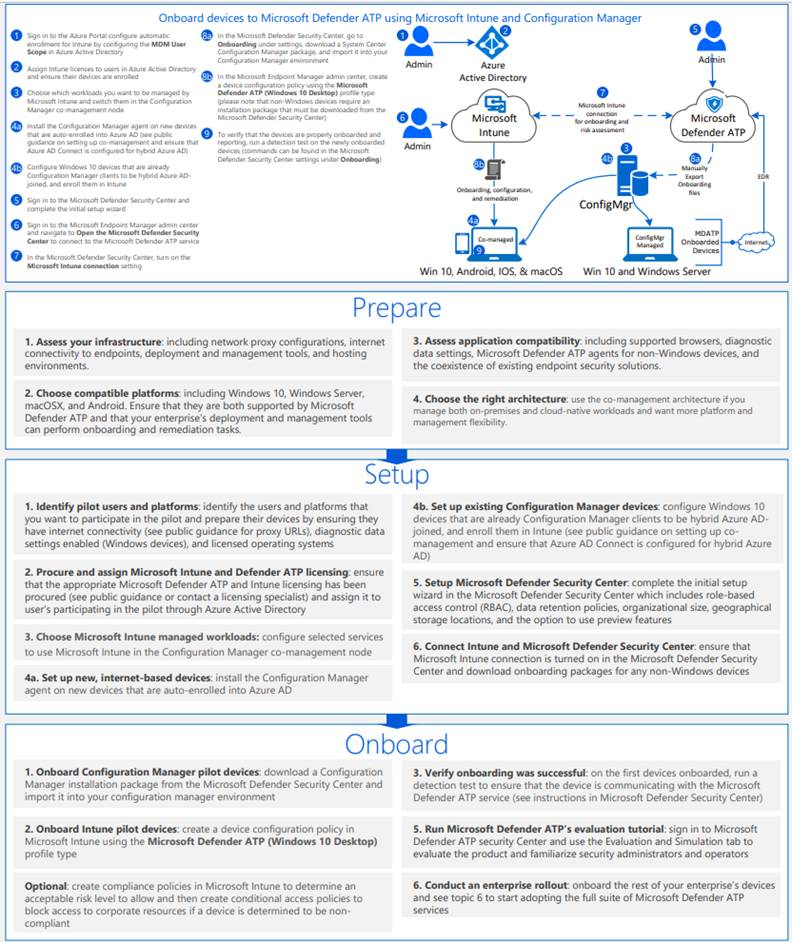

# <a name="onboard-windows-10-devices-using-configuration-manager"></a>使用 Configuration Manager 上線 Windows 10 裝置

[!INCLUDE [Microsoft 365 Defender rebranding](../../includes/microsoft-defender.md)]

**適用於：**

- [適用於端點的 Microsoft Defender](https://go.microsoft.com/fwlink/p/?linkid=2154037)
- [Microsoft 365 Defender](https://go.microsoft.com/fwlink/?linkid=2118804)
- Microsoft 端點 Configuration Manager 目前的分支
- System Center 2012 R2 Configuration Manager

>想要體驗 Defender for Endpoint？ [註冊免費試用版。](https://www.microsoft.com/microsoft-365/windows/microsoft-defender-atp?ocid=docs-wdatp-configureendpointssccm-abovefoldlink)

## <a name="supported-client-operating-systems"></a>支援的用戶端作業系統

根據您所執行的 Configuration Manager 版本，可以架下列用戶端作業系統：

#### <a name="configuration-manager-version-1910-and-prior"></a>Configuration Manager 版本1910及更早版本

- 執行 Windows 10 的用戶端電腦 

#### <a name="configuration-manager-version-2002-and-later"></a>Configuration Manager 版本2002和更新版本

從 Configuration Manager 2002 版開始，您可以在下列作業系統上架上架：

- Windows 8.1
- Windows 10
- Windows Server 2012 R2
- Windows Server 2016
- Windows Server 2016，版本1803或更新版本
- Windows Server 2019

>[!NOTE]
>如需有關如何將 Windows Server 2012 R2、Windows Server 2016 及 Windows Server 2019 上架上的詳細資訊，請參閱 [板載 Windows](configure-server-endpoints.md)server。


### <a name="onboard-devices-using-system-center-configuration-manager"></a>使用 System Center Configuration Manager 的板載裝置


[](images/onboard-config-mgr.png#lightbox)


請取出 [PDF](https://github.com/MicrosoftDocs/microsoft-365-docs/raw/public/microsoft-365/security/defender-endpoint/downloads/mdatp-deployment-strategy.pdf)  或  [Visio](https://github.com/MicrosoftDocs/microsoft-365-docs/raw/public/microsoft-365/security/defender-endpoint/downloads/mdatp-deployment-strategy.vsdx) ，以查看部署 Microsoft Defender for Endpoint 中的各種路徑。 


1. 從 [服務上架] 嚮導中，開啟您從 [服務上架] 的 [設定套件 .zip 檔案] (*WindowsDefenderATPOnboardingPackage.zip*) 。 您也可以從 [Microsoft Defender Security Center](https://securitycenter.windows.com/)取得套件：

    1. 在功能窗格中，選取 [**設定**] [上  >  **架**]。
    
    1. 選取 [Windows 10] 做為作業系統。

    1. 在 [ **部署方法** ] 欄位中，選取 **System Center Configuration Manager 2012/2012 R2/1511/1602**。
    
    1. 選取 [ **下載套件**]，然後儲存 .zip 檔案。

2. 將 .zip 檔案的內容解壓至共用的唯讀位置，該位置可供將要部署此套件的網路系統管理員存取。 您應該會有一個名為 *WindowsDefenderATPOnboardingScript* 的檔案。

3. 遵循 [System Center 2012 R2 Configuration Manager 文章中的套件和程式](https://docs.microsoft.com/previous-versions/system-center/system-center-2012-R2/gg699369\(v=technet.10\)) 中的步驟，部署套件。

    a. 選擇要將套件部署至其中的預先定義的裝置集合。

> [!NOTE]
> 在 [) 全新體驗 (OOBE ](https://answers.microsoft.com/en-us/windows/wiki/windows_10/how-to-complete-the-windows-10-out-of-box/47e3f943-f000-45e3-8c5c-9d85a1a0cf87) 階段中，端點不支援上架。 請確定使用者在執行 Windows 安裝或升級後完成 OOBE。

>[!TIP]
> 在裝置上架後，您可以選擇執行偵測測試，以確認裝置已正確架至服務。 如需詳細資訊，請參閱 [在新的架 Defender For Endpoint 裝置上執行偵測測試](run-detection-test.md)。
>
> 請注意，您可以在 Configuration Manager 應用程式上建立偵測規則，以持續檢查裝置是否已架。 應用程式是不同于套件和程式的物件類型。
> 如果裝置尚未架 (由於是未決的 OOBE 完成或任何其他原因) ，Configuration Manager 會重試裝置上架裝置，直到規則偵測到狀態變更為止。
> 
> 如果 "OnboardingState" 登錄值 (類型 REG_DWORD) = 1，則可以建立偵測規則檢查，以完成此行為。
> 此登錄值位於 "HKLM\SOFTWARE\Microsoft\Windows Advanced 威脅 Protection\Status" 底下。
如需詳細資訊，請參閱 [Configure 偵測方法 In System Center 2012 R2 Configuration Manager](https://docs.microsoft.com/previous-versions/system-center/system-center-2012-R2/gg682159\(v=technet.10\)#step-4-configure-detection-methods-to-indicate-the-presence-of-the-deployment-type)。

### <a name="configure-sample-collection-settings"></a>設定範例集合設定

針對每個裝置，您可以設定設定值，以指出當您透過 Microsoft Defender Security Center 提交檔案進行深入分析時，是否可以從裝置收集範例。

>[!NOTE]
>這些設定設定通常是透過 Configuration Manager 進行。 

您可以為 Configuration Manager 中的設定專案設定符合性規則，以變更裝置上的範例共用設定。

此規則應該是 *修正* 相容性規則設定專案，它會在目標裝置上設定登錄機碼的值，以確定他們的投訴。

設定是透過下列登錄機碼專案設定的：

```console
Path: "HKLM\SOFTWARE\Policies\Microsoft\Windows Advanced Threat Protection"
Name: "AllowSampleCollection"
Value: 0 or 1
```

其中：<br>
金鑰類型是 WORD。 <br>
可能的值為：
- 0-不允許從此裝置共用範例
- 1-允許共用此裝置的所有檔案類型

當登錄機碼不存在時的預設值為1。

如需 System Center Configuration Manager 合規性的詳細資訊，請參閱 [System center 2012 R2 Configuration Manager 中的規範設定簡介](https://docs.microsoft.com/previous-versions/system-center/system-center-2012-R2/gg682139\(v=technet.10\))。


## <a name="other-recommended-configuration-settings"></a>其他建議的設定
將裝置上架至服務後，請務必使用下列建議的設定設定，以充分運用包含的威脅防護功能。

### <a name="device-collection-configuration"></a>裝置集合設定
如果您使用端點設定管理員（版本2002或更新版本），您可以選擇拓寬部署以包含伺服器或低層次的用戶端。


### <a name="next-generation-protection-configuration"></a>下一代保護設定
建議使用下列設定：

**掃描** <br>
- 掃描可移動儲存裝置（例如 USB 磁片磁碟機）：是

**即時保護** <br>
- 啟用行為監視：是
- 在下載時和安裝之前，針對可能不需要的應用程式啟用防護：是

**Cloud Protection Service**
- Cloud Protection Service 成員資格類型：高級成員資格

**攻擊面減少** 設定所有可用的規則以進行審核。

>[!NOTE]
> 封鎖這些活動可能會中斷合法的商務程式。 最佳方法是設定要審核的內容，識別哪些專案可以安全地開啟，然後在沒有誤報的端點上啟用這些設定。


**網路保護** <br>
在啟用網路保護的「審核」或「封鎖模式」之前，請確定您已安裝反惡意軟體平臺更新，可從 [ [支援] 頁面](https://support.microsoft.com/en-us/help/4560203/windows-defender-anti-malware-platform-binaries-are-missing)取得。


**受控資料夾存取權**<br>
至少30天內啟用 [稽核模式] 中的功能。 在此期間之後，請複查偵測，並建立允許寫入受保護目錄的應用程式清單。

如需詳細資訊，請參閱 [評估受控資料夾存取權](evaluate-controlled-folder-access.md)。


## <a name="offboard-devices-using-configuration-manager"></a>使用 Configuration Manager 的下架裝置

基於安全性的考慮，用來下架裝置的套件會在下載之日期之後的30天后到期。 傳送給裝置的已到期的脫離套件會遭到拒絕。 下載脫離套件時，系統會通知您套件到期日，也會包含在套件名稱中。

> [!NOTE]
> 上架和脫離的原則不得同時部署在相同的裝置上，否則會造成無法預期的衝突。

### <a name="offboard-devices-using-microsoft-endpoint-manager-current-branch"></a>使用 Microsoft 端點管理員的下架裝置目前的分支

如果您使用 Microsoft 端點管理員的 [目前] 分支，請參閱 [建立脫離設定檔](https://docs.microsoft.com/configmgr/protect/deploy-use/windows-defender-advanced-threat-protection#create-an-offboarding-configuration-file)。

### <a name="offboard-devices-using-system-center-2012-r2-configuration-manager"></a>使用 System Center 2012 R2 Configuration Manager 下架裝置

1. 從 [Microsoft Defender Security Center](https://securitycenter.windows.com/)取得脫離套件：

    1. 在功能窗格中，選取 [**設定**  >   **脫離**]。

    1. 選取 [Windows 10] 做為作業系統。

    1. 在 [ **部署方法** ] 欄位中，選取 **System Center Configuration Manager 2012/2012 R2/1511/1602**。
    
    1. 選取 [ **下載套件**]，然後儲存 .zip 檔案。

2. 將 .zip 檔案的內容解壓至共用的唯讀位置，該位置可供將要部署此套件的網路系統管理員存取。 您應該有一個名為 *WindowsDefenderATPOffboardingScript_valid_until_YYYY-mm-dd* 的檔案。

3. 遵循 [System Center 2012 R2 Configuration Manager 文章中的套件和程式](https://docs.microsoft.com/previous-versions/system-center/system-center-2012-R2/gg699369\(v=technet.10\)) 中的步驟，部署套件。

    a. 選擇要將套件部署至其中的預先定義的裝置集合。

> [!IMPORTANT]
> 脫離會導致裝置停止將感應器資料傳送至入口網站，但是來自裝置的資料（包括對它所做的任何警示參考）將保留最多6個月。


## <a name="monitor-device-configuration"></a>監視裝置設定

如果您使用的是 Microsoft 端點管理員目前的分支，請在 Configuration Manager 主控台中使用內建的 Defender for Endpoint 儀表板。 如需詳細資訊，請參閱 [適用于 Endpoint Monitor 的 Defender](https://docs.microsoft.com/configmgr/protect/deploy-use/windows-defender-advanced-threat-protection#monitor)。

如果您使用的是 System Center 2012 R2 Configuration Manager，監控會包含兩個部分：

1. 確認設定套件已正確部署，且正在執行 (或已在您的網路上的裝置上成功執行) 。

2. 檢查裝置是否符合 Endpoint service 的 Defender service (這樣可確保裝置能夠完成上架程式，並且可以繼續向服務) 報告資料。

### <a name="confirm-the-configuration-package-has-been-correctly-deployed"></a>確認已正確部署設定套件

1. 在 Configuration Manager 主控台中，按一下功能窗格底部的 [ **監視** ]。

2. 選取 **[概述** ]，然後選取 [ **部署**]。

3. 使用套件名稱，選取 [部署]。

4. 檢查 [ **完成統計資料]** 和 [ **內容狀態**] 底下的狀態指示器。

    如果部署失敗 (裝置 **發生錯誤**、 **未滿足需求**，或「 **失敗的狀態** 」) ，您可能需要對裝置進行疑難排解。 如需詳細資訊，請參閱 [疑難排解 Microsoft Defender For Endpoint 上架問題](troubleshoot-onboarding.md)。

    

### <a name="check-that-the-devices-are-compliant-with-the-microsoft-defender-atp-service"></a>檢查裝置是否符合 Microsoft Defender ATP 服務

您可以設定 System Center 2012 R2 Configuration Manager 中設定專案的符合性規則，以監視您的部署。

此規則應該 *是非補救* 性規則設定專案，可監視目標裝置上之登錄機碼的值。

監視下列登錄機碼專案：

```console
Path: "HKLM\SOFTWARE\Microsoft\Windows Advanced Threat Protection\Status"
Name: "OnboardingState"
Value: "1"
```

如需詳細資訊，請參閱 [System Center 2012 R2 Configuration Manager 中的規範設定簡介](https://docs.microsoft.com/previous-versions/system-center/system-center-2012-R2/gg682139\(v=technet.10\))。

## <a name="related-topics"></a>相關主題
- [使用群組原則的板載 Windows 10 裝置](configure-endpoints-gp.md)
- [使用行動裝置管理工具上線 Windows 10 電腦](configure-endpoints-mdm.md)
- [使用本機指令碼上線 Windows 10 裝置](configure-endpoints-script.md)
- [上線非持續 Virtual Desktop Infrastructure (VDI) 裝置](configure-endpoints-vdi.md)
- [在新架的 Microsoft Defender ATP 裝置上執行偵測測試](run-detection-test.md)
- [疑難排解 Microsoft Defender 的端點上架問題](troubleshoot-onboarding.md)
