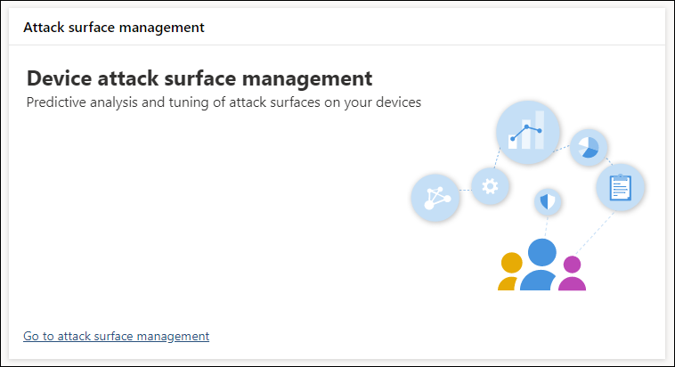

# 優化 ASR 規則的部署和偵測Optimize ASR rule deployment and detections

[!INCLUDE [Microsoft 365 Defender rebranding](../../includes/microsoft-defender.md)]

**適用於：****Applies to:**
- [適用於端點的 Microsoft DefenderMicrosoft Defender for Endpoint](https://go.microsoft.com/fwlink/p/?linkid=2154037)
- [Microsoft 365 DefenderMicrosoft 365 Defender](https://go.microsoft.com/fwlink/?linkid=2118804)

> 想要體驗 Defender for Endpoint？Want to experience Defender for Endpoint? [註冊免費試用版](https://www.microsoft.com/en-us/WindowsForBusiness/windows-atp?ocid=docs-wdatp-onboardconfigure-abovefoldlink)。[Sign up for a free trial](https://www.microsoft.com/en-us/WindowsForBusiness/windows-atp?ocid=docs-wdatp-onboardconfigure-abovefoldlink).

[攻擊面減少 (ASR) 規則](./attack-surface-reduction.md) 會識別及避免一般惡意程式碼利用漏洞。[Attack surface reduction (ASR) rules](./attack-surface-reduction.md) identify and prevent typical malware exploits. 它們會控制可能的惡意程式碼的執行時機和方式。They control when and how potentially malicious code can run. 例如，他們可以阻止 JavaScript 或 VBScript 啟動已下載的可執行檔、封鎖來自 Office 宏的 WIN32 API 呼叫，以及從 USB 磁片磁碟機封鎖執行的程式。For example, they can prevent JavaScript or VBScript from launching a downloaded executable, block Win32 API calls from Office macros, and block processes that run from USB drives.

 
*攻擊面管理卡**Attack surface management card*

「 *攻擊面管理卡* 」是 Microsoft 365 [安全性中心] 中工具的進入點，可供您用來進行下列作業：The *Attack surface management card* is an entry point to tools in Microsoft 365 security center that you can use to:

* 瞭解目前如何在組織中部署 ASR 規則。Understand how ASR rules are currently deployed in your organization.
* 檢查 ASR 偵測並找出可能不正確的偵測結果。Review ASR detections and identify possible incorrect detections.
* 分析排除專案的影響，並產生要排除的檔案路徑清單。Analyze the impact of exclusions and generate the list of file paths to exclude.

選取 [**移至攻擊介面管理**  >  **監控] & 報告 > 攻擊面減少規則，> 新增排除** 專案。Select **Go to attack surface management** > **Monitoring & reports > Attack surface reduction rules > Add exclusions**. 您可以從那裡流覽至 Microsoft 365 安全性中心的其他部分。From there, you can navigate to other sections of Microsoft 365 security center.

 
*Microsoft 365 security center 中攻擊面降低規則頁面上的 [**新增排除**] 索引標籤*The ***Add exclusions** tab in the Attack surface reduction rules page in Microsoft 365 security center*

> [!NOTE]
> 若要存取 Microsoft 365 的安全性中心，您需要有 Microsoft 365 E3 或 E5 授權，以及在 Azure Active Directory 上具有特定角色的帳戶。To access Microsoft 365 security center, you need a Microsoft 365 E3 or E5 license and an account that has certain roles on Azure Active Directory. [讀取必要的授權和許可權](https://docs.microsoft.com/office365/securitycompliance/microsoft-security-and-compliance#required-licenses-and-permissions)。[Read about required licenses and permissions](https://docs.microsoft.com/office365/securitycompliance/microsoft-security-and-compliance#required-licenses-and-permissions).

如需 Microsoft 365 security center 中有關 ASR 規則部署的詳細資訊，請參閱 [監視和管理 ASR 規則部署和](https://docs.microsoft.com/office365/securitycompliance/monitor-devices#monitor-and-manage-asr-rule-deployment-and-detections)偵測。For more information about ASR rule deployment in Microsoft 365 security center, see [Monitor and manage ASR rule deployment and detections](https://docs.microsoft.com/office365/securitycompliance/monitor-devices#monitor-and-manage-asr-rule-deployment-and-detections).

**相關主題****Related topics**

* [確定您的裝置設定正確Ensure your devices are configured properly](configure-machines.md)
* [取得架至 Microsoft Defender for Endpoint 的裝置Get devices onboarded to Microsoft Defender for Endpoint](configure-machines-onboarding.md)
* [監視 Microsoft Defender for Endpoint security 基準的合規性Monitor compliance to the Microsoft Defender for Endpoint security baseline](configure-machines-security-baseline.md)
