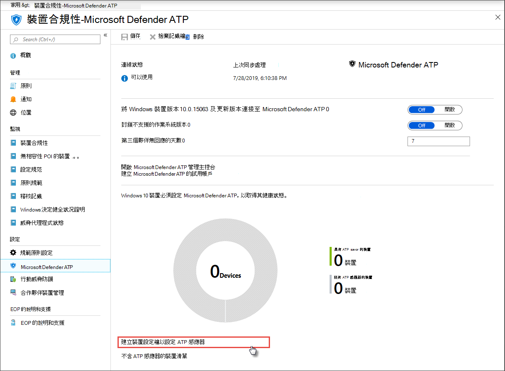

# 取得架至 Microsoft Defender for Endpoint 的裝置

[!INCLUDE [Microsoft 365 Defender rebranding](../../includes/microsoft-defender.md)]

**適用於：**
- [適用於端點的 Microsoft Defender](https://go.microsoft.com/fwlink/p/?linkid=2154037)
- [Microsoft 365 Defender](https://go.microsoft.com/fwlink/?linkid=2118804)

>想要體驗適用於端點的 Microsoft Defender 嗎？ [注册免費試用版。](https://www.microsoft.com/microsoft-365/windows/microsoft-defender-atp?ocid=docs-wdatp-onboardconfigure-abovefoldlink)

每個架裝置會在您的網路中新增額外的端點偵測偵測和回應 (EDR) 感應器，並增加對侵犯活動的知名度。 上架也可讓您檢查裝置是否有易受攻擊的元件，以及安全性設定問題，並可在攻擊期間接收重要的修復動作。

在您可以追蹤和管理裝置的上架之前：
- [將裝置註冊到 Intune 管理](configure-machines.md#enroll-devices-to-intune-management)
- [確定您具備必要的許可權](configure-machines.md#obtain-required-permissions)

## 探索並追蹤未受保護的裝置

在上架中，上 **架** 會將實際架到 Defender 的 Windows 10 裝置數目與 Intune 管理 Windows 10 裝置的總數進行比較，以提供您上架速度的高層次概述。

 
*顯示架裝置的卡片（與 Intune 管理的 Windows 10 裝置總數相比較）*

>[!NOTE]
>如果您使用的是 Security Center Configuration Manager、上架腳本，或是未使用 Intune 設定檔的其他上架方式，可能會發生資料差異。 若要解決這些矛盾，請建立適用于 Defender 上架的相關 Intune 設定檔，並將該設定檔指派給您的裝置。

## 具有 Intune 設定檔的板載以上裝置

Defender for Endpoint 為上[架 Windows 10 裝置](onboard-configure.md)提供數種便利的選項。 不過，對於 Intune 受管理的裝置，您可以利用 Intune 設定檔輕鬆地部署 Defender for Endpoint 感應器以選取裝置，並將這些裝置有效地上架至服務。

從上 **架** 卡上，選取 [上 **架更多裝置** ]，以在 Intune 上建立並指派設定檔。 此連結會帶您前往 Intune 上的裝置合規性頁面，此頁面提供您上架狀態的類似綜述。

 
   *Intune 裝置管理上的 Microsoft Defender for Endpoint device 相容性頁面*

>[!TIP]
>或者，您可以從 **所有服務 > Intune > 裝置合規性 > Microsoft Defender ATP**，流覽至 [Microsoft Azure 入口網站](https://portal.azure.com/)中的 [Defender for Endpoint 上架符合性] 頁面。

>[!NOTE]
> 如果您想要查看最新的裝置資料，請按一下 [ **不含 ATP 感應器的裝置清單**]。

在 [裝置符合性] 頁面上，建立專用於部署 Defender for Endpoint 感應器的設定檔，並將該設定檔指派給您想要上架的裝置。 若要這麼做，您可以執行下列其中一項動作：

- 選取 [ **建立裝置設定檔]，將 ATP 感應器設定** 為從預先定義的裝置設定檔開始設定。
- 從頭開始建立裝置設定檔。

如需詳細資訊，請 [參閱使用 Intune 裝置設定設定檔將「板載裝置」設定為使用 Defender For Endpoint](/intune/advanced-threat-protection#onboard-devices-by-using-a-configuration-profile)。

>想要體驗適用於端點的 Microsoft Defender 嗎？ [注册免費試用版。](https://www.microsoft.com/microsoft-365/windows/microsoft-defender-atp?ocid=docs-wdatp-onboardconfigure-belowfoldlink)

## 相關主題
- [確保您的裝置已正確設定](configure-machines.md)
- [將合規性提升至 Endpoint security 基準的 Defender](configure-machines-security-baseline.md)
- [優化 ASR 規則的部署和偵測](configure-machines-asr.md)
