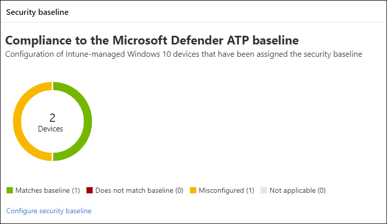
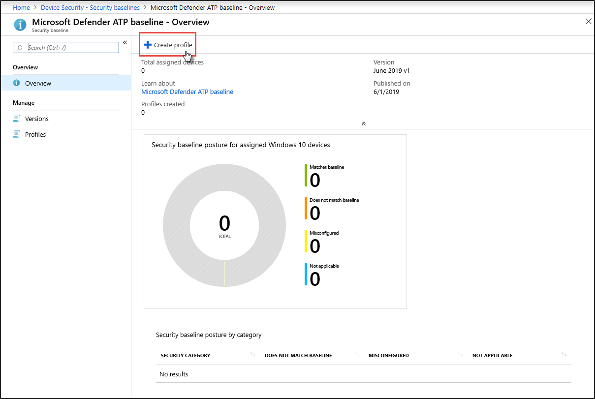
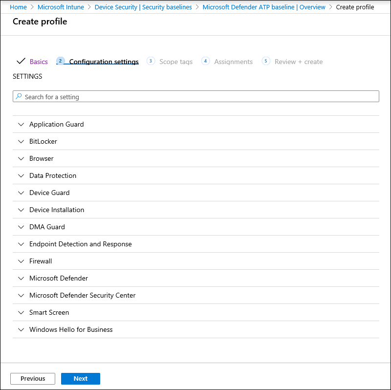
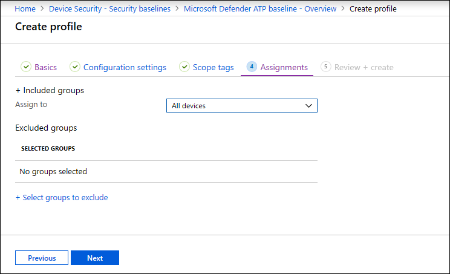

# 將合規性提升至 Microsoft Defender for Endpoint security 基準

[!INCLUDE [Microsoft 365 Defender rebranding](../../includes/microsoft-defender.md)]

**適用於：**
- [適用於端點的 Microsoft Defender](https://go.microsoft.com/fwlink/p/?linkid=2154037)
- [Microsoft 365 Defender](https://go.microsoft.com/fwlink/?linkid=2118804)

>想要體驗 Defender for Endpoint？ [注册免費試用版。](https://www.microsoft.com/microsoft-365/windows/microsoft-defender-atp?ocid=docs-wdatp-onboardconfigure-abovefoldlink)

安全性基準可確保根據安全性專家和專家 Windows 系統管理員的指導，設定安全性功能。 當部署時，用於端點安全性基準的 Defender 會將 Defender 設定為端點安全性控制，以提供最佳防護。

若要瞭解安全性基準，以及如何使用設定檔在 Intune 上指派它們，請 [閱讀此 FAQ](/intune/security-baselines#q--a)。

在您部署及追蹤安全性基準的符合性之前，您可以：
- [將裝置註冊到 Intune 管理](configure-machines.md#enroll-devices-to-intune-management)
- [確定您具備必要的許可權](configure-machines.md#obtain-required-permissions)

## 比較 Microsoft Defender for Endpoint 和 Windows Intune 安全性基準
Windows Intune 安全性基準會提供一組完整的建議設定，以安全地設定執行 Windows 的裝置，包括瀏覽器設定、PowerShell 設定，以及某些安全性功能（如 Microsoft Defender 防毒軟體）的設定。 相反地，「終結點」基準會提供設定，以優化所有的 endpoint 堆疊中的安全性控制，包括 Windows Intune 安全性基準中 EDR) 的端點偵測和回應 (的設定，以及也位於 Intune 安全性基準中的設定。 如需每個基準的詳細資訊，請參閱：

- [Windows Intune 的安全性基準設定](/intune/security-baseline-settings-windows)
- [Intune 的 Microsoft Defender 端點基準設定](/intune/security-baseline-settings-defender-atp)

理想狀況下，架 to Defender for endpoint 的裝置會同時部署這兩種基準：「Windows Intune 安全性基準」最初是安全的 Windows，而在最上層的 defender for endpoint security 基準會以最優化方式設定 defender for endpoint security 控制項。 若要受益于風險和威脅的最新資料，並在比較基準演變時盡可能減少衝突，請在發行所有產品時，隨時套用最新的基準版本。

>[!NOTE]
>已針對實體裝置優化端點安全性基準，目前不建議用於虛擬機器 (Vm) 或 VDI 端點。 某些基準設定會影響虛擬環境中的遠端互動會話。

## 監視對 Defender for Endpoint security 基準的合規性

[裝置設定管理](configure-machines.md)上的 **安全性基準** 卡會在已指派 Defender for Endpoint Security 基準的 Windows 10 裝置中，提供相容性的概覽。

 
*顯示對 Defender for Endpoint security 基準的合規性的卡片*

每個裝置都具有下列其中一個狀態類型：

- **符合基準** 線-裝置設定符合基線中的所有設定
- 不 **符合比較基準**，至少有一個裝置設定不符合基線
- **誤** 設定-裝置上至少有一個基準設定沒有正確設定，且處於衝突、錯誤或擱置狀態。
- **不適用**—至少一個基準設定不適用於裝置

若要查看特定裝置，請選取卡片上的 [ **設定安全性基準** ]。 這會帶您前往 Intune 裝置管理。 從那裡，選取裝置的名稱和狀態的裝置 **狀態** 。

>[!NOTE]
>在 [裝置設定管理] 頁面上顯示的匯總資料和在 Intune 中顯示的概要畫面中，您可能會遇到差異。

## 檢查並指派 Microsoft Defender for Endpoint security 基準

裝置設定管理會監控僅限明確指派 Microsoft Defender for Endpoint security 基準的 Windows 10 裝置的基準相容性。 您可以在 Intune 裝置管理上輕鬆查看基準，並將其指派給裝置。

1. 選取 [**安全性基準** 卡] 上的 [**設定安全性基準**]，以移至 [Intune 裝置管理]。 會顯示類似的基準相容性綜述。

   >[!TIP]
   > 或者，您可以從所有服務 > Intune 流覽至 Microsoft Azure 入口網站的 Defender for Endpoint security 基準 **> 裝置安全性 > 安全性基準 > Microsoft Defender ATP 基準**。

2. 建立新的設定檔。

    
   *Intune 上的 Microsoft Defender for Endpoint security 基準概述*

3. 在建立設定檔期間，您可以複查和調整基準上的特定設定。

    
   *在 Intune 上建立設定檔期間的安全性基準選項*

4. 將設定檔指派給適當的裝置群組。

    
   *在 Intune 上指派安全性基準設定檔*

5. 建立設定檔，並將其部署至指派的裝置群組。

    
   *在 Intune 上建立安全性基準設定檔*

>[!TIP]
>Intune 上的安全性基準可讓您輕鬆地保護裝置，並保護您的裝置。 [深入瞭解 Intune 上的安全性基準](/intune/security-baselines)。

>想要體驗適用於端點的 Microsoft Defender 嗎？ [注册免費試用版。](https://www.microsoft.com/microsoft-365/windows/microsoft-defender-atp?ocid=docs-wdatp-onboardconfigure-belowfoldlink)

## 相關主題
- [確保您的裝置已正確設定](configure-machines.md)
- [取得架至 Microsoft Defender for Endpoint 的裝置](configure-machines-onboarding.md)
- [優化 ASR 規則的部署和偵測](configure-machines-asr.md)
