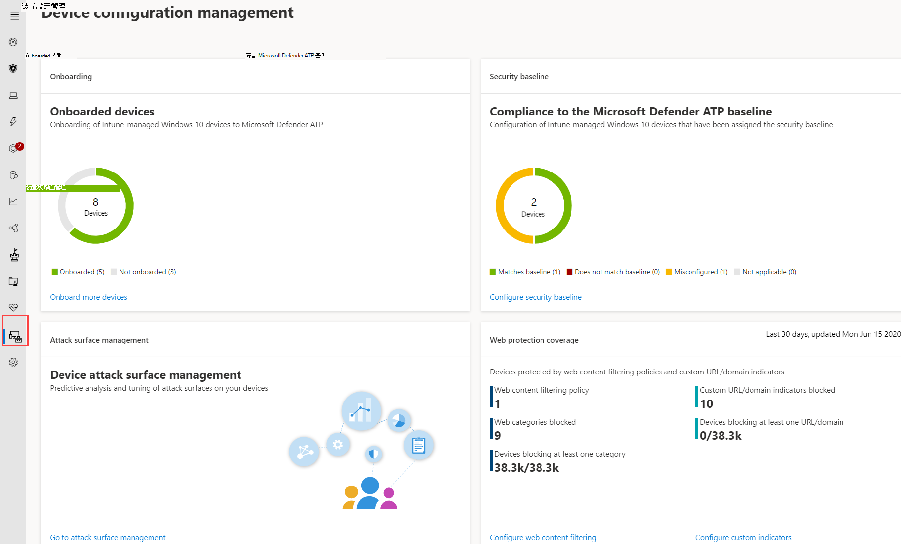

# 確保您的裝置已正確設定Ensure your devices are configured properly

[!INCLUDE [Microsoft 365 Defender rebranding](../../includes/microsoft-defender.md)]

**適用於：****Applies to:**
- [適用於端點的 Microsoft DefenderMicrosoft Defender for Endpoint](https://go.microsoft.com/fwlink/p/?linkid=2154037)
- [Microsoft 365 DefenderMicrosoft 365 Defender](https://go.microsoft.com/fwlink/?linkid=2118804)

>想要體驗 Defender for Endpoint？Want to experience Defender for Endpoint? [注册免費試用版。Sign up for a free trial.](https://www.microsoft.com/microsoft-365/windows/microsoft-defender-atp?ocid=docs-wdatp-onboardconfigure-abovefoldlink)

透過適當設定的裝置，您可以提升抵禦威脅的整體能力，並增強您偵測和回應攻擊的能力。With properly configured devices, you can boost overall resilience against threats and enhance your capability to detect and respond to attacks. 安全性設定管理可協助確保您的裝置：Security configuration management helps ensure that your devices:

- 在 Microsoft Defender for Endpoint 上的板載Onboard to Microsoft Defender for Endpoint
- 符合或超過 Defender for Endpoint security 基準設定Meet or exceed the Defender for Endpoint security baseline configuration
- 就地進行戰略性的攻擊面遷移Have strategic attack surface mitigations in place

按一下流覽功能表中的 [設定 **管理** ]，以開啟 [裝置設定管理] 頁面。Click **Configuration management** from the navigation menu to open the Device configuration management page.

 
*裝置設定管理頁面**Device configuration management page*

您可以追蹤組織層級的設定狀態，快速採取行動，以回應不良的內架、法規遵從性問題，以及透過直接連結到 Microsoft Intune 和 Microsoft 365 安全中心上的裝置管理頁面的深入連結。You can track configuration status at an organizational level and quickly take action in response to poor onboarding coverage, compliance issues, and poorly optimized attack surface mitigations through direct, deep links to device management pages on Microsoft Intune and Microsoft 365 security center.

如此一來，您可以：In doing so, you benefit from:
- 裝置上事件的完整可視性Comprehensive visibility of the events on your devices
- 強大的威脅智慧及強大的裝置教學技術，用來處理原始事件及識別違規活動和威脅指示器Robust threat intelligence and powerful device learning technologies for processing raw events and identifying the breach activity and threat indicators
- 設定為有效地停止安裝惡意 implants、劫持系統檔案與處理常式、資料 exfiltration 及其他威脅活動的完整安全功能堆疊A full stack of security features configured to efficiently stop the installation of malicious implants, hijacking of system files and process, data exfiltration, and other threat activities
- 優化的攻擊面緩解，最大化對威脅活動的戰略性防護，同時將對生產力的影響降至最低Optimized attack surface mitigations, maximizing strategic defenses against threat activity while minimizing impact to productivity

## 向 Intune 管理註冊裝置Enroll devices to Intune management

裝置設定管理與 Intune 裝置管理緊密合作，以建立組織中裝置的清查和基準安全性設定。Device configuration management works closely with Intune device management to establish the inventory of the devices in your organization and the baseline security configuration. 您將能夠在 Intune 管理的 Windows 10 裝置上追蹤和管理設定問題。You will be able to track and manage configuration issues on Intune-managed Windows 10 devices.

在您可以確保您的裝置設定正確之前，請先將其註冊至 Intune management。Before you can ensure your devices are configured properly, enroll them to Intune management. Intune 註冊很強大，且有許多 Windows 10 裝置的註冊選項。Intune enrollment is robust and has several enrollment options for Windows 10 devices. 如需 Intune 註冊選項的詳細資訊，請參閱[設定 Windows 裝置的註冊](/intune/windows-enroll)。For more information about Intune enrollment options, read about [setting up enrollment for Windows devices](/intune/windows-enroll).

>[!NOTE]
>若要在 Intune 中登記 Windows 裝置，系統管理員必須已獲指派授權。To enroll Windows devices to Intune, administrators must have already been assigned licenses. [閱讀指派裝置註冊的授權](/intune/licenses-assign)。[Read about assigning licenses for device enrollment](/intune/licenses-assign).

>[!TIP] 
>若要透過 Intune 優化裝置管理，請 [將 Intune 連線至 Defender For Endpoint](/intune/advanced-threat-protection#enable-windows-defender-atp-in-intune)。To optimize device management through Intune, [connect Intune to Defender for Endpoint](/intune/advanced-threat-protection#enable-windows-defender-atp-in-intune).

## 取得必要的許可權Obtain required permissions
根據預設，只有已獲指派全域管理員的使用者或 Azure AD 上的 Intune 服務系統管理員角色，才能管理及指派上架裝置和部署安全性基準所需的裝置設定設定檔。By default, only users who have been assigned the Global Administrator or the Intune Service Administrator role on Azure AD can manage and assign the device configuration profiles needed for onboarding devices and deploying the security baseline.

如果您已被指派其他角色，請確定您具備必要的許可權：If you have been assigned other roles, ensure you have the necessary permissions:

- 裝置設定的完整許可權Full permissions to device configurations
- 安全性基準的完整許可權Full permissions to security baselines
- 裝置合規性原則的讀取權限Read permissions to device compliance policies
- 組織的讀取權限Read permissions to the organization

 
*Intune 上的裝置設定許可權**Device configuration permissions on Intune*

>[!TIP] 
>若要深入瞭解在 Intune 上指派許可權，請 [參閱建立自訂角色](/intune/create-custom-role#to-create-a-custom-role)。To learn more about assigning permissions on Intune, [read about creating custom roles](/intune/create-custom-role#to-create-a-custom-role).

## 本節內容In this section
主題Topic | 描述Description
:---|:---
[取得架 to Defender for Endpoint 的裝置Get devices onboarded to Defender for Endpoint](configure-machines-onboarding.md)| 透過 Intune 追蹤 Intune 管理裝置和板載以上裝置的內架狀態。Track onboarding status of Intune-managed devices and onboard more devices through Intune. 
[將合規性提升至 Endpoint security 基準的 DefenderIncrease compliance to the Defender for Endpoint security baseline](configure-machines-security-baseline.md) | 追蹤基準相容性與不符合性。Track baseline compliance and noncompliance. 將安全性基準部署到更多 Intune 管理的裝置。Deploy the security baseline to more Intune-managed devices.
[優化 ASR 規則的部署和偵測Optimize ASR rule deployment and detections](configure-machines-asr.md) | 使用 Microsoft 365 security center 中的影響分析工具，檢查規則部署及調整偵測。Review rule deployment and tweak detections using impact analysis tools in Microsoft 365 security center.

>想要體驗 Defender for Endpoint？Want to experience Defender for Endpoint? [注册免費試用版。Sign up for a free trial.](https://www.microsoft.com/microsoft-365/windows/microsoft-defender-atp?ocid=docs-wdatp-onboardconfigure-belowfoldlink)
