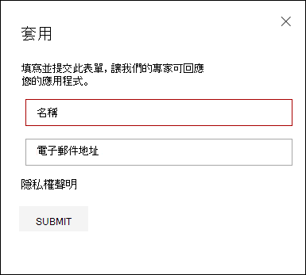
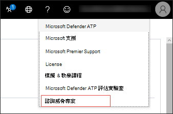

# 設定及管理 Microsoft 威脅專家功能

[!INCLUDE [Microsoft 365 Defender rebranding](../../includes/microsoft-defender.md)]

**適用於：**
- [適用於端點的 Microsoft Defender](https://go.microsoft.com/fwlink/p/?linkid=2154037)
- [Microsoft 365 Defender](https://go.microsoft.com/fwlink/?linkid=2118804)

>想要體驗 Defender for Endpoint？ [註冊免費試用版。](https://www.microsoft.com/microsoft-365/windows/microsoft-defender-atp?ocid=docs-wdatp-assignaccess-abovefoldlink)

## 開始之前 
> [!NOTE]
> 請先與您的 Microsoft 技術服務提供者和帳戶小組討論資格需求，然後再套用至 Microsoft 威脅專家的受攻擊通知管理威脅搜尋服務。

確定您在環境中部署裝置時，您已有已註冊的端點，而不只是實驗室設定。

如果您是 Endpoint 客戶的 Defender，您必須套用 **Microsoft 威脅專家針對目標的攻擊通知** ，以取得特殊的洞察力和分析，以協助識別最重要的威脅，讓您能快速回應。 請與您的帳戶小組或 Microsoft 代表聯繫，以訂閱 **Microsoft 威脅專家-針對** 相關偵測和敵人，向威脅專家請教的要求。

## 適用于 Microsoft 威脅專家-目標攻擊通知服務 
如果您已經是 Endpoint 客戶的 Defender，您可以透過 Microsoft Defender 安全中心來套用。 

1. 從功能窗格中，移至 **[設定] > 一般 > 「高級功能」，> Microsoft 威脅專家-已設定目標攻擊通知**。

2. 按一下 **[套用]**。

    

3. 輸入您的名稱和電子郵件地址，讓 Microsoft 可在您的應用程式中取得。

    

4. 閱讀 [隱私權聲明](https://privacy.microsoft.com/en-us/privacystatement)，然後在完成時按一下 [ **提交** ]。 您的應用程式經過核准後，您就會收到歡迎電子郵件。

    

接受時，您會收到歡迎使用的電子郵件，您會看到 [套用] 按鈕變更為「開啟 **」的切換** 。 若您想要將自己移出目標攻擊通知服務，請滑動切換 "off"，然後按一下頁面底部的 [ **儲存喜好** 設定]。 

## 您會看到 Microsoft 威脅專家對目標的攻擊通知 
您可以透過下列媒介接收來自 Microsoft 威脅專家的目標攻擊通知：  
- Defender for Endpoint portal 的 **事件** 頁面 
- Defender for Endpoint 入口網站的 **警示** 儀表板  
- OData 警示 [api](https://docs.microsoft.com/windows/security/threat-protection/microsoft-defender-atp/get-alerts) 和 [REST API](https://docs.microsoft.com/windows/security/threat-protection/microsoft-defender-atp/pull-alerts-using-rest-api)
- 高級搜尋中的[DeviceAlertEvents](https://docs.microsoft.com/windows/security/threat-protection/microsoft-defender-atp/advanced-hunting-devicealertevents-table)表格
- 您的電子郵件（如果選擇加以設定） 

若要透過電子郵件接收目標攻擊通知，請建立電子郵件通知規則。

### 建立電子郵件通知規則 
您可以建立規則來傳送通知收件者的電子郵件通知。 如需詳細資訊，請參閱  [設定警示通知](configure-email-notifications.md) ，以建立、編輯、刪除或疑難排解電子郵件通知。

## 查看已設定目標的攻擊通知  
在您將系統設定為接收電子郵件通知之後，您將開始從電子郵件中的 Microsoft 威脅專家接收目標攻擊通知。  

1. 按一下電子郵件中的連結，以移至以 **威脅專家** 標記的儀表板中對應的警示內容。 

2. 從儀表板中，選取您從電子郵件獲得的相同警示主題，以查看詳細資料。  

## 訂閱 Microsoft 威脅專家-點播的專家
這是提供訂閱服務。 如果您已經是 Endpoint 客戶的 Defender，您可以聯繫您的 Microsoft 代表，以訂閱 Microsoft 威脅專家-按需求的專家。 

## 請參閱 Microsoft 威脅專家關於您組織中的可疑 cybersecurity 活動 
您可以與 Microsoft 威脅專家合作，以直接從 Microsoft Defender Security Center 內直接參與，以進行及時且準確的回應。 專家會提供深入瞭解複雜威脅、您取得的目標攻擊通知，或者您需要相關資訊的詳細資訊，如您在入口網站儀表板上看到的警示、可能受損的裝置或威脅情報內容等相關資訊。 

> [!NOTE]
> - 目前不支援與貴組織的自訂威脅智慧資料相關的警示查詢。 如需詳細資訊，請參閱安全性作業或事件回應小組。
> - 您必須具備安全性中心入口網站中的「 **管理安全性設定** 」許可權，才能提交「參考威脅專家」查詢。

1. 流覽至入口網站頁面，其中包含您想要調查的相關資訊，例如「 **事件** 」頁面。 在您傳送調查要求之前，請確定相關警示或裝置的頁面位於 view。 

2. 從右上方的功能表中，按一下 [ **？** ] 圖示。 然後，選取 [ **對威脅專家進行協商**]。 

    

    隨即開啟快顯視窗。 下一個畫面會顯示您何時進行試用訂閱。

    

    下列畫面會顯示您何時使用完整的 Microsoft 威脅專家-點播訂閱。

    

    [ **查詢主題** ] 欄位已經預先填入調查要求之相關頁面的連結。 例如，您在進行要求時所在的事件、警示或裝置詳細資料頁面的連結。

3.  在下一個欄位中，提供足夠的資訊，讓 Microsoft 威脅專家有足夠的內容來開始調查。
  
4. 輸入您想要用來對應 Microsoft 威脅專家的電子郵件地址。

> [!NOTE]
> 如果您想要透過 Microsoft Services Hub 追蹤專家對需求案例的狀態，請與您的技術客戶經理聯繫。 

觀賞這段影片，以快速流覽 Microsoft Services 中樞。

>[!VIDEO https://www.microsoft.com/videoplayer/embed/RE4pk9f] 

   
## 您可以向 Microsoft 威脅專家請教的範例調查主題-依需求的專家 

**警示資訊**
- 我們看到一種新的警示類型，以用於非土地的二進位： [AlertID]。 您可以告訴我們關於此提醒的詳細資訊，以及我們可以進一步調查的方式嗎？
- 我們已觀察到兩個類似的攻擊，可嘗試執行惡意 PowerShell 腳本，但會產生不同的警示。 一個是「可疑 PowerShell 命令列」，另一個是「根據 O365 所提供的指示偵測到惡意檔案」。 有何差異？
- 從高設定檔使用者裝置的失敗登入失敗次數，我收到一份奇怪的警示。 我無法找到這些登入企圖的進一步證據。 Defender for Endpoint 會如何查看這些嘗試？ 受監視的登入類型為何？
- 您可以提供有關此警示的更多內容或深入瞭解：「系統公用程式的可疑行為已被觀測」。 

**可能危害的機器**
- 您可以協助解答為什麼我們看到「看得不到未知的程式？」。 在許多裝置上經常會出現此訊息或警示。 我們非常感謝任何輸入，以澄清此郵件或警示是否與惡意活動有關。
- 在 [date] 上，您可以協助驗證下列系統上的可能安全性漏洞，是否有類似的行為，與 [month] 中相同系統上的先前 [惡意程式碼名稱] 惡意程式碼偵測相同？

**威脅智慧詳細資料**
- 我們偵測到網路釣魚電子郵件，將惡意的 Word 檔傳遞給使用者。 惡意 Word 檔會引發一系列的可疑事件，這些事件會觸發多個 Microsoft Defender 警示的 [惡意程式碼名稱] 惡意程式碼。 您是否有這種惡意程式碼的資訊？ 如果是，您可以傳送我的連結嗎？
- 我最近看到的是以「我的行業」為目標之威脅的「社交媒體參考，例如 Twitter 或博客」。 您可以協助我瞭解什麼是針對此威脅者提供的 Endpoint protection Defender 嗎？ 

**Microsoft 威脅專家的警示通訊** 
- 您的事件回應小組可以協助我們解決我們所收到的目標攻擊通知嗎？
- 我收到來自 Microsoft 威脅專家的此目標攻擊通知。 我們沒有自己的事件回應小組。 我們現在可以做什麼，以及如何包含該事件？
- 我收到來自 Microsoft 威脅專家的目標攻擊通知。 您可以為我們提供哪些資料，讓我們能夠傳遞給我們的事件回應小組？

  >[!NOTE]
  >Microsoft 威脅專家是受管理的 cybersecurity 搜尋服務，並非事件回應服務。 不過，當必要時，專家可將調查順利轉換至 Microsoft Cybersecurity 解決方案群組 (CSG) 的偵測和回應小組 (DART) 服務。 您也可以選擇與您自己的事件回應小組合作，以解決需要事件回應的問題。 

## 案例

### 接收受管理搜尋查詢的進度報告 
Microsoft 威脅專家的回應會隨著您的查詢而異。 他們會透過電子郵件傳送進度報告給您，讓您參考兩天內的 **威脅專家** 查詢，以便從下列類別傳達調查狀態： 
- 需要有其他資訊才能繼續進行調查 
- 需要有一個或多個檔案範例，以判斷技術內容 
- 調查需要更多時間   
- 最初的資訊足以結束調查 

快速回應以繼續進行調查是很重要的。 

## 相關主題
- [Microsoft 威脅專家概述](microsoft-threat-experts.md)
