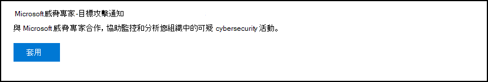

# 設定和管理 Microsoft 威脅專家功能Configure and manage Microsoft Threat Experts capabilities

[!INCLUDE [Microsoft 365 Defender rebranding](../../includes/microsoft-defender.md)]

**適用於：****Applies to:**
- [適用於端點的 Microsoft DefenderMicrosoft Defender for Endpoint](https://go.microsoft.com/fwlink/p/?linkid=2154037)
- [Microsoft 365 DefenderMicrosoft 365 Defender](https://go.microsoft.com/fwlink/?linkid=2118804)

>想要體驗 Defender for Endpoint？Want to experience Defender for Endpoint? [注册免費試用版。Sign up for a free trial.](https://www.microsoft.com/microsoft-365/windows/microsoft-defender-atp?ocid=docs-wdatp-assignaccess-abovefoldlink)

## 開始之前Before you begin 
> [!NOTE]
> 請先與您的 Microsoft 技術服務提供者和帳戶小組討論資格需求，然後再套用至 Microsoft 威脅專家目標的攻擊通知受管理威脅搜尋服務。Discuss the eligibility requirements with your Microsoft Technical Service provider and account team before you apply to Microsoft Threat Experts - Targeted Attack Notification managed threat hunting service.

確定您在環境中部署裝置時，您已有已註冊的端點，而不只是實驗室設定。Ensure that you have Defender for Endpoint deployed in your environment with devices enrolled, and not just on a laboratory set-up.

如果您是 Endpoint 客戶的 Defender，您必須針對 **Microsoft 威脅專家目標攻擊通知** 進行套用，以取得特殊的洞察力和分析，以協助找出最嚴重的威脅，讓您能快速回應這些威脅。If you're a Defender for Endpoint customer, you need to apply for **Microsoft Threat Experts - Targeted Attack Notifications** to get special insights and analysis to help identify the most critical threats, so you can respond to them quickly. 請與您的帳戶小組或 Microsoft 代表聯繫，以訂閱 **Microsoft 威脅專家的專家**，以諮詢我們對相關偵測和敵人的威脅專家。Contact your account team or Microsoft representative to subscribe to **Microsoft Threat Experts - Experts on Demand** to consult with our threat experts on relevant detections and adversaries.

## 適用于 Microsoft 威脅專家目標的攻擊通知服務Apply for Microsoft Threat Experts - Targeted Attack Notifications service 
如果您已經是 Endpoint 客戶的 Defender，您可以透過 Microsoft Defender 資訊安全中心加以套用。If you're already a Defender for Endpoint customer, you can apply through the Microsoft Defender Security Center. 

1. 在功能窗格中，移至 **設定 > 一般 > 高級功能 > Microsoft 威脅專家已設定攻擊通知**。From the navigation pane, go to **Settings > General > Advanced features > Microsoft Threat Experts - Targeted Attack Notifications**.

2. 按一下 \*\*\*\*[套用]。Click **Apply**.

    

3. 輸入您的名稱和電子郵件地址，讓 Microsoft 可在您的應用程式中取得。Enter your name and email address so that Microsoft can get back to you on your application.

    

4. 閱讀 [隱私權聲明](https://privacy.microsoft.com/en-us/privacystatement)，然後在完成時按一下 [ **提交** ]。Read the [privacy statement](https://privacy.microsoft.com/en-us/privacystatement), then click **Submit** when you're done. 您的應用程式經過核准後，您就會收到歡迎電子郵件。You will receive a welcome email once your application is approved.

    

接受時，您會收到歡迎使用的電子郵件，您會看到 [套用] 按鈕變更為「開啟 **」的切換** 。When accepted, you will receive a welcome email and you will see the **Apply** button change to a toggle that is “on”. 若您想要將自己移出目標攻擊通知服務，請滑動切換 "off"，然後按一下頁面底部的 [ **儲存喜好** 設定]。In case you want to take yourself out of the Targeted Attack Notifications service, slide the toggle “off” and click **Save preferences** at the bottom of the page. 

## 您可以從 Microsoft 威脅專家看到目標攻擊通知Where you'll see the targeted attack notifications from Microsoft Threat Experts 
您可以透過下列媒介從 Microsoft 威脅專家接收目標攻擊通知：You can receive targeted attack notification from Microsoft Threat Experts through the following medium:  
- Defender for Endpoint portal 的 **事件** 頁面The Defender for Endpoint portal's **Incidents** page 
- Defender for Endpoint 入口網站的 **警示** 儀表板The Defender for Endpoint portal's **Alerts** dashboard  
- OData 警示 [api](/windows/security/threat-protection/microsoft-defender-atp/get-alerts) 和 [REST API](/windows/security/threat-protection/microsoft-defender-atp/pull-alerts-using-rest-api)OData alerting [API](/windows/security/threat-protection/microsoft-defender-atp/get-alerts) and [REST API](/windows/security/threat-protection/microsoft-defender-atp/pull-alerts-using-rest-api)
- 高級搜尋中的[DeviceAlertEvents](/windows/security/threat-protection/microsoft-defender-atp/advanced-hunting-devicealertevents-table)表格[DeviceAlertEvents](/windows/security/threat-protection/microsoft-defender-atp/advanced-hunting-devicealertevents-table) table in Advanced hunting
- 您的電子郵件（如果選擇加以設定）Your email, if you choose to configure it 

若要透過電子郵件接收目標攻擊通知，請建立電子郵件通知規則。To receive targeted attack notifications through email, create an email notification rule.

### 建立電子郵件通知規則Create an email notification rule 
您可以建立規則來傳送通知收件者的電子郵件通知。You can create rules to send email notifications for notification recipients. 如需詳細資訊，請參閱  [設定警示通知](configure-email-notifications.md) ，以建立、編輯、刪除或疑難排解電子郵件通知。See  [Configure alert notifications](configure-email-notifications.md) to create, edit, delete, or troubleshoot email notification, for details.

## 查看已設定目標的攻擊通知View the targeted attack notification  
在您將系統設定為接收電子郵件通知之後，您將開始從電子郵件中的 Microsoft 威脅專家接收目標攻擊通知。You'll start receiving targeted attack notification from Microsoft Threat Experts in your email after you have configured your system to receive email notification.  

1. 按一下電子郵件中的連結，以移至以 **威脅專家** 標記的儀表板中對應的警示內容。Click the link in the email to go to the corresponding alert context in the dashboard tagged with **Threat experts**. 

2. 從儀表板中，選取您從電子郵件獲得的相同警示主題，以查看詳細資料。From the dashboard, select the same alert topic that you got from the email, to view the details.  

## 訂閱 Microsoft 威脅專家-依需求的專家Subscribe to Microsoft Threat Experts - Experts on Demand
這是提供訂閱服務。This is available as a subscription service. 如果您已經是 Endpoint 客戶的 Defender，您可以聯繫您的 Microsoft 代表，以訂閱 Microsoft 威脅專家的要求。If you're already a Defender for Endpoint customer, you can contact your Microsoft representative to subscribe to Microsoft Threat Experts - Experts on Demand. 

## 請參閱 Microsoft 威脅專家關於您組織中的可疑 cybersecurity 活動Consult a Microsoft threat expert about suspicious cybersecurity activities in your organization 
您可以合作 Microsoft 威脅專家誰可以直接從 Microsoft Defender 資訊安全中心中直接參與，以進行及時且準確的回應。You can partner with Microsoft Threat Experts who can be engaged directly from within the Microsoft Defender Security Center for timely and accurate response. 專家會提供深入瞭解複雜威脅、您取得的目標攻擊通知，或者您需要相關資訊的詳細資訊，如您在入口網站儀表板上看到的警示、可能受損的裝置或威脅情報內容等相關資訊。Experts provide insights to better understand complex threats, targeted attack notifications that you get, or if you need more information about the alerts, a potentially compromised device, or a threat intelligence context that you see on your portal dashboard. 

> [!NOTE]
> - 目前不支援與貴組織的自訂威脅智慧資料相關的警示查詢。Alert inquiries related to your organization's customized threat intelligence data are currently not supported. 如需詳細資訊，請參閱安全性作業或事件回應小組。Consult your security operations or incident response team for details.
> - 您必須具備安全性中心入口網站中的「 **管理安全性設定** 」許可權，才能提交「參考威脅專家」查詢。You need to have the **Manage security settings** permission in the Security Center portal to be able to submit a "Consult a threat expert" inquiry.

1. 流覽至入口網站頁面，其中包含您想要調查的相關資訊，例如「 **事件** 」頁面。Navigate to the portal page with the relevant information that you'd like to investigate, for example, the **Incident** page. 在您傳送調查要求之前，請確定相關警示或裝置的頁面位於 view。Ensure that the page for the relevant alert or device is in view before you send an investigation request. 

2. 從右上方的功能表中，按一下 [ **？** ]From the upper right-hand menu, click the **?** 圖示。icon. 然後，選取 [ **對威脅專家進行協商**]。Then, select **Consult a threat expert**. 

    

    隨即開啟快顯視窗。A flyout screen opens. 下一個畫面會顯示您何時進行試用訂閱。The following screen shows when you are on a trial subscription.

    

    下列畫面會顯示當您是在完全 Microsoft 威脅專家專家的點播訂閱上時。The following screen shows when you are on a full Microsoft Threat Experts - Experts on-Demand subscription.

    

    [ **查詢主題** ] 欄位已經預先填入調查要求之相關頁面的連結。The **Inquiry topic** field is pre-populated with the link to the relevant page for your investigation request. 例如，您在進行要求時所在的事件、警示或裝置詳細資料頁面的連結。For example, a link to the incident, alert, or device details page that you were at when you made the request.

3.  在下一個欄位中，提供足夠的資訊，讓 Microsoft 威脅專家足夠的上下文開始調查。In the next field, provide enough information to give the Microsoft Threat Experts enough context to start the investigation.
  
4. 輸入您想要用來與 Microsoft 威脅專家對應的電子郵件地址。Enter the email address that you'd like to use to correspond with Microsoft Threat Experts.

> [!NOTE]
> 如果您想要透過 Microsoft Services Hub 追蹤專家對需求案例的狀態，請與您的技術客戶經理聯繫。If you would like to track the status of your Experts on Demand cases through Microsoft Services Hub, reach out to your Technical Account Manager. 

觀賞這段影片，以快速流覽 Microsoft Services 中樞。Watch this video for a quick overview of the Microsoft Services Hub.

>[!VIDEO https://www.microsoft.com/videoplayer/embed/RE4pk9f] 

   
## 範例調查主題，您可以根據需求 Microsoft 威脅專家專家進行參考Sample investigation topics that you can consult with Microsoft Threat Experts - Experts on Demand 

**警示資訊****Alert information**
- 我們看到一種新的警示類型，以用於非土地的二進位： [AlertID]。We see a new type of alert for a living-off-the-land binary: [AlertID]. 您可以告訴我們關於此提醒的詳細資訊，以及我們可以進一步調查的方式嗎？Can you tell us something more about this alert and how we can investigate further?
- 我們已觀察到兩個類似的攻擊，可嘗試執行惡意 PowerShell 腳本，但會產生不同的警示。We’ve observed two similar attacks, which try to execute malicious PowerShell scripts but generate different alerts. 一個是「可疑 PowerShell 命令列」，另一個是「根據 O365 所提供的指示偵測到惡意檔案」。One is "Suspicious PowerShell command line" and the other is "A malicious file was detected based on indication provided by O365". 有何差異？What is the difference?
- 從高設定檔使用者裝置的失敗登入失敗次數，我收到一份奇怪的警示。I receive an odd alert today for abnormal number of failed logins from a high profile user’s device. 我無法找到這些登入企圖的進一步證據。I cannot find any further evidence around these sign-in attempts. Defender for Endpoint 會如何查看這些嘗試？How can Defender for Endpoint see these attempts? 受監視的登入類型為何？What type of sign-ins are being monitored?
- 您可以提供有關此警示的更多內容或深入瞭解：「系統公用程式的可疑行為已被觀測」。Can you give more context or insights about this alert: “Suspicious behavior by a system utility was observed”. 

**可能危害的機器****Possible machine compromise**
- 您可以協助解答為什麼我們看到「看得不到未知的程式？」。Can you help answer why we see “Unknown process observed?” 在許多裝置上經常會出現此訊息或警示。This message or alert is seen frequently on many devices. 我們非常感謝任何輸入，以澄清此郵件或警示是否與惡意活動有關。We appreciate any input to clarify whether this message or alert is related to malicious activity.
- 在 [date] 上，您可以協助驗證下列系統上的可能安全性漏洞，是否有類似的行為，與 [month] 中相同系統上的先前 [惡意程式碼名稱] 惡意程式碼偵測相同？Can you help validate a possible compromise on the following system on [date] with similar behaviors as the previous [malware name] malware detection on the same system in [month]?

**威脅智慧詳細資料****Threat intelligence details**
- 我們偵測到網路釣魚電子郵件，將惡意的 Word 檔傳遞給使用者。We detected a phishing email that delivered a malicious Word document to a user. 惡意 Word 檔會引發一系列的可疑事件，這些事件會觸發多個 Microsoft Defender 警示的 [惡意程式碼名稱] 惡意程式碼。The malicious Word document caused a series of suspicious events, which triggered multiple Microsoft Defender alerts for [malware name] malware. 您是否有這種惡意程式碼的資訊？Do you have any information on this malware? 如果是，您可以傳送我的連結嗎？If yes, can you send me a link?
- 我最近看到的是以「我的行業」為目標之威脅的「社交媒體參考，例如 Twitter 或博客」。I recently saw a [social media reference, for example, Twitter or blog] post about a threat that is targeting my industry. 您可以協助我瞭解什麼是針對此威脅者提供的 Endpoint protection Defender 嗎？Can you help me understand what protection Defender for Endpoint provides against this threat actor? 

**Microsoft 威脅專家 ' 警示通訊****Microsoft Threat Experts’ alert communications** 
- 您的事件回應小組可以協助我們解決我們所收到的目標攻擊通知嗎？Can your incident response team help us address the targeted attack notification that we got?
- 我收到來自 Microsoft 威脅專家的此目標攻擊通知。I received this targeted attack notification from Microsoft Threat Experts. 我們沒有自己的事件回應小組。We don’t have our own incident response team. 我們現在可以做什麼，以及如何包含該事件？What can we do now, and how can we contain the incident?
- 我收到來自 Microsoft 威脅專家的目標攻擊通知。I received a targeted attack notification from Microsoft Threat Experts. 您可以為我們提供哪些資料，讓我們能夠傳遞給我們的事件回應小組？What data can you provide to us that we can pass on to our incident response team?

  >[!NOTE]
  >Microsoft 威脅專家是受管理 cybersecurity 搜尋服務，並非事件回應服務。Microsoft Threat Experts is a managed cybersecurity hunting service and not an incident response service. 不過，當必要時，專家可將調查順利轉換至 Microsoft Cybersecurity 解決方案群組 (CSG) 的偵測和回應小組 (DART) 服務。However, the experts can seamlessly transition the investigation to Microsoft Cybersecurity Solutions Group (CSG)'s  Detection and Response Team (DART) services, when necessary. 您也可以選擇與您自己的事件回應小組合作，以解決需要事件回應的問題。You can also opt to engage with your own incident response team to address issues that requires an incident response. 

## 案例Scenario

### 接收受管理搜尋查詢的進度報告Receive a progress report about your managed hunting inquiry 
Microsoft 威脅專家的回應會根據您的查詢而有所不同。Response from Microsoft Threat Experts varies according to your inquiry. 他們會透過電子郵件傳送進度報告給您，讓您參考兩天內的 **威脅專家** 查詢，以便從下列類別傳達調查狀態：They will email a progress report to you about your **Consult a threat expert** inquiry within two days, to communicate the investigation status from the following categories: 
- 需要有其他資訊才能繼續進行調查More information is needed to continue with the investigation 
- 需要有一個或多個檔案範例，以判斷技術內容A file or several file samples are needed to determine the technical context 
- 調查需要更多時間Investigation requires more time   
- 最初的資訊足以結束調查Initial information was enough to conclude the investigation 

快速回應以繼續進行調查是很重要的。It is crucial to respond in quickly to keep the investigation moving. 

## 相關主題Related topic
- [Microsoft 威脅專家概觀Microsoft Threat Experts overview](microsoft-threat-experts.md)
- [Microsoft 365 概覽中的 Microsoft 威脅專家Microsoft Threat Experts in Microsoft 365 Overview](/microsoft-365/security/mtp/microsoft-threat-experts)
