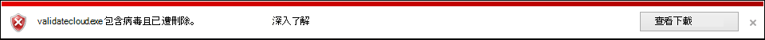

# <a name="configure-and-validate-microsoft-defender-antivirus-network-connections"></a><span data-ttu-id="03720-104">設定及驗證 Microsoft Defender 防毒軟體網路連線</span><span class="sxs-lookup"><span data-stu-id="03720-104">Configure and validate Microsoft Defender Antivirus network connections</span></span>

<span data-ttu-id="03720-105">**適用於：**</span><span class="sxs-lookup"><span data-stu-id="03720-105">**Applies to:**</span></span>

- [<span data-ttu-id="03720-106">適用於端點的 Microsoft Defender</span><span class="sxs-lookup"><span data-stu-id="03720-106">Microsoft Defender for Endpoint</span></span>](/microsoft-365/security/defender-endpoint/)

<span data-ttu-id="03720-107">為了確保已 Microsoft Defender 防毒軟體雲端傳送保護的運作是否正常，您必須設定網路以允許端點和某些 Microsoft 伺服器之間的連線。</span><span class="sxs-lookup"><span data-stu-id="03720-107">To ensure Microsoft Defender Antivirus cloud-delivered protection works properly, you need to configure your network to allow connections between your endpoints and certain Microsoft servers.</span></span> <span data-ttu-id="03720-108">本文列出必須允許的連線，例如使用防火牆規則，並提供驗證連線的指示。</span><span class="sxs-lookup"><span data-stu-id="03720-108">This article lists the connections that must be allowed, such as by using firewall rules, and provides instructions for validating your connection.</span></span> <span data-ttu-id="03720-109">正確設定保護可協助確保您從雲端提供的保護服務中取得最佳價值。</span><span class="sxs-lookup"><span data-stu-id="03720-109">Configuring your protection properly helps ensure that you receive the best value from your cloud-delivered protection services.</span></span>

<span data-ttu-id="03720-110">如需網路連線的某些詳細資料，請參閱博客文章 [重要變更 Microsoft Active Protection Services 端點](https://techcommunity.microsoft.com/t5/Configuration-Manager-Archive/Important-changes-to-Microsoft-Active-Protection-Service-MAPS/ba-p/274006) 。</span><span class="sxs-lookup"><span data-stu-id="03720-110">See the blog post [Important changes to Microsoft Active Protection Services endpoint](https://techcommunity.microsoft.com/t5/Configuration-Manager-Archive/Important-changes-to-Microsoft-Active-Protection-Service-MAPS/ba-p/274006) for some details about network connectivity.</span></span>

> [!TIP]
> <span data-ttu-id="03720-111">您也可以在 [demo.wd.microsoft.com](https://demo.wd.microsoft.com?ocid=cx-wddocs-testground) 流覽 Microsoft Defender for Endpoint 示範網站，以確認下列功能正在運作：</span><span class="sxs-lookup"><span data-stu-id="03720-111">You can also visit the Microsoft Defender for Endpoint demo website at [demo.wd.microsoft.com](https://demo.wd.microsoft.com?ocid=cx-wddocs-testground) to confirm the following features are working:</span></span>
>
> - <span data-ttu-id="03720-112">雲端提供的保護</span><span class="sxs-lookup"><span data-stu-id="03720-112">Cloud-delivered protection</span></span>
> - <span data-ttu-id="03720-113">Fast 教學 (包括第一次看到區塊) </span><span class="sxs-lookup"><span data-stu-id="03720-113">Fast learning (including block at first sight)</span></span>
> - <span data-ttu-id="03720-114">可能有害的應用程式封鎖</span><span class="sxs-lookup"><span data-stu-id="03720-114">Potentially unwanted application blocking</span></span>

## <a name="allow-connections-to-the-microsoft-defender-antivirus-cloud-service"></a><span data-ttu-id="03720-115">允許連線至 Microsoft Defender 防毒軟體雲端服務</span><span class="sxs-lookup"><span data-stu-id="03720-115">Allow connections to the Microsoft Defender Antivirus cloud service</span></span>

<span data-ttu-id="03720-116">Microsoft Defender 防毒軟體 cloud service 為您的端點提供快速、強大的保護。</span><span class="sxs-lookup"><span data-stu-id="03720-116">The Microsoft Defender Antivirus cloud service provides fast, strong protection for your endpoints.</span></span> <span data-ttu-id="03720-117">啟用雲端傳送保護服務是選用的選項，但是強烈建議您這麼做，因為它會針對您的端點和整個網路提供重要的防護。</span><span class="sxs-lookup"><span data-stu-id="03720-117">Enabling the cloud-delivered protection service is optional, however it's highly recommended because it provides important protection against malware on your endpoints and across your network.</span></span>

> [!NOTE]
> <span data-ttu-id="03720-118">Microsoft Defender 防毒軟體 cloud service 是一種機制，可將更新的保護傳遞到網路和端點。</span><span class="sxs-lookup"><span data-stu-id="03720-118">The Microsoft Defender Antivirus cloud service is a mechanism for delivering updated protection to your network and endpoints.</span></span> <span data-ttu-id="03720-119">雖然它稱為雲端服務，但並不只是保護儲存在雲端中的檔案，而是使用分散式資源和機器學習功能，以比傳統的安全性智慧更新速度更快的速率來提供對端點的保護。</span><span class="sxs-lookup"><span data-stu-id="03720-119">Although it's called a cloud service, it's not simply protection for files stored in the cloud, rather it uses distributed resources and machine learning to deliver protection to your endpoints at a rate that is far faster than traditional Security intelligence updates.</span></span>

<span data-ttu-id="03720-120">請參閱[啟用雲端提供的保護](enable-cloud-protection-microsoft-defender-antivirus.md)，以取得使用 Intune、Microsoft Endpoint Configuration Manager、群組原則、PowerShell 指令程式或 Windows 安全性應用程式中個別用戶端上啟用服務的詳細資訊。</span><span class="sxs-lookup"><span data-stu-id="03720-120">See [Enable cloud-delivered protection](enable-cloud-protection-microsoft-defender-antivirus.md) for details on enabling the service with Intune, Microsoft Endpoint Configuration Manager, Group Policy, PowerShell cmdlets, or on individual clients in the Windows Security app.</span></span> 

<span data-ttu-id="03720-121">在您啟用服務之後，您可能需要設定網路或防火牆，以允許其和您的端點之間的連線。</span><span class="sxs-lookup"><span data-stu-id="03720-121">After you've enabled the service, you may need to configure your network or firewall to allow connections between it and your endpoints.</span></span>

<span data-ttu-id="03720-122">因為您的保護是雲端服務，所以電腦必須能夠存取網際網路，並接觸 Microsoft Defender for a machine 教學 services Office 365。</span><span class="sxs-lookup"><span data-stu-id="03720-122">Because your protection is a cloud service, computers must have access to the internet and reach the Microsoft Defender for Office 365 machine learning services.</span></span> <span data-ttu-id="03720-123">請勿 `*.blob.core.windows.net` 從任何類型的網路檢查中排除 URL。</span><span class="sxs-lookup"><span data-stu-id="03720-123">Don't exclude the URL `*.blob.core.windows.net` from any kind of network inspection.</span></span> 

<span data-ttu-id="03720-124">下表列出服務及其相關聯的 URLs。</span><span class="sxs-lookup"><span data-stu-id="03720-124">The table below lists the services and their associated URLs.</span></span> <span data-ttu-id="03720-125">請確定沒有任何防火牆或網路篩選規則拒絕存取這些 URLs，否則您可能需要建立專用的 allow 規則 (排除 URL `*.blob.core.windows.net`) 。</span><span class="sxs-lookup"><span data-stu-id="03720-125">Make sure that there are no firewall or network filtering rules denying access to these URLs, or you may need to create an allow rule specifically for them (excluding the URL `*.blob.core.windows.net`).</span></span> <span data-ttu-id="03720-126">以下提及 URLs 使用埠443進行通訊。</span><span class="sxs-lookup"><span data-stu-id="03720-126">Below mention URLs are using port 443 for communication.</span></span>


| <span data-ttu-id="03720-127">**服務**</span><span class="sxs-lookup"><span data-stu-id="03720-127">**Service**</span></span>| <span data-ttu-id="03720-128">**描述**</span><span class="sxs-lookup"><span data-stu-id="03720-128">**Description**</span></span> |<span data-ttu-id="03720-129">**URL**</span><span class="sxs-lookup"><span data-stu-id="03720-129">**URL**</span></span> |
| :--: | :-- | :-- |
| <span data-ttu-id="03720-130">Microsoft Defender 防毒軟體雲端提供的保護服務，也稱為 Microsoft Active Protection Service (對應) </span><span class="sxs-lookup"><span data-stu-id="03720-130">Microsoft Defender Antivirus cloud-delivered protection service, also referred to as Microsoft Active Protection Service (MAPS)</span></span>|<span data-ttu-id="03720-131">用於 Microsoft Defender 防毒軟體以提供雲端提供的保護</span><span class="sxs-lookup"><span data-stu-id="03720-131">Used by Microsoft Defender Antivirus to provide cloud-delivered protection</span></span>|`*.wdcp.microsoft.com` <br/> `*.wdcpalt.microsoft.com` <br/> `*.wd.microsoft.com`|
| <span data-ttu-id="03720-132">Microsoft Update Service (MU) </span><span class="sxs-lookup"><span data-stu-id="03720-132">Microsoft Update Service (MU)</span></span> <br/> <span data-ttu-id="03720-133">WindowsUpdate Service (WU) </span><span class="sxs-lookup"><span data-stu-id="03720-133">Windows Update Service (WU)</span></span>|  <span data-ttu-id="03720-134">安全性智慧及產品更新</span><span class="sxs-lookup"><span data-stu-id="03720-134">Security intelligence and product updates</span></span>   |`*.update.microsoft.com` <br/> `*.delivery.mp.microsoft.com`<br/> `*.windowsupdate.com` <br/><br/> <span data-ttu-id="03720-135">如需詳細資訊，請參閱[Windows 更新的連接端點](/windows/privacy/manage-windows-1709-endpoints#windows-update)</span><span class="sxs-lookup"><span data-stu-id="03720-135">For details see [Connection endpoints for Windows Update](/windows/privacy/manage-windows-1709-endpoints#windows-update)</span></span>|
|<span data-ttu-id="03720-136">安全性智慧更新替代下載位置 (ADL) </span><span class="sxs-lookup"><span data-stu-id="03720-136">Security intelligence updates Alternate Download Location (ADL)</span></span>|   <span data-ttu-id="03720-137">如果已安裝的安全性情報已過期，則為 Microsoft Defender 防毒軟體 Security 情報更新的替代位置)  (7 天以上或以上天數</span><span class="sxs-lookup"><span data-stu-id="03720-137">Alternate location for Microsoft Defender Antivirus Security intelligence updates if the installed Security intelligence is out of date (7 or more days behind)</span></span>|    `*.download.microsoft.com`  </br> `*.download.windowsupdate.com`</br>  `go.microsoft.com`</br> `https://fe3cr.delivery.mp.microsoft.com/ClientWebService/client.asmx`|
| <span data-ttu-id="03720-138">惡意程式碼提交存放區</span><span class="sxs-lookup"><span data-stu-id="03720-138">Malware submission storage</span></span>|<span data-ttu-id="03720-139">透過提交表單或自動範例提交，將檔案提交給 Microsoft 的 Upload 位置</span><span class="sxs-lookup"><span data-stu-id="03720-139">Upload location for files submitted to Microsoft via the Submission form or automatic sample submission</span></span>    | `ussus1eastprod.blob.core.windows.net` <br/>    `ussus2eastprod.blob.core.windows.net` <br/>    `ussus3eastprod.blob.core.windows.net` <br/>    `ussus4eastprod.blob.core.windows.net` <br/>    `wsus1eastprod.blob.core.windows.net` <br/>    `wsus2eastprod.blob.core.windows.net` <br/>    `ussus1westprod.blob.core.windows.net` <br/>    `ussus2westprod.blob.core.windows.net` <br/>    `ussus3westprod.blob.core.windows.net` <br/>    `ussus4westprod.blob.core.windows.net` <br/>    `wsus1westprod.blob.core.windows.net` <br/>    `wsus2westprod.blob.core.windows.net` <br/>    `usseu1northprod.blob.core.windows.net` <br/>    `wseu1northprod.blob.core.windows.net` <br/>    `usseu1westprod.blob.core.windows.net` <br/>    `wseu1westprod.blob.core.windows.net` <br/>    `ussuk1southprod.blob.core.windows.net` <br/>    `wsuk1southprod.blob.core.windows.net` <br/>    `ussuk1westprod.blob.core.windows.net` <br/>    `wsuk1westprod.blob.core.windows.net` |
| <span data-ttu-id="03720-140"> (CRL) 的憑證吊銷清單</span><span class="sxs-lookup"><span data-stu-id="03720-140">Certificate Revocation List (CRL)</span></span>|<span data-ttu-id="03720-141">在建立對應的 SSL 連線以更新 CRL 時使用 Windows</span><span class="sxs-lookup"><span data-stu-id="03720-141">Used by Windows when creating the SSL connection to MAPS for updating the CRL</span></span>   | `http://www.microsoft.com/pkiops/crl/` <br/> `http://www.microsoft.com/pkiops/certs` <br/>   `http://crl.microsoft.com/pki/crl/products` <br/> `http://www.microsoft.com/pki/certs` |
| <span data-ttu-id="03720-142">符號儲存區</span><span class="sxs-lookup"><span data-stu-id="03720-142">Symbol Store</span></span>|<span data-ttu-id="03720-143">由 Microsoft Defender 防毒軟體用來在修正流程期間還原某些重要檔案</span><span class="sxs-lookup"><span data-stu-id="03720-143">Used by Microsoft Defender Antivirus to restore certain critical files during remediation flows</span></span>  | `https://msdl.microsoft.com/download/symbols` |
| <span data-ttu-id="03720-144">通用遙測用戶端</span><span class="sxs-lookup"><span data-stu-id="03720-144">Universal Telemetry Client</span></span>| <span data-ttu-id="03720-145">由 Windows 用來傳送用戶端診斷資料;Microsoft Defender 防毒軟體使用遙測進行產品品質監控的目的</span><span class="sxs-lookup"><span data-stu-id="03720-145">Used by Windows to send client diagnostic data; Microsoft Defender Antivirus uses telemetry for product quality monitoring purposes</span></span>   | <span data-ttu-id="03720-146">更新使用 SSL (TCP 埠 443) 下載資訊清單，並將使用下列 DNS 端點的診斷資料上傳至 Microsoft：   `vortex-win.data.microsoft.com`</span><span class="sxs-lookup"><span data-stu-id="03720-146">The update uses SSL (TCP Port 443) to download manifests and upload diagnostic data to Microsoft that uses the following DNS endpoints:   `vortex-win.data.microsoft.com`</span></span> <br/>   `settings-win.data.microsoft.com`|

## <a name="validate-connections-between-your-network-and-the-cloud"></a><span data-ttu-id="03720-147">驗證網路與雲端之間的連線</span><span class="sxs-lookup"><span data-stu-id="03720-147">Validate connections between your network and the cloud</span></span>

<span data-ttu-id="03720-148">允許上述 URLs 之後，您可以測試是否已連線到 Microsoft Defender 防毒軟體雲端服務，並正確報告和接收資訊，以確保您受到完全保護。</span><span class="sxs-lookup"><span data-stu-id="03720-148">After allowing the URLs listed above, you can test if you're connected to the Microsoft Defender Antivirus cloud service and are correctly reporting and receiving information to ensure you're fully protected.</span></span>

<span data-ttu-id="03720-149">**使用 cmdline 工具來驗證雲端提供的保護：**</span><span class="sxs-lookup"><span data-stu-id="03720-149">**Use the cmdline tool to validate cloud-delivered protection:**</span></span>

<span data-ttu-id="03720-150">在 Microsoft Defender 防毒軟體命令列公用程式 () 使用下列引數， `mpcmdrun.exe` 以確認您的網路能夠與 Microsoft Defender 防毒軟體雲端服務通訊：</span><span class="sxs-lookup"><span data-stu-id="03720-150">Use the following argument with the Microsoft Defender Antivirus command-line utility (`mpcmdrun.exe`) to verify that your network can communicate with the Microsoft Defender Antivirus cloud service:</span></span>

```console
"%ProgramFiles%\Windows Defender\MpCmdRun.exe" -ValidateMapsConnection
```

> [!NOTE]
> <span data-ttu-id="03720-151">您必須開啟命令提示字元的系統管理員層級版本。</span><span class="sxs-lookup"><span data-stu-id="03720-151">You need to open an administrator-level version of the command prompt.</span></span> <span data-ttu-id="03720-152">在 [開始] 功能表中，以滑鼠右鍵按一下專案，按一下 [以 **系統管理員身分執行** ]，然後在許可權提示中按一下 **[是]** 。</span><span class="sxs-lookup"><span data-stu-id="03720-152">Right-click the item in the Start menu, click **Run as administrator** and click **Yes** at the permissions prompt.</span></span> <span data-ttu-id="03720-153">這個命令只會在 Windows 10 版本1703或更高版本上運作。</span><span class="sxs-lookup"><span data-stu-id="03720-153">This command will only work on Windows 10, version 1703 or higher.</span></span>

<span data-ttu-id="03720-154">如需詳細資訊，請參閱[使用 mpcmdrun.exe 命令列工具管理 Microsoft Defender 防毒軟體](command-line-arguments-microsoft-defender-antivirus.md)。</span><span class="sxs-lookup"><span data-stu-id="03720-154">For more information, see [Manage Microsoft Defender Antivirus with the mpcmdrun.exe commandline tool](command-line-arguments-microsoft-defender-antivirus.md).</span></span>

<span data-ttu-id="03720-155">**嘗試從 Microsoft 下載虛假惡意程式碼檔：**</span><span class="sxs-lookup"><span data-stu-id="03720-155">**Attempt to download a fake malware file from Microsoft:**</span></span>

<span data-ttu-id="03720-156">您可以下載範例檔案，當您已正確連接至雲端時，Microsoft Defender 防毒軟體會偵測並封鎖。</span><span class="sxs-lookup"><span data-stu-id="03720-156">You can download a sample file that Microsoft Defender Antivirus will detect and block if you're properly connected to the cloud.</span></span>

<span data-ttu-id="03720-157">透過訪問下載檔案 [https://aka.ms/ioavtest](https://aka.ms/ioavtest) 。</span><span class="sxs-lookup"><span data-stu-id="03720-157">Download the file by visiting [https://aka.ms/ioavtest](https://aka.ms/ioavtest).</span></span>

> [!NOTE]
> <span data-ttu-id="03720-158">此檔案不是惡意程式碼的實際部分。</span><span class="sxs-lookup"><span data-stu-id="03720-158">This file is not an actual piece of malware.</span></span> <span data-ttu-id="03720-159">這是一個偽檔案，其設計目的是為了測試您是否已正確連接至雲端。</span><span class="sxs-lookup"><span data-stu-id="03720-159">It's a fake file that is designed to test if you're properly connected to the cloud.</span></span>

<span data-ttu-id="03720-160">正確連接後，您會看到警告 Microsoft Defender 防毒軟體通知。</span><span class="sxs-lookup"><span data-stu-id="03720-160">If you're properly connected, you'll see a warning Microsoft Defender Antivirus notification.</span></span>

<span data-ttu-id="03720-161">如果您正在使用 Microsoft Edge，您也會看到通知訊息：</span><span class="sxs-lookup"><span data-stu-id="03720-161">If you're using Microsoft Edge, you'll also see a notification message:</span></span>


<span data-ttu-id="03720-163">當您使用 Internet Explorer 時，會發生類似的訊息：</span><span class="sxs-lookup"><span data-stu-id="03720-163">A similar message occurs if you're using Internet Explorer:</span></span>



<span data-ttu-id="03720-165">您也會在 Windows 安全性應用程式的 [掃描歷程 **記錄**] 區段中看到 [**隔離威脅**] 下的偵測：</span><span class="sxs-lookup"><span data-stu-id="03720-165">You'll also see a detection under **Quarantined threats** in the **Scan history** section in the Windows Security app:</span></span>

1. <span data-ttu-id="03720-166">按一下工作列中的盾牌圖示，或搜尋 [**安全性**] 的 [開始] 功能表，開啟 Windows 安全性應用程式。</span><span class="sxs-lookup"><span data-stu-id="03720-166">Open the Windows Security app by clicking the shield icon in the task bar or searching the start menu for **Security**.</span></span>

2. <span data-ttu-id="03720-167">選取 [ **病毒 & 威脅防護**]，然後選取 [ **保護歷程記錄**]。</span><span class="sxs-lookup"><span data-stu-id="03720-167">Select **Virus & threat protection**, and then select **Protection history**.</span></span>

3. <span data-ttu-id="03720-168">在 [ **隔離威脅** ] 區段中，選取 [ **查看完整的史** ]，以查看偵測到的虛假惡意程式碼。</span><span class="sxs-lookup"><span data-stu-id="03720-168">Under the **Quarantined threats** section, select **See full history** to see the detected fake malware.</span></span>

   > [!NOTE]
   > <span data-ttu-id="03720-169">版本1703之前的 Windows 10 版本都具有不同的使用者介面。</span><span class="sxs-lookup"><span data-stu-id="03720-169">Versions of Windows 10 before version 1703 have a different user interface.</span></span> <span data-ttu-id="03720-170">請參閱[Windows 安全性應用程式中的 Microsoft Defender 防毒軟體](microsoft-defender-security-center-antivirus.md)。</span><span class="sxs-lookup"><span data-stu-id="03720-170">See [Microsoft Defender Antivirus in the Windows Security app](microsoft-defender-security-center-antivirus.md).</span></span>

   <span data-ttu-id="03720-171">Windows 事件記錄也會顯示[Windows Defender 用戶端事件識別碼 1116](troubleshoot-microsoft-defender-antivirus.md)。</span><span class="sxs-lookup"><span data-stu-id="03720-171">The Windows event log will also show [Windows Defender client event ID 1116](troubleshoot-microsoft-defender-antivirus.md).</span></span>

## <a name="related-articles"></a><span data-ttu-id="03720-172">相關文章</span><span class="sxs-lookup"><span data-stu-id="03720-172">Related articles</span></span>

- [<span data-ttu-id="03720-173">Windows 10 中的 Microsoft Defender 防毒軟體</span><span class="sxs-lookup"><span data-stu-id="03720-173">Microsoft Defender Antivirus in Windows 10</span></span>](microsoft-defender-antivirus-in-windows-10.md)

- [<span data-ttu-id="03720-174">啟動雲端提供的保護</span><span class="sxs-lookup"><span data-stu-id="03720-174">Enable cloud-delivered protection</span></span>](enable-cloud-protection-microsoft-defender-antivirus.md)

- [<span data-ttu-id="03720-175">命令列引數</span><span class="sxs-lookup"><span data-stu-id="03720-175">Command line arguments</span></span>](command-line-arguments-microsoft-defender-antivirus.md)

- [<span data-ttu-id="03720-176">Microsoft Active Protection Services 端點的重要變更</span><span class="sxs-lookup"><span data-stu-id="03720-176">Important changes to Microsoft Active Protection Services endpoint</span></span>](https://techcommunity.microsoft.com/t5/Configuration-Manager-Archive/Important-changes-to-Microsoft-Active-Protection-Service-MAPS/ba-p/274006)
