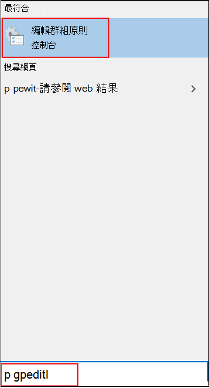

# 在群組原則中啟用和設定 Microsoft Defender 防病毒的 always on 防護

[!INCLUDE [Microsoft 365 Defender rebranding](../../includes/microsoft-defender.md)]

**適用於：**

- [適用於端點的 Microsoft Defender](/microsoft-365/security/defender-endpoint/)

Always on 防護包含即時保護、行為監控和試探法，以根據已知的可疑和惡意活動來識別惡意程式碼。

這些活動包括事件（例如，對現有檔案進行非正常變更的處理常式）、修改或建立自動啟動登錄機碼和啟動位置 (也稱為自動啟動擴充點，或 ASEPs) ，以及其他對檔案系統或檔結構所做的變更。

## 啟用並設定群組原則中的 always on 保護

您可以使用 **本機組策略編輯器** ，啟用並設定 Microsoft Defender 防病毒永遠開啟防護設定。

啟用和設定 always on 保護：

1. 開啟 [ **本機群組原則編輯器**]。 若要執行這項作業：  

    1. 在您的 Windows 10 工作列搜尋方塊中，輸入 **gpedit.msc**。
    
    1. 在 [ **最佳相符**] 底下，按一下 [ **編輯群組原則** ] 以啟動 **本機組策略編輯器**。
    
       

2. 在 [**本機群組原則編輯器**] 的左窗格中，展開 [**電腦** 設定] 系統管理範本的樹狀目錄，以進行  >    >    >  **Microsoft Defender 防毒軟體**。 

3. 設定 Microsoft Defender 防毒程式的反惡意程式碼服務原則設定。 若要執行這項作業：  

    1. 在右側的 [ **Microsoft Defender 防病毒** 程式詳細資料] 窗格中，按兩下下清單格中所指定的原則設定：

       | 設定 | 描述 | 預設設定 |
       |-----------------------------|------------------------|-------------------------------|
       | 允許反惡意程式碼服務以一般優先順序啟動 | 您可以降低 Microsoft Defender 防病毒引擎的優先順序，這在您想要讓啟動程式盡可能精益的輕型部署中非常有用。 這可能會影響端點的保護。 | Enabled
       | 允許反惡意程式碼服務持續保持執行狀態 | 如果已停用保護更新，您可以設定 Microsoft Defender 防毒軟體仍可執行。 這會降低對端點的保護。 | 已停用 |
    
    1. 設定適當的設定，然後按一下 **[確定]**。
    
    1. 針對表格中的每個設定，重複上述步驟。

4. 設定 Microsoft Defender 防病毒即時保護原則設定。 若要執行這項作業：

    1. 在 [ **Microsoft Defender 防病毒** 程式詳細資料] 窗格中，按兩下 [ **即時保護**]。 或者，在左窗格上的 **Microsoft Defender 防病毒** 樹狀目錄中，按一下 [ **即時保護**]。
    
    1. 在 [ **即時保護** 詳細資料] 窗格的 [許可權] 中，按兩下下表所指定的原則設定：  

       | 設定 | 描述 | 預設設定 |
       |-----------------------------|------------------------|-------------------------------|
       | 開啟行為監控 | AV 引擎會監視檔案處理常式、檔案和登錄變更，以及終結點上的其他事件，以取得可疑和已知的惡意活動。 | Enabled |
       | 掃描所有已下載的檔案和附件 | 會自動掃描下載的檔案和附件。 這除了 Windows Defender SmartScreen 篩選器以外，還會在下載之前和下載期間掃描檔案。 | Enabled |
       | 監視電腦上的檔案和程式活動 | Microsoft Defender 防病毒引擎會記下所做的任何檔案變更，以 (檔案寫入作業，例如移動、複製或修改) 以及已開啟或執行的一般程式活動 (程式，而且會導致其他程式執行) 。 | Enabled |
       | 開啟原始大量寫入通知 | 有關原始磁片區寫入的資訊會透過行為監控進行分析。 | Enabled |
       | 在啟用即時保護時開啟處理常式掃描 | 您可以個別啟用 Microsoft Defender 防病毒引擎，以掃描正在執行的程式，以進行可疑的修改或行為。 如果您暫時停用即時保護，且想要自動掃描已停用的處理常式，這會很有用。 | Enabled |
       | 定義要掃描的下載檔案和附件大小上限 | 您可以定義大小（以 kb 為單位）。 | Enabled |
       | 設定本機設定超越開啟行為監控 | 設定本機覆寫以設定行為監控的設定。 此設定只可由「群組原則」設定。 如果您啟用此設定，則本機偏好設定會優先于「群組原則」。 如果您停用或未設定此設定，群組原則將優先于本機偏好設定。| Enabled |
       | 設定本機設定覆寫以掃描所有已下載的檔案和附件 | 設定本機覆寫以設定掃描所有已下載檔案和附件的設定。 此設定只可由「群組原則」設定。 如果您啟用此設定，則本機偏好設定會優先于「群組原則」。 如果您停用或未設定此設定，群組原則將優先于本機偏好設定。| Enabled |
       | 設定本機設定覆寫以監控電腦上的檔案和程式活動 | 設定本機覆寫，以監視電腦上的檔案和程式活動。 此設定只可由「群組原則」設定。 如果您啟用此設定，則本機偏好設定會優先于「群組原則」。 如果您停用或未設定此設定，群組原則將優先于本機偏好設定。| Enabled |
       | 設定本機設定覆寫以開啟即時保護 | 設定本機覆寫設定，以開啟即時保護。 此設定只可由「群組原則」設定。 如果您啟用此設定，則本機偏好設定會優先于「群組原則」。 如果您停用或未設定此設定，群組原則將優先于本機偏好設定。| Enabled |
       | 設定針對內送和外寄檔案活動進行監視的本機設定覆寫 | 設定本機覆寫，以監視傳入和傳出檔案活動的監視。 此設定只可由「群組原則」設定。 如果您啟用此設定，則本機偏好設定會優先于「群組原則」。 如果您停用或未設定此設定，群組原則將優先于本機偏好設定。 | Enabled |
       | 設定對內送和外寄檔案和程式活動的監控 | 指定監視是否應該發生在內送、撥出、兩者或兩者的方向。 這適用于您已定義特定伺服器或伺服器角色的 Windows Server 安裝，只會在一個方向上看到大量的檔案變更，且您想要提升網路效能。 完全更新的端點 (和伺服器) 在網路上，不論檔變更的數目或方向，都只會對效能造成影響。 | 已啟用兩個方向 ()  |

    1. 設定適當的設定，然後按一下 **[確定]**。
    
    1. 針對表格中的每個設定，重複上述步驟。

5. 設定 [Microsoft Defender 防病毒掃描原則] 設定。 若要執行這項作業：  

    1. 在左窗格的 [ **Microsoft Defender 防病毒** 樹狀目錄] 中，按一下 [ **掃描**]。
    
       

    1. 在右側的 [ **掃描** 詳細資料] 窗格中，按兩下下清單格所指定的原則設定：

       | 設定 | 描述 | 預設設定 |
       |-----------------------------|------------------------|-------------------------------|    
       | 開啟試探法 | 啟發式防護會在 Microsoft Defender 防病毒引擎要求偵測活動之前停用或封鎖可疑活動。 | Enabled |

    1. 設定適當的設定，然後按一下 **[確定]**。
    
6. 關閉 [ **本機群組原則編輯器**]。

## 停用群組原則中的即時保護

> [!WARNING]
> 停用即時保護可大幅減少對端點的保護，所以不建議您這樣做。

預設會啟用主要即時保護功能，但您可以使用 [ **本機組策略編輯器**] 加以停用。

若要停用群組原則中的即時保護：

1. 開啟 [ **本機群組原則編輯器**]。

   1. 在您的 Windows 10 工作列搜尋方塊中，輸入 **gpedit.msc**。
   
   1. 在 [ **最佳相符**] 底下，按一下 [ **編輯群組原則** ] 以啟動 **本機組策略編輯器**。

2.  在 [**本機群組原則編輯器**] 的左窗格中，展開 [**電腦** 設定] 系統管理範本的樹狀目錄，以進行  >    >    >  **Microsoft Defender 防病毒**  >  **即時保護**。

3. 在 [ **即時保護** 詳細資料] 窗格的 [許可權] 中，按兩下 [ **關閉即時保護**]。

   

4. 在 [ **關閉即時保護** 設定] 視窗中，將選項設定為 [ **啟用**]。

   
   
5. 按一下 [確定]。

6. 關閉 [ **本機群組原則編輯器**]。

## 相關文章

- [設定行為、啟發式和即時保護](configure-protection-features-microsoft-defender-antivirus.md)
- [Windows 10 中的 Microsoft Defender 防病毒](microsoft-defender-antivirus-in-windows-10.md)