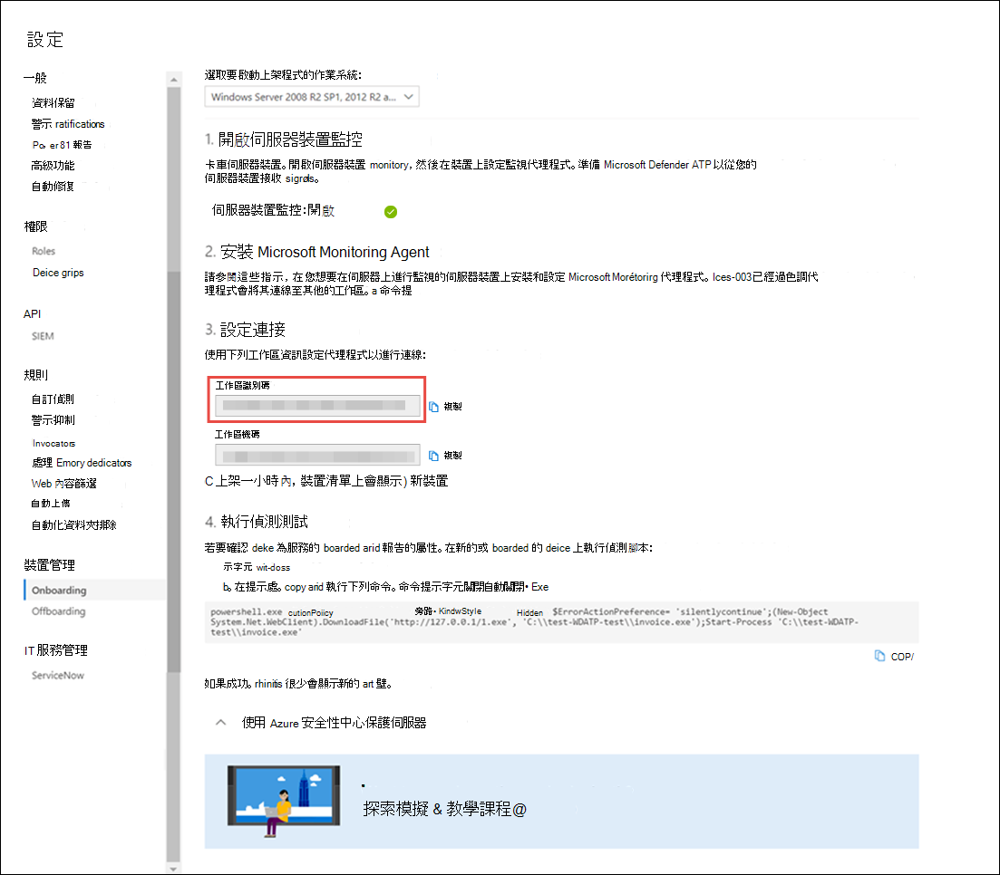

# <a name="onboard-windows-servers-to-the-microsoft-defender-for-endpoint-service"></a>Microsoft Defender for Endpoint service 的板載 Windows 伺服器

[!INCLUDE [Microsoft 365 Defender rebranding](../../includes/microsoft-defender.md)]


**適用於：**

- Windows Server 2008 R2 SP1
- Windows Server 2012 R2
- Windows Server 2016
- Windows Server (SAC) 版本1803和更新版本
- Windows Server 2019 和更新版本
- Windows Server 2019 core edition

> 想要體驗 Defender for Endpoint？ [註冊免費試用版。](https://www.microsoft.com/microsoft-365/windows/microsoft-defender-atp?ocid=docs-wdatp-configserver-abovefoldlink)


用於端點的 Defender 擴充支援也包含 Windows Server 作業系統。 這種支援透過 Microsoft Defender Security Center 主控台無縫提供高級攻擊偵測和調查功能。

如需有關授權和基礎結構需要採取的實際事項，請參閱 [使用 Defender For Endpoint 保護 Windows server](https://techcommunity.microsoft.com/t5/What-s-New/Protecting-Windows-Server-with-Windows-Defender-ATP/m-p/267114#M128)。

如需如何下載及使用 Windows server 之 Windows 安全性基準的指導方針，請參閱 [Windows 安全性基準](https://docs.microsoft.com/windows/device-security/windows-security-baselines)。

<br>

## <a name="windows-server-2008-r2-sp1-windows-server-2012-r2-and-windows-server-2016"></a>Windows Server 2008 R2 SP1、Windows Server 2012 R2 和 Windows Server 2016

您可以使用下列任一選項，將 Windows Server 2008 R2 SP1、Windows Server 2012 R2 和 Windows Server 2016 上架到 Defender for Endpoint：

- **選項 1**：透過 [安裝及設定 Microsoft MONITORING Agent (MMA) 上的板載](#option-1-onboard-by-installing-and-configuring-microsoft-monitoring-agent-mma)
- **選項 2**： [透過 Azure Security Center 的板載](#option-2-onboard-windows-servers-through-azure-security-center)
- **選項 3**： [透過 Microsoft 端點管理員版本2002和更新版本的板載版本](#option-3-onboard-windows-servers-through-microsoft-endpoint-manager-version-2002-and-later)


使用任何提供的選項完成上架步驟之後，您將需要 [設定並更新 System Center Endpoint Protection 用戶端](#configure-and-update-system-center-endpoint-protection-clients)。


> [!NOTE]
> 需要使用 Defender for Endpoint 獨立伺服器授權（每個節點），以便透過 Microsoft Monitoring Agent (選項 1) 或透過 Microsoft 端點管理員 (選項 3) 將 Windows server 上架。 或者，每個節點需要 Azure Defender for Server 授權，以便透過 Azure Security Center 板載 Windows server (選項 2) ，請參閱 [Azure Security center 中提供的支援功能](https://docs.microsoft.com/azure/security-center/security-center-services)。


### <a name="option-1-onboard-by-installing-and-configuring-microsoft-monitoring-agent-mma"></a>選項1：透過安裝及設定 Microsoft Monitoring Agent (MMA) 上的板載
您將需要安裝及設定 MMA for Windows server，才能將感應器資料包告為端點的 Defender。 如需詳細資訊，請參閱 [使用 Azure Log Analytics Agent 收集記錄資料](https://docs.microsoft.com/azure/azure-monitor/platform/log-analytics-agent)。

如果您已在使用 System Center Operations Manager (SCOM) 或 Azure 監視器 (之前稱為 Operations Management Suite (OMS) ) ，請將 Microsoft Monitoring Agent (MMA) ，以透過各核心支援報告您的 Defender for Endpoint workspace。

一般來講，您必須採取下列步驟：
1. **會滿足開始之前** 區段中所述的上架需求。
2. 從 Microsoft Defender Security center 開啟伺服器監視。
3. 針對伺服器安裝和設定 MMA，將感應器資料包告給 Defender for Endpoint。
4. 設定及更新 System Center Endpoint Protection 用戶端。


> [!TIP]
> 在裝置上架後，您可以選擇執行偵測測試，以確認它已正確架至服務。 如需詳細資訊，請參閱 [在新的架 Defender For endpoint 端點上執行偵測測試](run-detection-test.md)。


#### <a name="before-you-begin"></a>開始之前 
請執行下列步驟來滿足上架需求：

 - 若為 Windows Server 2008 R2 SP1 或 Windows Server 2012 R2，請確定您已安裝下列修復程式：
    - [客戶體驗和診斷遙測的更新](https://support.microsoft.com/help/3080149/update-for-customer-experience-and-diagnostic-telemetry)

 - 此外，針對 Windows Server 2008 R2 SP1，請確定您符合下列需求：
    - 安裝 [二月份每月更新彙總套件](https://support.microsoft.com/help/4074598/windows-7-update-kb4074598)
    - 安裝 [.net framework 4.5](https://www.microsoft.com/download/details.aspx?id=30653) (或更新版本) 或 [KB3154518](https://support.microsoft.com/help/3154518/support-for-tls-system-default-versions-included-in-the-net-framework)

 - 若為 Windows Server 2008 R2 SP1 和 Windows Server 2012 R2： [設定及更新 System Center Endpoint Protection 用戶端](#configure-and-update-system-center-endpoint-protection-clients)。

    > [!NOTE]
    > 只有當您的組織使用 System Center Endpoint Protection (SCEP) ，且您要上架 Windows Server 2008 R2 SP1 和 Windows Server 2012 R2 時，才需要此步驟。


<span id="server-mma"/>

### <a name="install-and-configure-microsoft-monitoring-agent-mma-to-report-sensor-data-to-microsoft-defender-for-endpoint"></a>安裝和設定 Microsoft Monitoring Agent (MMA) ，將感應器資料包告至 Microsoft Defender for Endpoint

1. 下載代理程式安裝程式檔案： [Windows 64 位代理](https://go.microsoft.com/fwlink/?LinkId=828603)程式。

2. 使用上一個程式中取得的工作區識別碼和工作區機碼，選擇下列任何安裝方法，在 Windows server 上安裝該代理程式：
    - [使用安裝程式手動安裝代理程式](https://docs.microsoft.com/azure/log-analytics/log-analytics-windows-agents#install-agent-using-setup-wizard)。 <br>
    在 [ **代理程式安裝選項** ] 頁面上，選擇 **[將代理程式連接至 Azure 記錄分析 (OMS])**。
    - [使用命令列安裝代理程式](https://docs.microsoft.com/azure/log-analytics/log-analytics-windows-agents#install-agent-using-command-line)。
    - [使用腳本設定代理程式](https://docs.microsoft.com/azure/log-analytics/log-analytics-windows-agents#install-agent-using-dsc-in-azure-automation)。

> [!NOTE]
> 如果您是 [美國政府客戶](gov.md)，請在「azure 雲端」下，如果使用設定向導，或是使用命令列或腳本-將 "OPINSIGHTS_WORKSPACE_AZURE_CLOUD_TYPE" 參數設定為1，則必須選擇「Azure US 政府」。


<span id="server-proxy"/>

### <a name="configure-windows-server-proxy-and-internet-connectivity-settings-if-needed"></a>視需要設定 Windows server proxy 和網際網路連線設定
如果您的伺服器需要使用 proxy 與 Defender for Endpoint 通訊，請使用下列其中一種方法來設定 MMA 以使用 proxy 伺服器：


- [設定 MMA 以使用 proxy 伺服器](https://docs.microsoft.com/azure/azure-monitor/platform/agent-windows#install-agent-using-setup-wizard)

- [設定 Windows 以針對所有連線使用 proxy 伺服器](configure-proxy-internet.md)

如果使用 proxy 或防火牆，請確定伺服器可以直接存取所有的 Microsoft Defender for Endpoint service URLs，而不需要 SSL 截取。 如需詳細資訊，請參閱 [enable access To Defender For Endpoint service URLs](configure-proxy-internet.md#enable-access-to-microsoft-defender-for-endpoint-service-urls-in-the-proxy-server)。 使用 SSL 截取可防止系統與 Defender for Endpoint service 進行通訊。 

完成後，您應該會在一小時內看到入口網站中的架 Windows server。

### <a name="option-2-onboard-windows-servers-through-azure-security-center"></a>選項2：透過 Azure Security Center 的板載 Windows 伺服器
1. 在 Microsoft Defender 安全性中心導覽窗格中，選取 [**設定**  >  **裝置管理** 上  >  **架**]。

2. 選取 [ **Windows Server 2008 R2 SP1，2012 R2 and 2016** 做為作業系統。

3. 按一下 **Azure Security Center 中的 [上架伺服器**]。

4. 遵循 [Microsoft Defender for With Azure Security Center 的端點](https://docs.microsoft.com/azure/security-center/security-center-wdatp)中的上架指示。

完成上架步驟之後，您將需要 [設定及更新 System Center Endpoint Protection 用戶端](#configure-and-update-system-center-endpoint-protection-clients)。

> [!NOTE]
> - 若要透過 Azure server Defender 針對伺服器進行上架 (先前的 Azure 安全性中心 Standard Edition) 如預期般運作，伺服器必須在 Microsoft Monitoring Agent 內設定適當的工作區和機碼， (MMA) 設定。
> - 設定後，系統會在機器上部署適當的雲端管理元件，而且會部署及開始 (MsSenseS.exe) 的感應器處理常式。 
> - 如果伺服器設定為使用 OMS 閘道伺服器做為 proxy，也是必要的。

### <a name="option-3-onboard-windows-servers-through-microsoft-endpoint-manager-version-2002-and-later"></a>選項3：透過 Microsoft 端點管理員版本2002和更新版本的板載 Windows 伺服器
您可以使用 Microsoft 端點管理員版本2002和更新版本，將 Windows Server 2012 R2 和 Windows Server 2016 上架在一起。 如需詳細資訊，請參閱 [在 Microsoft 端點管理員的 [目前分支] 中的 Microsoft Defender For Endpoint](https://docs.microsoft.com/mem/configmgr/protect/deploy-use/defender-advanced-threat-protection)。

完成上架步驟之後，您將需要 [設定及更新 System Center Endpoint Protection 用戶端](#configure-and-update-system-center-endpoint-protection-clients)。

<br>

## <a name="windows-server-sac-version-1803-windows-server-2019-and-windows-server-2019-core-edition"></a>Windows Server (SAC) 版本1803、Windows Server 2019 及 Windows Server 2019 Core edition
您可以使用下列部署方法，將 Windows Server (SAC) 版本1803、Windows Server 2019 或 Windows Server 2019 Core edition 上架：

- [本機腳本](configure-endpoints-script.md) 
- [群組原則](configure-endpoints-gp.md)
- [Microsoft Endpoint Configuration Manager](configure-endpoints-sccm.md)
- [System Center Configuration Manager 2012/2012 R2 1511/1602](configure-endpoints-sccm.md#onboard-devices-using-system-center-configuration-manager)
- [非持久性裝置的 VDI 上架腳本](configure-endpoints-vdi.md)

> [!NOTE]
> - 透過 Microsoft 端點管理員的 Windows Server 2019 的上架套件目前附帶腳本。 如需如何在 Configuration Manager 中部署腳本的詳細資訊，請參閱 [Configuration manager 中的套件與程式](https://docs.microsoft.com/configmgr/apps/deploy-use/packages-and-programs)。
> - 本機腳本適用于概念證明，但不適用於實際執行部署。 在實際執行部署中，我們建議使用群組原則或 Microsoft 端點 Configuration Manager。

支援 Windows Server 可深入瞭解伺服器活動、內核和記憶體攻擊偵測的覆蓋率，並啟用回應動作。

1. 使用 Windows 10 裝置的相同工具和方法，在 Windows server 上為端點上架上架設定設定 Defender。 如需詳細資訊，請參閱 [板載 Windows 10 裝置](configure-endpoints.md)。

2. 如果您正在執行協力廠商反惡意軟體解決方案，則必須套用下列 Microsoft Defender AV 被動模式設定。 確認已正確設定：

    1. 設定下列登錄專案：
       - 路徑： `HKLM\SOFTWARE\Policies\Microsoft\Windows Advanced Threat Protection`
       - 名稱： ForceDefenderPassiveMode
       - 類型： REG_DWORD
       - Value: 1

    1. 執行下列 PowerShell 命令，以確認已設定被動式模式：

       ```PowerShell
       Get-WinEvent -FilterHashtable @{ProviderName="Microsoft-Windows-Sense" ;ID=84}
       ```

    1. 確認找到一個包含被動模式事件的最近事件：

       

3. 執行下列命令以檢查是否已安裝 Microsoft Defender AV：

   ```sc.exe query Windefend```

    如果結果是「指定的服務不是已安裝的服務」，您將需要安裝 Microsoft Defender AV。 如需詳細資訊，請參閱 [Windows 10 中的 Microsoft Defender 防毒軟體](https://docs.microsoft.com/windows/security/threat-protection/microsoft-defender-antivirus/microsoft-defender-antivirus-in-windows-10)。
    
    如需如何使用群組原則在 Windows 伺服器上設定及管理 Microsoft Defender 防病毒的詳細資訊，請參閱 [使用群組原則設定來設定及管理 Microsoft Defender 防病毒](https://docs.microsoft.com/windows/security/threat-protection/microsoft-defender-antivirus/use-group-policy-microsoft-defender-antivirus)。

<br>

## <a name="integration-with-azure-security-center"></a>與 Azure 安全性中心整合
適用于 Azure 的 Defender 可以與 Azure Security Center 整合，以提供全面的 Windows server 保護解決方案。 透過這項整合，Azure Security Center 可使用端點的 Defender 的功能，為 Windows Server 提供增強的威脅偵測。

此整合中包含下列功能：
- 自動上架-當架至 Azure Security Center 的 Windows Server 上，會自動啟用端點感應器的 Defender。 如需 Azure 安全性中心上架的詳細資訊，請參閱 [板載 To Azure Security Center Standard for security 的增強](https://docs.microsoft.com/azure/security-center/security-center-onboarding)功能。

    > [!NOTE]
    > 自動上架只適用于 Windows Server 2008 R2 SP1、Windows Server 2012 R2 和 Windows Server 2016。

- Azure Security center 監控的 Windows 伺服器也會在 Endpoint Azure Security Center 中提供，以無縫地連接至使用者和伺服器的 Defender。  此外，Azure Security Center 主控台也可使用 Defender for Endpoint 警示。
- 伺服器調查-Azure Security Center 客戶可以存取 Microsoft Defender Security Center，以執行詳細的調查，以找出可能遭到破壞的範圍。

> [!IMPORTANT]
> - 當您使用 Azure Security Center 監控伺服器時，會自動為「美國使用者」（位於歐洲和英國使用者）) 中為美國使用者建立 (的 Endpoint 租使用者的 Defender。<br>
Defender for Endpoint 收集的資料會儲存在提供期間所識別的承租人地理位置。
> - 如果您在使用 Azure Security Center 之前使用 Defender for Endpoint，您的資料會儲存在您建立租使用者時所指定的位置，即使您在稍後與 Azure Security Center 整合也是一樣。
> - 設定後，您就無法變更儲存資料的位置。 如果您需要將資料移至其他位置，您必須聯繫 Microsoft 支援部門以重設租使用者。 <br>
已停用 Office 365 GCC 客戶使用此整合的伺服器端點監控功能。

<br>

## <a name="configure-and-update-system-center-endpoint-protection-clients"></a>設定及更新 System Center Endpoint Protection 用戶端

與 System Center Endpoint Protection 整合的端點的 Defender。 整合可透過 banning 潛在的惡意檔案或可疑惡意程式碼，以查看惡意程式碼偵測，以及停止傳播攻擊。

若要啟用此整合，必須執行下列步驟：
- [針對 Endpoint Protection 用戶端安裝2017年1月的反惡意程式碼平臺更新](https://support.microsoft.com/help/3209361/january-2017-anti-malware-platform-update-for-endpoint-protection-clie)。

- [將 SCEP 用戶端 Cloud Protection Service 成員資格](https://docs.microsoft.com/windows/security/threat-protection/microsoft-defender-antivirus/enable-cloud-protection-microsoft-defender-antivirus) 設定為 [ **高級** ] 設定。

<br>

## <a name="offboard-windows-servers"></a>Windows server 下架
您可以使用 Windows 10 用戶端裝置的相同方法，下架 Windows Server (SAC) 、Windows Server 2019 及 Windows Server 2019 Core edition。

若為其他 Windows server 版本，您有兩個選項可讓您從服務下架 Windows server：
- 卸載 MMA 代理程式
- 移除用於端點工作區設定的 Defender

> [!NOTE]
> 脫離會導致 Windows server 停止將感應器資料傳送至入口網站，但是來自 Windows 伺服器的資料（包括對其所做的任何警示參考）將保留最多6個月。

### <a name="uninstall-windows-servers-by-uninstalling-the-mma-agent"></a>卸載 MMA 代理程式以卸載 Windows server
若要下架 Windows server，您可以從 Windows server 卸載 MMA agent，或將其從報告中拔出至您的 Defender for Endpoint workspace。 脫離代理程式後，Windows server 將不再將感應器資料傳送至端點的 Defender。
如需詳細資訊，請參閱 [停用代理程式](https://docs.microsoft.com/azure/log-analytics/log-analytics-windows-agents#to-disable-an-agent)。

### <a name="remove-the-defender-for-endpoint-workspace-configuration"></a>移除用於端點工作區設定的 Defender
若要下架 Windows server，您可以使用下列其中一種方法：

- 從 MMA 代理程式中移除 Defender for Endpoint workspace 設定
- 執行 PowerShell 命令以移除設定

#### <a name="remove-the-defender-for-endpoint-workspace-configuration-from-the-mma-agent"></a>從 MMA 代理程式中移除 Defender for Endpoint workspace 設定

1. 在 [ **Microsoft Monitoring Agent 屬性**] 中，選取 [ **Azure 記錄分析 (OMS)** ] 索引標籤。

2. 選取 [Defender for Endpoint workspace]，然後按一下 [ **移除**]。

    

#### <a name="run-a-powershell-command-to-remove-the-configuration"></a>執行 PowerShell 命令以移除設定

1. 取得您的工作區 ID:

   1. 在功能窗格中，選取 [**設定**] [上  >  **架**]。

   1. 選取 [ **Windows Server 2008 R2 SP1，2012 R2 and 2016** 做為作業系統並取得您的工作區 ID:

      

2. 開啟提升許可權的 PowerShell，並執行下列命令。 使用您取得及取代的工作區識別碼 `WorkspaceID` ：

    ```powershell
    $ErrorActionPreference = "SilentlyContinue"
    # Load agent scripting object
    $AgentCfg = New-Object -ComObject AgentConfigManager.MgmtSvcCfg
    # Remove OMS Workspace
    $AgentCfg.RemoveCloudWorkspace("WorkspaceID")
    # Reload the configuration and apply changes
    $AgentCfg.ReloadConfiguration()

    ```

<br>

## <a name="related-topics"></a>相關主題
- [板載 Windows 10 裝置](configure-endpoints.md)
- [板載非 Windows 裝置](configure-endpoints-non-windows.md)
- [設定 proxy 和網際網路連線設定](configure-proxy-internet.md)
- [在新的架 Defender for Endpoint 裝置上執行偵測測試](run-detection-test.md)
- [疑難排解 Microsoft Defender 的端點上架問題](troubleshoot-onboarding.md)
