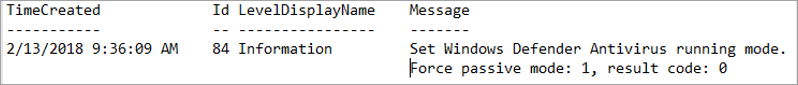

# <a name="onboard-windows-servers-to-the-microsoft-defender-for-endpoint-service"></a>適用于 Microsoft Defender for Endpoint service 的板載 Windows 伺服器

[!INCLUDE [Microsoft 365 Defender rebranding](../../includes/microsoft-defender.md)]

**適用於：**

- Windows Server 2008 R2 SP1
- Windows Server 2012 R2
- Windows Server 2016
- WindowsServer (SAC) 版本1803和更新版本
- Windows伺服器2019和更新版本
- Windows伺服器2019核心版

> 想要體驗 Defender for Endpoint？ [注册免費試用版。](https://www.microsoft.com/microsoft-365/windows/microsoft-defender-atp?ocid=docs-wdatp-configserver-abovefoldlink)

用於端點的 Defender 擴充支援，也包括 Windows Server 作業系統。 這種支援透過「Microsoft 365 Defender 主控台」順利提供高級攻擊偵測和調查功能。

如需有關授權和基礎結構需要的實際內容，請參閱[使用 Defender for Endpoint 保護 Windows server](https://techcommunity.microsoft.com/t5/What-s-New/Protecting-Windows-Server-with-Windows-Defender-ATP/m-p/267114#M128)。

如需如何下載及使用 Windows 伺服器的 Windows 安全性基線的指導方針，請參閱[Windows 安全性基準](/windows/device-security/windows-security-baselines)。

## <a name="windows-server-2008-r2-sp1-windows-server-2012-r2-and-windows-server-2016"></a>Windows伺服器 2008 r2 SP1、Windows Server 2012 R2 及 Windows Server 2016

您可以使用下列任一選項，將 Windows Server 2008 R2 SP1、Windows Server 2012 R2 及 Windows Server 2016 的使用者介面上架至 Defender for Endpoint：

- **選項 1**：透過 [安裝及設定 Microsoft Monitoring Agent (MMA) 的板載](#option-1-onboard-by-installing-and-configuring-microsoft-monitoring-agent-mma)
- **選項 2**： [透過 Azure Security Center 的板載](#option-2-onboard-windows-servers-through-azure-security-center)
- **選項 3**：[板載到 Microsoft 端點管理員版本2002和更新版本](#option-3-onboard-windows-servers-through-microsoft-endpoint-manager-version-2002-and-later)

使用任何提供的選項完成上架步驟之後，您將需要[設定和更新 System Center Endpoint Protection 用戶端](#configure-and-update-system-center-endpoint-protection-clients)。

> [!NOTE]
> 需要使用 Defender for Endpoint 獨立伺服器授權（每個節點），以便透過 Microsoft Monitoring Agent (選項 1) 或透過 Microsoft 端點管理員 (選項 3) ，將 Windows 伺服器板載。 或者，每個節點需要 azure Defender for server 授權，以便透過 azure Security Center 在 Windows server 上架 (選項 2) ，請參閱[Azure Defender 中提供的支援功能](/azure/security-center/security-center-services)。

### <a name="option-1-onboard-by-installing-and-configuring-microsoft-monitoring-agent-mma"></a>選項1：透過安裝及設定 Microsoft Monitoring Agent (MMA) 的板載

您必須安裝並設定 Windows 伺服器的 MMA，才能將感應器資料包告給 Defender for Endpoint。 如需詳細資訊，請參閱 [使用 Azure Log Analytics Agent 收集記錄資料](/azure/azure-monitor/platform/log-analytics-agent)。

如果您已使用 System Center Operations Manager (SCOM) 或 Azure 監視器 (之前稱為 Operations Management Suite (OMS) ) ，請附加 Microsoft Monitoring Agent (MMA) ，將其報告至您的 Defender for Endpoint workspace （透過整個執行的支援）。

一般來講，您必須採取下列步驟：

1. **會滿足開始之前** 區段中所述的上架需求。
2. 從 Microsoft 365 Defender 入口網站開啟伺服器監視。
3. 針對伺服器安裝和設定 MMA，將感應器資料包告給 Defender for Endpoint。
4. 設定和更新 System Center Endpoint Protection 用戶端。

> [!TIP]
> 在裝置上架後，您可以選擇執行偵測測試，以確認它已正確架至服務。 如需詳細資訊，請參閱 [在新的架 Defender For endpoint 端點上執行偵測測試](run-detection-test.md)。

#### <a name="before-you-begin"></a>事前準備

請執行下列步驟來滿足上架需求：

針對 Windows Server 2008 R2 SP1 或 Windows Server 2012 R2，請確定您已安裝下列修復程式：

- [客戶體驗和診斷遙測的更新](https://support.microsoft.com/help/3080149/update-for-customer-experience-and-diagnostic-telemetry)

針對 Windows Server 2008 R2 SP1，請確定您符合下列需求：

- 安裝 [二月份每月更新彙總套件](https://support.microsoft.com/help/4074598/windows-7-update-kb4074598)
- 安裝 [.net framework 4.5](https://www.microsoft.com/download/details.aspx?id=30653) (或更新版本) 或 [KB3154518](https://support.microsoft.com/help/3154518/support-for-tls-system-default-versions-included-in-the-net-framework)

    > [!NOTE]
    > 如果您使用 sccm 管理 Windows Server 2008 R2 SP1，則 SCCM 用戶端代理程式會安裝 .net Framework 4.5.2。 因此，您不需要安裝 .NET framework 4.5 (或更新版本) 。

針對 Windows Server 2008 R2 SP1 和 Windows Server 2012 R2：[設定和更新 System Center Endpoint Protection 用戶端](#configure-and-update-system-center-endpoint-protection-clients)。

> [!NOTE]
> 只有當您的組織使用 System Center Endpoint Protection (SCEP) ，而且您是上架 Windows Server 2008 R2 SP1 和 Windows Server 2012 R2 時，才需要此步驟。

### <a name="install-and-configure-microsoft-monitoring-agent-mma-to-report-sensor-data-to-microsoft-defender-for-endpoint"></a>安裝和設定 Microsoft Monitoring Agent (MMA) ，向 Microsoft Defender for Endpoint 報告感應器資料

1. 下載代理程式安裝檔： [Windows 64 位代理](https://go.microsoft.com/fwlink/?LinkId=828603)程式。

2. 使用先前程式中取得的工作區識別碼和工作區機碼，選擇下列任何安裝方法，在 Windows 伺服器上安裝代理程式：
    - [使用安裝程式手動安裝代理程式](/azure/log-analytics/log-analytics-windows-agents#install-agent-using-setup-wizard)。 
    在 [**代理程式安裝選項**] 頁面上，選擇 [將 **代理程式連線至 Azure 記錄分析 (OMS)**]。
    - [使用命令列安裝代理程式](/azure/log-analytics/log-analytics-windows-agents#install-agent-using-command-line)。
    - [使用腳本設定代理程式](/azure/log-analytics/log-analytics-windows-agents#install-agent-using-dsc-in-azure-automation)。

> [!NOTE]
> 如果您是 [美國政府客戶](gov.md)，請在「azure 雲端」下，如果使用設定向導，或是使用命令列或腳本-將 "OPINSIGHTS_WORKSPACE_AZURE_CLOUD_TYPE" 參數設定為1，則必須選擇「Azure US 政府」。

### <a name="configure-windows-server-proxy-and-internet-connectivity-settings-if-needed"></a>設定 Windows 伺服器 proxy 和網際網路連線設定（如有需要）

如果您的伺服器需要使用 proxy 與 Defender for Endpoint 通訊，請使用下列其中一種方法來設定 MMA 以使用 proxy 伺服器：

- [設定 MMA 以使用 proxy 伺服器](/azure/azure-monitor/platform/agent-windows#install-agent-using-setup-wizard)

- [設定 Windows 對所有連線使用 proxy 伺服器](configure-proxy-internet.md)

如果使用 proxy 或防火牆，請確定伺服器可以直接存取所有的 Microsoft Defender for Endpoint service URLs，而不需要 SSL 截取。 如需詳細資訊，請參閱 [enable access To Defender For Endpoint service URLs](configure-proxy-internet.md#enable-access-to-microsoft-defender-for-endpoint-service-urls-in-the-proxy-server)。 使用 SSL 截取可防止系統與 Defender for Endpoint service 進行通訊。

完成後，您應該會在入口網站中看到架 Windows 伺服器一小時內。

### <a name="option-2-onboard-windows-servers-through-azure-security-center"></a>選項2：透過 Azure Security Center 的板載 Windows 伺服器

1. 在 [Microsoft 365 Defender] 導覽窗格中，選取 [**設定**  >  **端點**  >  **裝置管理** 上  >  **架**]。

2. 選取 [ **Windows Server 2008 R2 SP1，2012 R2 和 2016** 當作作業系統。

3. 按一下 **Azure Security Center 中的 [上架伺服器**]。

4. 遵循 [適用于 Azure defender 的端點的 Microsoft defender](/azure/security-center/security-center-wdatp) 中的上架指示，如果您使用 azure ARC，請依照 [啟用 Microsoft defender for endpoint integration](/azure/security-center/security-center-wdatp#enabling-the-microsoft-defender-for-endpoint-integration)中的上架指示進行。

完成上架步驟之後，您必須[設定和更新 System Center Endpoint Protection 用戶端](#configure-and-update-system-center-endpoint-protection-clients)。

> [!NOTE]
>
> - 若要透過 Azure server Defender 的伺服器上架以取得預期的運作方式，伺服器必須在 Microsoft Monitoring Agent (MMA) 設定內設定適當的工作區和機碼。
> - 設定後，系統會在機器上部署適當的雲端管理元件，而且會部署及開始 (MsSenseS.exe) 的感應器處理常式。
> - 如果伺服器設定為使用 OMS 閘道伺服器做為 proxy，也是必要的。

### <a name="option-3-onboard-windows-servers-through-microsoft-endpoint-manager-version-2002-and-later"></a>選項3：透過 Microsoft 端點管理員版本2002和更新版本的板載 Windows 伺服器

您可以使用 Microsoft 端點管理員版本2002和更新版本，將 Windows Server 2012 R2 和 Windows Server 2016 上架在一起。 如需詳細資訊，請參閱[Microsoft 端點管理員 current branch 中的 Microsoft Defender for Endpoint](/mem/configmgr/protect/deploy-use/defender-advanced-threat-protection)。

完成上架步驟之後，您必須[設定和更新 System Center Endpoint Protection 用戶端](#configure-and-update-system-center-endpoint-protection-clients)。

## <a name="windows-server-sac-version-1803-windows-server-2019-and-windows-server-2019-core-edition"></a>Windowsserver (SAC) 版本1803、Windows server 2019 及 Windows Server 2019 Core edition

您可以使用下列部署方法，將 Windows server (SAC) 版本1803、Windows Server 2019 或 Windows Server 2019 Core edition 進行上架：

- [本機腳本](configure-endpoints-script.md)
- [群組原則](configure-endpoints-gp.md)
- [Microsoft Endpoint Configuration Manager](configure-endpoints-sccm.md)
- [System Center Configuration Manager 2012/2012 R2 1511/1602](configure-endpoints-sccm.md#onboard-devices-using-system-center-configuration-manager)
- [非持久性裝置的 VDI 上架腳本](configure-endpoints-vdi.md)

> [!NOTE]
>
> - Windows Server 2019 到 Microsoft 端點管理員的上架套件目前已發行腳本。 如需如何在 Configuration Manager 中部署腳本的詳細資訊，請參閱 [Configuration manager 中的套件與程式](/configmgr/apps/deploy-use/packages-and-programs)。
> - 本機腳本適用于概念證明，但不適用於實際執行部署。 在實際執行部署中，建議使用群組原則或 Microsoft Endpoint Configuration Manager。

對 Windows 伺服器的支援，可提供深入瞭解伺服器活動、內核和記憶體攻擊偵測的覆蓋率，並啟用回應動作。

1. 使用 Windows 10 裝置的相同工具和方法，設定 Windows 伺服器上的 Endpoint 上架上架設定的 Defender。 如需詳細資訊，請參閱[板載 Windows 10 裝置](configure-endpoints.md)。

2. 如果您正在執行協力廠商反惡意程式碼解決方案，則必須套用下列 Microsoft Defender AV 被動模式設定。 確認已正確設定：

    1. 設定下列登錄專案：
       - 路徑： `HKLM\SOFTWARE\Policies\Microsoft\Windows Advanced Threat Protection`
       - 名稱： ForceDefenderPassiveMode
       - 類型： REG_DWORD
       - Value: 1

    1. 執行下列 PowerShell 命令，以確認已設定被動式模式：

       ```PowerShell
       Get-WinEvent -FilterHashtable @{ProviderName="Microsoft-Windows-Sense" ;ID=84}
       ```

    1. 確認找到一個包含被動模式事件的最近事件：

       

3. 執行下列命令以檢查是否已安裝 Microsoft Defender AV：

   ```sc.exe query Windefend```

    如果結果是「指定的服務不是已安裝的服務」，您將需要安裝 Microsoft Defender AV。 如需詳細資訊，請參閱[Windows 10 中的 Microsoft Defender 防毒軟體](/windows/security/threat-protection/microsoft-defender-antivirus/microsoft-defender-antivirus-in-windows-10)。

    如需如何使用群組原則來設定及管理 Windows 伺服器上的 Microsoft Defender 防毒軟體的詳細資訊，請參閱[使用群組原則設定來設定及管理 Microsoft Defender 防毒軟體](/windows/security/threat-protection/microsoft-defender-antivirus/use-group-policy-microsoft-defender-antivirus)。

## <a name="integration-with-azure-defender"></a>與 Azure Defender 整合

Endpoint for Endpoint 可以與 Azure Defender 整合，以提供全面的 Windows server protection 解決方案。 透過這項整合，Azure defender 可使用端點的 Defender 的功能，提供 Windows 伺服器的增強威脅偵測。

此整合中包含下列功能：

- 自動上架-在架至 Azure Defender 的 Windows 伺服器上，會自動啟用端點感應器的 Defender。 如需 Azure Defender 上架的詳細資訊，請參閱 [使用整合的 Microsoft Defender For Endpoint 授權](/azure/security-center/security-center-wdatp)。

    > [!NOTE]
    > Azure Defender for server 和 Microsoft Defender for 端點之間的整合已擴充，可支援[Windows Server 2019 和 Windows Virtual Desktop (WVD) ](/azure/security-center/release-notes#microsoft-defender-for-endpoint-integration-with-azure-defender-now-supports-windows-server-2019-and-windows-10-virtual-desktop-wvd-in-preview)。

- 適用于 azure defender 監控的 Windows 伺服器也會在 defender for endpoint 中提供，azure defender 可在用戶端和伺服器之間，提供單一視圖，使 azure defender 能夠順利連線至 Defender for endpoint 租使用者。  此外，Azure Defender 主控台也可使用 Defender for Endpoint 警示。
- 伺服器調查-Azure Defender 客戶可以存取 Microsoft 365 Defender 入口網站，以執行詳細的調查，以找出可能遭到破壞的範圍。

> [!IMPORTANT]
> - 當您使用 Azure Defender 監控伺服器時，系統會自動為美國使用者建立 (的 Endpoint 租使用者，而歐盟為歐洲和英國使用者) 。<br>
Defender for Endpoint 收集的資料會儲存在提供期間所識別的承租人地理位置。
> - 如果您在使用 Azure Defender 之前使用 Defender for Endpoint，您的資料會儲存在您建立租使用者時所指定的位置，即使您在稍後整合 Azure Defender 時也是如此。
> - 設定後，您就無法變更儲存資料的位置。 如果您需要將資料移至其他位置，您必須聯繫 Microsoft 支援部門以重設租使用者。 <br>
已對 Office 365 GCC 客戶停用利用此整合的伺服器端點監控。

## <a name="configure-and-update-system-center-endpoint-protection-clients"></a>設定及更新 System Center Endpoint Protection 用戶端

Defender for Endpoint 與 System Center Endpoint Protection 整合。 整合可透過 banning 潛在的惡意檔案或可疑惡意程式碼，以查看惡意程式碼偵測，以及停止傳播攻擊。

若要啟用此整合，必須執行下列步驟：

- [為 Endpoint Protection 用戶端安裝2017年1月的反惡意程式碼平臺更新](https://support.microsoft.com/help/3209361/january-2017-anti-malware-platform-update-for-endpoint-protection-clie)。

- [將 SCEP 用戶端 Cloud Protection Service 成員資格](/windows/security/threat-protection/microsoft-defender-antivirus/enable-cloud-protection-microsoft-defender-antivirus) 設定為 [ **高級** ] 設定。

## <a name="offboard-windows-servers"></a>下架 Windows 伺服器

您可以在 Windows 用戶端裝置使用的相同方法中，下架 Windows Server (SAC) 、Windows server 2019 和 Windows 10 Server 2019 Core edition。

若為其他 Windows 伺服器版本，您有兩個選項可從服務下架 Windows 伺服器：

- 卸載 MMA 代理程式
- 移除用於端點工作區設定的 Defender

> [!NOTE]
> 脫離會使 Windows 伺服器停止將感應器資料傳送至入口網站，但是來自 Windows 伺服器的資料（包括已有的任何警示的參考）將保留最多6個月。

### <a name="uninstall-windows-servers-by-uninstalling-the-mma-agent"></a>卸載 MMA 代理程式以卸載 Windows 伺服器

若要下架 Windows 伺服器，您可以從 Windows 伺服器卸載 MMA agent，或是將其從報告中拔出至您的 Defender for Endpoint workspace。 脫離代理程式之後，Windows 伺服器就不再將感應器資料傳送至端點的 Defender。
如需詳細資訊，請參閱 [停用代理程式](/azure/log-analytics/log-analytics-windows-agents#to-disable-an-agent)。

### <a name="remove-the-defender-for-endpoint-workspace-configuration"></a>移除用於端點工作區設定的 Defender

若要下架 Windows 伺服器，您可以使用下列其中一種方法：

- 從 MMA 代理程式中移除 Defender for Endpoint workspace 設定
- 執行 PowerShell 命令以移除設定

#### <a name="remove-the-defender-for-endpoint-workspace-configuration-from-the-mma-agent"></a>從 MMA 代理程式中移除 Defender for Endpoint workspace 設定

1. 在 [ **Microsoft Monitoring Agent 屬性**] 中，選取 [ **Azure 記錄分析 (OMS)** ] 索引標籤。

2. 選取 [Defender for Endpoint workspace]，然後按一下 [ **移除**]。

    

#### <a name="run-a-powershell-command-to-remove-the-configuration"></a>執行 PowerShell 命令以移除設定

1. 取得您的工作區 ID:

   1. 在 [Microsoft 365 Defender] 導覽窗格中，選取 [**設定**  >  **端點**  >  **裝置管理** 上  >  **架**]。

   1. 選取 [ **Windows Server 2008 R2 SP1，2012 R2 and 2016** 當作作業系統並取得您的工作區 ID:

      

2. 開啟提升許可權的 PowerShell，並執行下列命令。 使用您取得及取代的工作區識別碼 `WorkspaceID` ：

    ```powershell
    $ErrorActionPreference = "SilentlyContinue&quot;
    # Load agent scripting object
    $AgentCfg = New-Object -ComObject AgentConfigManager.MgmtSvcCfg
    # Remove OMS Workspace
    $AgentCfg.RemoveCloudWorkspace(&quot;WorkspaceID")
    # Reload the configuration and apply changes
    $AgentCfg.ReloadConfiguration()

    ```

## <a name="onboarding-servers-with-no-management-solution"></a>無管理解決方案的上架伺服器

### <a name="using-group-policy"></a>使用群組原則

**步驟-1：建立要向外複製到伺服器的必要檔案。**

1. 流覽至 c:\windows\sysvol\domain\scripts (可能需要在其中一個網域控制站上進行變更控制。 ) 
1. 建立名為 MMA 的資料夾。
1. 下載下列專案並放入 MMA 資料夾：

    **客戶經驗的更新和診斷遙測 (Windows Server 2008 R2 和 Windows Server 2012 R2)**

    [針對 Windows 2008 R2 x64](https://www.microsoft.com/download/details.aspx?familyid=1bd1d18d-4631-4d8e-a897-327925765f71)

    [針對 Windows 2012 R2 x64](https://www.microsoft.com/download/details.aspx?familyid=94cf6d85-017a-4c4c-afca-7d00721b500f)

    > [!NOTE]
    > 本文假設您使用 x64 伺服器 (MMA Agent .exe x64 [新 SHA-2 相容版本](https://go.microsoft.com/fwlink/?LinkId=828603)) 

**步驟-2：使用 [記事本] 建立檔案名 DeployMMA ()** 將下列行新增至 cmd 檔案。 請注意，您需要您的工作區識別碼和金鑰。

```dos
@echo off 
cd "C:"
IF EXIST "C:\Program Files\Microsoft Monitoring Agent\Agent\MonitoringHost.exe" ( 
exit
) ELSE (
wusa.exe c:\Windows\MMA\Windows6.1-KB123456-x86.msu /quiet /norestart
wusa.exe c:\Windows\MMA\Windows8.1-KB123456-x86.msu /quiet /norestart
"c:\windows\MMA\MMASetup-AMD64.exe" /C:"setup.exe /qn ADD_OPINSIGHTS_WORKSPACE=1
OPINSIGHTS_WORKSPACE_ID=<your workspace ID>
OPINSIGHTS_WORKSPACE_KEY=<your workspace key>== AcceptEndUserLicenseAgreement=1"
)
```

## <a name="group-policy-configuration"></a>群組原則設定

為上架裝置（例如 "Microsoft Defender for Endpoint 上架]）專門建立新的群組原則。

- 建立名為 "c:\windows\MMA" 的群組原則資料夾

     :::image type="content" source="images/grppolicyconfig1.png" alt-text="資料夾":::

    **這會在每個取得所套用 GPO 的伺服器（稱為 MMA）上新增一個新的資料夾，並將其儲存在 c:\windows. 中。這會包含 MMA、必要條件及安裝腳本的安裝檔。**

- 為儲存在 Net logon 中的每個檔案建立「群組原則檔案」首選項。

     :::image type="content" source="images/grppolicyconfig2.png" alt-text="群組原則 image1":::

它會將檔案從 DOMAIN\NETLOGON\MMA\filename 複製到 C:\windows\MMA\filename **，使安裝檔案在伺服器上是本機** 的：

:::image type="content" source="images/deploymma.png" alt-text="部署 mma cmd":::

針對 Windows Server nm-winserver-2008r2-2nd/Windows 7 的兩個 kb (一個，而另一個用於 Windows Server 2012 R2) 重複此程式，但在 [一般] 索引標籤上建立專案層級的目標，所以檔案只會複製到範圍中適當的平臺/作業系統版本：

:::image type="content" source="images/targeteditor.png" alt-text="目標編輯器":::

- 若為 Windows Server 2008 R2，您需要 (，而且它只會複製) Windows 6.1-bj3080149-x64
- 若為 Windows Server 2012 R2，您需要 (，而且它只會複製到) Windows 8.1-bj3080149-x64

完成之後，您將需要建立啟動腳本原則：

:::image type="content" source="images/startupprops.png" alt-text="啟動屬性":::

要在這裡執行的檔案名 c:\windows\MMA\DeployMMA.cmd。
重新開機伺服器做為啟動程式的一部分之後，它會安裝更新以取得客戶體驗和診斷遙測 KB，然後在設定工作區識別碼和機碼時安裝 MMA 代理程式，而伺服器將會架。

您也可以使用 **立即** 工作來執行 deployMMA，如果您不想要重新開機所有伺服器。
這可分兩個階段完成。 請先 **在 GPO 中建立檔案和資料夾** –請提供系統時間，以確保已套用 gpo，且所有伺服器都有安裝盤案。 然後，新增立即工作。 這樣就能在不需要重新開機的情況下達到相同的結果。

當您已安裝 MMA 時，腳本具有 exit 方法，而且不會重新執行，您也可以使用每日排程的任務，以達到相同的結果。 與 Configuration Manager 符合性原則類似，它會每日檢查以確認 MMA 是否存在。

:::image type="content" source="images/schtask.png" alt-text="排程任務":::

:::image type="content" source="images/newtaskprops.png" alt-text="新任務屬性":::

:::image type="content" source="images/deploymmadowmload.png" alt-text="部署 mma 下載中心 props":::

:::image type="content" source="images/tasksch.png" alt-text="任務排程器":::

如您在伺服器 2008 R2 的伺服器上架檔中所述，請參閱下列各項：

若為 Windows Server 2008 R2 PS1，請確定您符合下列需求：

- 安裝 [每月2018月更新彙總套件](https://support.microsoft.com/help/4074598/windows-7-update-kb4074598)
  
- 安裝 [.net framework 4.5](https://www.microsoft.com/download/details.aspx?id=30653) (或更新版本) 或 [KB3154518](https://support.microsoft.com/help/3154518/support-for-tls-system-default-versions-included-in-the-net-framework)

請檢查 kb 在上架之前是否存在。 Windows Server 2008 R2 此程式可讓您在沒有 Configuration Manager 管理伺服器的情況時，將所有伺服器上架上架。

## <a name="related-topics"></a>相關主題

- [將 Windows 10 裝置上線](configure-endpoints.md)
- [將非 Windows 裝置上線](configure-endpoints-non-windows.md)
- [設定 Proxy 和網際網路連接設定](configure-proxy-internet.md)
- [在新的架 Defender for Endpoint 裝置上執行偵測測試](run-detection-test.md)
- [疑難排解 Microsoft Defender 的端點上架問題](troubleshoot-onboarding.md)
