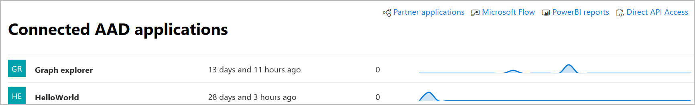

# Microsoft Defender for Endpoint 中連線的應用程式Connected applications in Microsoft Defender for Endpoint

[!INCLUDE [Microsoft 365 Defender rebranding](../../includes/microsoft-defender.md)]

**適用於：****Applies to:**
- [適用於端點的 Microsoft DefenderMicrosoft Defender for Endpoint](https://go.microsoft.com/fwlink/p/?linkid=2154037)
- [Microsoft 365 DefenderMicrosoft 365 Defender](https://go.microsoft.com/fwlink/?linkid=2118804)

>想要體驗 Defender for Endpoint？Want to experience Defender for Endpoint? [注册免費試用版。Sign up for a free trial.](https://www.microsoft.com/microsoft-365/windows/microsoft-defender-atp?ocid=docs-wdatp-assignaccess-abovefoldlink)

連接的應用程式會使用 APIs 與使用 Defender 的端點平臺整合。Connected applications integrates with the Defender for Endpoint platform using APIs. 

應用程式使用 standard OAuth 2.0 通訊協定來驗證及提供與 Microsoft Defender for Endpoint APIs 搭配使用的權杖。Applications use standard OAuth 2.0 protocol to authenticate and provide tokens for use with Microsoft Defender for Endpoint APIs.  此外，Azure Active Directory (Azure AD) 應用程式允許租使用者管理員設定可使用對應的應用程式存取 APIs 的明確控制。In addition, Azure Active Directory (Azure AD) applications allow tenant admins to set explicit control over which APIs can be accessed using the corresponding app.
 
您必須遵循 [下列步驟](/microsoft-365/security/defender-endpoint/apis-intro) ，才能將 APIs 與連接的應用程式搭配使用。You'll need to follow [these steps](/microsoft-365/security/defender-endpoint/apis-intro) to use the APIs with the connected application.
 
## 存取連線的應用程式頁面Access the connected application page
從左導覽功能表中，選取 [**端點**  >  **夥伴及 APIs**  >  **連線的應用程式**]。From the left navigation menu, select **Endpoints** > **Partners and APIs** > **Connected applications**.

 
## 查看連接的應用程式詳細資料View connected application details
[連線的應用程式] 頁面會提供連線至您組織中之端點之 Azure AD 應用程式的相關資訊。The Connected applications page provides information about the Azure AD applications connected to Microsoft Defender for Endpoint in your organization. 您可以查看已連接之應用程式的使用狀況：上次查看時間、過去24小時內的要求數量，以及過去30天的要求趨勢。You can review the usage of the connected applications: last seen, number of requests in the past 24 hours, and request trends in the last 30 days.

 
## 編輯、重新設定或刪除連接的應用程式Edit, reconfigure, or delete a connected application
[ **開啟應用程式設定** ] 連結會在 azure 入口網站中開啟對應的 [Azure AD 應用程式管理] 頁面。The **Open application settings** link opens the corresponding Azure AD application management page in the Azure portal. 從 Azure 入口網站，您可以管理許可權、重新設定或刪除連接的應用程式。From the Azure portal, you can manage permissions, reconfigure, or delete the connected applications.
