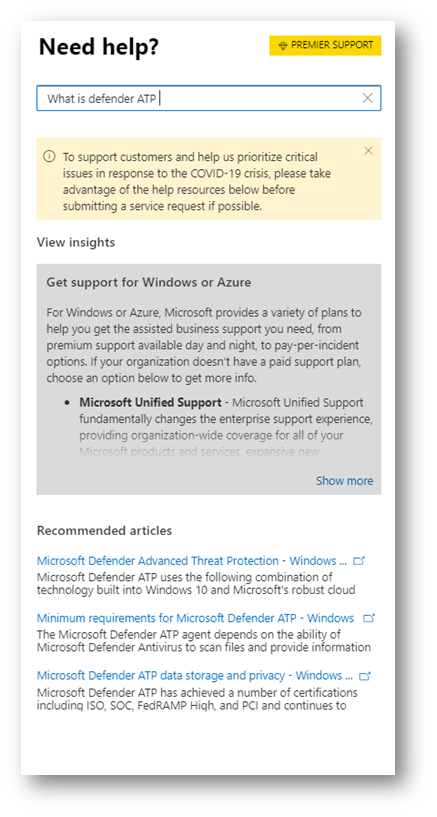

# 聯絡適用於端點的 Microsoft Defender 支援

[!INCLUDE [Microsoft 365 Defender rebranding](../../includes/microsoft-defender.md)]

**適用於：**
- [適用於端點的 Microsoft Defender](https://go.microsoft.com/fwlink/p/?linkid=2154037)
- [Microsoft 365 Defender](https://go.microsoft.com/fwlink/?linkid=2118804)

>想要體驗 Defender for Endpoint？ [注册免費試用版。](https://www.microsoft.com/microsoft-365/windows/microsoft-defender-atp?ocid=docs-wdatp-assignaccess-abovefoldlink)

端點的 Defender 最近已升級支援程式，以提供更新式和高級的支援經驗。

新的小工具可讓客戶：

- 尋找常見問題的解決方案
- 將支援案例提交給 Microsoft 支援小組

## 必要條件

請務必知道具有開啟支援案例許可權的特定角色。

您必須至少要有服務支援管理員 **或** 支援人員的系統管理員角色。

如需哪些角色具有許可權的詳細資訊，請參閱 [安全性管理員許可權](/azure/active-directory/users-groups-roles/directory-assign-admin-roles#security-administrator-permissions)。 包含動作的角色 `microsoft.office365.supportTickets/allEntities/allTasks` 可以提交案例。

如需系統管理員角色的一般資訊，請參閱 [關於系統管理員角色](/microsoft-365/admin/add-users/about-admin-roles)。

## 存取小工具
您可以透過下列其中一種方式來存取新的支援元件：

1. 按一下入口網站右上方的問號，然後按一下「Microsoft 支援」：

    ![選取 [問號時構件的圖像] 標記](images/support-widget.png)

2. 按一下 [ **需要協助]？**  Microsoft Defender 資訊安全中心的右下方按鈕：

    ![[需要協助] 按鈕的圖像](images/need-help.png)

在 [widget] 中，將會提供兩個選項：

- 尋找常見問題的解決方案
- 開啟服務要求

## 尋找常見問題的解決方案
此選項包含可能與您可能要求的問題相關的文章。 只要開始在搜尋方塊中輸入問題，就會呈現與您的搜尋相關的文章。

如果建議的文章不足，您可以開啟服務要求。

## 開啟服務要求

瞭解如何聯繫 Defender 以取得端點支援，以開啟支援票證。

> [!Note]
> 如果您有 Microsoft 的 permier 支援合同，您會在此小工具上看到 premier 標記。 如果不是，請與您的 Microsoft 帳戶管理員聯繫。

### 連絡客戶支援

按一下看起來像是耳機的圖示，即可使用此選項。 然後您會看到下列頁面以送出支援案例：

1. 請填入您所面臨問題的標題和描述，以及可能與您聯繫的電話號碼和電子郵件地址。

2.  (選用) 包含多達五個與問題相關的附件，以便為支援案例提供其他內容。

3. 選取您的時區及其他語言（如果適用）。 要求會傳送給 Microsoft 支援小組。 團隊會立即回應您的服務要求。

## 相關主題

- [為服務問題疑難排解](troubleshoot-mdatp.md)
- [檢查服務健康狀態](service-status.md)
