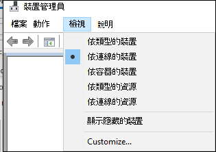
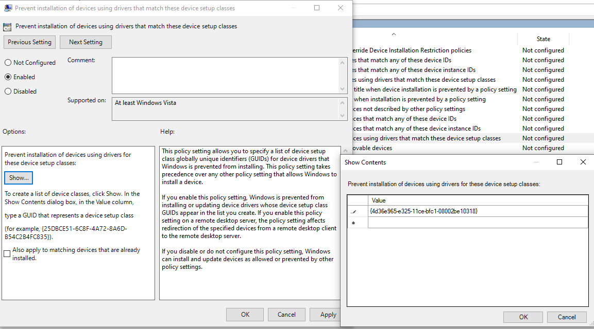
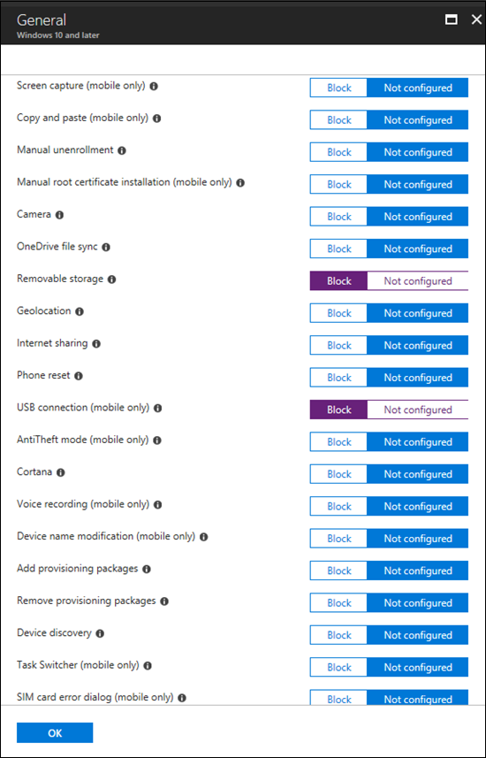
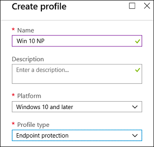
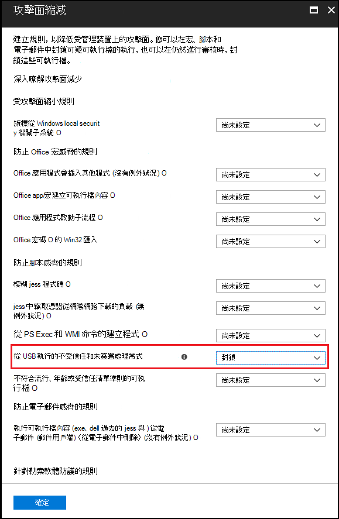

# <a name="how-to-control-usb-devices-and-other-removable-media-using-microsoft-defender-for-endpoint"></a>如何使用 Microsoft Defender for Endpoint 控制 USB 裝置和其他卸除式媒體

**適用于：** [Microsoft Defender for Endpoint](https://go.microsoft.com/fwlink/p/?linkid=2069559)

Microsoft 建議 [使用一種分層方法來保護卸除式媒體](https://aka.ms/devicecontrolblog)，而且 microsoft Defender for Endpoint 會提供多個監視和控制功能，以協助防止未經授權的外設威脅損損您的裝置：

1. [在 Microsoft Defender 中探索針對外設的隨插即用線上活動，以進行端點高級搜尋](#discover-plug-and-play-connected-events)。 識別或調查可疑的使用活動。

2. 設定為只允許或封鎖某些可移動裝置，並避免威脅。
    1. 根據細微設定[允許或封鎖可移除裝置](#allow-or-block-removable-devices)，以拒絕對抽取式磁碟的寫入權限，以及使用 USB 裝置 IDs 來核准或拒絕裝置。 根據 Azure Active Directory (Azure AD) 使用者和裝置的個人或群組，以彈性原則指派裝置安裝設定。

    2. 啟用下列專案，以防止可拆卸儲存體裝置所引進的可[拆卸儲存體威脅](#prevent-threats-from-removable-storage)：  
        - Microsoft Defender 防毒軟體即時保護 (RTP) 來掃描可拆卸儲存體以取得惡意程式碼。  
        - 攻擊面減少 (ASR) USB 規則，以封鎖從 USB 執行的不受信任的和未簽署的處理常式。  
        - Direct Memory Access (DMA) 保護設定，以減輕 DMA 攻擊（包括 Thunderbolt 和封鎖 DMA 的內核 DMA 保護），直到使用者登入為止。  

3. 根據這些隨插即用事件或任何其他 Microsoft Defender for with[自訂偵測規則](/microsoft-365/security/defender-endpoint/custom-detection-rules)的 Endpoint 事件，[建立自訂的警示和回應動作](#create-customized-alerts-and-response-actions)，以監視可移動裝置的使用方式。

4. 根據每個外設所報告的內容即時回應週邊設備的[威脅](#respond-to-threats)。

>[!Note]
>這些威脅降低量值可協助防止惡意程式碼進入您的環境。 若要保護企業資料離開您的環境，您也可以設定資料遺失防護量值。 例如，在 Windows 10 裝置上，您可以設定[BitLocker](/windows/security/information-protection/bitlocker/bitlocker-overview.md)和[Windows 資訊保護](/windows/security/information-protection/create-wip-policy-using-intune-azure.md)，它會加密公司資料（即使是儲存在個人裝置上），或是使用[儲存體/RemovableDiskDenyWriteAccess CSP](/windows/client-management/mdm/policy-csp-storage#storage-removablediskdenywriteaccess)來拒絕對抽取式磁碟的寫入存取。 此外，您可以使用 Microsoft Defender for Endpoint 和 Azure 資訊保護功能，[在 Windows 裝置上分類及保護](/windows/security/threat-protection/windows-defender-atp/information-protection-in-windows-overview)檔案 (包括其裝載的 USB 裝置) 。

## <a name="discover-plug-and-play-connected-events"></a>探索隨插即用連線的事件

您可以在 Microsoft Defender for Endpoint advanced 搜尋中查看隨插即用連線的事件，以找出可疑的使用狀況活動或執行內部調查。
如需適用于端點高級搜尋查詢的 defender 範例，請參閱[Microsoft Defender for endpoint 搜尋查詢 GitHub](https://github.com/Microsoft/WindowsDefenderATP-Hunting-Queries)儲存機制。

Power BI 報告範本的範例可用於您可以用於高級搜尋查詢的 Microsoft Defender for Endpoint。 使用這些範例範本（包括裝置控制項的一個），您可以將高級搜尋的威力整合至 Power BI。 如需詳細資訊，請參閱[PowerBI 範本的 GitHub 存放庫](https://github.com/microsoft/MDATP-PowerBI-Templates)。 請參閱[使用 Power BI 建立自訂報告](/microsoft-365/security/defender-endpoint/api-power-bi)以深入瞭解 Power BI 整合。

## <a name="allow-or-block-removable-devices"></a>允許或封鎖可移動裝置
下表說明 Microsoft Defender for Endpoint 根據細微設定允許或封鎖可移除裝置的方式。

| 控制項  | 描述 |
|----------|-------------|
| [限制 USB 磁片磁碟機和其他外設](#restrict-usb-drives-and-other-peripherals) | 您可以允許/避免使用者只安裝授權/未經授權裝置或裝置類型清單中包含的 USB 磁片磁碟機和其他外設。 |
| [封鎖可移動儲存裝置的安裝與使用](#block-installation-and-usage-of-removable-storage) | 您無法安裝或使用 [可移動儲存]。 |
| [允許安裝和使用特別核准的週邊設備](#allow-installation-and-usage-of-specifically-approved-peripherals)   | 您只能安裝及使用已核准的外設，以在其固件中報告特定屬性。 |
| [避免安裝明確禁止的週邊設備](#prevent-installation-of-specifically-prohibited-peripherals) | 您無法安裝或使用已禁止的外設，以在其固件中報告特定屬性。 |
| [允許安裝和使用符合裝置實例的特別核准的外設 IDs](#allow-installation-and-usage-of-specifically-approved-peripherals-with-matching-device-instance-ids) | 您只能安裝和使用符合任何上述裝置實例 IDs 的核准外設。 |
| [避免安裝和使用符合裝置實例的明確禁止的外設 IDs](#prevent-installation-and-usage-of-specifically-prohibited-peripherals-with-matching-device-instance-ids) | 您無法安裝或使用符合任何上述裝置實例 IDs 的已禁止外設。 |
| [限制使用藍牙的服務](#limit-services-that-use-bluetooth) | 您可以限制可使用藍牙的服務。 |
| [使用 Microsoft Defender 做為端點基準設定](#use-microsoft-defender-for-endpoint-baseline-settings) | 您可以使用 Defender for Endpoint security 基準設定 ATP 的建議配置。 |

### <a name="restrict-usb-drives-and-other-peripherals"></a>限制 USB 磁片磁碟機和其他外設

若要防止惡意程式碼感染或資料遺失，組織可以限制 USB 磁片磁碟機和其他外設。 下表說明 Microsoft Defender for Endpoint 如何協助避免安裝和使用 USB 磁片磁碟機和其他外設的方式。

| 控制項  | 描述
|----------|-------------|
| [允許安裝和使用 USB 磁片磁碟機和其他外設](#allow-installation-and-usage-of-usb-drives-and-other-peripherals) | 僅允許使用者安裝授權裝置或裝置類型清單中包含的 USB 磁片磁碟機和其他外設 |
| [避免安裝和使用 USB 磁片磁碟機和其他外設](#prevent-installation-and-usage-of-usb-drives-and-other-peripherals) | 防止使用者安裝 USB 磁片磁碟機，以及其他未授權裝置和裝置類型清單中的外設 |

以上所有控制項都可以透過 Intune 系統 [管理範本](/intune/administrative-templates-windows)進行設定。 相關原則位於下列的 Intune 管理員範本中：


>[!Note]
>使用 Intune，您可以將裝置設定原則套用至 Azure AD 使用者和/或設備群組。
上述原則也可以透過 [設備安裝 CSP](/windows/client-management/mdm/policy-csp-deviceinstallation) 設定和 [裝置安裝 gpo](/previous-versions/dotnet/articles/bb530324(v=msdn.10))加以設定。

> [!Note]
> 在實際執行之前，請先使用使用者和裝置的試驗群組測試及精煉這些設定。
如需控制 USB 裝置的詳細資訊，請參閱 [Microsoft Defender For Endpoint 博客](https://www.microsoft.com/security/blog/2018/12/19/windows-defender-atp-has-protections-for-usb-and-removable-devices/)。

#### <a name="allow-installation-and-usage-of-usb-drives-and-other-peripherals"></a>允許安裝和使用 USB 磁片磁碟機和其他外設

若要讓 USB 磁片磁碟機和其他外設進行安裝與使用的方法是一種方法，可讓您從允許所有專案開始。 之後，您就可以開始減少允許的 USB 驅動程式和其他外設。

>[!Note]
>由於未經授權的 USB 外設可以有可欺騙其 USB 內容的固件，因此我們建議您只允許特別核准的 USB 外設，並限制可以存取這些外設的使用者。

1. Enable **禁止將其他原則設定所描述的裝置安裝** 給所有使用者。
2. 啟用允許安裝使用符合所有 [裝置安裝](/windows-hardware/drivers/install/system-defined-device-setup-classes-available-to-vendors)類別 **之裝置安裝類別的驅動程式來安裝裝置**。

若要強制執行已安裝裝置的原則，請套用「禁止使用此設定的原則」。

設定 [允許裝置安裝原則] 時，您必須同時允許所有的父屬性。 您可以開啟裝置管理員並依連線方式查看，以查看裝置的父代。



在此範例中，需要新增下列類別： HID、鍵盤和 {36fc9e60-c465-11cf-8056-444553540000}。 如需詳細資訊，請參閱 [Microsoft 提供的 USB 驅動程式](/windows-hardware/drivers/usbcon/supported-usb-classes) 。


如果您想要限制特定裝置，請移除您要限制之外設的裝置安裝程式類別。 然後新增您要新增的設備識別碼。 裝置識別碼是以裝置的「廠商識別碼」和「產品識別碼」值為基礎。 如需裝置識別碼格式的詳細資訊，請參閱 [標準 USB 識別碼](/windows-hardware/drivers/install/standard-usb-identifiers)。 

若要尋找裝置 IDs，請參閱 [查閱設備識別碼](#look-up-device-id)。 

例如：

1. 從 **允許使用符合這些裝置設定的驅動程式安裝裝置**，移除類別 USBDevice。
2. 在 [ **允許安裝符合下列任一裝置的裝置**] 中，新增要允許的裝置識別碼 IDs。 


#### <a name="prevent-installation-and-usage-of-usb-drives-and-other-peripherals"></a>避免安裝和使用 USB 磁片磁碟機和其他外設

如果您想要阻止安裝裝置類別或特定裝置，您可以使用禁止裝置安裝原則：

1. 啟用 [ **避免安裝符合下列任一裝置的裝置 IDs** ，並將這些裝置新增至清單。
2. Enable **使用符合這些裝置安裝類別的驅動程式來安裝裝置**。

> [!Note]
> [阻止裝置安裝原則] 優先于 [允許裝置安裝原則]。

[**阻止安裝符合任何這些裝置的裝置 IDs** 原則] 可讓您指定 Windows 所禁止安裝的裝置清單。 

若要防止安裝符合下列任一裝置的裝置 IDs： 

1. 針對您想要 Windows 以避免安裝的裝置[查詢裝置識別碼](#look-up-device-id)。

   

2. 啟用 [ **阻止安裝符合下列任一裝置的裝置 IDs** ，並將廠商或產品識別碼s 新增至清單。

    

#### <a name="look-up-device-id"></a>查詢裝置識別碼

您可以使用 [裝置管理員] 來查詢裝置識別碼。

1. 開啟裝置管理員。
2. 按一下 [ **查看** ]，然後依連線選取 **裝置**。
3. 從樹狀目錄中，以滑鼠右鍵按一下裝置，然後選取 [ **屬性**]。
4. 在選取之裝置的對話方塊中，按一下 [ **詳細資料** ] 索引標籤。
5. 按一下 **屬性** 下拉式清單，然後選取 [ **硬體識別碼**]。
6. 以滑鼠右鍵按一下上方識別碼值，然後選取 [ **複製**]。

如需裝置識別碼格式的相關資訊，請參閱 [標準 USB 識別碼](/windows-hardware/drivers/install/standard-usb-identifiers)。

如需廠商 IDs 的詳細資訊，請參閱 [USB members](https://www.usb.org/members)。

以下是用來查閱裝置廠商識別碼或產品識別碼 (的範例，其為設備識別碼的一部分) 使用 PowerShell: 

```powershell
Get-WMIObject -Class Win32_DiskDrive |
Select-Object -Property * 
```

[**防止使用符合這些裝置安裝類別的驅動程式安裝裝置**] 原則可讓您指定 Windows 所禁止安裝的裝置安裝類別。 

若要防止安裝特定類別的裝置： 

1. 從 [廠商提供的系統定義裝置安裝類別](/windows-hardware/drivers/install/system-defined-device-setup-classes-available-to-vendors)，尋找裝置安裝類別的 GUID。

2. Enable **禁止使用符合這些裝置安裝類別的驅動程式安裝裝置** ，並將類別 GUID 新增至清單。

    > [!div class="mx-imgBorder"]
    > 

### <a name="block-installation-and-usage-of-removable-storage"></a>封鎖可移動儲存裝置的安裝與使用

1. 登入 Microsoft 端點管理員系統[管理中心](https://endpoint.microsoft.com/)。

2. 按一下 [**裝置**  >  **設定檔**  >  **建立設定檔**]。

    > [!div class="mx-imgBorder"]
    > 

3. 使用下列設定：

   - 名稱：輸入設定檔的名稱
   - 描述：輸入描述
   - Platform： Windows 10 和更新版本
   - 配置檔案類型：裝置限制

   > [!div class="mx-imgBorder"]
   > 

4. 按一下  >  **[設定一般**]。  

5. 在 [ **可移動儲存區** 與 USB 連線] 中 **(僅限行動)**，請選擇 [ **封鎖**]。 [**可移動儲存**] 包含 usb 磁片磁碟機，而 **usb 連線 (僅限** 行動裝置) 排除 USB 充電，但只在行動裝置上包含其他 usb 連線。 

   

6. 按一下 **[確定]** 關閉 **一般** 設定和 **裝置限制**。

7. 按一下 [ **建立** ] 以儲存設定檔。

### <a name="allow-installation-and-usage-of-specifically-approved-peripherals"></a>允許安裝和使用特別核准的週邊設備

可以安裝的外設可以透過其 [硬體身分識別](/windows-hardware/drivers/install/device-identification-strings)加以指定。 如需通用識別碼結構的清單，請參閱 [Device 識別碼格式](/windows-hardware/drivers/install/device-identifier-formats)。 在執行此設定之前，請先測試設定，以確保它封鎖並允許預期的裝置。 理想情況下，測試硬體的各個實例。 例如，測試多個 USB 機碼，而不只是一個。

如需可安裝特定裝置 IDs 的 SyncML 範例，請參閱 [DeviceInstallation/ALLOWINSTALLATIONOFMATCHINGDEVICEIDS CSP](/windows/client-management/mdm/policy-csp-deviceinstallation#deviceinstallation-allowinstallationofmatchingdeviceids)。 若要允許特定裝置類別，請參閱 [DeviceInstallation/ALLOWINSTALLATIONOFMATCHINGDEVICESETUPCLASSES CSP](/windows/client-management/mdm/policy-csp-deviceinstallation#deviceinstallation-allowinstallationofmatchingdevicesetupclasses)。
允許安裝特定裝置也需要啟用 [DeviceInstallation/PreventInstallationOfDevicesNotDescribedByOtherPolicySettings](/windows/client-management/mdm/policy-csp-deviceinstallation#deviceinstallation-preventinstallationofdevicesnotdescribedbyotherpolicysettings)。

### <a name="prevent-installation-of-specifically-prohibited-peripherals"></a>避免安裝明確禁止的週邊設備

Microsoft Defender for Endpoint 會封鎖使用下列任一選項來安裝及使用已禁止的外設：

- 系統[管理範本](/intune/administrative-templates-windows)可以封鎖具有符合硬體識別碼或 setup 類別的任何裝置。  
- 使用 Intune 中的自訂設定檔的[裝置安裝 CSP 設定](/windows/client-management/mdm/policy-csp-deviceinstallation)。 您可以 [禁止安裝特定裝置 IDs](/windows/client-management/mdm/policy-csp-deviceinstallation#deviceinstallation-preventinstallationofmatchingdeviceids) ，也可以避免安裝 [特定裝置類別](/windows/client-management/mdm/policy-csp-deviceinstallation#deviceinstallation-preventinstallationofmatchingdevicesetupclasses)。

### <a name="allow-installation-and-usage-of-specifically-approved-peripherals-with-matching-device-instance-ids"></a>允許安裝和使用符合裝置實例的特別核准的外設 IDs

可以安裝的外設可由其 [裝置實例 IDs](/windows-hardware/drivers/install/device-instance-ids)來指定。 在執行此設定之前，請先測試設定，以確保其允許所預期的裝置。 理想情況下，測試硬體的各個實例。 例如，測試多個 USB 機碼，而不只是一個。

您可以設定 [DeviceInstallation/AllowInstallationOfMatchingDeviceInstanceIDs](/windows/client-management/mdm/policy-csp-deviceinstallation#deviceinstallation-allowinstallationofmatchingdeviceinstanceids) 原則設定，以允許安裝和使用符合裝置實例的已核准外設 IDs。

### <a name="prevent-installation-and-usage-of-specifically-prohibited-peripherals-with-matching-device-instance-ids"></a>避免安裝和使用符合裝置實例的明確禁止的外設 IDs

已禁止安裝的外設可由其 [裝置實例 IDs](/windows-hardware/drivers/install/device-instance-ids)來指定。 在執行此設定之前，請先測試設定，以確保其允許所預期的裝置。 理想情況下，測試硬體的各個實例。 例如，測試多個 USB 機碼，而不只是一個。

您可以設定 [DeviceInstallation/PreventInstallationOfMatchingDeviceInstanceIDs](/windows/client-management/mdm/policy-csp-deviceinstallation#deviceinstallation-preventinstallationofmatchingdeviceinstanceids) 原則設定，以避免安裝符合裝置實例 IDs 的已禁止外設。

### <a name="limit-services-that-use-bluetooth"></a>限制使用藍牙的服務

使用 Intune，您可以使用「[藍牙允許的服務](/windows/client-management/mdm/policy-csp-bluetooth#servicesallowedlist-usage-guide)」來限制可使用藍牙的服務。 "藍牙允許的服務「設定」的預設狀態是指允許所有的專案。  加入服務後，就會變成允許的清單。 如果客戶新增鍵盤和滑鼠值，但沒有新增檔案傳輸 Guid，則應該封鎖檔案傳輸。

> [!div class="mx-imgBorder"]
> 

### <a name="use-microsoft-defender-for-endpoint-baseline-settings"></a>使用 Microsoft Defender 做為端點基準設定

Microsoft Defender for Endpoint 的基準設定代表威脅防護的建議設定。 基準的設定設定位於設定設定的 [編輯設定檔] 頁面。

> [!div class="mx-imgBorder"]
> 

## <a name="prevent-threats-from-removable-storage"></a>防止可拆卸儲存體的威脅
  
可移動儲存裝置可能會對您的組織帶來額外的安全性風險。 Microsoft Defender for Endpoint 可協助識別及封鎖卸除式存放裝置裝置上的惡意檔案。

Microsoft Defender for Endpoint 也可以防止 USB 週邊設備在裝置上使用，以協助防止外部威脅。 為此，您可以使用 USB 外設所報告的內容，判斷是否可以在裝置上安裝及使用這些屬性。

請注意，如果您使用裝置安裝原則封鎖 USB 裝置或任何其他裝置類別，則已連接的裝置（例如電話）仍然可以充電。

>[!NOTE]
>在廣泛地散佈到組織之前，請務必先使用使用者和裝置的試驗群組測試及精煉這些設定。 

下表說明 Microsoft Defender for Endpoint 可協助防止「可移動儲存」威脅的方式。

如需控制 USB 裝置的詳細資訊，請參閱 [Microsoft Defender For Endpoint 博客](https://aka.ms/devicecontrolblog)。

| 控制項  | 描述 |
|----------|-------------|
| [啟用 Microsoft Defender 防毒軟體掃描](#enable-microsoft-defender-antivirus-scanning) | 啟用 Microsoft Defender 防毒軟體掃描以進行即時保護或排程掃描。|
| [封鎖 USB 週邊設備上的不受信任和未簽署的處理常式](#block-untrusted-and-unsigned-processes-on-usb-peripherals) | 封鎖未簽署或不受信任的 USB 檔案。 |
| [防護直接記憶體存取 (DMA) 攻擊](#protect-against-direct-memory-access-dma-attacks) | 設定防護以防範 DMA 攻擊。 |

>[!NOTE]
>由於未經授權的 USB 外設可以有可欺騙其 USB 內容的固件，因此我們建議您只允許特別核准的 USB 外設，並限制可以存取這些外設的使用者。

### <a name="enable-microsoft-defender-antivirus-scanning"></a>啟用 Microsoft Defender 防毒軟體掃描

使用 Microsoft Defender 防毒軟體保護已授權的移除儲存體時，必須[啟用即時保護](/microsoft-365/security/defender-endpoint/configure-real-time-protection-microsoft-defender-antivirus)或排程掃描，並設定可拆卸磁片磁碟機進行掃描。

- 如果啟用即時保護，系統會先掃描檔案，再加以存取和執行。 掃描範圍包括所有檔案，包括安裝的可移動裝置（例如 USB 磁片磁碟機）上的檔案。 您可以選擇性地執行 PowerShell 腳本，以在裝載 USB 磁片磁碟機後[執行自訂掃描](/samples/browse/?redirectedfrom=TechNet-Gallery)，如此一來，Microsoft Defender 防毒軟體會在附加可移動裝置後開始掃描可移動裝置上的所有檔案。 不過，我們建議啟用即時保護以改善掃描效能，尤其是針對大型儲存裝置。

- 如果使用排程的掃描，您必須停用預設 (啟用 DisableRemovableDriveScanning 設定) 以在完整掃描期間掃描可移動裝置。 不論 DisableRemovableDriveScanning 設定為何，都可以在快速或自訂掃描期間掃描移除裝置。

>[!NOTE]
>我們建議啟用掃描的即時監控。 在 Intune 中，您可以針對 **裝置限制**  >  **設定**  >  **Microsoft Defender 防毒軟體**  >  **即時監控**，啟用 Windows 10 即時監控。

<!-- Need to build out point in the preceding note. 
-->

### <a name="block-untrusted-and-unsigned-processes-on-usb-peripherals"></a>封鎖 USB 週邊設備上的不受信任和未簽署的處理常式

使用者可能插入已感染惡意程式碼的移除裝置。
若要防止感染，公司可以封鎖未簽署或不受信任的 USB 檔案。
另外，公司也可以利用 [攻擊面減少規則](/microsoft-365/security/defender-endpoint/attack-surface-reduction) 的「審計」功能，監控在 USB 外設上執行的不受信任和未簽署程式的活動。
若要執行此動作，您可以將 **不受信任和未簽署的程式，** 分別設定為 **封鎖** 或 **僅限審核** 執行。
使用此規則，系統管理員可以防止或審計未簽署或不受信任的可執行檔，從 USB 抽取式磁碟磁碟機（包括 SD 卡）執行。
受影響的檔案類型包括可執行檔 (例如 .exe、.dll 或 .scr) 及腳本檔案，例如 PowerShell ( .ps) 、或 () JavaScript 的檔案。

這些設定需要 [啟用即時保護](/microsoft-365/security/defender-endpoint/configure-real-time-protection-microsoft-defender-antivirus)。

1. 登入[Microsoft 端點管理員](https://endpoint.microsoft.com/)。

2. 按一下 [**裝置**  >  **Windows**  >  **配置原則**]  >  **建立設定檔**。 

    

3. 使用下列設定：
   - Platform： Windows 10 和更新版本 
   - 配置檔案類型：裝置限制

   > [!div class="mx-imgBorder"]
   > 

4. 按一下 ****[建立]。  

5. 針對 **從 USB 執行的未簽署和不受信任的處理常式**，選擇 [ **封鎖**]。

   

6. 按一下 **[確定]** 關閉設定和 **裝置限制**。

### <a name="protect-against-direct-memory-access-dma-attacks"></a>防護直接記憶體存取 (DMA) 攻擊

DMA 攻擊可能會導致洩漏位於電腦上的機密資訊，或甚至是惡意程式碼注入，以允許攻擊者以遠端方式略過鎖定畫面或控制電腦。 下列設定可協助避免 DMA 攻擊：

1. 從 Windows 10 版本1803開始，Microsoft 推出了[Thunderbolt 的內核 DMA 保護](/windows/security/information-protection/kernel-dma-protection-for-thunderbolt.md)，以透過 Thunderbolt 埠提供對 DMA 攻擊的原生防護。 系統製造商已啟用 Thunderbolt 的內核 DMA 保護，且無法由使用者開啟或關閉。

   從 Windows 10 版本1809開始，您可以設定[DMA 防護 CSP](/windows/client-management/mdm/policy-csp-dmaguard#dmaguard-deviceenumerationpolicy)，以調整內核 DMA 保護的層級。 這是不支援裝置記憶體隔離 (（也稱為 DMA 重新對應) ）的週邊設備的其他控制項。 記憶體隔離可讓 OS 利用裝置的 I/O 記憶體管理單元 (IOMMU) ，以封鎖週邊 (記憶體沙箱) 的 unallowed I/O （或記憶體存取）。 換句話說，作業系統會將特定記憶體範圍指派給外設。 如果外設嘗試讀取/寫入指定範圍外的記憶體，作業系統會封鎖該範圍。

   支援裝置記憶體隔離的外設可永遠連接。 只有在使用者登入 (預設) 後，才能封鎖、允許或允許的外設。

2. 在不支援內核 DMA 保護的 Windows 10 系統上，您可以：

   - [封鎖 DMA，直到使用者登入](/windows/client-management/mdm/policy-csp-dataprotection#dataprotection-allowdirectmemoryaccess)
   - [封鎖透過 Thunderbolt 埠 (包含 USB 裝置的所有連接) ](https://support.microsoft.com/help/2516445/blocking-the-sbp-2-driver-and-thunderbolt-controllers-to-reduce-1394-d)

## <a name="create-customized-alerts-and-response-actions"></a>建立自訂的警示和回應動作

您可以使用 WDATP 連接器和自訂偵測規則來建立自訂警示和回應動作：

**Wdatp 連接器回應動作：**

**調查：** 發起調查、收集調查套件，以及隔離電腦。

在 USB 裝置上進行 **威脅掃描**。

**限制電腦上所有應用程式的執行**，除非預先定義的組 MDATP 連接器是一個200以上的預先定義的連接器之一（包括 Outlook、Teams、寬限時間等等）。可以建立自訂連接器。
- [WDATP 連接器回應動作的詳細資訊](/connectors/wdatp/)

**自訂偵測規則回應動作：** 您可以套用電腦及檔層級動作。
- [自訂偵測規則回應動作的詳細資訊](/microsoft-365/security/defender-endpoint/custom-detection-rules)

如需裝置控制相關的高級搜尋事件及如何建立自訂警示的範例資訊，請參閱 [Advanced 搜尋更新： USB 事件、電腦層級動作和架構變更](https://techcommunity.microsoft.com/t5/Microsoft-Defender-ATP/Advanced-hunting-updates-USB-events-machine-level-actions-and/ba-p/824152)。

## <a name="respond-to-threats"></a>回應威脅

您可以使用 [Microsoft Defender For Endpoint 自訂偵測規則](/microsoft-365/security/defender-endpoint/custom-detection-rules)來建立自訂警示和自動回應動作。 自訂偵測內的回應動作涵蓋機器及檔層級動作。 您也可以使用[Microsoft Defender for Endpoint connector](/connectors/wdatp/) [PowerApps](https://powerapps.microsoft.com/)和[Flow](https://flow.microsoft.com/) ，來建立警示和自動回應動作。 連接器支援調查的動作、威脅掃描及限制執行中的應用程式。 它是一種超過200個預先定義的連接器，包括 Outlook、Teams、寬限時間等等。 您也可以建立自訂連接器。 請參閱 [連接器](/connectors/) 以深入瞭解連接器。
 
例如，使用任一種方法時，當 USB 裝置裝載到機器時，您可以自動執行 Microsoft Defender 防毒軟體。

## <a name="related-topics"></a>相關主題

- [設定 Microsoft Defender 防毒軟體的即時保護](/microsoft-365/security/defender-endpoint/configure-real-time-protection-microsoft-defender-antivirus)
- [Defender/AllowFullScanRemovableDriveScanning](/windows/client-management/mdm/policy-csp-defender#defender-allowfullscanremovabledrivescanning)
- [Policy/DeviceInstallation CSP](/windows/client-management/mdm/policy-csp-deviceinstallation)
- [執行可移動裝置的自訂掃描](/samples/browse/?redirectedfrom=TechNet-Gallery)
- [自訂報表的裝置控制項 PowerBI 範本](https://github.com/microsoft/MDATP-PowerBI-Templates)
- [BitLocker](/windows/security/information-protection/bitlocker/bitlocker-overview.md) 
- [Windows 資訊保護](/windows/security/information-protection/windows-information-protection/create-wip-policy-using-intune-azure.md)
