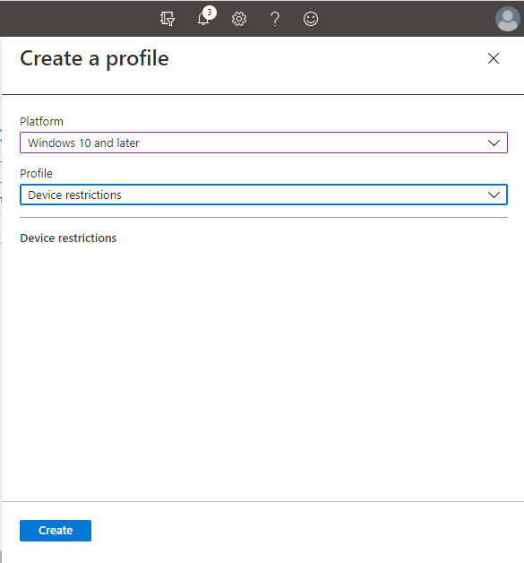

# <a name="how-to-control-usb-devices-and-other-removable-media-using-microsoft-defender-for-endpoint"></a><span data-ttu-id="d5018-103">如何使用 Microsoft Defender for Endpoint 控制 USB 裝置和其他卸除式媒體</span><span class="sxs-lookup"><span data-stu-id="d5018-103">How to control USB devices and other removable media using Microsoft Defender for Endpoint</span></span>

<span data-ttu-id="d5018-104">**適用于：** [Microsoft Defender for Endpoint](https://go.microsoft.com/fwlink/p/?linkid=2069559)</span><span class="sxs-lookup"><span data-stu-id="d5018-104">**Applies to:** [Microsoft Defender for Endpoint](https://go.microsoft.com/fwlink/p/?linkid=2069559)</span></span>

<span data-ttu-id="d5018-105">Microsoft 建議 [使用一種分層方法來保護卸除式媒體](https://aka.ms/devicecontrolblog)，而且 microsoft Defender for Endpoint 會提供多個監視和控制功能，以協助防止未經授權的外設威脅損損您的裝置：</span><span class="sxs-lookup"><span data-stu-id="d5018-105">Microsoft recommends [a layered approach to securing removable media](https://aka.ms/devicecontrolblog), and Microsoft Defender for Endpoint provides multiple monitoring and control features to help prevent threats in unauthorized peripherals from compromising your devices:</span></span>

1. <span data-ttu-id="d5018-106">[在 Microsoft Defender 中探索針對外設的隨插即用線上活動，以進行端點高級搜尋](#discover-plug-and-play-connected-events)。</span><span class="sxs-lookup"><span data-stu-id="d5018-106">[Discover plug and play connected events for peripherals in Microsoft Defender for Endpoint advanced hunting](#discover-plug-and-play-connected-events).</span></span> <span data-ttu-id="d5018-107">識別或調查可疑的使用活動。</span><span class="sxs-lookup"><span data-stu-id="d5018-107">Identify or investigate suspicious usage activity.</span></span>

2. <span data-ttu-id="d5018-108">設定為只允許或封鎖某些可移動裝置，並避免威脅。</span><span class="sxs-lookup"><span data-stu-id="d5018-108">Configure to allow or block only certain removable devices and prevent threats.</span></span>
    1. <span data-ttu-id="d5018-109">根據細微設定[允許或封鎖可移除裝置](#allow-or-block-removable-devices)，以拒絕對抽取式磁碟的寫入權限，以及使用 USB 裝置 IDs 來核准或拒絕裝置。</span><span class="sxs-lookup"><span data-stu-id="d5018-109">[Allow or block removable devices](#allow-or-block-removable-devices) based on granular configuration to deny write access to removable disks and approve or deny devices by using USB device IDs.</span></span> <span data-ttu-id="d5018-110">根據 Azure Active Directory (Azure AD) 使用者和裝置的個人或群組，以彈性原則指派裝置安裝設定。</span><span class="sxs-lookup"><span data-stu-id="d5018-110">Flexible policy assignment of device installation settings based on an individual or group of Azure Active Directory (Azure AD) users and devices.</span></span>

    2. <span data-ttu-id="d5018-111">啟用下列專案，以防止可拆卸儲存體裝置所引進的可[拆卸儲存體威脅](#prevent-threats-from-removable-storage)：</span><span class="sxs-lookup"><span data-stu-id="d5018-111">[Prevent threats from removable storage](#prevent-threats-from-removable-storage) introduced by removable storage devices by enabling:</span></span>  
        - <span data-ttu-id="d5018-112">Microsoft Defender 防毒軟體即時保護 (RTP) 來掃描可拆卸儲存體以取得惡意程式碼。</span><span class="sxs-lookup"><span data-stu-id="d5018-112">Microsoft Defender Antivirus real-time protection (RTP) to scan removable storage for malware.</span></span>  
        - <span data-ttu-id="d5018-113">攻擊面減少 (ASR) USB 規則，以封鎖從 USB 執行的不受信任的和未簽署的處理常式。</span><span class="sxs-lookup"><span data-stu-id="d5018-113">The Attack Surface Reduction (ASR) USB rule to block untrusted and unsigned processes that run from USB.</span></span>  
        - <span data-ttu-id="d5018-114">Direct Memory Access (DMA) 保護設定，以減輕 DMA 攻擊（包括 Thunderbolt 和封鎖 DMA 的內核 DMA 保護），直到使用者登入為止。</span><span class="sxs-lookup"><span data-stu-id="d5018-114">Direct Memory Access (DMA) protection settings to mitigate DMA attacks, including Kernel DMA Protection for Thunderbolt and blocking DMA until a user signs in.</span></span>  

3. <span data-ttu-id="d5018-115">根據這些隨插即用事件或任何其他 Microsoft Defender for with[自訂偵測規則](/microsoft-365/security/defender-endpoint/custom-detection-rules)的 Endpoint 事件，[建立自訂的警示和回應動作](#create-customized-alerts-and-response-actions)，以監視可移動裝置的使用方式。</span><span class="sxs-lookup"><span data-stu-id="d5018-115">[Create customized alerts and response actions](#create-customized-alerts-and-response-actions) to monitor usage of removable devices based on these plug and play events or any other Microsoft Defender for Endpoint events with [custom detection rules](/microsoft-365/security/defender-endpoint/custom-detection-rules).</span></span>

4. <span data-ttu-id="d5018-116">根據每個外設所報告的內容即時回應週邊設備的[威脅](#respond-to-threats)。</span><span class="sxs-lookup"><span data-stu-id="d5018-116">[Respond to threats](#respond-to-threats) from peripherals in real-time based on properties reported by each peripheral.</span></span>

>[!Note]
><span data-ttu-id="d5018-117">這些威脅降低量值可協助防止惡意程式碼進入您的環境。</span><span class="sxs-lookup"><span data-stu-id="d5018-117">These threat reduction measures help prevent malware from coming into your environment.</span></span> <span data-ttu-id="d5018-118">若要保護企業資料離開您的環境，您也可以設定資料遺失防護量值。</span><span class="sxs-lookup"><span data-stu-id="d5018-118">To protect enterprise data from leaving your environment, you can also configure data loss prevention measures.</span></span> <span data-ttu-id="d5018-119">例如，在 Windows 10 裝置上，您可以設定[BitLocker](/windows/security/information-protection/bitlocker/bitlocker-overview.md)和[Windows 資訊保護](/windows/security/information-protection/create-wip-policy-using-intune-azure.md)，它會加密公司資料（即使是儲存在個人裝置上），或是使用[儲存體/RemovableDiskDenyWriteAccess CSP](/windows/client-management/mdm/policy-csp-storage#storage-removablediskdenywriteaccess)來拒絕對抽取式磁碟的寫入存取。</span><span class="sxs-lookup"><span data-stu-id="d5018-119">For example, on Windows 10 devices you can configure [BitLocker](/windows/security/information-protection/bitlocker/bitlocker-overview.md) and [Windows Information Protection](/windows/security/information-protection/create-wip-policy-using-intune-azure.md), which will encrypt company data even if it is stored on a personal device, or use the [Storage/RemovableDiskDenyWriteAccess CSP](/windows/client-management/mdm/policy-csp-storage#storage-removablediskdenywriteaccess) to deny write access to removable disks.</span></span> <span data-ttu-id="d5018-120">此外，您可以使用 Microsoft Defender for Endpoint 和 Azure 資訊保護功能，[在 Windows 裝置上分類及保護](/windows/security/threat-protection/windows-defender-atp/information-protection-in-windows-overview)檔案 (包括其裝載的 USB 裝置) 。</span><span class="sxs-lookup"><span data-stu-id="d5018-120">Additionally, you can [classify and protect files on Windows devices](/windows/security/threat-protection/windows-defender-atp/information-protection-in-windows-overview) (including their mounted USB devices) by using Microsoft Defender for Endpoint and Azure Information Protection.</span></span>

## <a name="discover-plug-and-play-connected-events"></a><span data-ttu-id="d5018-121">探索隨插即用連線的事件</span><span class="sxs-lookup"><span data-stu-id="d5018-121">Discover plug and play connected events</span></span>

<span data-ttu-id="d5018-122">您可以在 Microsoft Defender for Endpoint advanced 搜尋中查看隨插即用連線的事件，以找出可疑的使用狀況活動或執行內部調查。</span><span class="sxs-lookup"><span data-stu-id="d5018-122">You can view plug and play connected events in Microsoft Defender for Endpoint advanced hunting to identify suspicious usage activity or perform internal investigations.</span></span>
<span data-ttu-id="d5018-123">如需適用于端點高級搜尋查詢的 defender 範例，請參閱[Microsoft Defender for endpoint 搜尋查詢 GitHub](https://github.com/Microsoft/WindowsDefenderATP-Hunting-Queries)儲存機制。</span><span class="sxs-lookup"><span data-stu-id="d5018-123">For examples of Defender for Endpoint advanced hunting queries, see the [Microsoft Defender for Endpoint hunting queries GitHub repo](https://github.com/Microsoft/WindowsDefenderATP-Hunting-Queries).</span></span>

<span data-ttu-id="d5018-124">Power BI 報告範本的範例可用於您可以用於高級搜尋查詢的 Microsoft Defender for Endpoint。</span><span class="sxs-lookup"><span data-stu-id="d5018-124">Sample Power BI report templates are available for Microsoft Defender for Endpoint that you can use for Advanced hunting queries.</span></span> <span data-ttu-id="d5018-125">使用這些範例範本（包括裝置控制項的一個），您可以將高級搜尋的威力整合至 Power BI。</span><span class="sxs-lookup"><span data-stu-id="d5018-125">With these sample templates, including one for device control, you can integrate the power of Advanced hunting into Power BI.</span></span> <span data-ttu-id="d5018-126">如需詳細資訊，請參閱[PowerBI 範本的 GitHub 存放庫](https://github.com/microsoft/MDATP-PowerBI-Templates)。</span><span class="sxs-lookup"><span data-stu-id="d5018-126">See the [GitHub repository for PowerBI templates](https://github.com/microsoft/MDATP-PowerBI-Templates) for more information.</span></span> <span data-ttu-id="d5018-127">請參閱[使用 Power BI 建立自訂報告](/microsoft-365/security/defender-endpoint/api-power-bi)以深入瞭解 Power BI 整合。</span><span class="sxs-lookup"><span data-stu-id="d5018-127">See [Create custom reports using Power BI](/microsoft-365/security/defender-endpoint/api-power-bi) to learn more about Power BI integration.</span></span>

## <a name="allow-or-block-removable-devices"></a><span data-ttu-id="d5018-128">允許或封鎖可移動裝置</span><span class="sxs-lookup"><span data-stu-id="d5018-128">Allow or block removable devices</span></span>
<span data-ttu-id="d5018-129">下表說明 Microsoft Defender for Endpoint 根據細微設定允許或封鎖可移除裝置的方式。</span><span class="sxs-lookup"><span data-stu-id="d5018-129">The following table describes the ways Microsoft Defender for Endpoint can allow or block removable devices based on granular configuration.</span></span>

| <span data-ttu-id="d5018-130">控制項</span><span class="sxs-lookup"><span data-stu-id="d5018-130">Control</span></span>  | <span data-ttu-id="d5018-131">描述</span><span class="sxs-lookup"><span data-stu-id="d5018-131">Description</span></span> |
|----------|-------------|
| [<span data-ttu-id="d5018-132">限制 USB 磁片磁碟機和其他外設</span><span class="sxs-lookup"><span data-stu-id="d5018-132">Restrict USB drives and other peripherals</span></span>](#restrict-usb-drives-and-other-peripherals) | <span data-ttu-id="d5018-133">您可以允許/避免使用者只安裝授權/未經授權裝置或裝置類型清單中包含的 USB 磁片磁碟機和其他外設。</span><span class="sxs-lookup"><span data-stu-id="d5018-133">You can allow/prevent users to install only the USB drives and other peripherals included on a list of authorized/unauthorized devices or device types.</span></span> |
| [<span data-ttu-id="d5018-134">封鎖可移動儲存裝置的安裝與使用</span><span class="sxs-lookup"><span data-stu-id="d5018-134">Block installation and usage of removable storage</span></span>](#block-installation-and-usage-of-removable-storage) | <span data-ttu-id="d5018-135">您無法安裝或使用 [可移動儲存]。</span><span class="sxs-lookup"><span data-stu-id="d5018-135">You can't install or use removable storage.</span></span> |
| [<span data-ttu-id="d5018-136">允許安裝和使用特別核准的週邊設備</span><span class="sxs-lookup"><span data-stu-id="d5018-136">Allow installation and usage of specifically approved peripherals</span></span>](#allow-installation-and-usage-of-specifically-approved-peripherals)   | <span data-ttu-id="d5018-137">您只能安裝及使用已核准的外設，以在其固件中報告特定屬性。</span><span class="sxs-lookup"><span data-stu-id="d5018-137">You can only install and use approved peripherals that report specific properties in their firmware.</span></span> |
| [<span data-ttu-id="d5018-138">避免安裝明確禁止的週邊設備</span><span class="sxs-lookup"><span data-stu-id="d5018-138">Prevent installation of specifically prohibited peripherals</span></span>](#prevent-installation-of-specifically-prohibited-peripherals) | <span data-ttu-id="d5018-139">您無法安裝或使用已禁止的外設，以在其固件中報告特定屬性。</span><span class="sxs-lookup"><span data-stu-id="d5018-139">You can't install or use prohibited peripherals that report specific properties in their firmware.</span></span> |
| [<span data-ttu-id="d5018-140">允許安裝和使用符合裝置實例的特別核准的外設 IDs</span><span class="sxs-lookup"><span data-stu-id="d5018-140">Allow installation and usage of specifically approved peripherals with matching device instance IDs</span></span>](#allow-installation-and-usage-of-specifically-approved-peripherals-with-matching-device-instance-ids) | <span data-ttu-id="d5018-141">您只能安裝和使用符合任何上述裝置實例 IDs 的核准外設。</span><span class="sxs-lookup"><span data-stu-id="d5018-141">You can only install and use approved peripherals that match any of these device instance IDs.</span></span> |
| [<span data-ttu-id="d5018-142">避免安裝和使用符合裝置實例的明確禁止的外設 IDs</span><span class="sxs-lookup"><span data-stu-id="d5018-142">Prevent installation and usage of specifically prohibited peripherals with matching device instance IDs</span></span>](#prevent-installation-and-usage-of-specifically-prohibited-peripherals-with-matching-device-instance-ids) | <span data-ttu-id="d5018-143">您無法安裝或使用符合任何上述裝置實例 IDs 的已禁止外設。</span><span class="sxs-lookup"><span data-stu-id="d5018-143">You can't install or use prohibited peripherals that match any of these device instance IDs.</span></span> |
| [<span data-ttu-id="d5018-144">限制使用藍牙的服務</span><span class="sxs-lookup"><span data-stu-id="d5018-144">Limit services that use Bluetooth</span></span>](#limit-services-that-use-bluetooth) | <span data-ttu-id="d5018-145">您可以限制可使用藍牙的服務。</span><span class="sxs-lookup"><span data-stu-id="d5018-145">You can limit the services that can use Bluetooth.</span></span> |
| [<span data-ttu-id="d5018-146">使用 Microsoft Defender 做為端點基準設定</span><span class="sxs-lookup"><span data-stu-id="d5018-146">Use Microsoft Defender for Endpoint baseline settings</span></span>](#use-microsoft-defender-for-endpoint-baseline-settings) | <span data-ttu-id="d5018-147">您可以使用 Defender for Endpoint security 基準設定 ATP 的建議配置。</span><span class="sxs-lookup"><span data-stu-id="d5018-147">You can set the recommended configuration for ATP by using the Defender for Endpoint security baseline.</span></span> |

### <a name="restrict-usb-drives-and-other-peripherals"></a><span data-ttu-id="d5018-148">限制 USB 磁片磁碟機和其他外設</span><span class="sxs-lookup"><span data-stu-id="d5018-148">Restrict USB drives and other peripherals</span></span>

<span data-ttu-id="d5018-149">若要防止惡意程式碼感染或資料遺失，組織可以限制 USB 磁片磁碟機和其他外設。</span><span class="sxs-lookup"><span data-stu-id="d5018-149">To prevent malware infections or data loss, an organization may restrict USB drives and other peripherals.</span></span> <span data-ttu-id="d5018-150">下表說明 Microsoft Defender for Endpoint 如何協助避免安裝和使用 USB 磁片磁碟機和其他外設的方式。</span><span class="sxs-lookup"><span data-stu-id="d5018-150">The following table describes the ways Microsoft Defender for Endpoint can help prevent installation and usage of USB drives and other peripherals.</span></span>

| <span data-ttu-id="d5018-151">控制項</span><span class="sxs-lookup"><span data-stu-id="d5018-151">Control</span></span>  | <span data-ttu-id="d5018-152">描述</span><span class="sxs-lookup"><span data-stu-id="d5018-152">Description</span></span>
|----------|-------------|
| [<span data-ttu-id="d5018-153">允許安裝和使用 USB 磁片磁碟機和其他外設</span><span class="sxs-lookup"><span data-stu-id="d5018-153">Allow installation and usage of USB drives and other peripherals</span></span>](#allow-installation-and-usage-of-usb-drives-and-other-peripherals) | <span data-ttu-id="d5018-154">僅允許使用者安裝授權裝置或裝置類型清單中包含的 USB 磁片磁碟機和其他外設</span><span class="sxs-lookup"><span data-stu-id="d5018-154">Allow users to install only the USB drives and other peripherals included on a list of authorized devices or device types</span></span> |
| [<span data-ttu-id="d5018-155">避免安裝和使用 USB 磁片磁碟機和其他外設</span><span class="sxs-lookup"><span data-stu-id="d5018-155">Prevent installation and usage of USB drives and other peripherals</span></span>](#prevent-installation-and-usage-of-usb-drives-and-other-peripherals) | <span data-ttu-id="d5018-156">防止使用者安裝 USB 磁片磁碟機，以及其他未授權裝置和裝置類型清單中的外設</span><span class="sxs-lookup"><span data-stu-id="d5018-156">Prevent users from installing USB drives and other peripherals included on a list of unauthorized devices and device types</span></span> |

<span data-ttu-id="d5018-157">以上所有控制項都可以透過 Intune 系統 [管理範本](/intune/administrative-templates-windows)進行設定。</span><span class="sxs-lookup"><span data-stu-id="d5018-157">All of the above controls can be set through the Intune [Administrative Templates](/intune/administrative-templates-windows).</span></span> <span data-ttu-id="d5018-158">相關原則位於下列的 Intune 管理員範本中：</span><span class="sxs-lookup"><span data-stu-id="d5018-158">The relevant policies are located here in the Intune Administrator Templates:</span></span>


>[!Note]
><span data-ttu-id="d5018-160">使用 Intune，您可以將裝置設定原則套用至 Azure AD 使用者和/或設備群組。</span><span class="sxs-lookup"><span data-stu-id="d5018-160">Using Intune, you can apply device configuration policies to Azure AD user and/or device groups.</span></span>
<span data-ttu-id="d5018-161">上述原則也可以透過 [設備安裝 CSP](/windows/client-management/mdm/policy-csp-deviceinstallation) 設定和 [裝置安裝 gpo](/previous-versions/dotnet/articles/bb530324(v=msdn.10))加以設定。</span><span class="sxs-lookup"><span data-stu-id="d5018-161">The above policies can also be set through the [Device Installation CSP settings](/windows/client-management/mdm/policy-csp-deviceinstallation) and the [Device Installation GPOs](/previous-versions/dotnet/articles/bb530324(v=msdn.10)).</span></span>

> [!Note]
> <span data-ttu-id="d5018-162">在實際執行之前，請先使用使用者和裝置的試驗群組測試及精煉這些設定。</span><span class="sxs-lookup"><span data-stu-id="d5018-162">Always test and refine these settings with a pilot group of users and devices first before applying them in production.</span></span>
<span data-ttu-id="d5018-163">如需控制 USB 裝置的詳細資訊，請參閱 [Microsoft Defender For Endpoint 博客](https://www.microsoft.com/security/blog/2018/12/19/windows-defender-atp-has-protections-for-usb-and-removable-devices/)。</span><span class="sxs-lookup"><span data-stu-id="d5018-163">For more information about controlling USB devices, see the [Microsoft Defender for Endpoint blog](https://www.microsoft.com/security/blog/2018/12/19/windows-defender-atp-has-protections-for-usb-and-removable-devices/).</span></span>

#### <a name="allow-installation-and-usage-of-usb-drives-and-other-peripherals"></a><span data-ttu-id="d5018-164">允許安裝和使用 USB 磁片磁碟機和其他外設</span><span class="sxs-lookup"><span data-stu-id="d5018-164">Allow installation and usage of USB drives and other peripherals</span></span>

<span data-ttu-id="d5018-165">若要讓 USB 磁片磁碟機和其他外設進行安裝與使用的方法是一種方法，可讓您從允許所有專案開始。</span><span class="sxs-lookup"><span data-stu-id="d5018-165">One way to approach allowing installation and usage of USB drives and other peripherals is to start by allowing everything.</span></span> <span data-ttu-id="d5018-166">之後，您就可以開始減少允許的 USB 驅動程式和其他外設。</span><span class="sxs-lookup"><span data-stu-id="d5018-166">Afterwards, you can start reducing the allowable USB drivers and other peripherals.</span></span>

>[!Note]
><span data-ttu-id="d5018-167">由於未經授權的 USB 外設可以有可欺騙其 USB 內容的固件，因此我們建議您只允許特別核准的 USB 外設，並限制可以存取這些外設的使用者。</span><span class="sxs-lookup"><span data-stu-id="d5018-167">Because an unauthorized USB peripheral can have firmware that spoofs its USB properties, we recommend only allowing specifically approved USB peripherals and limiting the users who can access them.</span></span>

1. <span data-ttu-id="d5018-168">Enable **禁止將其他原則設定所描述的裝置安裝** 給所有使用者。</span><span class="sxs-lookup"><span data-stu-id="d5018-168">Enable **Prevent installation of devices not described by other policy settings** to all users.</span></span>
2. <span data-ttu-id="d5018-169">啟用允許安裝使用符合所有 [裝置安裝](/windows-hardware/drivers/install/system-defined-device-setup-classes-available-to-vendors)類別 **之裝置安裝類別的驅動程式來安裝裝置**。</span><span class="sxs-lookup"><span data-stu-id="d5018-169">Enable **Allow installation of devices using drivers that match these device setup classes** for all [device setup classes](/windows-hardware/drivers/install/system-defined-device-setup-classes-available-to-vendors).</span></span>

<span data-ttu-id="d5018-170">若要強制執行已安裝裝置的原則，請套用「禁止使用此設定的原則」。</span><span class="sxs-lookup"><span data-stu-id="d5018-170">To enforce the policy for already installed devices, apply the prevent policies that have this setting.</span></span>

<span data-ttu-id="d5018-171">設定 [允許裝置安裝原則] 時，您必須同時允許所有的父屬性。</span><span class="sxs-lookup"><span data-stu-id="d5018-171">When configuring the allow device installation policy, you must allow all parent attributes as well.</span></span> <span data-ttu-id="d5018-172">您可以開啟裝置管理員並依連線方式查看，以查看裝置的父代。</span><span class="sxs-lookup"><span data-stu-id="d5018-172">You can view the parents of a device by opening Device Manager and view by connection.</span></span>


<span data-ttu-id="d5018-174">在此範例中，需要新增下列類別： HID、鍵盤和 {36fc9e60-c465-11cf-8056-444553540000}。</span><span class="sxs-lookup"><span data-stu-id="d5018-174">In this example, the following classes needed to be added: HID, Keyboard, and {36fc9e60-c465-11cf-8056-444553540000}.</span></span> <span data-ttu-id="d5018-175">如需詳細資訊，請參閱 [Microsoft 提供的 USB 驅動程式](/windows-hardware/drivers/usbcon/supported-usb-classes) 。</span><span class="sxs-lookup"><span data-stu-id="d5018-175">See [Microsoft-provided USB drivers](/windows-hardware/drivers/usbcon/supported-usb-classes) for more information.</span></span>


<span data-ttu-id="d5018-177">如果您想要限制特定裝置，請移除您要限制之外設的裝置安裝程式類別。</span><span class="sxs-lookup"><span data-stu-id="d5018-177">If you want to restrict to certain devices, remove the device setup class of the peripheral that you want to limit.</span></span> <span data-ttu-id="d5018-178">然後新增您要新增的設備識別碼。</span><span class="sxs-lookup"><span data-stu-id="d5018-178">Then add the device ID that you want to add.</span></span> <span data-ttu-id="d5018-179">裝置識別碼是以裝置的「廠商識別碼」和「產品識別碼」值為基礎。</span><span class="sxs-lookup"><span data-stu-id="d5018-179">Device ID is based on the vendor ID and product ID values for a device.</span></span> <span data-ttu-id="d5018-180">如需裝置識別碼格式的詳細資訊，請參閱 [標準 USB 識別碼](/windows-hardware/drivers/install/standard-usb-identifiers)。</span><span class="sxs-lookup"><span data-stu-id="d5018-180">For information on device ID formats, see [Standard USB Identifiers](/windows-hardware/drivers/install/standard-usb-identifiers).</span></span> 

<span data-ttu-id="d5018-181">若要尋找裝置 IDs，請參閱 [查閱設備識別碼](#look-up-device-id)。</span><span class="sxs-lookup"><span data-stu-id="d5018-181">To find the device IDs, see [Look up device ID](#look-up-device-id).</span></span> 

<span data-ttu-id="d5018-182">例如：</span><span class="sxs-lookup"><span data-stu-id="d5018-182">For example:</span></span>

1. <span data-ttu-id="d5018-183">從 **允許使用符合這些裝置設定的驅動程式安裝裝置**，移除類別 USBDevice。</span><span class="sxs-lookup"><span data-stu-id="d5018-183">Remove class USBDevice from the **Allow installation of devices using drivers that match these device setup**.</span></span>
2. <span data-ttu-id="d5018-184">在 [ **允許安裝符合下列任一裝置的裝置**] 中，新增要允許的裝置識別碼 IDs。</span><span class="sxs-lookup"><span data-stu-id="d5018-184">Add the device ID to allow in the **Allow installation of device that match any of these device IDs**.</span></span> 


#### <a name="prevent-installation-and-usage-of-usb-drives-and-other-peripherals"></a><span data-ttu-id="d5018-185">避免安裝和使用 USB 磁片磁碟機和其他外設</span><span class="sxs-lookup"><span data-stu-id="d5018-185">Prevent installation and usage of USB drives and other peripherals</span></span>

<span data-ttu-id="d5018-186">如果您想要阻止安裝裝置類別或特定裝置，您可以使用禁止裝置安裝原則：</span><span class="sxs-lookup"><span data-stu-id="d5018-186">If you want to prevent the installation of a device class or certain devices, you can use the prevent device installation policies:</span></span>

1. <span data-ttu-id="d5018-187">啟用 [ **避免安裝符合下列任一裝置的裝置 IDs** ，並將這些裝置新增至清單。</span><span class="sxs-lookup"><span data-stu-id="d5018-187">Enable **Prevent installation of devices that match any of these device IDs** and add these devices to the list.</span></span>
2. <span data-ttu-id="d5018-188">Enable **使用符合這些裝置安裝類別的驅動程式來安裝裝置**。</span><span class="sxs-lookup"><span data-stu-id="d5018-188">Enable **Prevent installation of devices using drivers that match these device setup classes**.</span></span>

> [!Note]
> <span data-ttu-id="d5018-189">[阻止裝置安裝原則] 優先于 [允許裝置安裝原則]。</span><span class="sxs-lookup"><span data-stu-id="d5018-189">The prevent device installation policies take precedence over the allow device installation policies.</span></span>

<span data-ttu-id="d5018-190">[**阻止安裝符合任何這些裝置的裝置 IDs** 原則] 可讓您指定 Windows 所禁止安裝的裝置清單。</span><span class="sxs-lookup"><span data-stu-id="d5018-190">The **Prevent installation of devices that match any of these device IDs** policy allows you to specify a list of devices that Windows is prevented from installing.</span></span> 

<span data-ttu-id="d5018-191">若要防止安裝符合下列任一裝置的裝置 IDs：</span><span class="sxs-lookup"><span data-stu-id="d5018-191">To prevent installation of devices that match any of these device IDs:</span></span> 

1. <span data-ttu-id="d5018-192">針對您想要 Windows 以避免安裝的裝置[查詢裝置識別碼](#look-up-device-id)。</span><span class="sxs-lookup"><span data-stu-id="d5018-192">[Look up device ID](#look-up-device-id) for devices that you want Windows to prevent from installing.</span></span>

   

2. <span data-ttu-id="d5018-194">啟用 [ **阻止安裝符合下列任一裝置的裝置 IDs** ，並將廠商或產品識別碼s 新增至清單。</span><span class="sxs-lookup"><span data-stu-id="d5018-194">Enable **Prevent installation of devices that match any of these device IDs** and add the vendor or product IDs to the list.</span></span>

    

#### <a name="look-up-device-id"></a><span data-ttu-id="d5018-196">查詢裝置識別碼</span><span class="sxs-lookup"><span data-stu-id="d5018-196">Look up device ID</span></span>

<span data-ttu-id="d5018-197">您可以使用 [裝置管理員] 來查詢裝置識別碼。</span><span class="sxs-lookup"><span data-stu-id="d5018-197">You can use Device Manager to look up a device ID.</span></span>

1. <span data-ttu-id="d5018-198">開啟裝置管理員。</span><span class="sxs-lookup"><span data-stu-id="d5018-198">Open Device Manager.</span></span>
2. <span data-ttu-id="d5018-199">按一下 [ **查看** ]，然後依連線選取 **裝置**。</span><span class="sxs-lookup"><span data-stu-id="d5018-199">Click **View** and select **Devices by connection**.</span></span>
3. <span data-ttu-id="d5018-200">從樹狀目錄中，以滑鼠右鍵按一下裝置，然後選取 [ **屬性**]。</span><span class="sxs-lookup"><span data-stu-id="d5018-200">From the tree, right-click the device and select **Properties**.</span></span>
4. <span data-ttu-id="d5018-201">在選取之裝置的對話方塊中，按一下 [ **詳細資料** ] 索引標籤。</span><span class="sxs-lookup"><span data-stu-id="d5018-201">In the dialog box for the selected device, click the **Details** tab.</span></span>
5. <span data-ttu-id="d5018-202">按一下 **屬性** 下拉式清單，然後選取 [ **硬體識別碼**]。</span><span class="sxs-lookup"><span data-stu-id="d5018-202">Click the **Property** drop-down list and select **Hardware Ids**.</span></span>
6. <span data-ttu-id="d5018-203">以滑鼠右鍵按一下上方識別碼值，然後選取 [ **複製**]。</span><span class="sxs-lookup"><span data-stu-id="d5018-203">Right-click the top ID value and select **Copy**.</span></span>

<span data-ttu-id="d5018-204">如需裝置識別碼格式的相關資訊，請參閱 [標準 USB 識別碼](/windows-hardware/drivers/install/standard-usb-identifiers)。</span><span class="sxs-lookup"><span data-stu-id="d5018-204">For information about Device ID formats, see [Standard USB Identifiers](/windows-hardware/drivers/install/standard-usb-identifiers).</span></span>

<span data-ttu-id="d5018-205">如需廠商 IDs 的詳細資訊，請參閱 [USB members](https://www.usb.org/members)。</span><span class="sxs-lookup"><span data-stu-id="d5018-205">For information on vendor IDs, see [USB members](https://www.usb.org/members).</span></span>

<span data-ttu-id="d5018-206">以下是用來查閱裝置廠商識別碼或產品識別碼 (的範例，其為設備識別碼的一部分) 使用 PowerShell:</span><span class="sxs-lookup"><span data-stu-id="d5018-206">The following is an example for looking up a device vendor ID or product ID (which is part of the device ID) using PowerShell:</span></span> 

```powershell
Get-WMIObject -Class Win32_DiskDrive |
Select-Object -Property * 
```

<span data-ttu-id="d5018-207">[**防止使用符合這些裝置安裝類別的驅動程式安裝裝置**] 原則可讓您指定 Windows 所禁止安裝的裝置安裝類別。</span><span class="sxs-lookup"><span data-stu-id="d5018-207">The **Prevent installation of devices using drivers that match these device setup classes** policy allows you to specify device setup classes that Windows is prevented from installing.</span></span> 

<span data-ttu-id="d5018-208">若要防止安裝特定類別的裝置：</span><span class="sxs-lookup"><span data-stu-id="d5018-208">To prevent installation of particular classes of devices:</span></span> 

1. <span data-ttu-id="d5018-209">從 [廠商提供的系統定義裝置安裝類別](/windows-hardware/drivers/install/system-defined-device-setup-classes-available-to-vendors)，尋找裝置安裝類別的 GUID。</span><span class="sxs-lookup"><span data-stu-id="d5018-209">Find the GUID of the device setup class from [System-Defined Device Setup Classes Available to Vendors](/windows-hardware/drivers/install/system-defined-device-setup-classes-available-to-vendors).</span></span>

2. <span data-ttu-id="d5018-210">Enable **禁止使用符合這些裝置安裝類別的驅動程式安裝裝置** ，並將類別 GUID 新增至清單。</span><span class="sxs-lookup"><span data-stu-id="d5018-210">Enable **Prevent installation of devices using drivers that match these device setup classes** and add the class GUID to the list.</span></span>

    > [!div class="mx-imgBorder"]
    > <span data-ttu-id="d5018-211"></span><span class="sxs-lookup"><span data-stu-id="d5018-211"></span></span>

### <a name="block-installation-and-usage-of-removable-storage"></a><span data-ttu-id="d5018-212">封鎖可移動儲存裝置的安裝與使用</span><span class="sxs-lookup"><span data-stu-id="d5018-212">Block installation and usage of removable storage</span></span>

1. <span data-ttu-id="d5018-213">登入 Microsoft 端點管理員系統[管理中心](https://endpoint.microsoft.com/)。</span><span class="sxs-lookup"><span data-stu-id="d5018-213">Sign in to the [Microsoft Endpoint Manager admin center](https://endpoint.microsoft.com/).</span></span>

2. <span data-ttu-id="d5018-214">按一下 [**裝置**  >  **設定檔**  >  **建立設定檔**]。</span><span class="sxs-lookup"><span data-stu-id="d5018-214">Click **Devices** > **Configuration Profiles** > **Create profile**.</span></span>

    > [!div class="mx-imgBorder"]
    > <span data-ttu-id="d5018-215"></span><span class="sxs-lookup"><span data-stu-id="d5018-215"></span></span>

3. <span data-ttu-id="d5018-216">使用下列設定：</span><span class="sxs-lookup"><span data-stu-id="d5018-216">Use the following settings:</span></span>

   - <span data-ttu-id="d5018-217">名稱：輸入設定檔的名稱</span><span class="sxs-lookup"><span data-stu-id="d5018-217">Name: Type a name for the profile</span></span>
   - <span data-ttu-id="d5018-218">描述：輸入描述</span><span class="sxs-lookup"><span data-stu-id="d5018-218">Description: Type a description</span></span>
   - <span data-ttu-id="d5018-219">Platform： Windows 10 和更新版本</span><span class="sxs-lookup"><span data-stu-id="d5018-219">Platform: Windows 10 and later</span></span>
   - <span data-ttu-id="d5018-220">配置檔案類型：裝置限制</span><span class="sxs-lookup"><span data-stu-id="d5018-220">Profile type: Device restrictions</span></span>

   > [!div class="mx-imgBorder"]
   > <span data-ttu-id="d5018-221"></span><span class="sxs-lookup"><span data-stu-id="d5018-221"></span></span>

4. <span data-ttu-id="d5018-222">按一下  >  **[設定一般**]。</span><span class="sxs-lookup"><span data-stu-id="d5018-222">Click **Configure** > **General**.</span></span>  

5. <span data-ttu-id="d5018-223">在 [ **可移動儲存區** 與 USB 連線] 中 **(僅限行動)**，請選擇 [ **封鎖**]。</span><span class="sxs-lookup"><span data-stu-id="d5018-223">For **Removable storage** and **USB connection (mobile only)**, choose **Block**.</span></span> <span data-ttu-id="d5018-224">[**可移動儲存**] 包含 usb 磁片磁碟機，而 **usb 連線 (僅限** 行動裝置) 排除 USB 充電，但只在行動裝置上包含其他 usb 連線。</span><span class="sxs-lookup"><span data-stu-id="d5018-224">**Removable storage** includes USB drives, whereas **USB connection (mobile only)** excludes USB charging but includes other USB connections on mobile devices only.</span></span> 

   

6. <span data-ttu-id="d5018-226">按一下 **[確定]** 關閉 **一般** 設定和 **裝置限制**。</span><span class="sxs-lookup"><span data-stu-id="d5018-226">Click **OK** to close **General** settings and **Device restrictions**.</span></span>

7. <span data-ttu-id="d5018-227">按一下 [ **建立** ] 以儲存設定檔。</span><span class="sxs-lookup"><span data-stu-id="d5018-227">Click **Create** to save the profile.</span></span>

### <a name="allow-installation-and-usage-of-specifically-approved-peripherals"></a><span data-ttu-id="d5018-228">允許安裝和使用特別核准的週邊設備</span><span class="sxs-lookup"><span data-stu-id="d5018-228">Allow installation and usage of specifically approved peripherals</span></span>

<span data-ttu-id="d5018-229">可以安裝的外設可以透過其 [硬體身分識別](/windows-hardware/drivers/install/device-identification-strings)加以指定。</span><span class="sxs-lookup"><span data-stu-id="d5018-229">Peripherals that are allowed to be installed can be specified by their [hardware identity](/windows-hardware/drivers/install/device-identification-strings).</span></span> <span data-ttu-id="d5018-230">如需通用識別碼結構的清單，請參閱 [Device 識別碼格式](/windows-hardware/drivers/install/device-identifier-formats)。</span><span class="sxs-lookup"><span data-stu-id="d5018-230">For a list of common identifier structures, see [Device Identifier Formats](/windows-hardware/drivers/install/device-identifier-formats).</span></span> <span data-ttu-id="d5018-231">在執行此設定之前，請先測試設定，以確保它封鎖並允許預期的裝置。</span><span class="sxs-lookup"><span data-stu-id="d5018-231">Test the configuration prior to rolling it out to ensure it blocks and allows the devices expected.</span></span> <span data-ttu-id="d5018-232">理想情況下，測試硬體的各個實例。</span><span class="sxs-lookup"><span data-stu-id="d5018-232">Ideally test various instances of the hardware.</span></span> <span data-ttu-id="d5018-233">例如，測試多個 USB 機碼，而不只是一個。</span><span class="sxs-lookup"><span data-stu-id="d5018-233">For example, test multiple USB keys rather than only one.</span></span>

<span data-ttu-id="d5018-234">如需可安裝特定裝置 IDs 的 SyncML 範例，請參閱 [DeviceInstallation/ALLOWINSTALLATIONOFMATCHINGDEVICEIDS CSP](/windows/client-management/mdm/policy-csp-deviceinstallation#deviceinstallation-allowinstallationofmatchingdeviceids)。</span><span class="sxs-lookup"><span data-stu-id="d5018-234">For a SyncML example that allows installation of specific device IDs, see [DeviceInstallation/AllowInstallationOfMatchingDeviceIDs CSP](/windows/client-management/mdm/policy-csp-deviceinstallation#deviceinstallation-allowinstallationofmatchingdeviceids).</span></span> <span data-ttu-id="d5018-235">若要允許特定裝置類別，請參閱 [DeviceInstallation/ALLOWINSTALLATIONOFMATCHINGDEVICESETUPCLASSES CSP](/windows/client-management/mdm/policy-csp-deviceinstallation#deviceinstallation-allowinstallationofmatchingdevicesetupclasses)。</span><span class="sxs-lookup"><span data-stu-id="d5018-235">To allow specific device classes, see [DeviceInstallation/AllowInstallationOfMatchingDeviceSetupClasses CSP](/windows/client-management/mdm/policy-csp-deviceinstallation#deviceinstallation-allowinstallationofmatchingdevicesetupclasses).</span></span>
<span data-ttu-id="d5018-236">允許安裝特定裝置也需要啟用 [DeviceInstallation/PreventInstallationOfDevicesNotDescribedByOtherPolicySettings](/windows/client-management/mdm/policy-csp-deviceinstallation#deviceinstallation-preventinstallationofdevicesnotdescribedbyotherpolicysettings)。</span><span class="sxs-lookup"><span data-stu-id="d5018-236">Allowing installation of specific devices requires also enabling [DeviceInstallation/PreventInstallationOfDevicesNotDescribedByOtherPolicySettings](/windows/client-management/mdm/policy-csp-deviceinstallation#deviceinstallation-preventinstallationofdevicesnotdescribedbyotherpolicysettings).</span></span>

### <a name="prevent-installation-of-specifically-prohibited-peripherals"></a><span data-ttu-id="d5018-237">避免安裝明確禁止的週邊設備</span><span class="sxs-lookup"><span data-stu-id="d5018-237">Prevent installation of specifically prohibited peripherals</span></span>

<span data-ttu-id="d5018-238">Microsoft Defender for Endpoint 會封鎖使用下列任一選項來安裝及使用已禁止的外設：</span><span class="sxs-lookup"><span data-stu-id="d5018-238">Microsoft Defender for Endpoint blocks installation and usage of prohibited peripherals by using either of these options:</span></span>

- <span data-ttu-id="d5018-239">系統[管理範本](/intune/administrative-templates-windows)可以封鎖具有符合硬體識別碼或 setup 類別的任何裝置。</span><span class="sxs-lookup"><span data-stu-id="d5018-239">[Administrative Templates](/intune/administrative-templates-windows) can block any device with a matching hardware ID or setup class.</span></span>  
- <span data-ttu-id="d5018-240">使用 Intune 中的自訂設定檔的[裝置安裝 CSP 設定](/windows/client-management/mdm/policy-csp-deviceinstallation)。</span><span class="sxs-lookup"><span data-stu-id="d5018-240">[Device Installation CSP settings](/windows/client-management/mdm/policy-csp-deviceinstallation) with a custom profile in Intune.</span></span> <span data-ttu-id="d5018-241">您可以 [禁止安裝特定裝置 IDs](/windows/client-management/mdm/policy-csp-deviceinstallation#deviceinstallation-preventinstallationofmatchingdeviceids) ，也可以避免安裝 [特定裝置類別](/windows/client-management/mdm/policy-csp-deviceinstallation#deviceinstallation-preventinstallationofmatchingdevicesetupclasses)。</span><span class="sxs-lookup"><span data-stu-id="d5018-241">You can [prevent installation of specific device IDs](/windows/client-management/mdm/policy-csp-deviceinstallation#deviceinstallation-preventinstallationofmatchingdeviceids) or [prevent specific device classes](/windows/client-management/mdm/policy-csp-deviceinstallation#deviceinstallation-preventinstallationofmatchingdevicesetupclasses).</span></span>

### <a name="allow-installation-and-usage-of-specifically-approved-peripherals-with-matching-device-instance-ids"></a><span data-ttu-id="d5018-242">允許安裝和使用符合裝置實例的特別核准的外設 IDs</span><span class="sxs-lookup"><span data-stu-id="d5018-242">Allow installation and usage of specifically approved peripherals with matching device instance IDs</span></span>

<span data-ttu-id="d5018-243">可以安裝的外設可由其 [裝置實例 IDs](/windows-hardware/drivers/install/device-instance-ids)來指定。</span><span class="sxs-lookup"><span data-stu-id="d5018-243">Peripherals that are allowed to be installed can be specified by their [device instance IDs](/windows-hardware/drivers/install/device-instance-ids).</span></span> <span data-ttu-id="d5018-244">在執行此設定之前，請先測試設定，以確保其允許所預期的裝置。</span><span class="sxs-lookup"><span data-stu-id="d5018-244">Test the configuration prior to rolling it out to ensure it allows the devices expected.</span></span> <span data-ttu-id="d5018-245">理想情況下，測試硬體的各個實例。</span><span class="sxs-lookup"><span data-stu-id="d5018-245">Ideally test various instances of the hardware.</span></span> <span data-ttu-id="d5018-246">例如，測試多個 USB 機碼，而不只是一個。</span><span class="sxs-lookup"><span data-stu-id="d5018-246">For example, test multiple USB keys rather than only one.</span></span>

<span data-ttu-id="d5018-247">您可以設定 [DeviceInstallation/AllowInstallationOfMatchingDeviceInstanceIDs](/windows/client-management/mdm/policy-csp-deviceinstallation#deviceinstallation-allowinstallationofmatchingdeviceinstanceids) 原則設定，以允許安裝和使用符合裝置實例的已核准外設 IDs。</span><span class="sxs-lookup"><span data-stu-id="d5018-247">You can allow installation and usage of approved peripherals with matching device instance IDs by configuring [DeviceInstallation/AllowInstallationOfMatchingDeviceInstanceIDs](/windows/client-management/mdm/policy-csp-deviceinstallation#deviceinstallation-allowinstallationofmatchingdeviceinstanceids) policy setting.</span></span>

### <a name="prevent-installation-and-usage-of-specifically-prohibited-peripherals-with-matching-device-instance-ids"></a><span data-ttu-id="d5018-248">避免安裝和使用符合裝置實例的明確禁止的外設 IDs</span><span class="sxs-lookup"><span data-stu-id="d5018-248">Prevent installation and usage of specifically prohibited peripherals with matching device instance IDs</span></span>

<span data-ttu-id="d5018-249">已禁止安裝的外設可由其 [裝置實例 IDs](/windows-hardware/drivers/install/device-instance-ids)來指定。</span><span class="sxs-lookup"><span data-stu-id="d5018-249">Peripherals that are prohibited to be installed can be specified by their [device instance IDs](/windows-hardware/drivers/install/device-instance-ids).</span></span> <span data-ttu-id="d5018-250">在執行此設定之前，請先測試設定，以確保其允許所預期的裝置。</span><span class="sxs-lookup"><span data-stu-id="d5018-250">Test the configuration prior to rolling it out to ensure it allows the devices expected.</span></span> <span data-ttu-id="d5018-251">理想情況下，測試硬體的各個實例。</span><span class="sxs-lookup"><span data-stu-id="d5018-251">Ideally test various instances of the hardware.</span></span> <span data-ttu-id="d5018-252">例如，測試多個 USB 機碼，而不只是一個。</span><span class="sxs-lookup"><span data-stu-id="d5018-252">For example, test multiple USB keys rather than only one.</span></span>

<span data-ttu-id="d5018-253">您可以設定 [DeviceInstallation/PreventInstallationOfMatchingDeviceInstanceIDs](/windows/client-management/mdm/policy-csp-deviceinstallation#deviceinstallation-preventinstallationofmatchingdeviceinstanceids) 原則設定，以避免安裝符合裝置實例 IDs 的已禁止外設。</span><span class="sxs-lookup"><span data-stu-id="d5018-253">You can prevent installation of the prohibited peripherals with matching device instance IDs by configuring [DeviceInstallation/PreventInstallationOfMatchingDeviceInstanceIDs](/windows/client-management/mdm/policy-csp-deviceinstallation#deviceinstallation-preventinstallationofmatchingdeviceinstanceids) policy setting.</span></span>

### <a name="limit-services-that-use-bluetooth"></a><span data-ttu-id="d5018-254">限制使用藍牙的服務</span><span class="sxs-lookup"><span data-stu-id="d5018-254">Limit services that use Bluetooth</span></span>

<span data-ttu-id="d5018-255">使用 Intune，您可以使用「[藍牙允許的服務](/windows/client-management/mdm/policy-csp-bluetooth#servicesallowedlist-usage-guide)」來限制可使用藍牙的服務。</span><span class="sxs-lookup"><span data-stu-id="d5018-255">Using Intune, you can limit the services that can use Bluetooth through the ["Bluetooth allowed services"](/windows/client-management/mdm/policy-csp-bluetooth#servicesallowedlist-usage-guide).</span></span> <span data-ttu-id="d5018-256">"藍牙允許的服務「設定」的預設狀態是指允許所有的專案。</span><span class="sxs-lookup"><span data-stu-id="d5018-256">The default state of "Bluetooth allowed services" settings means everything is allowed.</span></span>  <span data-ttu-id="d5018-257">加入服務後，就會變成允許的清單。</span><span class="sxs-lookup"><span data-stu-id="d5018-257">As soon as a service is added, that becomes the allowed list.</span></span> <span data-ttu-id="d5018-258">如果客戶新增鍵盤和滑鼠值，但沒有新增檔案傳輸 Guid，則應該封鎖檔案傳輸。</span><span class="sxs-lookup"><span data-stu-id="d5018-258">If the customer adds the Keyboards and Mice values, and doesn’t add the file transfer GUIDs, file transfer should be blocked.</span></span>

> [!div class="mx-imgBorder"]
> <span data-ttu-id="d5018-259"></span><span class="sxs-lookup"><span data-stu-id="d5018-259"></span></span>

### <a name="use-microsoft-defender-for-endpoint-baseline-settings"></a><span data-ttu-id="d5018-260">使用 Microsoft Defender 做為端點基準設定</span><span class="sxs-lookup"><span data-stu-id="d5018-260">Use Microsoft Defender for Endpoint baseline settings</span></span>

<span data-ttu-id="d5018-261">Microsoft Defender for Endpoint 的基準設定代表威脅防護的建議設定。</span><span class="sxs-lookup"><span data-stu-id="d5018-261">The Microsoft Defender for Endpoint baseline settings represent the recommended configuration for threat protection.</span></span> <span data-ttu-id="d5018-262">基準的設定設定位於設定設定的 [編輯設定檔] 頁面。</span><span class="sxs-lookup"><span data-stu-id="d5018-262">Configuration settings for baseline are located in the edit profile page of the configuration settings.</span></span>

> [!div class="mx-imgBorder"]
> <span data-ttu-id="d5018-263"></span><span class="sxs-lookup"><span data-stu-id="d5018-263"></span></span>

## <a name="prevent-threats-from-removable-storage"></a><span data-ttu-id="d5018-264">防止可拆卸儲存體的威脅</span><span class="sxs-lookup"><span data-stu-id="d5018-264">Prevent threats from removable storage</span></span>
  
<span data-ttu-id="d5018-265">可移動儲存裝置可能會對您的組織帶來額外的安全性風險。</span><span class="sxs-lookup"><span data-stu-id="d5018-265">Removable storage devices can introduce additional security risk to your organization.</span></span> <span data-ttu-id="d5018-266">Microsoft Defender for Endpoint 可協助識別及封鎖卸除式存放裝置裝置上的惡意檔案。</span><span class="sxs-lookup"><span data-stu-id="d5018-266">Microsoft Defender for Endpoint can help identify and block malicious files on removable storage devices.</span></span>

<span data-ttu-id="d5018-267">Microsoft Defender for Endpoint 也可以防止 USB 週邊設備在裝置上使用，以協助防止外部威脅。</span><span class="sxs-lookup"><span data-stu-id="d5018-267">Microsoft Defender for Endpoint can also prevent USB peripherals from being used on devices to help prevent external threats.</span></span> <span data-ttu-id="d5018-268">為此，您可以使用 USB 外設所報告的內容，判斷是否可以在裝置上安裝及使用這些屬性。</span><span class="sxs-lookup"><span data-stu-id="d5018-268">It does this by using the properties reported by USB peripherals to determine whether or not they can be installed and used on the device.</span></span>

<span data-ttu-id="d5018-269">請注意，如果您使用裝置安裝原則封鎖 USB 裝置或任何其他裝置類別，則已連接的裝置（例如電話）仍然可以充電。</span><span class="sxs-lookup"><span data-stu-id="d5018-269">Note that if you block USB devices or any other device classes using the device installation policies, connected devices, such as phones, can still charge.</span></span>

>[!NOTE]
><span data-ttu-id="d5018-270">在廣泛地散佈到組織之前，請務必先使用使用者和裝置的試驗群組測試及精煉這些設定。</span><span class="sxs-lookup"><span data-stu-id="d5018-270">Always test and refine these settings with a pilot group of users and devices first before widely distributing to your organization.</span></span> 

<span data-ttu-id="d5018-271">下表說明 Microsoft Defender for Endpoint 可協助防止「可移動儲存」威脅的方式。</span><span class="sxs-lookup"><span data-stu-id="d5018-271">The following table describes the ways Microsoft Defender for Endpoint can help prevent threats from removable storage.</span></span>

<span data-ttu-id="d5018-272">如需控制 USB 裝置的詳細資訊，請參閱 [Microsoft Defender For Endpoint 博客](https://aka.ms/devicecontrolblog)。</span><span class="sxs-lookup"><span data-stu-id="d5018-272">For more information about controlling USB devices, see the [Microsoft Defender for Endpoint blog](https://aka.ms/devicecontrolblog).</span></span>

| <span data-ttu-id="d5018-273">控制項</span><span class="sxs-lookup"><span data-stu-id="d5018-273">Control</span></span>  | <span data-ttu-id="d5018-274">描述</span><span class="sxs-lookup"><span data-stu-id="d5018-274">Description</span></span> |
|----------|-------------|
| [<span data-ttu-id="d5018-275">啟用 Microsoft Defender 防毒軟體掃描</span><span class="sxs-lookup"><span data-stu-id="d5018-275">Enable Microsoft Defender Antivirus Scanning</span></span>](#enable-microsoft-defender-antivirus-scanning) | <span data-ttu-id="d5018-276">啟用 Microsoft Defender 防毒軟體掃描以進行即時保護或排程掃描。</span><span class="sxs-lookup"><span data-stu-id="d5018-276">Enable Microsoft Defender Antivirus scanning for real-time protection or scheduled scans.</span></span>|
| [<span data-ttu-id="d5018-277">封鎖 USB 週邊設備上的不受信任和未簽署的處理常式</span><span class="sxs-lookup"><span data-stu-id="d5018-277">Block untrusted and unsigned processes on USB peripherals</span></span>](#block-untrusted-and-unsigned-processes-on-usb-peripherals) | <span data-ttu-id="d5018-278">封鎖未簽署或不受信任的 USB 檔案。</span><span class="sxs-lookup"><span data-stu-id="d5018-278">Block USB files that are unsigned or untrusted.</span></span> |
| [<span data-ttu-id="d5018-279">防護直接記憶體存取 (DMA) 攻擊</span><span class="sxs-lookup"><span data-stu-id="d5018-279">Protect against Direct Memory Access (DMA) attacks</span></span>](#protect-against-direct-memory-access-dma-attacks) | <span data-ttu-id="d5018-280">設定防護以防範 DMA 攻擊。</span><span class="sxs-lookup"><span data-stu-id="d5018-280">Configure settings to protect against DMA attacks.</span></span> |

>[!NOTE]
><span data-ttu-id="d5018-281">由於未經授權的 USB 外設可以有可欺騙其 USB 內容的固件，因此我們建議您只允許特別核准的 USB 外設，並限制可以存取這些外設的使用者。</span><span class="sxs-lookup"><span data-stu-id="d5018-281">Because an unauthorized USB peripheral can have firmware that spoofs its USB properties, we recommend only allowing specifically approved USB peripherals and limiting the users who can access them.</span></span>

### <a name="enable-microsoft-defender-antivirus-scanning"></a><span data-ttu-id="d5018-282">啟用 Microsoft Defender 防毒軟體掃描</span><span class="sxs-lookup"><span data-stu-id="d5018-282">Enable Microsoft Defender Antivirus Scanning</span></span>

<span data-ttu-id="d5018-283">使用 Microsoft Defender 防毒軟體保護已授權的移除儲存體時，必須[啟用即時保護](/microsoft-365/security/defender-endpoint/configure-real-time-protection-microsoft-defender-antivirus)或排程掃描，並設定可拆卸磁片磁碟機進行掃描。</span><span class="sxs-lookup"><span data-stu-id="d5018-283">Protecting authorized removable storage with Microsoft Defender Antivirus requires [enabling real-time protection](/microsoft-365/security/defender-endpoint/configure-real-time-protection-microsoft-defender-antivirus) or scheduling scans and configuring removable drives for scans.</span></span>

- <span data-ttu-id="d5018-284">如果啟用即時保護，系統會先掃描檔案，再加以存取和執行。</span><span class="sxs-lookup"><span data-stu-id="d5018-284">If real-time protection is enabled, files are scanned before they are accessed and executed.</span></span> <span data-ttu-id="d5018-285">掃描範圍包括所有檔案，包括安裝的可移動裝置（例如 USB 磁片磁碟機）上的檔案。</span><span class="sxs-lookup"><span data-stu-id="d5018-285">The scanning scope includes all files, including those on mounted removable devices such as USB drives.</span></span> <span data-ttu-id="d5018-286">您可以選擇性地執行 PowerShell 腳本，以在裝載 USB 磁片磁碟機後[執行自訂掃描](/samples/browse/?redirectedfrom=TechNet-Gallery)，如此一來，Microsoft Defender 防毒軟體會在附加可移動裝置後開始掃描可移動裝置上的所有檔案。</span><span class="sxs-lookup"><span data-stu-id="d5018-286">You can optionally [run a PowerShell script to perform a custom scan](/samples/browse/?redirectedfrom=TechNet-Gallery) of a USB drive after it is mounted, so that Microsoft Defender Antivirus starts scanning all files on a removable device once the removable device is attached.</span></span> <span data-ttu-id="d5018-287">不過，我們建議啟用即時保護以改善掃描效能，尤其是針對大型儲存裝置。</span><span class="sxs-lookup"><span data-stu-id="d5018-287">However, we recommend enabling real-time protection for improved scanning performance, especially for large storage devices.</span></span>

- <span data-ttu-id="d5018-288">如果使用排程的掃描，您必須停用預設 (啟用 DisableRemovableDriveScanning 設定) 以在完整掃描期間掃描可移動裝置。</span><span class="sxs-lookup"><span data-stu-id="d5018-288">If scheduled scans are used, then you need to disable the DisableRemovableDriveScanning setting (enabled by default) to scan the removable device during a full scan.</span></span> <span data-ttu-id="d5018-289">不論 DisableRemovableDriveScanning 設定為何，都可以在快速或自訂掃描期間掃描移除裝置。</span><span class="sxs-lookup"><span data-stu-id="d5018-289">Removable devices are scanned during a quick or custom scan regardless of the DisableRemovableDriveScanning setting.</span></span>

>[!NOTE]
><span data-ttu-id="d5018-290">我們建議啟用掃描的即時監控。</span><span class="sxs-lookup"><span data-stu-id="d5018-290">We recommend enabling real-time monitoring for scanning.</span></span> <span data-ttu-id="d5018-291">在 Intune 中，您可以針對 **裝置限制**  >  **設定**  >  **Microsoft Defender 防毒軟體**  >  **即時監控**，啟用 Windows 10 即時監控。</span><span class="sxs-lookup"><span data-stu-id="d5018-291">In Intune, you can enable real-time monitoring for Windows 10 in **Device Restrictions** > **Configure** > **Microsoft Defender Antivirus** > **Real-time monitoring**.</span></span>

<!-- Need to build out point in the preceding note. 
-->

### <a name="block-untrusted-and-unsigned-processes-on-usb-peripherals"></a><span data-ttu-id="d5018-292">封鎖 USB 週邊設備上的不受信任和未簽署的處理常式</span><span class="sxs-lookup"><span data-stu-id="d5018-292">Block untrusted and unsigned processes on USB peripherals</span></span>

<span data-ttu-id="d5018-293">使用者可能插入已感染惡意程式碼的移除裝置。</span><span class="sxs-lookup"><span data-stu-id="d5018-293">End-users might plug in removable devices that are infected with malware.</span></span>
<span data-ttu-id="d5018-294">若要防止感染，公司可以封鎖未簽署或不受信任的 USB 檔案。</span><span class="sxs-lookup"><span data-stu-id="d5018-294">To prevent infections, a company can block USB files that are unsigned or untrusted.</span></span>
<span data-ttu-id="d5018-295">另外，公司也可以利用 [攻擊面減少規則](/microsoft-365/security/defender-endpoint/attack-surface-reduction) 的「審計」功能，監控在 USB 外設上執行的不受信任和未簽署程式的活動。</span><span class="sxs-lookup"><span data-stu-id="d5018-295">Alternatively, companies can leverage the audit feature of [attack surface reduction rules](/microsoft-365/security/defender-endpoint/attack-surface-reduction) to monitor the activity of untrusted and unsigned processes that execute on a USB peripheral.</span></span>
<span data-ttu-id="d5018-296">若要執行此動作，您可以將 **不受信任和未簽署的程式，** 分別設定為 **封鎖** 或 **僅限審核** 執行。</span><span class="sxs-lookup"><span data-stu-id="d5018-296">This can be done by setting **Untrusted and unsigned processes that run from USB** to either **Block** or **Audit only**, respectively.</span></span>
<span data-ttu-id="d5018-297">使用此規則，系統管理員可以防止或審計未簽署或不受信任的可執行檔，從 USB 抽取式磁碟磁碟機（包括 SD 卡）執行。</span><span class="sxs-lookup"><span data-stu-id="d5018-297">With this rule, admins can prevent or audit unsigned or untrusted executable files from running from USB removable drives, including SD cards.</span></span>
<span data-ttu-id="d5018-298">受影響的檔案類型包括可執行檔 (例如 .exe、.dll 或 .scr) 及腳本檔案，例如 PowerShell ( .ps) 、或 () JavaScript 的檔案。</span><span class="sxs-lookup"><span data-stu-id="d5018-298">Affected file types include executable files (such as .exe, .dll, or .scr) and script files such as a PowerShell (.ps), VisualBasic (.vbs), or JavaScript (.js) files.</span></span>

<span data-ttu-id="d5018-299">這些設定需要 [啟用即時保護](/microsoft-365/security/defender-endpoint/configure-real-time-protection-microsoft-defender-antivirus)。</span><span class="sxs-lookup"><span data-stu-id="d5018-299">These settings require [enabling real-time protection](/microsoft-365/security/defender-endpoint/configure-real-time-protection-microsoft-defender-antivirus).</span></span>

1. <span data-ttu-id="d5018-300">登入[Microsoft 端點管理員](https://endpoint.microsoft.com/)。</span><span class="sxs-lookup"><span data-stu-id="d5018-300">Sign in to the [Microsoft Endpoint Manager](https://endpoint.microsoft.com/).</span></span>

2. <span data-ttu-id="d5018-301">按一下 [**裝置**  >  **Windows**  >  **配置原則**]  >  **建立設定檔**。</span><span class="sxs-lookup"><span data-stu-id="d5018-301">Click **Devices** > **Windows** > **Configuration Policies** > **Create profile**.</span></span> 

    

3. <span data-ttu-id="d5018-303">使用下列設定：</span><span class="sxs-lookup"><span data-stu-id="d5018-303">Use the following settings:</span></span>
   - <span data-ttu-id="d5018-304">Platform： Windows 10 和更新版本</span><span class="sxs-lookup"><span data-stu-id="d5018-304">Platform: Windows 10 and later</span></span> 
   - <span data-ttu-id="d5018-305">配置檔案類型：裝置限制</span><span class="sxs-lookup"><span data-stu-id="d5018-305">Profile type: Device restrictions</span></span>

   > [!div class="mx-imgBorder"]
   > <span data-ttu-id="d5018-306"></span><span class="sxs-lookup"><span data-stu-id="d5018-306"></span></span>

4. <span data-ttu-id="d5018-307">按一下 **[建立]**。</span><span class="sxs-lookup"><span data-stu-id="d5018-307">Click **Create**.</span></span>  

5. <span data-ttu-id="d5018-308">針對 **從 USB 執行的未簽署和不受信任的處理常式**，選擇 [ **封鎖**]。</span><span class="sxs-lookup"><span data-stu-id="d5018-308">For **Unsigned and untrusted processes that run from USB**, choose **Block**.</span></span>

   

6. <span data-ttu-id="d5018-310">按一下 **[確定]** 關閉設定和 **裝置限制**。</span><span class="sxs-lookup"><span data-stu-id="d5018-310">Click **OK** to close settings and **Device restrictions**.</span></span>

### <a name="protect-against-direct-memory-access-dma-attacks"></a><span data-ttu-id="d5018-311">防護直接記憶體存取 (DMA) 攻擊</span><span class="sxs-lookup"><span data-stu-id="d5018-311">Protect against Direct Memory Access (DMA) attacks</span></span>

<span data-ttu-id="d5018-312">DMA 攻擊可能會導致洩漏位於電腦上的機密資訊，或甚至是惡意程式碼注入，以允許攻擊者以遠端方式略過鎖定畫面或控制電腦。</span><span class="sxs-lookup"><span data-stu-id="d5018-312">DMA attacks can lead to disclosure of sensitive information residing on a PC, or even injection of malware that allows attackers to bypass the lock screen or control PCs remotely.</span></span> <span data-ttu-id="d5018-313">下列設定可協助避免 DMA 攻擊：</span><span class="sxs-lookup"><span data-stu-id="d5018-313">The following settings help to prevent DMA attacks:</span></span>

1. <span data-ttu-id="d5018-314">從 Windows 10 版本1803開始，Microsoft 推出了[Thunderbolt 的內核 DMA 保護](/windows/security/information-protection/kernel-dma-protection-for-thunderbolt.md)，以透過 Thunderbolt 埠提供對 DMA 攻擊的原生防護。</span><span class="sxs-lookup"><span data-stu-id="d5018-314">Beginning with Windows 10 version 1803, Microsoft introduced [Kernel DMA Protection for Thunderbolt](/windows/security/information-protection/kernel-dma-protection-for-thunderbolt.md) to provide native protection against DMA attacks via Thunderbolt ports.</span></span> <span data-ttu-id="d5018-315">系統製造商已啟用 Thunderbolt 的內核 DMA 保護，且無法由使用者開啟或關閉。</span><span class="sxs-lookup"><span data-stu-id="d5018-315">Kernel DMA Protection for Thunderbolt is enabled by system manufacturers and cannot be turned on or off by users.</span></span>

   <span data-ttu-id="d5018-316">從 Windows 10 版本1809開始，您可以設定[DMA 防護 CSP](/windows/client-management/mdm/policy-csp-dmaguard#dmaguard-deviceenumerationpolicy)，以調整內核 DMA 保護的層級。</span><span class="sxs-lookup"><span data-stu-id="d5018-316">Beginning with Windows 10 version 1809, you can adjust the level of Kernel DMA Protection by configuring the [DMA Guard CSP](/windows/client-management/mdm/policy-csp-dmaguard#dmaguard-deviceenumerationpolicy).</span></span> <span data-ttu-id="d5018-317">這是不支援裝置記憶體隔離 (（也稱為 DMA 重新對應) ）的週邊設備的其他控制項。</span><span class="sxs-lookup"><span data-stu-id="d5018-317">This is an additional control for peripherals that don't support device memory isolation (also known as DMA-remapping).</span></span> <span data-ttu-id="d5018-318">記憶體隔離可讓 OS 利用裝置的 I/O 記憶體管理單元 (IOMMU) ，以封鎖週邊 (記憶體沙箱) 的 unallowed I/O （或記憶體存取）。</span><span class="sxs-lookup"><span data-stu-id="d5018-318">Memory isolation allows the OS to leverage the I/O Memory Management Unit (IOMMU) of a device to block unallowed I/O, or memory access, by the peripheral (memory sandboxing).</span></span> <span data-ttu-id="d5018-319">換句話說，作業系統會將特定記憶體範圍指派給外設。</span><span class="sxs-lookup"><span data-stu-id="d5018-319">In other words, the OS assigns a certain memory range to the peripheral.</span></span> <span data-ttu-id="d5018-320">如果外設嘗試讀取/寫入指定範圍外的記憶體，作業系統會封鎖該範圍。</span><span class="sxs-lookup"><span data-stu-id="d5018-320">If the peripheral attempts to read/write to memory outside of the assigned range, the OS blocks it.</span></span>

   <span data-ttu-id="d5018-321">支援裝置記憶體隔離的外設可永遠連接。</span><span class="sxs-lookup"><span data-stu-id="d5018-321">Peripherals that support device memory isolation can always connect.</span></span> <span data-ttu-id="d5018-322">只有在使用者登入 (預設) 後，才能封鎖、允許或允許的外設。</span><span class="sxs-lookup"><span data-stu-id="d5018-322">Peripherals that don't can be blocked, allowed, or allowed only after the user signs in (default).</span></span>

2. <span data-ttu-id="d5018-323">在不支援內核 DMA 保護的 Windows 10 系統上，您可以：</span><span class="sxs-lookup"><span data-stu-id="d5018-323">On Windows 10 systems that do not support Kernel DMA Protection, you can:</span></span>

   - [<span data-ttu-id="d5018-324">封鎖 DMA，直到使用者登入</span><span class="sxs-lookup"><span data-stu-id="d5018-324">Block DMA until a user signs in</span></span>](/windows/client-management/mdm/policy-csp-dataprotection#dataprotection-allowdirectmemoryaccess)
   - [<span data-ttu-id="d5018-325">封鎖透過 Thunderbolt 埠 (包含 USB 裝置的所有連接) </span><span class="sxs-lookup"><span data-stu-id="d5018-325">Block all connections via the Thunderbolt ports (including USB devices)</span></span>](https://support.microsoft.com/help/2516445/blocking-the-sbp-2-driver-and-thunderbolt-controllers-to-reduce-1394-d)

## <a name="create-customized-alerts-and-response-actions"></a><span data-ttu-id="d5018-326">建立自訂的警示和回應動作</span><span class="sxs-lookup"><span data-stu-id="d5018-326">Create customized alerts and response actions</span></span>

<span data-ttu-id="d5018-327">您可以使用 WDATP 連接器和自訂偵測規則來建立自訂警示和回應動作：</span><span class="sxs-lookup"><span data-stu-id="d5018-327">You can create custom alerts and response actions with the WDATP Connector and the custom detection rules:</span></span>

<span data-ttu-id="d5018-328">**Wdatp 連接器回應動作：**</span><span class="sxs-lookup"><span data-stu-id="d5018-328">**Wdatp Connector response Actions:**</span></span>

<span data-ttu-id="d5018-329">**調查：** 發起調查、收集調查套件，以及隔離電腦。</span><span class="sxs-lookup"><span data-stu-id="d5018-329">**Investigate:** Initiate investigations, collect investigation package, and isolate a machine.</span></span>

<span data-ttu-id="d5018-330">在 USB 裝置上進行 **威脅掃描**。</span><span class="sxs-lookup"><span data-stu-id="d5018-330">**Threat Scanning** on USB devices.</span></span>

<span data-ttu-id="d5018-331">**限制電腦上所有應用程式的執行**，除非預先定義的組 MDATP 連接器是一個200以上的預先定義的連接器之一（包括 Outlook、Teams、寬限時間等等）。可以建立自訂連接器。</span><span class="sxs-lookup"><span data-stu-id="d5018-331">**Restrict execution of all applications** on the machine except a predefined set MDATP connector is one of over 200 pre-defined connectors including Outlook, Teams, Slack, etc. Custom connectors can be built.</span></span>
- [<span data-ttu-id="d5018-332">WDATP 連接器回應動作的詳細資訊</span><span class="sxs-lookup"><span data-stu-id="d5018-332">More information on WDATP Connector Response Actions</span></span>](/connectors/wdatp/)

<span data-ttu-id="d5018-333">**自訂偵測規則回應動作：** 您可以套用電腦及檔層級動作。</span><span class="sxs-lookup"><span data-stu-id="d5018-333">**Custom Detection Rules Response Action:** Both machine and file level actions can be applied.</span></span>
- [<span data-ttu-id="d5018-334">自訂偵測規則回應動作的詳細資訊</span><span class="sxs-lookup"><span data-stu-id="d5018-334">More information on Custom Detection Rules Response Actions</span></span>](/microsoft-365/security/defender-endpoint/custom-detection-rules)

<span data-ttu-id="d5018-335">如需裝置控制相關的高級搜尋事件及如何建立自訂警示的範例資訊，請參閱 [Advanced 搜尋更新： USB 事件、電腦層級動作和架構變更](https://techcommunity.microsoft.com/t5/Microsoft-Defender-ATP/Advanced-hunting-updates-USB-events-machine-level-actions-and/ba-p/824152)。</span><span class="sxs-lookup"><span data-stu-id="d5018-335">For information on device control related advance hunting events and examples on how to create custom alerts, see [Advanced hunting updates: USB events, machine-level actions, and schema changes](https://techcommunity.microsoft.com/t5/Microsoft-Defender-ATP/Advanced-hunting-updates-USB-events-machine-level-actions-and/ba-p/824152).</span></span>

## <a name="respond-to-threats"></a><span data-ttu-id="d5018-336">回應威脅</span><span class="sxs-lookup"><span data-stu-id="d5018-336">Respond to threats</span></span>

<span data-ttu-id="d5018-337">您可以使用 [Microsoft Defender For Endpoint 自訂偵測規則](/microsoft-365/security/defender-endpoint/custom-detection-rules)來建立自訂警示和自動回應動作。</span><span class="sxs-lookup"><span data-stu-id="d5018-337">You can create custom alerts and automatic response actions with the [Microsoft Defender for Endpoint Custom Detection Rules](/microsoft-365/security/defender-endpoint/custom-detection-rules).</span></span> <span data-ttu-id="d5018-338">自訂偵測內的回應動作涵蓋機器及檔層級動作。</span><span class="sxs-lookup"><span data-stu-id="d5018-338">Response actions within the custom detection cover both machine and file level actions.</span></span> <span data-ttu-id="d5018-339">您也可以使用[Microsoft Defender for Endpoint connector](/connectors/wdatp/) [PowerApps](https://powerapps.microsoft.com/)和[Flow](https://flow.microsoft.com/) ，來建立警示和自動回應動作。</span><span class="sxs-lookup"><span data-stu-id="d5018-339">You can also create alerts and automatic response actions using [PowerApps](https://powerapps.microsoft.com/) and [Flow](https://flow.microsoft.com/) with the [Microsoft Defender for Endpoint connector](/connectors/wdatp/).</span></span> <span data-ttu-id="d5018-340">連接器支援調查的動作、威脅掃描及限制執行中的應用程式。</span><span class="sxs-lookup"><span data-stu-id="d5018-340">The connector supports actions for investigation, threat scanning, and restricting running applications.</span></span> <span data-ttu-id="d5018-341">它是一種超過200個預先定義的連接器，包括 Outlook、Teams、寬限時間等等。</span><span class="sxs-lookup"><span data-stu-id="d5018-341">It is one of over 200 pre-defined connectors including Outlook, Teams, Slack, and more.</span></span> <span data-ttu-id="d5018-342">您也可以建立自訂連接器。</span><span class="sxs-lookup"><span data-stu-id="d5018-342">Custom connectors can also be built.</span></span> <span data-ttu-id="d5018-343">請參閱 [連接器](/connectors/) 以深入瞭解連接器。</span><span class="sxs-lookup"><span data-stu-id="d5018-343">See [Connectors](/connectors/) to learn more about connectors.</span></span>
 
<span data-ttu-id="d5018-344">例如，使用任一種方法時，當 USB 裝置裝載到機器時，您可以自動執行 Microsoft Defender 防毒軟體。</span><span class="sxs-lookup"><span data-stu-id="d5018-344">For example, using either approach, you can automatically have the Microsoft Defender Antivirus run when a USB device is mounted onto a machine.</span></span>

## <a name="related-topics"></a><span data-ttu-id="d5018-345">相關主題</span><span class="sxs-lookup"><span data-stu-id="d5018-345">Related topics</span></span>

- [<span data-ttu-id="d5018-346">設定 Microsoft Defender 防毒軟體的即時保護</span><span class="sxs-lookup"><span data-stu-id="d5018-346">Configure real-time protection for Microsoft Defender Antivirus</span></span>](/microsoft-365/security/defender-endpoint/configure-real-time-protection-microsoft-defender-antivirus)
- [<span data-ttu-id="d5018-347">Defender/AllowFullScanRemovableDriveScanning</span><span class="sxs-lookup"><span data-stu-id="d5018-347">Defender/AllowFullScanRemovableDriveScanning</span></span>](/windows/client-management/mdm/policy-csp-defender#defender-allowfullscanremovabledrivescanning)
- [<span data-ttu-id="d5018-348">Policy/DeviceInstallation CSP</span><span class="sxs-lookup"><span data-stu-id="d5018-348">Policy/DeviceInstallation CSP</span></span>](/windows/client-management/mdm/policy-csp-deviceinstallation)
- [<span data-ttu-id="d5018-349">執行可移動裝置的自訂掃描</span><span class="sxs-lookup"><span data-stu-id="d5018-349">Perform a custom scan of a removable device</span></span>](/samples/browse/?redirectedfrom=TechNet-Gallery)
- [<span data-ttu-id="d5018-350">自訂報表的裝置控制項 PowerBI 範本</span><span class="sxs-lookup"><span data-stu-id="d5018-350">Device Control PowerBI Template for custom reporting</span></span>](https://github.com/microsoft/MDATP-PowerBI-Templates)
- [<span data-ttu-id="d5018-351">BitLocker</span><span class="sxs-lookup"><span data-stu-id="d5018-351">BitLocker</span></span>](/windows/security/information-protection/bitlocker/bitlocker-overview.md) 
- [<span data-ttu-id="d5018-352">Windows 資訊保護</span><span class="sxs-lookup"><span data-stu-id="d5018-352">Windows Information Protection</span></span>](/windows/security/information-protection/windows-information-protection/create-wip-policy-using-intune-azure.md)
