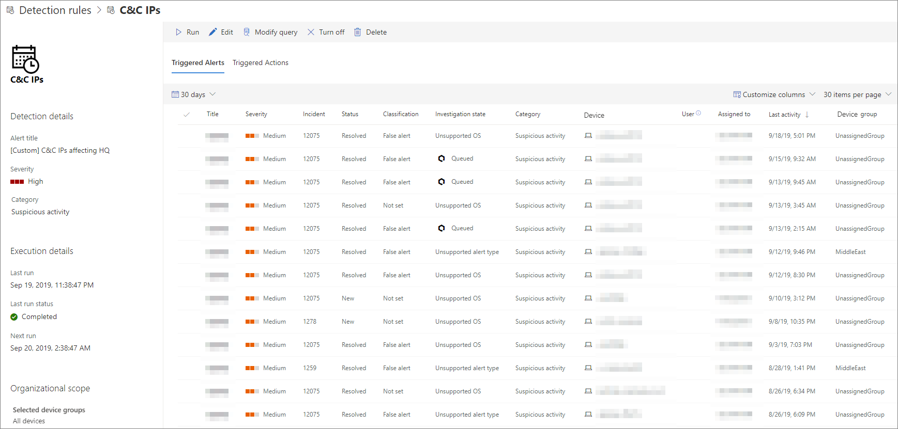

# 查看及管理自訂偵測規則

[!INCLUDE [Microsoft 365 Defender rebranding](../../includes/microsoft-defender.md)]

**適用於：**
- [適用於端點的 Microsoft Defender](https://go.microsoft.com/fwlink/p/?linkid=2154037)
- [Microsoft 365 Defender](https://go.microsoft.com/fwlink/?linkid=2118804)

>想要體驗 Defender for Endpoint？ [註冊免費試用版。](https://www.microsoft.com/microsoft-365/windows/microsoft-defender-atp?ocid=docs-wdatp-assignaccess-abovefoldlink)

管理您現有的 [自訂偵測規則](custom-detection-rules.md) ，以確保它們有效地尋找威脅並採取動作。 探索如何查看規則清單、檢查先前的執行，並複查其觸發的警示。 您也可以根據需要執行規則，並加以修改。

## 必要權限

若要建立或管理自訂的偵測， [您的角色](user-roles.md#create-roles-and-assign-the-role-to-an-azure-active-directory-group) 必須具有「 **管理安全性設定** 」許可權。

## 查看現有規則

若要查看所有現有的自訂偵測規則，請流覽至 [**設定**  >  **自訂** 偵測]。 頁面會列出具有下列執行資訊的所有規則：

- **上次執行** 時間-最後一次執行規則以檢查查詢符合專案並產生警示
- **上次執行狀態**—是否已成功執行規則
- **下一次執行**（下一個排程的執行）
- **狀態**—是否已開啟或關閉規則

## View rule details、modify rule 及 run rule

若要查看自訂偵測規則的完整資訊，請從 [**設定**  >  **自訂** 偵測] 中的規則清單中，選取規則的名稱。 關於選取之規則的頁面會顯示下列資訊：

- 規則的一般資訊，包括警示、執行狀態和範圍的詳細資料
- 觸發警示的清單
- 觸發動作清單

 
*自訂偵測規則頁面*

您也可以在此頁面上對規則採取下列動作：

- **Run**-立即執行規則。 此動作也會重設下一個執行的間隔。
- **編輯**—修改規則但不變更查詢
- **修改查詢**-在高級搜尋中編輯查詢
- **開啟**  / **關閉**—啟用規則或停止執行
- **刪除**—關閉規則並加以移除

>[!TIP]
>若要快速查看資訊，並對表格中的專案採取動作，請使用表格左邊的選取範圍欄 [&#10003;]。

## 相關主題
- [自訂偵測概觀](overview-custom-detections.md)
- [建立偵測規則](custom-detection-rules.md)
- [進階搜捕概觀](advanced-hunting-overview.md)
- [查看和組織提醒](alerts-queue.md)
