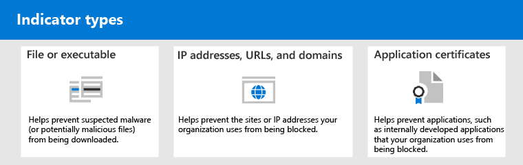

# <a name="address-false-positivesnegatives-in-microsoft-defender-for-endpoint"></a>適用於端點的 Microsoft Defender 中的位址誤判/誤否定

[!INCLUDE [Microsoft 365 Defender rebranding](../../includes/microsoft-defender.md)]

**適用於**

- [適用於端點的 Microsoft Defender](https://go.microsoft.com/fwlink/p/?linkid=2146806)

在 endpoint protection 解決方案中，誤報是指偵測到並識別為惡意的實體（例如檔案或處理常式），即使實體實際上不是威脅也是一樣。 誤報是指未被偵測為威脅的實體，但實際上為惡意。 任何威脅防護解決方案（包括 [Microsoft Defender For Endpoint](microsoft-defender-endpoint.md)）都可能會發生誤報/負片。


幸運的是，您可以採取步驟解決並減少這類問題。 如果您在[Microsoft 365 Defender](microsoft-defender-security-center.md)中看到誤報/負片 (先前為 Microsoft Defender 資訊安全中心) ，您的安全性作業可以採取步驟來處理這些錯誤，方法是使用下列程式：

1. [審閱和分類提醒](#part-1-review-and-classify-alerts)
2. [複查所執行的修復動作](#part-2-review-remediation-actions)
3. [審閱及定義排除專案](#part-3-review-or-define-exclusions)
4. [提交實體進行分析](#part-4-submit-a-file-for-analysis)
5. [檢查並調整威脅防護設定](#part-5-review-and-adjust-your-threat-protection-settings)

您可以在執行本文所述的工作時，取得錯誤陽性/負片問題，以取得協助。 [仍需要協助嗎？](#still-need-help)


> [!NOTE]
> 本文適用于使用 [Microsoft Defender For Endpoint](microsoft-defender-endpoint.md)的安全性操作員及安全性管理員的指導方針。

## <a name="part-1-review-and-classify-alerts"></a>第1部分：檢查和分類警示

如果您看到因偵測到非預期的惡意或可疑而觸發的 [警示](alerts.md) ，您可以抑制該實體的警示。 您也可以抑制不一定是誤報的警示，但並不重要。 我們建議您也對提醒進行分類。

管理提醒和分類 true/false 正值有助於訓練威脅防護解決方案，以及減少因時間的誤報或漏報數目。 採取這些步驟也有助於減少安全性作業儀表板中的噪音，讓安全性小組能夠專注于優先順序較高的工作專案。

### <a name="determine-whether-an-alert-is-accurate"></a>判斷警示是否正確

在您分類或抑制警示之前，請先判斷警示是否正確、誤報或良性。

1. 移至 Microsoft 365 Defender 入口網站 (<https://security.microsoft.com>) 並登入。

2. 在功能窗格中，選擇 [ **警示佇列**]。

3. 選取警示的詳細資料。  (請參閱 [在 Microsoft Defender For Endpoint 中查看警示](review-alerts.md)。 ) 

4. 根據警示狀態，採取下表所述的步驟：

<br>

****

|警示狀態|處理方式|
|---|---|
|警示準確無誤|指派提醒，然後進一步 [調查](investigate-alerts.md) 。|
|警示是誤報|<ol><li>[將警示歸類](#classify-an-alert) 為 false 陽性。</li><li>[抑制警示](#suppress-an-alert)。</li><li>[建立](#indicators-for-microsoft-defender-for-endpoint) Microsoft Defender for Endpoint 的標記。</li><li>[將檔案提交給 Microsoft 進行分析](#part-4-submit-a-file-for-analysis)。</li></ol>|
|警示正確，但誤報 (不重要) |將[警示歸類](#classify-an-alert)為 true 正值，然後[抑制警示](#suppress-an-alert)。|
|||

### <a name="classify-an-alert"></a>分類警示

警示可以分類為 Microsoft 365 Defender 中的誤報或 true 陽性。 分類提醒可協助訓練 Microsoft Defender for Endpoint，這樣一來，您就能看到更真實的通知，以及更少的錯誤警示。

1. 移至 Microsoft 365 Defender 入口網站 (<https://security.microsoft.com>) 並登入。

2. 選取 [ **提醒佇列**]，然後選取警示。

3. 針對選取的警示，選取 [**動作**  >  **管理警示**]。 隨即開啟彈出窗格。

4. 在 [ **管理提醒** ] 區段中，選取 [ **True 警示** ] 或 [ **False 警示**]。  (使用 **false 警示** 來分類誤報的誤報。 ) 

> [!TIP]
> 如需抑制警告的詳細資訊，請參閱 [管理 Microsoft Defender For Endpoint 警示](/microsoft-365/security/defender-endpoint/manage-alerts)。 而且，如果您的組織使用安全性資訊和事件管理 (SIEM) server，請務必同時定義抑制規則。

### <a name="suppress-an-alert"></a>抑制警示

如果您有警示是誤報或為 true，但為不重要的事件，您可以在 Microsoft 365 Defender 抑制這些警示。 抑制提醒有助於減少安全性作業儀表板中的噪音。

1. 移至 Microsoft 365 Defender 入口網站 (<https://security.microsoft.com>) 並登入。

2. 在功能窗格中，選取 [ **警示佇列**]。

3. 選取您要抑制的警示，以開啟其 **詳細資料** 窗格。

4. 在 **詳細資料** 窗格中，選擇 [省略號 (**...** ]) ，然後 **建立隱藏規則**。

5. 指定抑制規則的所有設定，然後選擇 [ **儲存**]。

> [!TIP]
> 需要關於抑制規則的協助嗎？ 請參閱 [抑制警示並建立新的抑制規則](/microsoft-365/security/defender-endpoint/manage-alerts#suppress-an-alert-and-create-a-new-suppression-rule)。

## <a name="part-2-review-remediation-actions"></a>第2部分：複查修復動作

[修正動作](manage-auto-investigation.md#remediation-actions)（例如傳送檔案至隔離或停止程式）的工作是針對實體 (，例如偵測為威脅) 的檔案。 透過自動調查和 Microsoft Defender 防毒軟體，會自動進行多種類型的修復動作：

- 隔離檔
- 移除登錄機碼
- 終止進程
- 停止服務
- 停用驅動程式
- 移除排程任務

其他動作（例如啟動防病毒掃描或收集調查套件）會手動或透過 [即時回應](live-response.md)進行。 透過 Live Response 採取的動作無法復原。

在您檢查提醒後，下一步是 [複查修復動作](manage-auto-investigation.md)。 如果因誤報而採取任何動作，您可以復原大多數類型的修復動作。 具體說來，您可以：

- [從行動中心還原隔離的檔案](#restore-a-quarantined-file-from-the-action-center)
- [一次撤銷多個動作](#undo-multiple-actions-at-one-time)
- [在多個裝置間移除隔離區中的](#remove-a-file-from-quarantine-across-multiple-devices)檔案。  及
- [從隔離區還原檔案](#restore-file-from-quarantine)

當您完成檢查並撤銷因誤報而採取的動作時，請繼續 [審閱或定義排除](#part-3-review-or-define-exclusions)。

### <a name="review-completed-actions"></a>查看已完成的動作

1. 在 Microsoft 365 Defender 入口網站的左側流覽窗格中，按一下 [**操作中心**]。

2. 選取 [ **記錄** ] 索引標籤，以查看採取的動作清單。

3. 選取專案，以查看有關所採取之修正動作的詳細資料。

### <a name="restore-a-quarantined-file-from-the-action-center"></a>從行動中心還原隔離的檔案

1. 在 Microsoft 365 Defender 入口網站的左側流覽窗格中，按一下 [**操作中心**]。

2. 在 [ **記錄** ] 索引標籤上，選取您要復原的動作。

3. 在快顯視窗中，選取 [ **復原**]。 如果無法使用此方法復原動作，您就不會看到 [ **復原** ] 按鈕。  (若要深入瞭解，請參閱 [復原已完成的動作](manage-auto-investigation.md#undo-completed-actions)。 ) 

### <a name="undo-multiple-actions-at-one-time"></a>一次撤銷多個動作

1. 在 Microsoft 365 Defender 入口網站的左側流覽窗格中，按一下 [**操作中心**]。

2. 在 [ **記錄** ] 索引標籤上，選取您要復原的動作。

3. 在螢幕右側的窗格中，選取 [ **復原**]。

### <a name="remove-a-file-from-quarantine-across-multiple-devices"></a>在多個裝置之間移除隔離區中的檔案

> [!div class="mx-imgBorder"]
> 

1. 在 Microsoft 365 Defender 入口網站的左側流覽窗格中，按一下 [**操作中心**]。

2. 在 [ **記錄** ] 索引標籤上，選取具有 [ **隔離** 檔] 動作類型的檔案。

3. 在螢幕右側的窗格中，選取 [套用至此檔案 **的 X 個實例**]，然後選取 [ **復原**]。

### <a name="restore-file-from-quarantine"></a>從隔離區還原檔案

如果您已決定在調查之後清除檔案，您可以從隔離區復原檔案並將其移除。 在隔離檔案的每個裝置上執行下列命令。

1. 在裝置上開啟已提升許可權的命令列提示：
   1. 轉至 **[開始]** 並鍵入 _「cmd」_。
   2. 以滑鼠右鍵按一下 [ **命令提示** 字元]，然後選取 [ **以管理員身分執行**]。

2. 輸入下列命令，然後按 **enter**：

    ```console
    "ProgramFiles%\Windows Defender\MpCmdRun.exe" –Restore –Name EUS:Win32/CustomEnterpriseBlock –All
    ```

    > [!IMPORTANT]
    > 在某些情況下， **ThreatName** 可能會顯示為 `EUS:Win32/CustomEnterpriseBlock!cl` 。 在過去30天內，在此裝置上已隔離的所有自訂封鎖檔案都會還原為端點。
    >
    > 被隔離成可能網路威脅的檔案可能無法復原。 如果使用者嘗試在隔離後還原檔案，該檔案可能無法存取。 這可能是因為系統已無法再有存取該檔案的網路認證。 一般來說，這是暫時登入系統或共用資料夾，且存取權杖已到期的結果。

3. 在螢幕右側的窗格中，選取 [套用至此檔案 **的 X 個實例**]，然後選取 [ **復原**]。

## <a name="part-3-review-or-define-exclusions"></a>第3部分：審閱或定義排除專案

排除是您指定作為修正動作例外狀況的實體（例如檔案或 URL）。 仍然可以偵測到已排除的實體，但不會對該實體採取任何修正動作。 也就是說，已偵測到的檔案或處理常式不會停止、傳送至隔離、移除，或由 Microsoft Defender for Endpoint 變更為已變更。

若要在 Microsoft Defender for Endpoint 中定義排除專案，請執行下列工作：

- [為 Microsoft Defender 防毒軟體定義排除專案](#exclusions-for-microsoft-defender-antivirus)
- [為 Microsoft Defender for Endpoint 建立 "allow" 標記](#indicators-for-microsoft-defender-for-endpoint)

> [!NOTE]
> Microsoft Defender 防毒軟體排除只會套用至防防毒保護，而不是跨其他 Microsoft Defender for Endpoint 功能。 若要排除廣泛的檔案，請針對 Microsoft Defender for Endpoint 的 Microsoft Defender 防毒軟體和[自訂指示器](/microsoft-365/security/defender-endpoint/manage-indicators)使用排除。

本節中的程式說明如何定義排除和指示器。

### <a name="exclusions-for-microsoft-defender-antivirus"></a>Microsoft Defender 防毒軟體的排除專案

一般說來，您不需要為 Microsoft Defender 防毒軟體定義排除專案。 請確定您少定義排除專案，而且您只會包含會產生誤報的檔案、資料夾、處理常式及處理常式開啟的檔。 此外，請務必定期查看您定義的排除專案。 建議使用[Microsoft 端點管理員](/mem/endpoint-manager-overview)來定義或編輯您的防病毒排除專案。不過，您可以使用其他方法，例如[群組原則](/azure/active-directory-domain-services/manage-group-policy) (請參閱[管理 Microsoft Defender for Endpoint](manage-atp-post-migration.md)) 。

> [!TIP]
> 需要防病毒排除的協助嗎？ 請參閱[設定及驗證 Microsoft Defender 防毒軟體掃描的排除](configure-exclusions-microsoft-defender-antivirus.md)專案。

#### <a name="use-microsoft-endpoint-manager-to-manage-antivirus-exclusions-for-existing-policies"></a>使用 Microsoft 端點管理員管理現有原則的防病毒排除 () 

1. 請移至 Microsoft 端點管理員系統管理中心 (<https://endpoint.microsoft.com>) 並登入。

2. 選擇 [ **Endpoint security**  >  **防病毒**]，然後選取現有的原則。  (如果您沒有現有的原則，或是您想要建立新的原則，請跳至 [下一個](#use-microsoft-endpoint-manager-to-create-a-new-antivirus-policy-with-exclusions) 程式) 。

3. 選擇 [ **屬性**]，然後選擇 [ **設定設定**] 旁的 [ **編輯**]。

4. 展開 **Microsoft Defender 防毒軟體排除** 專案，然後指定排除專案。

5. 選擇 [ **審閱 + 儲存**]，然後選擇 [ **儲存**]。

#### <a name="use-microsoft-endpoint-manager-to-create-a-new-antivirus-policy-with-exclusions"></a>使用 Microsoft 端點管理員建立包含排除的新防病毒原則

1. 請移至 Microsoft 端點管理員系統管理中心 (<https://endpoint.microsoft.com>) 並登入。

2. 選擇 [**安全性**  >  **防病毒**  >  **+ 建立原則**]。

3. 選取平臺 (，例如 **Windows 10 和更新版本**、 **macOS**] 或 [ **Windows 10 及 Windows Server**) 。

4. 在 [**設定檔**] 中，選取 [ **Microsoft Defender 防毒軟體排除**]，然後選擇 [**建立**]。

5. 指定設定檔的名稱和描述，然後選擇 **[下一步]**。

6. 在 [ **設定設定** ] 索引標籤上，指定防病毒排除，然後選擇 **[下一步]**。

7. 在 [ **範圍** 標籤] 索引標籤上，如果您在組織中使用範圍標記，請指定您要建立之原則的範圍標記。  (請參閱 [Scope tags](/mem/intune/fundamentals/scope-tags)。 ) 

8. 在 [ **工作分派** ] 索引標籤上，指定應套用原則的使用者和群組，然後選擇 **[下一步]**。  (如果您需要協助工作指派，請參閱[在 Microsoft Intune 中指派使用者和裝置設定檔](/mem/intune/configuration/device-profile-assign)。 ) 

9. 在 [ **複查 + 建立** ] 索引標籤上，複查設定，然後選擇 [ **建立**]。

### <a name="indicators-for-microsoft-defender-for-endpoint"></a>Microsoft Defender for Endpoint 的標記

指標[ (特別](/microsoft-365/security/defender-endpoint/manage-indicators)、有損損或 IoCs) 可讓您的安全性作業小組定義實體的偵測、預防和排除。 例如，您可以在 Microsoft Defender for Endpoint 中指定要省略的掃描和修正動作中的某些檔案。 您也可以使用指示器，針對特定的檔案、IP 位址或 URLs 產生警示。

若要將實體指定為 Microsoft Defender for Endpoint 的排除專案，請為這些實體建立 "allow" 標記。 Microsoft Defender for Endpoint 中的這類「允許」指示器適用于 [下一代保護](microsoft-defender-antivirus-in-windows-10.md)、 [端點偵測和回應](overview-endpoint-detection-response.md)，以及 [自動調查 & 修復](/microsoft-365/security/defender-endpoint/automated-investigations)。

可為下列專案建立 "Allow" 指示器：

- [Files](#indicators-for-files)
- [IP 位址、URLs 及網域](#indicators-for-ip-addresses-urls-or-domains)
- [應用程式憑證](#indicators-for-application-certificates)



#### <a name="indicators-for-files"></a>檔標記

當您為檔案 [（例如可執行檔）建立「允許」指示器](/microsoft-365/security/defender-endpoint/indicator-file)時，它會協助防止您的組織所使用的檔案遭到封鎖。 檔案可以包含可遷移的可執行檔 (PE) 檔案，例如 `.exe` 和 `.dll` files。

在您為檔案建立指示器之前，請確定符合下列需求：

- 已啟用以雲端式保護方式設定 Microsoft Defender 防毒軟體 (請參閱[管理雲端型保護](/windows/security/threat-protection/microsoft-defender-antivirus/deploy-manage-report-microsoft-defender-antivirus)) 
- 反惡意軟體用戶端版本為4.18.1901 或更新版本
- 裝置執行 Windows 10，版本1703或更新版本;Windows Server 2016;或 Windows Server 2019
- [已開啟組塊或 allow 功能](/microsoft-365/security/defender-endpoint/advanced-features)

#### <a name="indicators-for-ip-addresses-urls-or-domains"></a>IP 位址、URLs 或網域的標記

當您 [為 IP 位址、URL 或網域建立「允許」指示器](/microsoft-365/security/defender-endpoint/indicator-ip-domain)時，它有助於防止組織使用的網站或 IP 位址遭到封鎖。

在您為 IP 位址、URLs 或網域建立指示器之前，請確定符合下列需求：

- 已在封鎖模式中啟用在 Defender for Endpoint 中的網路保護 (請參閱 [Enable network protection](/microsoft-365/security/defender-endpoint/enable-network-protection)) 
- 反惡意軟體用戶端版本為4.18.1906 或更新版本
- 裝置執行 Windows 10、版本1709或更新版本）

在[Microsoft 365 Defender](microsoft-defender-security-center.md)中開啟自訂網路指示器。 若要深入瞭解，請參閱 [高級功能](/microsoft-365/security/defender-endpoint/advanced-features)。

#### <a name="indicators-for-application-certificates"></a>應用程式憑證的標記

當您 [為應用程式憑證建立「允許」指示器](/microsoft-365/security/defender-endpoint/indicator-certificates)時，它可協助防止組織使用的應用程式（例如內部開發的應用程式）遭到封鎖。 `.CER``.PEM`支援副檔名或副檔名。

在您建立應用程式憑證的指示器之前，請確定符合下列需求：

- 已啟用以雲端式保護方式設定 Microsoft Defender 防毒軟體 (請參閱[管理雲端型保護](deploy-manage-report-microsoft-defender-antivirus.md)) 
- 反惡意軟體用戶端版本為4.18.1901 或更新版本
- 裝置執行 Windows 10，版本1703或更新版本;Windows Server 2016;或 Windows Server 2019
- 病毒和威脅防護定義是最新的

> [!TIP]
> 當您建立指示器時，您可以逐個定義它們，也可以一次匯入多個專案。 請記住，單一承租人的限制為15000標記。 而且，您可能需要先收集特定詳細資料，例如檔案雜湊資訊。 請務必先檢查必要條件，再 [建立指示器](manage-indicators.md)。

## <a name="part-4-submit-a-file-for-analysis"></a>第4部分：提交檔案以進行分析

您可以將實體（例如檔案和 fileless 偵測）提交給 Microsoft 進行分析。 Microsoft security 研究員會分析所有提交，其結果會協助通知 Microsoft Defender 進行端點威脅防護功能。 當您在提交網站登入時，您可以追蹤您的提交。

### <a name="submit-a-file-for-analysis"></a>提交檔案以進行分析

如果您有錯誤偵測為惡意或已錯過的檔案，請遵循下列步驟提交檔案進行分析。

1. 請參閱此處的指導方針： [提交檔案以進行分析](/windows/security/threat-protection/intelligence/submission-guide)。

2. 流覽 Microsoft 安全情報提交網站 (<https://www.microsoft.com/wdsi/filesubmission>) ，並提交您的檔案 (s) 。

### <a name="submit-a-fileless-detection-for-analysis"></a>提交 fileless 偵測以供分析

如果偵測到某項專案是以惡意程式碼為基礎，而且您沒有檔案，您可以提交檔案 `Mpsupport.cab` 進行分析。 您可以在 Windows 10 上使用 Microsoft 惡意程式碼保護 Command-Line 公用程式 (MPCmdRun.exe) 工具，取得 *.cab* 檔案。

1. 移至 ` C:\ProgramData\Microsoft\Windows Defender\Platform\<version>` ，然後 `MpCmdRun.exe` 以系統管理員身分執行。

2. 類型 `mpcmdrun.exe -GetFiles` ，然後按 **enter**。

   會產生包含各種診斷記錄檔的 .cab 檔。 檔案的位置會在命令提示字元的輸出中指定。 根據預設，位置是 `C:\ProgramData\Microsoft\Microsoft Defender\Support\MpSupportFiles.cab` 。

3. 請參閱此處的指導方針： [提交檔案以進行分析](/windows/security/threat-protection/intelligence/submission-guide)。

4. 流覽 Microsoft 安全情報提交網站 (<https://www.microsoft.com/wdsi/filesubmission>) ，然後提交您的 .cab 檔案。

### <a name="what-happens-after-a-file-is-submitted"></a>提交檔後會發生什麼情況？

您的提交會立即由我們的系統進行掃描，以在分析員開始處理您的案例之前，為您提供最新的決定。 檔可能已由分析員提交並處理。 在這種情況下，會很快進行判斷。

對於尚未處理的報送，會依照下列方式進行分析的優先順序：

- 可能影響大量電腦的流行檔案會獲得較高的優先順序。
- 已驗證的客戶，尤其是具有有效 [軟體保證 IDs (SAIDs) ](https://www.microsoft.com/licensing/licensing-programs/software-assurance-default.aspx)中的企業客戶，都具有較高的優先順序。
- 被稱為「持有者」標為高優先順序的報送會立即注意。

若要檢查有關您提交的更新，請在[Microsoft 安全情報提交網站](https://www.microsoft.com/wdsi/filesubmission)上登入。

> [!TIP]
> 若要深入瞭解，請參閱 [Submit files for analysis](/windows/security/threat-protection/intelligence/submission-guide#how-does-microsoft-prioritize-submissions)。

## <a name="part-5-review-and-adjust-your-threat-protection-settings"></a>第5部分：檢查並調整威脅防護設定

Microsoft Defender for Endpoint 提供各種各樣的選項，包括微調各種功能及功能的設定的功能。 如果您收到大量的誤報，請務必檢查您組織的威脅防護設定。 您可能需要進行一些調整：

- [雲端提供的保護](#cloud-delivered-protection)
- [可能有害之應用程式的修復](#remediation-for-potentially-unwanted-applications)
- [自動化調查和修正](#automated-investigation-and-remediation)

### <a name="cloud-delivered-protection"></a>雲端提供的保護

檢查您的雲端提供的保護層級 Microsoft Defender 防毒軟體。 根據預設，已將雲端傳送保護設定為 [ **未** 設定]，這會對應至大多陣列織的一般保護層級。 如果您的雲端傳送保護設定為 **高**、 **高 +** 或零的 **容錯**，您可能會遇到較高的誤報數目。

> [!TIP]
> 若要深入瞭解設定雲端提供的保護，請參閱 [指定雲端提供的保護層級](/windows/security/threat-protection/microsoft-defender-antivirus/specify-cloud-protection-level-microsoft-defender-antivirus)。

建議使用[Microsoft 端點管理員](/mem/endpoint-manager-overview)來編輯或設定您的雲端提供的保護設定。不過，您可以使用其他方法，例如[群組原則](/azure/active-directory-domain-services/manage-group-policy) (請參閱[管理 Microsoft Defender for Endpoint](manage-atp-post-migration.md)) 。

#### <a name="use-microsoft-endpoint-manager-to-review-and-edit-cloud-delivered-protection-settings-for-existing-policies"></a>使用 Microsoft 端點管理員複查及編輯現有原則的雲端傳送保護設定 () 

1. 請移至 Microsoft 端點管理員系統管理中心 (<https://endpoint.microsoft.com>) 並登入。

2. 選擇 [ **Endpoint security**  >  **防病毒**]，然後選取現有的原則。  (如果您沒有現有的原則，或是您想要建立新的原則，請跳至 [下一個](#use-microsoft-endpoint-manager-to-set-cloud-delivered-protection-settings-for-a-new-policy) 程式) 。

3. 在 [ **管理**] 下，選取 [ **屬性**]。 然後，選擇 [ **設定設定**] 旁的 [ **編輯**]。

4. 展開 [ **cloud protection**]，並在 [ **雲端提供的保護層級** ] 列中查看您目前的設定。 建議您將雲端提供的保護設定為 [ **未設定**]，這樣可提供強大的保護，同時減少接收誤報的機率。

5. 選擇 [複查] 和 [ **儲存**]，然後按一下 [ **儲存**]。

#### <a name="use-microsoft-endpoint-manager-to-set-cloud-delivered-protection-settings-for-a-new-policy"></a>使用 Microsoft 端點管理員設定新原則的雲端傳送保護設定 () 

1. 請移至 Microsoft 端點管理員系統管理中心 (<https://endpoint.microsoft.com>) 並登入。

2. 選擇 [**安全性**  >  **防病毒**  >  **+ 建立原則**]。

3. 在 [**平臺**] 中，選取選項，然後針對 [**設定檔**]，選取 [**防病毒** 或 **Microsoft Defender 防毒軟體** (特定選項取決於您為 **Platform** 選取的專案。 ) 然後選擇 [**建立**]。

4. 在 [ **基礎** ] 索引標籤上，指定原則的名稱和描述。 接著選擇 [下一步]。

5. 在 [ **設定設定** ] 索引標籤上，展開 [ **Cloud protection**]，然後指定下列設定：
   - 將 **雲端傳送保護開啟** 為 **[是]**。
   - 將 **[雲端式保護層級]** 設定為 **[未設定]**。  (此層級預設會提供強層級的保護，同時降低取得誤報的機率。 ) 

6. 在 [ **範圍** 標籤] 索引標籤上，如果您在組織中使用範圍標記，請指定原則的範圍標記。  (請參閱 [Scope tags](/mem/intune/fundamentals/scope-tags)。 ) 

7. 在 [ **工作分派** ] 索引標籤上，指定應套用原則的使用者和群組，然後選擇 **[下一步]**。  (如果您需要協助工作指派，請參閱[在 Microsoft Intune 中指派使用者和裝置設定檔](/mem/intune/configuration/device-profile-assign)。 ) 

8. 在 [ **複查 + 建立** ] 索引標籤上，複查設定，然後選擇 [ **建立**]。

### <a name="remediation-for-potentially-unwanted-applications"></a>可能有害之應用程式的修復

可能有害的應用程式 (PUA) 是一種軟體類別，可導致裝置執行緩慢、顯示未預期的廣告，或是安裝可能是意外或不需要的其他軟體。 PUA 的範例包括廣告軟體、搭售軟體，以及與安全性產品行為不同的規避軟體。 雖然 PUA 不會被視為惡意程式碼，但某些類型的軟體會根據其行為和信譽而 PUA。

> [!TIP]
> 若要深入瞭解 PUA，請參閱偵測 [和封鎖可能不需要的應用程式](/windows/security/threat-protection/microsoft-defender-antivirus/detect-block-potentially-unwanted-apps-microsoft-defender-antivirus)。

視您的組織使用的應用程式而定，您可能會因為 PUA 保護設定而取得誤報。 如有必要，請考慮在稽核模式中執行 PUA 保護一段時間，或將 PUA protection 套用至組織中裝置的子集。 您可以為 Microsoft Edge 瀏覽器及 Microsoft Defender 防毒軟體設定 PUA 保護。

建議使用[Microsoft 端點管理員](/mem/endpoint-manager-overview)來編輯或設定 PUA 保護設定;不過，您可以使用其他方法，例如[群組原則](/azure/active-directory-domain-services/manage-group-policy) (請參閱[管理 Microsoft Defender for Endpoint](manage-atp-post-migration.md)) 。

#### <a name="use-microsoft-endpoint-manager-to-edit-pua-protection-for-existing-configuration-profiles"></a>使用 Microsoft 端點管理員編輯現有設定設定檔的 PUA 保護 () 

1. 請移至 Microsoft 端點管理員系統管理中心 (<https://endpoint.microsoft.com>) 並登入。

2. 選擇 [**裝置** 設定  >  **設定檔**]，然後選取現有的原則。  (如果您沒有現有的原則，或是您想要建立新的原則，請跳至 [下一個](#use-microsoft-endpoint-manager-to-set-pua-protection-for-a-new-configuration-profile)程式。 ) 

3. 在 [ **管理**] 下 **，選擇 [** 內容]，然後按一下 [ **設定設定**] 旁的 [ **編輯**]。

4. 在 [**設定設定**] 索引標籤上，向下滾動並展開 **Microsoft Defender 防毒軟體**。

5. 將 [偵測 **可能有害的應用程式** ] 設定為 [ **審計**]。  (您可以將它關閉，但透過使用「稽核模式」，您就能看到偵測。 ) 

6. 選擇 [ **審閱 + 儲存**]，然後選擇 [ **儲存**]。

#### <a name="use-microsoft-endpoint-manager-to-set-pua-protection-for-a-new-configuration-profile"></a>使用 Microsoft 端點管理員設定新設定設定檔的 PUA 保護 () 

1. 請移至 Microsoft 端點管理員系統管理中心 (<https://endpoint.microsoft.com>) 並登入。

2. 選擇 [**裝置**  >  **設定檔**]  >  **+ [建立設定檔**]。

3. 針對 [**平臺**]，選擇 [ **Windows 10 和更新版本**]，然後針對 [**設定檔**] 選取 [**裝置限制**]。

4. 在 [ **基礎** ] 索引標籤上，指定原則的名稱和描述。 接著選擇 [下一步]。

5. 在 [**設定設定**] 索引標籤上，向下滾動並展開 **Microsoft Defender 防毒軟體**。

6. 設定 [偵測 **可能有害的應用程式** 進行 **審計**]，然後選擇 **[下一步]**。  (您可以關閉 PUA 保護，但透過使用稽核模式，您就可以看到偵測。 ) 

7. 在 [ **工作分派** ] 索引標籤上，指定應套用原則的使用者和群組，然後選擇 **[下一步]**。  (如果您需要協助工作指派，請參閱[在 Microsoft Intune 中指派使用者和裝置設定檔](/mem/intune/configuration/device-profile-assign)。 ) 

8. 在 [ **適用性規則** ] 索引標籤上，指定要包含或排除的原則中的 OS 版本。 例如，您可以設定原則套用至所有的裝置 Windows 10 的某些版本。 接著選擇 [下一步]。

9. 在 [ **複查 + 建立** ] 索引標籤上，複查您的設定，然後選擇 [ **建立**]。

### <a name="automated-investigation-and-remediation"></a>自動化調查與補救措施

[自動調查和修正](automated-investigations.md) (AIR) 功能是專門用來檢查警示，並立即採取行動以解決違規行為。 在觸發警示時，自動調查執行時，會針對每個證據調查產生一個判定。 Verdicts 可能是 *惡意*、 *可疑* 或 *沒有發現威脅*。

根據您組織的 [自動化設定層級](/microsoft-365/security/defender-endpoint/automation-levels) 及其他安全性設定，對被視為 *惡意* 或 *可疑* 的偽像採取修正動作。 在某些情況下，會自動進行修正動作;在其他情況下，修復動作會以手動方式取得，或是只在您的安全操作小組核准時進行。

- [深入瞭解自動化層級](/microsoft-365/security/defender-endpoint/automation-levels);然後
- [在 Defender For Endpoint 中設定 AIR 功能](/microsoft-365/security/defender-endpoint/configure-automated-investigations-remediation)。

> [!IMPORTANT]
> 建議使用 *完整的自動化* ，以進行自動調查和修復。 請勿關閉這些功能，因為是誤報。 相反地，使用 ["allow" 標記來定義例外](#indicators-for-microsoft-defender-for-endpoint)狀況，並將自動調查和修正設定為自動採取適當的動作。 遵循 [此指南](automation-levels.md#levels-of-automation) 可協助減少您的安全作業小組必須處理的提醒數目。

## <a name="still-need-help"></a>是否仍需要協助？

如果您已完成本文中的所有步驟，但仍需要協助，請與技術支援人員聯繫。

1. 移至 Microsoft 365 Defender (<https://security.microsoft.com>) 並登入。

2. 在右上角，選取 [問號] (**？**) ]，然後選取 [ **Microsoft 支援**]。

3. 在 [ **支援助理** ] 視窗中，描述您的問題，然後傳送您的郵件。 您可以從那裡開啟服務要求。

## <a name="see-also"></a>另請參閱

[管理 Microsoft Defender for Endpoint](manage-atp-post-migration.md)

[Microsoft 365 Defender 入口網站概述](/microsoft-365/security/defender-endpoint/use)
