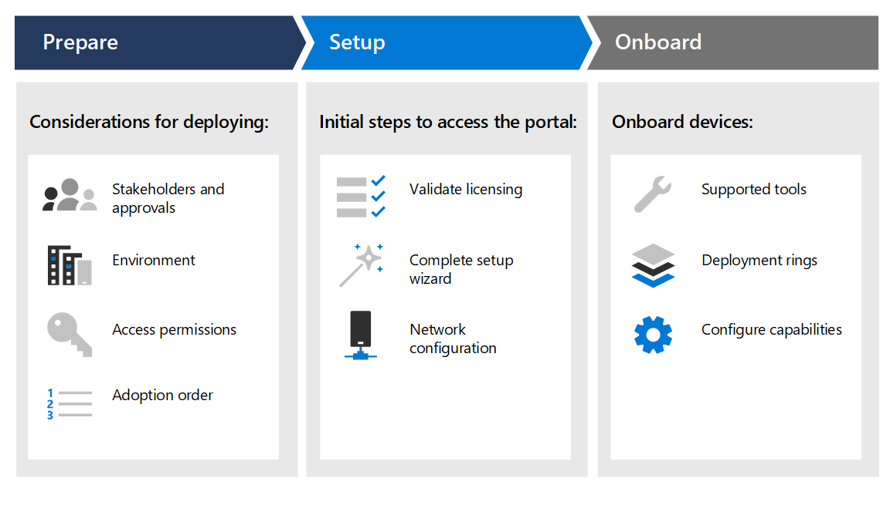

# 部署階段Deployment phases

[!INCLUDE [Microsoft 365 Defender rebranding](../../includes/microsoft-defender.md)]

**適用於：****Applies to:**
- [適用於端點的 Microsoft DefenderMicrosoft Defender for Endpoint](https://go.microsoft.com/fwlink/p/?linkid=2154037)
- [Microsoft 365 DefenderMicrosoft 365 Defender](https://go.microsoft.com/fwlink/?linkid=2118804)

>想要體驗 Defender for Endpoint？Want to experience Defender for Endpoint? [注册免費試用版。Sign up for a free trial.](https://www.microsoft.com/microsoft-365/windows/microsoft-defender-atp?ocid=docs-wdatp-assignaccess-abovefoldlink)

瞭解如何部署 Microsoft Defender for Endpoint，使您的企業能夠利用預防性防護、入侵後偵測、自動調查和回應。Learn how to deploy Microsoft Defender for Endpoint so that your enterprise can take advantage of preventative protection, post-breach detection, automated investigation, and response. 

本指南可協助您在不同的專案關係人上運作，以系統方式準備您的環境，然後以系統方式從評估移至有意義的試驗，以進行完整部署。This guide helps you work across stakeholders to prepare your environment and then onboard devices in a methodical way, moving from evaluation, to a meaningful pilot, to full deployment.

每一節都對應此方案中的個別文章。Each section corresponds to a separate article in this solution.

|階段Phase | 描述Description | 
|:-------|:-----|
| [階段 1：準備Phase 1: Prepare](prepare-deployment.md)| 深入瞭解部署 Defender （如專案關係人核准、環境考慮、存取權及功能採用順序）時，您需要考慮的事項。Learn about what you need to consider when deploying Defender for Endpoint such as stakeholder approvals, environment considerations, access permissions, and adoption order of capabilities. 
| [階段 2：設定Phase 2: Setup](production-deployment.md)|  取得您必須採取之初始步驟的指導方針，讓您可以存取入口網站，例如驗證授權、完成安裝精靈及網路設定。Get guidance on the initial steps you need to take so that you can access the portal such as validating licensing, completing the setup wizard, and network configuration. 
| [第 3 階段：導入Phase 3: Onboard](onboarding.md) | 瞭解如何使用部署環、根據端點類型所支援的內架工具，以及設定可用的功能。Learn how to make use of deployment rings, supported onboarding tools based on the type of endpoint, and configuring available capabilities. 

當您完成本指南後，您將會使用正確的存取權限進行安裝，而您的端點將會架並報告感應器資料給服務，而下一代保護和攻擊面降低等功能將會就地實施。After you've completed this guide, you'll be setup with the right access permissions, your endpoints will be onboarded and reporting sensor data to the service, and capabilities such as next-generation protection and attack surface reduction will be in place.

不論 [規劃部署](deployment-strategy.md) 指導中所選擇的環境架構和部署方法為何，本指南都將為您提供上架端點的支援。Regardless of the environment architecture and method of deployment you choose outlined in the [Plan deployment](deployment-strategy.md) guidance, this guide is going to support you in onboarding endpoints. 

## 主要功能Key capabilities

雖然 Microsoft Defender for Endpoint 提供許多功能，但此部署指南的主要目的是讓您開始使用上架裝置。While Microsoft Defender for Endpoint provides many capabilities, the primary purpose of this deployment guide is to get you started by onboarding devices. 除了上架之外，本指南也可讓您開始使用下列功能。In addition to onboarding, this guidance gets you started with the following capabilities.

功能Capability | 描述Description 
:---|:---
端點偵測及回應Endpoint detection and response | 端點偵測和回應功能可就地偵測、調查和回應入侵嘗試和主動違例。Endpoint detection and response capabilities are put in place to detect, investigate, and respond to intrusion attempts and active breaches.
新一代保護Next-generation protection | 若要進一步鞏固網路的安全性周邊，Microsoft Defender for Endpoint 會使用下一代保護，以捕捉所有類型的新威脅。To further reinforce the security perimeter of your network, Microsoft Defender for Endpoint uses next-generation protection designed to catch all types of emerging threats.
攻擊面縮小Attack surface reduction |  在堆疊中提供第一項防護。Provide the first line of defense in the stack. 透過確定設定設定正確，並套用利用緩解技術，這些功能可讓攻擊和利用。By ensuring configuration settings are properly set and exploit mitigation techniques are applied, these set of capabilities resist attacks and exploitation.

所有這些功能均可供 Microsoft Defender for Endpoint 授權擁有者使用。All these capabilities are available for Microsoft Defender for Endpoint license holders. 如需詳細資訊，請參閱 [授權要求](minimum-requirements.md#licensing-requirements)。For more information, see [Licensing requirements](minimum-requirements.md#licensing-requirements).

## 範圍Scope

### 在範圍內In scope

-   使用 Microsoft 端點管理員和 Microsoft 端點管理員上架端點至服務和設定功能Use of Microsoft Endpoint Manager and Microsoft Endpoint Manager to onboard endpoints into the service and configure capabilities

-   啟用 (EDR) 功能的 Defender endpoint endpoint 偵測和回應Enabling Defender for Endpoint endpoint detection and response (EDR)  capabilities

-   啟用適用于 Endpoint endpoint protection 平臺的 Defender (EPP) 功能Enabling Defender for Endpoint endpoint protection platform (EPP) capabilities

    -   新一代保護Next-generation protection

    -   攻擊面縮小Attack surface reduction

### 超出範圍Out of scope

下列專案不在本部署指南的範圍內：The following are out of scope of this deployment guide:

-   設定可能與 Defender for Endpoint 整合的協力廠商解決方案Configuration of third-party solutions that might integrate with Defender for Endpoint

-   實際執行環境中的滲透測試Penetration testing in production environment

## 另請參閱See also
- [階段 1：準備Phase 1: Prepare](prepare-deployment.md)
- [階段 2：設定Phase 2: Set up](production-deployment.md)
- [第 3 階段：導入Phase 3: Onboard](onboarding.md)
- [規劃部署Plan deployment](deployment-strategy.md)