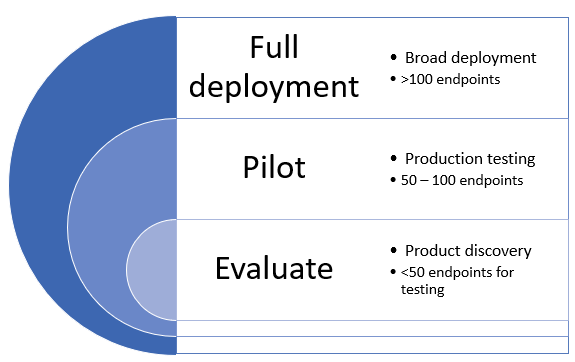

# 在環中部署 Microsoft Defender for EndpointDeploy Microsoft Defender for Endpoint in rings

[!INCLUDE [Microsoft 365 Defender rebranding](../../includes/microsoft-defender.md)]

**適用於：****Applies to:**
- [適用於端點的 Microsoft DefenderMicrosoft Defender for Endpoint](https://go.microsoft.com/fwlink/p/?linkid=2154037)
- [Microsoft 365 DefenderMicrosoft 365 Defender](https://go.microsoft.com/fwlink/?linkid=2118804)

>想要體驗 Defender for Endpoint？Want to experience Defender for Endpoint? [注册免費試用版。Sign up for a free trial.](https://www.microsoft.com/microsoft-365/windows/microsoft-defender-atp?ocid=docs-wdatp-assignaccess-abovefoldlink)

您可以使用以環為基礎的部署方法來部署 Microsoft Defender for Endpoint。Deploying Microsoft Defender for Endpoint can be done using a ring-based deployment approach. 

部署週期可用於下列案例：The deployment rings can be applied in the following scenarios:
- [新部署New deployments](#new-deployments)
- [現有部署Existing deployments](#existing-deployments)

## 新部署New deployments

震鈴方法是一種方法，可將一組端點識別成板載，並確認符合特定準則，然後再繼續將服務部署到一組較大的裝置。A ring-based approach is a method of identifying a set of endpoints to onboard and verifying that certain criteria is met before proceeding to deploy the service to a larger set of devices. 您可以為每個震鈴定義結束準則，並在移動至下一環之前確定已完成。You can define the exit criteria for each ring and ensure that they are satisfied before moving on to the next ring.

採用以震鈴的部署可協助減少在推出服務時可能發生的潛在問題。Adopting a ring-based deployment helps reduce potential issues that could arise while rolling out the service. 透過試驗特定數目的裝置，您可以識別潛在問題，並減輕可能發生的潛在風險。By piloting a certain number of devices first, you can identify potential issues and mitigate potential risks that might arise. 

表1提供您可能使用的部署環範例。Table 1 provides an example of the deployment rings you might use. 

**表1****Table 1**

|**部署環****Deployment ring**|**描述****Description**|
|:-----|:-----|
EvaluateEvaluate | Ring 1：識別試驗測試的50系統Ring 1: Identify 50 systems for pilot testing 
試驗Pilot | Ring 2：在實際執行環境中識別下50-100 端點Ring 2: Identify the next 50-100  endpoints in production environment    
完整部署Full deployment | 震鈴3：以較大的增量向環境中的其他環境推出服務Ring 3: Roll out service to the rest of environment in larger increments

### 退出準則Exit criteria
這些震鈴的一組出口準則範例包括：An example set of exit criteria for these rings can include:
- 裝置庫存清單中顯示裝置Devices show up in the device inventory list
- 在儀表板中顯示警示Alerts appear in dashboard
- [執行偵測測試Run a detection test](run-detection-test.md)
- [在裝置上執行模擬的攻擊Run a simulated attack on a device](attack-simulations.md)

### EvaluateEvaluate
識別您環境中的少量測試電腦，以在服務上架。Identify a small number of test machines in your environment to onboard to the service. 理想情況下，這些機器會少於50端點。Ideally, these machines would be fewer than 50 endpoints. 

### 試驗Pilot
Microsoft Defender for Endpoint 支援您可以在服務上架的各種端點。Microsoft Defender for Endpoint supports a variety of endpoints that you can onboard to the service. 在此震鈴中，根據您所定義的允出準則，識別多個裝置，並決定繼續進行下一個部署環。In this ring, identify several devices to onboard and based on the exit criteria you define, decide to proceed to the next deployment ring.

下表顯示支援的端點，以及您可以用於板載裝置裝置至服務的對應工具。The following table shows the supported endpoints and the corresponding tool you can use to onboard devices to the service. 

| 端點Endpoint     | 部署工具Deployment tool                       |
|--------------|------------------------------------------|
| **Windows****Windows**  |  [本機腳本 (最多10個裝置) Local script (up to 10 devices)](configure-endpoints-script.md)   附注：如果您想要在實際執行環境中部署超過10個裝置，請改用「群組原則」方法或下列所列的其他支援工具。NOTE: If you want to deploy more than 10 devices in a production environment, use the Group Policy method instead or the other supported tools listed below.   [群組原則Group Policy](configure-endpoints-gp.md)    [Microsoft 端點管理員/行動裝置管理員Microsoft Endpoint Manager/ Mobile Device Manager](configure-endpoints-mdm.md)     [Microsoft Endpoint Configuration ManagerMicrosoft Endpoint Configuration Manager](configure-endpoints-sccm.md)   [VDI 腳本VDI scripts](configure-endpoints-vdi.md)   |
| **macOS****macOS**    | [本機腳本Local script](mac-install-manually.md)   [Microsoft 端點管理員Microsoft Endpoint Manager](mac-install-with-intune.md)   [JAMF ProJAMF Pro](mac-install-with-jamf.md)   [行動裝置管理Mobile Device Management](mac-install-with-other-mdm.md) |
| **Linux 伺服器****Linux Server** | [本機腳本Local script](linux-install-manually.md)   [木偶Puppet](linux-install-with-puppet.md)   [AnsibleAnsible](linux-install-with-ansible.md)|
| **iOS****iOS**      | [以應用程式為基礎App-based](ios-install.md)                                |
| **Android****Android**  | [Microsoft 端點管理員Microsoft Endpoint Manager](android-intune.md)               | 

### 完整部署Full deployment
在此階段中，您可以使用 [計畫部署](deployment-strategy.md) 材料來協助您規劃部署。At this stage, you can use the [Plan deployment](deployment-strategy.md) material to help you plan your deployment. 

使用下列材料，為最適合您組織的端點架構選取適當的 Microsoft Defender。Use the following material to select the appropriate Microsoft Defender for Endpoint architecture that best suites your organization.

|**Item****Item**|**描述****Description**|
|:-----|:-----|
|  [PDF](https://github.com/MicrosoftDocs/microsoft-365-docs/raw/public/microsoft-365/security/defender-endpoint/downloads/mdatp-deployment-strategy.pdf)  \| [Visio](https://github.com/MicrosoftDocs/microsoft-365-docs/raw/public/microsoft-365/security/defender-endpoint/downloads/mdatp-deployment-strategy.vsdx)[PDF](https://github.com/MicrosoftDocs/microsoft-365-docs/raw/public/microsoft-365/security/defender-endpoint/downloads/mdatp-deployment-strategy.pdf)  \| [Visio](https://github.com/MicrosoftDocs/microsoft-365-docs/raw/public/microsoft-365/security/defender-endpoint/downloads/mdatp-deployment-strategy.vsdx) | 架構材料可協助您規劃下列架構的部署：The architectural material helps you plan your deployment for the following architectures: <ul><li> 雲端-原生Cloud-native </li><li> 共同管理Co-management </li><li> 內部部署On-premise</li><li>評估與本機上架Evaluation and local onboarding</li>

## 現有部署Existing deployments

### Windows 端點Windows endpoints
若為 Windows 和/或 Windows Server，您可以使用 **安全性更新驗證計畫 (SUVP)**，選取要提前測試的幾部電腦，以在 patch 星期二) 之前 (。For Windows and/or Windows Servers, you select several machines to test ahead of time (before patch Tuesday) by using the **Security Update Validation program (SUVP)**.

如需詳細資訊，請參閱：For more information, see:
- [何謂安全性更新驗證程式What is the Security Update Validation Program](https://techcommunity.microsoft.com/t5/windows-it-pro-blog/what-is-the-security-update-validation-program/ba-p/275767)
- [軟體更新驗證計畫和 Microsoft 惡意程式碼保護中心 TwC 互動式時程表第4部分Software Update Validation Program and Microsoft Malware Protection Center Establishment - TwC Interactive Timeline Part 4](https://www.microsoft.com/security/blog/2012/03/28/software-update-validation-program-and-microsoft-malware-protection-center-establishment-twc-interactive-timeline-part-4/)

### 非 Windows 端點Non-Windows endpoints
使用 macOS 和 Linux，您可以使用一些系統，並在 "InsidersFast" 通道中執行。With macOS and Linux, you could take a couple of systems and run in the "InsidersFast" channel.

>[!NOTE]
>理想情況下，至少有一個安全性管理員和一個開發人員，這樣您就能在組建進入「生產」通道之前找到相容性、效能和可靠性問題。Ideally at least one security admin and one developer so that you are able to find compatibility, performance and reliability issues before the build makes it into the "Production" channel.

通道選擇會決定提供給裝置的更新類型及頻率。The choice of the channel determines the type and frequency of updates that are offered to your device. 在內部版本中的裝置快用的第一種方法是接收更新及新功能，然後是上一個程式-速度慢，最後透過生產。Devices in insiders-fast are the first ones to receive updates and new features, followed later by insiders-slow and lastly by prod.

為了預覽新功能並提供及早的意見反應，建議您將企業中的部分裝置設定為使用預覽人員-快或內部的速度緩慢。In order to preview new features and provide early feedback, it is recommended that you configure some devices in your enterprise to use either insiders-fast or insiders-slow.

>[!WARNING]
>初次安裝後切換通道需要重新安裝產品。Switching the channel after the initial installation requires the product to be reinstalled. 若要切換產品通道，請執行下列動作：卸載現有的套件、重新設定裝置以使用新通道，然後依照此檔中的步驟，從新位置安裝套件。To switch the product channel: uninstall the existing package, re-configure your device to use the new channel, and follow the steps in this document to install the package from the new location.
