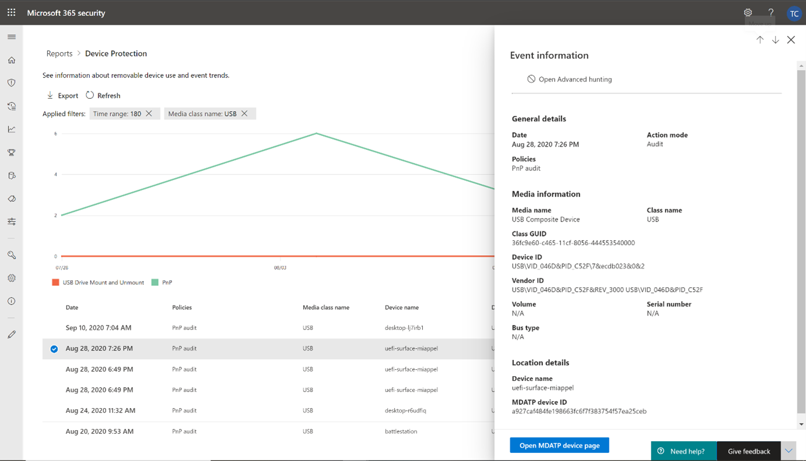
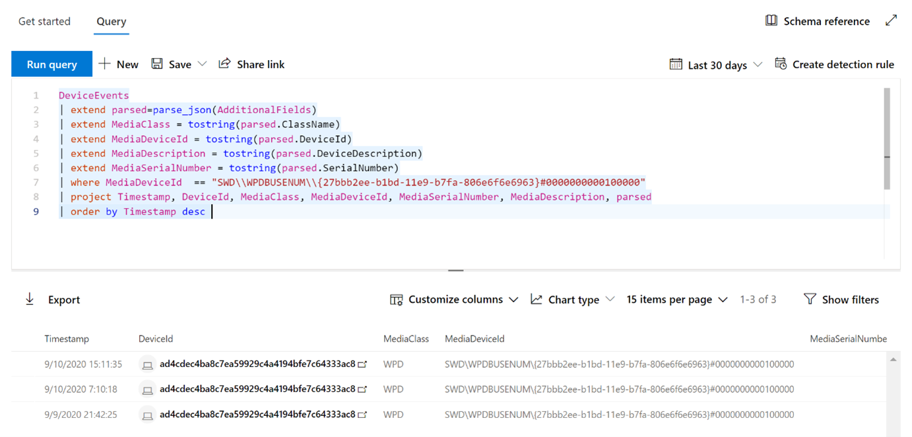

# 使用裝置控制來保護貴組織的資料

**適用于：** [Microsoft Defender for Endpoint](https://go.microsoft.com/fwlink/p/?linkid=2069559)

Microsoft Defender for Endpoint device control：透過監視和控制組織中裝置使用的媒體（例如，使用可移動儲存裝置和 USB 磁片磁碟機），以防止資料遺失。

您可以使用裝置控制報告，查看與媒體使用狀況相關的事件，例如：

- **審核事件：** 顯示外部媒體連線時發生的審計事件數目。
- **原則事件：** 顯示在觸發裝置控制原則時發生的原則事件數目。

> [!NOTE]
> 架至 Microsoft Defender for Endpoint 的裝置預設會啟用用於追蹤媒體使用狀況的「審核」事件。

## 瞭解審核事件

審核事件包括：

- **USB 磁片磁碟機裝載和卸載：** 在裝載或卸下 USB 磁片磁碟機時所產生的審計事件。
- **PnP：** 「隨插即用」審核事件會在連線儲存裝置、印表機或藍牙媒體連線時產生。

## 監視裝置控制安全性

Microsoft Defender for Endpoint 中的裝置控制可讓安全性管理員使用工具，透過報告追蹤組織的裝置控制安全性。 您可以在 Microsoft 365 的「安全性中心」找到「裝置控制」報告， **> 裝置保護**。

在 [ **報告** ] 儀表板上的裝置保護卡會顯示媒體類型所產生的審計事件數目（過去180天內）。

> [!div class="mx-imgBorder"]
> 

[ **查看詳細** 資料] 按鈕會在 [ **裝置控制報告** ] 頁面中顯示更多媒體使用方式資料。

此頁面提供儀表板，包含每個類型的事件總數和事件清單。 管理員可以篩選時間範圍、媒體類別名稱和裝置識別碼。

> [!div class="mx-imgBorder"]
> 

當您選取事件時，會出現一個快顯視窗，顯示其他資訊：

- **一般詳細資料：** 日期、動作模式和此事件的原則。
- **媒體資訊：** 媒體資訊包含媒體名稱、類別名稱、類別 GUID、裝置識別碼、廠商識別碼、磁片區編號及主線類型。
- **位置詳細資料：** 裝置名稱和 MDATP 裝置識別碼。

> [!div class="mx-imgBorder"]
> 

若要查看整個組織中此媒體的即時活動，請選取 [ **開啟高級搜尋** ] 按鈕。 這包括內嵌的預先定義的查詢。

> [!div class="mx-imgBorder"]
> 

若要查看裝置的安全性，請選取浮出控制項上的 [ **開啟裝置] 頁面** 按鈕。 此按鈕會開啟 [裝置實體] 頁面。

> [!div class="mx-imgBorder"]
> 

## 報告延遲

裝置控制項報告可以從媒體連接發生時的12小時延遲到卡片中或網域清單中所反映的事件。
