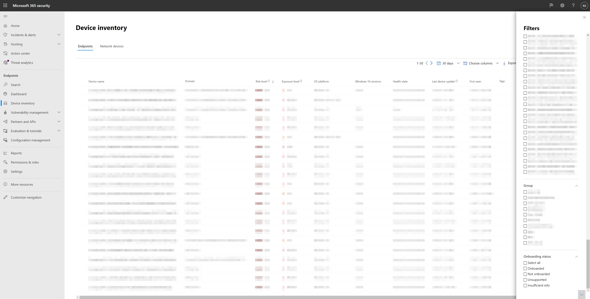

# <a name="device-discovery-overview"></a><span data-ttu-id="f8482-104">裝置探索概述</span><span class="sxs-lookup"><span data-stu-id="f8482-104">Device discovery overview</span></span>

[!INCLUDE [Microsoft 365 Defender rebranding](../../includes/microsoft-defender.md)]

<span data-ttu-id="f8482-105">**適用於：**</span><span class="sxs-lookup"><span data-stu-id="f8482-105">**Applies to:**</span></span>
- [<span data-ttu-id="f8482-106">適用於端點的 Microsoft Defender</span><span class="sxs-lookup"><span data-stu-id="f8482-106">Microsoft Defender for Endpoint</span></span>](https://go.microsoft.com/fwlink/p/?linkid=2146631)
- [<span data-ttu-id="f8482-107">Microsoft 365 Defender</span><span class="sxs-lookup"><span data-stu-id="f8482-107">Microsoft 365 Defender</span></span>](https://go.microsoft.com/fwlink/?linkid=2118804)

[!include[Prerelease information](../../includes/prerelease.md)]

<span data-ttu-id="f8482-108">保護您的環境需要清查您網路中的裝置。</span><span class="sxs-lookup"><span data-stu-id="f8482-108">Protecting your environment requires taking inventory of the devices that are in your network.</span></span> <span data-ttu-id="f8482-109">不過，網路中的對應裝置通常會成本高、富有挑戰性且耗時。</span><span class="sxs-lookup"><span data-stu-id="f8482-109">However, mapping devices in a network can often be expensive, challenging, and time-consuming.</span></span> 

<span data-ttu-id="f8482-110">Microsoft Defender for Endpoint 提供裝置探索功能，可協助您尋找連接至公司網路的未受管理裝置，而不需要額外裝置或繁瑣的處理常式變更。</span><span class="sxs-lookup"><span data-stu-id="f8482-110">Microsoft Defender for Endpoint provides a device discovery capability that helps you find unmanaged devices connected to your corporate network without the need for extra appliances or cumbersome process changes.</span></span>


<span data-ttu-id="f8482-111">裝置探索功能可讓您：</span><span class="sxs-lookup"><span data-stu-id="f8482-111">The device discovery capability allows you to:</span></span>

- <span data-ttu-id="f8482-112">**探索連線到公司網路的企業端點**</span><span class="sxs-lookup"><span data-stu-id="f8482-112">**Discover enterprise endpoints connected to your corporate network**</span></span> <br>
<span data-ttu-id="f8482-113">您可以使用初級或 standard 探索選項，探索尚未架至 Microsoft Defender for Endpoint 的工作站、伺服器及行動端點。</span><span class="sxs-lookup"><span data-stu-id="f8482-113">Using either basic or standard discovery options, you can discover workstations, servers, and mobile endpoints that are not yet onboarded to Microsoft Defender for Endpoint.</span></span>  

- <span data-ttu-id="f8482-114">**上架探索到的端點**</span><span class="sxs-lookup"><span data-stu-id="f8482-114">**Onboard discovered endpoints**</span></span><br>
<span data-ttu-id="f8482-115">網路中未受管理的端點會向您的網路引進弱點和風險。</span><span class="sxs-lookup"><span data-stu-id="f8482-115">Unmanaged endpoints in your network introduce vulnerabilities and risks to your network.</span></span> <span data-ttu-id="f8482-116">將其上架至服務可提高安全性。</span><span class="sxs-lookup"><span data-stu-id="f8482-116">Onboarding them to the service can increase the security visibility on them.</span></span> 

<span data-ttu-id="f8482-117">結合這項功能，在現有威脅和弱點管理經驗中，將會提供對 Microsoft Defender for Endpoint 之板載裝置的新安全性建議。</span><span class="sxs-lookup"><span data-stu-id="f8482-117">In conjunction with this capability, a new security recommendation to onboard devices to Microsoft Defender for Endpoint will be available as part of the existing Threat and Vulnerability Management experience.</span></span>


## <a name="discovery-methods"></a><span data-ttu-id="f8482-118">探索方法</span><span class="sxs-lookup"><span data-stu-id="f8482-118">Discovery methods</span></span>
<span data-ttu-id="f8482-119">探索分為兩個模式：</span><span class="sxs-lookup"><span data-stu-id="f8482-119">There are two modes of discovery:</span></span> 

-   <span data-ttu-id="f8482-120">基本探索</span><span class="sxs-lookup"><span data-stu-id="f8482-120">Basic discovery</span></span> 
-   <span data-ttu-id="f8482-121">建議的標準探索 () </span><span class="sxs-lookup"><span data-stu-id="f8482-121">Standard discovery (recommended)</span></span> 


> [!IMPORTANT]
> <span data-ttu-id="f8482-122">探索已設定為基本模式。</span><span class="sxs-lookup"><span data-stu-id="f8482-122">Discovery is set to basic mode.</span></span> <span data-ttu-id="f8482-123">您可以選擇透過 [設定] 頁面保留此設定。</span><span class="sxs-lookup"><span data-stu-id="f8482-123">You can choose to retain this configuration through the settings page.</span></span> <span data-ttu-id="f8482-124">在此日期之前，除非透過 [設定] 頁面進行修改，否則所有預覽版客戶的預設模式都會是2021。</span><span class="sxs-lookup"><span data-stu-id="f8482-124">Standard discovery will be the default mode for all preview customers starting May 10, 2021 - unless modified through the settings page before this date.</span></span>

### <a name="basic-discovery"></a><span data-ttu-id="f8482-125">基本探索</span><span class="sxs-lookup"><span data-stu-id="f8482-125">Basic discovery</span></span> 

<span data-ttu-id="f8482-126">在此模式中，端點會被動收集您網路中的事件，並從這些事件析取裝置資訊。</span><span class="sxs-lookup"><span data-stu-id="f8482-126">In this mode, endpoints will passively collect events in your network and extract device information from them.</span></span> <span data-ttu-id="f8482-127">基本探索使用 SenseNDR.exe 用於被動式網路資料收集的二進位，而且不會啟動任何網路流量。</span><span class="sxs-lookup"><span data-stu-id="f8482-127">Basic discovery uses the SenseNDR.exe binary for passive network data collection and no network traffic will be initiated.</span></span> <span data-ttu-id="f8482-128">端點只會從架裝置所看到的每個網路流量提取資料。</span><span class="sxs-lookup"><span data-stu-id="f8482-128">Endpoints will simply extract data from every network traffic that is seen by an onboarded device.</span></span> 

### <a name="standard-discovery"></a><span data-ttu-id="f8482-129">標準探索</span><span class="sxs-lookup"><span data-stu-id="f8482-129">Standard discovery</span></span> 

<span data-ttu-id="f8482-130">此模式可讓端點主動探查網路中的觀測裝置，以濃縮收集的資料，以協助您建立可靠且連貫的設備清查。</span><span class="sxs-lookup"><span data-stu-id="f8482-130">This mode allows endpoints to actively probe observed devices in the network to enrich collected data - helping you build a reliable and coherent device inventory.</span></span> <span data-ttu-id="f8482-131">標準模式使用智慧主動探測，探索有關所觀察裝置的詳細資訊，以濃縮現有的裝置資訊。</span><span class="sxs-lookup"><span data-stu-id="f8482-131">Standard mode uses smart, active probing to discover even more information about observed devices to enrich existing device information.</span></span>  

<span data-ttu-id="f8482-132">啟用標準模式時，由組織中的網路監視工具可能會觀測出探索感應器所產生的最小和不計的網路活動。</span><span class="sxs-lookup"><span data-stu-id="f8482-132">When Standard mode is enabled, minimal and negligible network activity generated by the discovery sensor might be observed by network monitoring tools in your organization.</span></span>  

 <span data-ttu-id="f8482-133">如果您選擇不啟用此模式，您的網路中只會獲得有限的非受管理端點的可見度。</span><span class="sxs-lookup"><span data-stu-id="f8482-133">If you choose not to enable this mode, you will only gain limited visibility of unmanaged endpoints in your network.</span></span>

<span data-ttu-id="f8482-134">Standard discovery 使用各種 PowerShell 腳本，在網路上主動探查裝置。</span><span class="sxs-lookup"><span data-stu-id="f8482-134">Standard discovery uses various PowerShell scripts to actively probe devices in the network.</span></span> <span data-ttu-id="f8482-135">這些 PowerShell 腳本是由 Microsoft 簽署，並從下列位置執行： `C:\ProgramData\Microsoft\Windows Defender Advanced Threat Protection\Downloads\*.ps` 。</span><span class="sxs-lookup"><span data-stu-id="f8482-135">Those PowerShell scripts are Microsoft signed and are executed from the following location: `C:\ProgramData\Microsoft\Windows Defender Advanced Threat Protection\Downloads\*.ps`.</span></span> <span data-ttu-id="f8482-136">例如，`C:\ProgramData\Microsoft\Windows Defender Advanced Threat Protection\Downloads\UnicastScannerV1.1.0.ps1`。</span><span class="sxs-lookup"><span data-stu-id="f8482-136">For example, `C:\ProgramData\Microsoft\Windows Defender Advanced Threat Protection\Downloads\UnicastScannerV1.1.0.ps1`.</span></span>

<span data-ttu-id="f8482-137">您可以變更及自訂探索設定，如需詳細資訊，請參閱 [Configure device discovery](configure-device-discovery.md)。</span><span class="sxs-lookup"><span data-stu-id="f8482-137">You can change and customize your discovery settings, for more information see [Configure device discovery](configure-device-discovery.md).</span></span>

> [!NOTE]
> <span data-ttu-id="f8482-138">探索引擎會區別公司網路中所接收的網路事件與公司網路以外的網路事件。</span><span class="sxs-lookup"><span data-stu-id="f8482-138">The discovery engine distinguishes between network events that are received in the corporate network versus outside of the corporate network.</span></span> <span data-ttu-id="f8482-139">未連接到公司網路的裝置將不會被探索或列在設備清查中。</span><span class="sxs-lookup"><span data-stu-id="f8482-139">Devices that are not connected to corporate networks will not be discovered or listed in the device inventory.</span></span> 


## <a name="device-inventory"></a><span data-ttu-id="f8482-140">裝置清單</span><span class="sxs-lookup"><span data-stu-id="f8482-140">Device Inventory</span></span> 
<span data-ttu-id="f8482-141">已發現但尚未由 Microsoft Defender for Endpoint 架及保護的裝置，將會列在 [端點] 索引標籤的 [裝置庫存] 中。您現在可以在名為「上架狀態」的裝置庫存清單清單中使用新的篩選器，其可具有下列任何值：</span><span class="sxs-lookup"><span data-stu-id="f8482-141">Devices that have been discovered but have not yet been onboarded and secured by Microsoft Defender for Endpoint will be listed in Device Inventory within the Endpoints tab. You can now use a new filter in the device inventory list called Onboarding status which can have any of the following values:</span></span>

- <span data-ttu-id="f8482-142">架–端點是架至 Microsoft Defender for Endpoint。</span><span class="sxs-lookup"><span data-stu-id="f8482-142">Onboarded – The endpoint is onboarded to Microsoft Defender for Endpoint.</span></span>
- <span data-ttu-id="f8482-143">可以是架–端點已在網路中探索，且已將作業系統識別為 Microsoft Defender for Endpoint 所支援，但目前並未架。</span><span class="sxs-lookup"><span data-stu-id="f8482-143">Can be onboarded – The endpoint was discovered in the network and the Operating System was identified as one that is supported by Microsoft Defender for Endpoint, but it is not currently onboarded.</span></span> <span data-ttu-id="f8482-144">我們強烈建議您將這些裝置上架。</span><span class="sxs-lookup"><span data-stu-id="f8482-144">We highly recommend onboarding these devices.</span></span>
- <span data-ttu-id="f8482-145">不受支援–端點已在網路中探索，但無法由 Microsoft Defender for Endpoint 所支援。</span><span class="sxs-lookup"><span data-stu-id="f8482-145">Unsupported – The endpoint was discovered in the network but is not supported by Microsoft Defender for Endpoint.</span></span>
- <span data-ttu-id="f8482-146">資訊不足–系統無法決定裝置的支援。</span><span class="sxs-lookup"><span data-stu-id="f8482-146">Insufficient info – The system could not determine the supportability of the device.</span></span> <span data-ttu-id="f8482-147">在網路上的更多裝置上啟用標準探索，可以豐富探索的屬性。</span><span class="sxs-lookup"><span data-stu-id="f8482-147">Enabling standard discovery on more devices in the network can enrich the discovered attributes.</span></span> 
 




## <a name="vulnerability-assessment-on-discovered-devices"></a><span data-ttu-id="f8482-149">已探索裝置上的漏洞評估</span><span class="sxs-lookup"><span data-stu-id="f8482-149">Vulnerability assessment on discovered devices</span></span>
<span data-ttu-id="f8482-150">在您的裝置上以及其他探索網路上的受管理裝置，在 [安全性建議] 底下的目前 TVM 流程中，以及整個入口網站的實體頁面中所代表的，其弱點和風險都是部分。</span><span class="sxs-lookup"><span data-stu-id="f8482-150">Vulnerabilities and risks on your devices as well as other discovered unmanaged devices in the network are part of the current TVM flows under "Security Recommendations" and represented in entity pages across the portal.</span></span> <span data-ttu-id="f8482-151">搜尋「SSH」相關的安全性建議，以尋找與非管理裝置相關的 SSH 安全性漏洞。</span><span class="sxs-lookup"><span data-stu-id="f8482-151">Search for "SSH" related security recommendations to find SSH vulnerabilities that are related for unmanaged and managed devices.</span></span> 

  

## <a name="use-advanced-hunting-on-discovered-devices"></a><span data-ttu-id="f8482-153">在探索的裝置上使用高級搜尋</span><span class="sxs-lookup"><span data-stu-id="f8482-153">Use Advanced Hunting on discovered devices</span></span>
<span data-ttu-id="f8482-154">您可以使用高級搜尋查詢，以取得已探索裝置的知名度。</span><span class="sxs-lookup"><span data-stu-id="f8482-154">You can use Advanced Hunting queries to gain visibility on discovered devices.</span></span>
<span data-ttu-id="f8482-155">尋找 DeviceInfo 表格中已探索端點的詳細資料，或 DeviceNetworkInfo 表格中這些裝置的網路相關資訊。</span><span class="sxs-lookup"><span data-stu-id="f8482-155">Find details about discovered Endpoints in the DeviceInfo table, or network-related information about those devices in the DeviceNetworkInfo table.</span></span>
  


<span data-ttu-id="f8482-157">裝置探索利用 Microsoft Defender for Endpoint 架裝置作為網路資料來源，以進行非架裝置的屬性活動。</span><span class="sxs-lookup"><span data-stu-id="f8482-157">Device discovery leverages Microsoft Defender for Endpoint onboarded devices as a network data source to attribute activities to non-onboarded devices.</span></span> <span data-ttu-id="f8482-158">這表示，如果 Microsoft Defender for Endpoint 架裝置與非架裝置通訊，則在時程表上或透過 [高級搜尋 DeviceNetworkEvents] 表格可看到非架裝置上的活動。</span><span class="sxs-lookup"><span data-stu-id="f8482-158">This means that if a Microsoft Defender for Endpoint onboarded device communicated with a non-onboarded device, activities on the non-onboarded device can be seen on the timeline and through the Advanced hunting DeviceNetworkEvents table.</span></span> 


<span data-ttu-id="f8482-159">新的事件是傳輸控制通訊協定 (TCP) 連線，而且會符合目前的 DeviceNetworkEvents 配置。</span><span class="sxs-lookup"><span data-stu-id="f8482-159">New events are Transmission Control Protocol (TCP) connections-based and will fit to the current DeviceNetworkEvents scheme.</span></span> <span data-ttu-id="f8482-160">在啟用的非 Microsoft Defender 端點中，TCP 入口至 Microsoft Defender for Endpoint 的裝置。</span><span class="sxs-lookup"><span data-stu-id="f8482-160">TCP ingress to the Microsoft Defender for Endpoint enabled device from a non-Microsoft Defender for Endpoint enabled.</span></span>  

<span data-ttu-id="f8482-161">也新增了下列動作類型：</span><span class="sxs-lookup"><span data-stu-id="f8482-161">The following action types have also been added:</span></span>  

- <span data-ttu-id="f8482-162">ConnectionAttempt-嘗試 (syn) 建立 TCP 連接</span><span class="sxs-lookup"><span data-stu-id="f8482-162">ConnectionAttempt - An attempt to establish a TCP connection (syn)</span></span>  
- <span data-ttu-id="f8482-163">ConnectionAcknowledged-已接受 TCP 連線的認可 (syn\ack) </span><span class="sxs-lookup"><span data-stu-id="f8482-163">ConnectionAcknowledged - An acknowledgment that a TCP connection was accepted (syn\ack)</span></span>  

<span data-ttu-id="f8482-164">您可以嘗試此範例查詢：</span><span class="sxs-lookup"><span data-stu-id="f8482-164">You can try this example query:</span></span>  

```
DeviceNetworkEvents  
| where ActionType == "ConnectionAcknowledged" or ActionType == "ConnectionAttempt"  
| take 10  
```


## <a name="changed-behaviour"></a><span data-ttu-id="f8482-165">變更的行為</span><span class="sxs-lookup"><span data-stu-id="f8482-165">Changed behaviour</span></span>
<span data-ttu-id="f8482-166">下列章節列出當啟用此功能時，您在 Microsoft Defender for Endpoint 和/或 Microsoft 365 Security Center 中所看到的變更。</span><span class="sxs-lookup"><span data-stu-id="f8482-166">The following section lists the changes you'll observe in Microsoft Defender for Endpoint and/or Microsoft 365 Security Center when this capability is enabled.</span></span> 
 
1.  <span data-ttu-id="f8482-167">未架至 Microsoft Defender to Endpoint 的裝置應該會出現在設備清查、高級搜尋和 API 查詢中。</span><span class="sxs-lookup"><span data-stu-id="f8482-167">Devices that are not onboarded to Microsoft Defender to Endpoint are expected to appear in the device inventory, advanced hunting, and API queries.</span></span> <span data-ttu-id="f8482-168">這可能會大幅增加查詢結果的大小。</span><span class="sxs-lookup"><span data-stu-id="f8482-168">This may significantly increase the size of query results.</span></span> 
    1. <span data-ttu-id="f8482-169">Advanced 搜尋中的 "DeviceInfo" 和 "DeviceNetworkInfo" 資料表現在會保留探索的裝置。</span><span class="sxs-lookup"><span data-stu-id="f8482-169">"DeviceInfo" and "DeviceNetworkInfo" tables in Advanced Hunting will now hold discovered device.</span></span> <span data-ttu-id="f8482-170">您可以使用 "OnboardingStatus" 屬性來篩選出那些裝置。</span><span class="sxs-lookup"><span data-stu-id="f8482-170">You can filter out those devices by using “OnboardingStatus” attribute.</span></span>

    2. <span data-ttu-id="f8482-171">探索的裝置應該會出現在流式 API 查詢結果中。</span><span class="sxs-lookup"><span data-stu-id="f8482-171">Discovered devices are expected to appear in Streaming API query results.</span></span> <span data-ttu-id="f8482-172">您可以在查詢中使用篩選來篩選出那些裝置 `OnboardingStatus` 。</span><span class="sxs-lookup"><span data-stu-id="f8482-172">You can filter out those devices by using the `OnboardingStatus` filter in your query.</span></span> 

2.  <span data-ttu-id="f8482-173">根據定義的準則，未受管理的裝置會指派給現有的裝置群組。</span><span class="sxs-lookup"><span data-stu-id="f8482-173">Unmanaged devices will be assigned to existing device groups based on the defined criteria.</span></span> 
3.  <span data-ttu-id="f8482-174">在極少的情況下，Standard discovery 可能會在網路監視器或安全性工具上觸發警示。</span><span class="sxs-lookup"><span data-stu-id="f8482-174">In rare cases, Standard discovery might trigger alerts on network monitors or security tools.</span></span> <span data-ttu-id="f8482-175">如果您經歷這類事件，請提供意見反應，以協助避免這些問題重複發生。</span><span class="sxs-lookup"><span data-stu-id="f8482-175">Please provide feedback, if you experience such events, to help prevent these issues from recurring.</span></span> <span data-ttu-id="f8482-176">您可以明確地排除特定目標或整個子網，使其積極地透過 Standard discovery 進行探測。</span><span class="sxs-lookup"><span data-stu-id="f8482-176">You can explicitly exclude specific targets or entire subnets from being actively probed by Standard discovery.</span></span> 


## <a name="next-steps"></a><span data-ttu-id="f8482-177">後續步驟</span><span class="sxs-lookup"><span data-stu-id="f8482-177">Next steps</span></span>
- [<span data-ttu-id="f8482-178">設定裝置探索</span><span class="sxs-lookup"><span data-stu-id="f8482-178">Configure device discovery</span></span>](configure-device-discovery.md)
- [<span data-ttu-id="f8482-179">裝置探索 FAQs</span><span class="sxs-lookup"><span data-stu-id="f8482-179">Device discovery FAQs</span></span>](device-discovery-faq.md)
