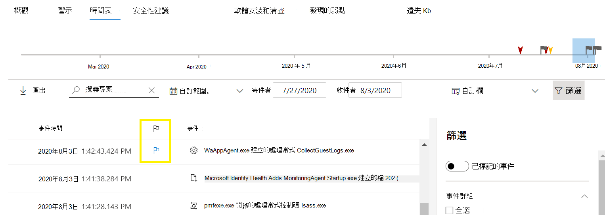
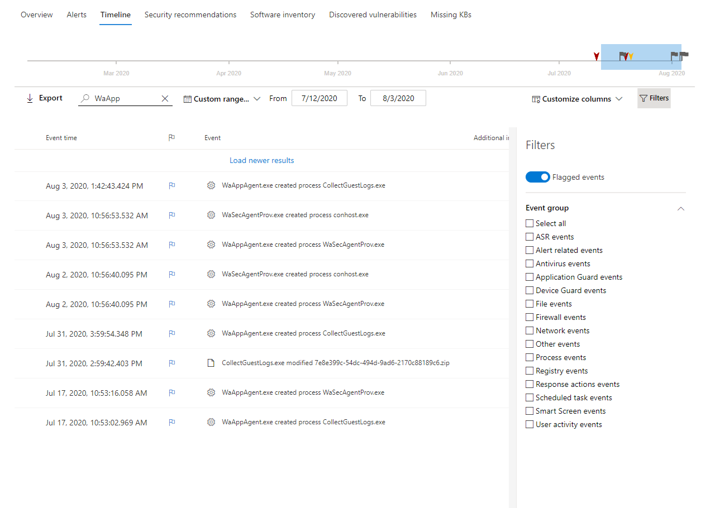

# Microsoft Defender for Endpoint 裝置的時間表事件旗標

[!INCLUDE [Microsoft 365 Defender rebranding](../../includes/microsoft-defender.md)]

**適用於：**
- [適用於端點的 Microsoft Defender](https://go.microsoft.com/fwlink/p/?linkid=2154037)
- [Microsoft 365 Defender](https://go.microsoft.com/fwlink/?linkid=2118804)

>想要體驗 Defender for Endpoint？ [注册免費試用版。](https://www.microsoft.com/microsoft-365/windows/microsoft-defender-atp?ocid=docs-wdatp-assignaccess-abovefoldlink)

Defender for Endpoint 裝置時程表中的事件旗標可協助您在調查可能的攻擊時，篩選和組織特定事件。

[Defender for Endpoint 裝置時程表] 提供在裝置上觀察到的事件及相關警示的按時間排序的視圖。 此事件清單可讓您在裝置上看到任何事件、檔案及 IP 位址的完整可視性。 清單有時候會很長。 裝置時程表事件旗標可協助您追蹤可能相關的事件。 

在您完成裝置時程表之後，您可以排序、篩選和匯出您已標記的特定事件。

流覽裝置時程表時，您可以搜尋並篩選特定的事件。 您可以使用下列方式設定事件旗標： 

- 高亮顯示最重要的事件 
- 標示需要深入深入的事件 
- 建立清晰的破壞時程表

## 旗標事件
1. 尋找您要標示的事件
2. 按一下 [旗標] 欄中的旗標圖示。 

## 查看已標記的事件  
1. 在 [時程表 **篩選** ] 區段中，啟用已 **標記的事件**。
2. 按一下 ****[套用]。 只會顯示已標示的事件。
您可以按一下時間列來套用其他篩選器。 這只會顯示已標示事件之前的事件。  

