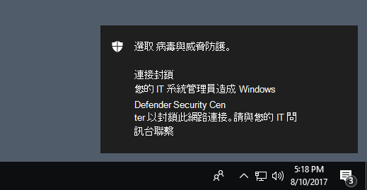

# <a name="evaluate-network-protection"></a><span data-ttu-id="4b5d7-104">評估網路保護</span><span class="sxs-lookup"><span data-stu-id="4b5d7-104">Evaluate network protection</span></span>

[!INCLUDE [Microsoft 365 Defender rebranding](../../includes/microsoft-defender.md)]

<span data-ttu-id="4b5d7-105">**適用於：**</span><span class="sxs-lookup"><span data-stu-id="4b5d7-105">**Applies to:**</span></span>
- [<span data-ttu-id="4b5d7-106">適用於端點的 Microsoft Defender</span><span class="sxs-lookup"><span data-stu-id="4b5d7-106">Microsoft Defender for Endpoint</span></span>](https://go.microsoft.com/fwlink/?linkid=2154037)
- - [<span data-ttu-id="4b5d7-107">Microsoft 365 Defender</span><span class="sxs-lookup"><span data-stu-id="4b5d7-107">Microsoft 365 Defender</span></span>](https://go.microsoft.com/fwlink/?linkid=2118804)

<span data-ttu-id="4b5d7-108">[網路保護](network-protection.md) 可協助防止員工使用任何應用程式來存取可能會在網際網路上主控網路釣魚詐騙、入侵和其他惡意內容的危險網域。</span><span class="sxs-lookup"><span data-stu-id="4b5d7-108">[Network protection](network-protection.md) helps prevent employees from using any application to access dangerous domains that may host phishing scams, exploits, and other malicious content on the Internet.</span></span>

<span data-ttu-id="4b5d7-109">本文可協助您評估網路保護，只要啟用該功能並引導您進行測試網站。</span><span class="sxs-lookup"><span data-stu-id="4b5d7-109">This article helps you evaluate network protection by enabling the feature and guiding you to a testing site.</span></span> <span data-ttu-id="4b5d7-110">這項評估文章中的網站不是惡意的。</span><span class="sxs-lookup"><span data-stu-id="4b5d7-110">The sites in this evaluation article aren't malicious.</span></span> <span data-ttu-id="4b5d7-111">他們已特別建立了假裝為惡意的網站。</span><span class="sxs-lookup"><span data-stu-id="4b5d7-111">They're specially created websites that pretend to be malicious.</span></span> <span data-ttu-id="4b5d7-112">網站會複製使用者在訪問惡意網站或網域時會發生的行為。</span><span class="sxs-lookup"><span data-stu-id="4b5d7-112">The site will replicate the behavior that would happen if a user visited a malicious site or domain.</span></span>

> [!TIP]
> <span data-ttu-id="4b5d7-113">您也可以在 [demo.wd.microsoft.com](https://demo.wd.microsoft.com?ocid=cx-wddocs-testground) 流覽 Microsoft Defender Testground 網站，以查看其他保護功能的運作方式。</span><span class="sxs-lookup"><span data-stu-id="4b5d7-113">You can also visit the Microsoft Defender Testground website at [demo.wd.microsoft.com](https://demo.wd.microsoft.com?ocid=cx-wddocs-testground) to see how other protection features work.</span></span>

## <a name="enable-network-protection-in-audit-mode"></a><span data-ttu-id="4b5d7-114">在稽核模式中啟用網路保護</span><span class="sxs-lookup"><span data-stu-id="4b5d7-114">Enable network protection in audit mode</span></span>

<span data-ttu-id="4b5d7-115">在稽核模式中啟用網路保護，以查看已封鎖的 IP 位址和網域。</span><span class="sxs-lookup"><span data-stu-id="4b5d7-115">Enable network protection in audit mode to see which IP addresses and domains would have been blocked.</span></span> <span data-ttu-id="4b5d7-116">您可以確定不會影響企業營運的應用程式，或瞭解封鎖發生的頻率。</span><span class="sxs-lookup"><span data-stu-id="4b5d7-116">You can make sure it doesn't affect line-of-business apps, or get an idea of how often blocks occur.</span></span>

1. <span data-ttu-id="4b5d7-117">在 [開始] 功能表中輸入 **powershell** ，在 **Windows PowerShell** 上按一下滑鼠右鍵，然後選取 [以 **系統管理員身分執行**]</span><span class="sxs-lookup"><span data-stu-id="4b5d7-117">Type **powershell** in the Start menu, right-click **Windows PowerShell** and select **Run as administrator**</span></span>
2. <span data-ttu-id="4b5d7-118">輸入下列 Cmdlet：</span><span class="sxs-lookup"><span data-stu-id="4b5d7-118">Enter the following cmdlet:</span></span>

    ```PowerShell
    Set-MpPreference -EnableNetworkProtection AuditMode
    ```

### <a name="visit-a-fake-malicious-domain"></a><span data-ttu-id="4b5d7-119">造訪 (假冒) 惡意網域</span><span class="sxs-lookup"><span data-stu-id="4b5d7-119">Visit a (fake) malicious domain</span></span>

1. <span data-ttu-id="4b5d7-120">開啟 Internet Explorer、Google Chrome 或您選擇的任何其他瀏覽器。</span><span class="sxs-lookup"><span data-stu-id="4b5d7-120">Open Internet Explorer, Google Chrome, or any other browser of your choice.</span></span>

1. <span data-ttu-id="4b5d7-121">請移至 [https://smartscreentestratings2.net](https://smartscreentestratings2.net)。</span><span class="sxs-lookup"><span data-stu-id="4b5d7-121">Go to [https://smartscreentestratings2.net](https://smartscreentestratings2.net).</span></span>

<span data-ttu-id="4b5d7-122">將會允許網路連線，並且會顯示測試郵件。</span><span class="sxs-lookup"><span data-stu-id="4b5d7-122">The network connection will be allowed and a test message will be displayed.</span></span>



## <a name="review-network-protection-events-in-windows-event-viewer"></a><span data-ttu-id="4b5d7-125">在 Windows 事件檢視器中查看網路保護事件</span><span class="sxs-lookup"><span data-stu-id="4b5d7-125">Review network protection events in Windows Event Viewer</span></span>

<span data-ttu-id="4b5d7-126">若要查看已封鎖的應用程式，請在 Microsoft Windows Windows 中開啟事件檢視器並篩選事件識別碼1125。</span><span class="sxs-lookup"><span data-stu-id="4b5d7-126">To review apps that would have been blocked, open Event Viewer and filter for Event ID 1125 in the Microsoft-Windows-Windows-Defender/Operational log.</span></span> <span data-ttu-id="4b5d7-127">下表列出所有網路保護事件。</span><span class="sxs-lookup"><span data-stu-id="4b5d7-127">The following table lists all network protection events.</span></span>

| <span data-ttu-id="4b5d7-128">事件識別碼</span><span class="sxs-lookup"><span data-stu-id="4b5d7-128">Event ID</span></span> | <span data-ttu-id="4b5d7-129">提供/來源</span><span class="sxs-lookup"><span data-stu-id="4b5d7-129">Provide/Source</span></span> | <span data-ttu-id="4b5d7-130">描述</span><span class="sxs-lookup"><span data-stu-id="4b5d7-130">Description</span></span> |
|-|-|-|
|<span data-ttu-id="4b5d7-131">5007</span><span class="sxs-lookup"><span data-stu-id="4b5d7-131">5007</span></span> | <span data-ttu-id="4b5d7-132">Windows Defender (操作) </span><span class="sxs-lookup"><span data-stu-id="4b5d7-132">Windows Defender (Operational)</span></span> | <span data-ttu-id="4b5d7-133">設定變更時的事件</span><span class="sxs-lookup"><span data-stu-id="4b5d7-133">Event when settings are changed</span></span> |
|<span data-ttu-id="4b5d7-134">1125</span><span class="sxs-lookup"><span data-stu-id="4b5d7-134">1125</span></span> | <span data-ttu-id="4b5d7-135">Windows Defender (操作) </span><span class="sxs-lookup"><span data-stu-id="4b5d7-135">Windows Defender (Operational)</span></span> | <span data-ttu-id="4b5d7-136">審核網路連接時的事件</span><span class="sxs-lookup"><span data-stu-id="4b5d7-136">Event when a network connection is audited</span></span> |
|<span data-ttu-id="4b5d7-137">1126</span><span class="sxs-lookup"><span data-stu-id="4b5d7-137">1126</span></span> | <span data-ttu-id="4b5d7-138">Windows Defender (操作) </span><span class="sxs-lookup"><span data-stu-id="4b5d7-138">Windows Defender (Operational)</span></span> | <span data-ttu-id="4b5d7-139">封鎖網路連接時的事件</span><span class="sxs-lookup"><span data-stu-id="4b5d7-139">Event when a network connection is blocked</span></span> |

## <a name="see-also"></a><span data-ttu-id="4b5d7-140">請參閱</span><span class="sxs-lookup"><span data-stu-id="4b5d7-140">See also</span></span>

* [<span data-ttu-id="4b5d7-141">網路保護</span><span class="sxs-lookup"><span data-stu-id="4b5d7-141">Network protection</span></span>](network-protection.md)
* [<span data-ttu-id="4b5d7-142">啟用網路保護</span><span class="sxs-lookup"><span data-stu-id="4b5d7-142">Enable network protection</span></span>](enable-network-protection.md)
* [<span data-ttu-id="4b5d7-143">疑難排解網路保護</span><span class="sxs-lookup"><span data-stu-id="4b5d7-143">Troubleshoot network protection</span></span>](troubleshoot-np.md)
