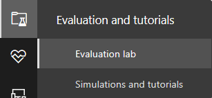
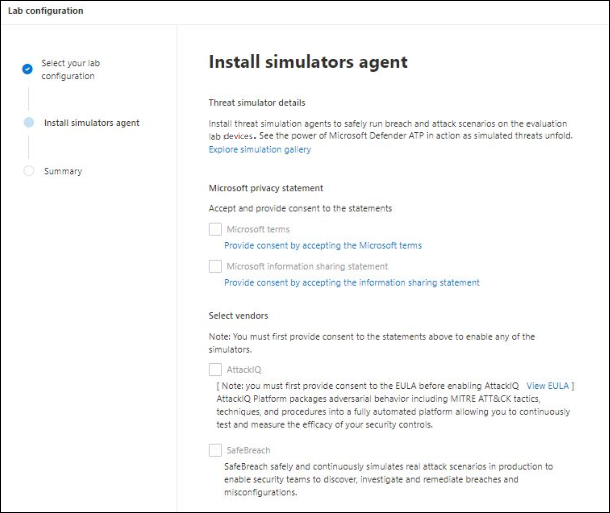

# Microsoft Defender for Endpoint 評估實驗室

[!INCLUDE [Microsoft 365 Defender rebranding](../../includes/microsoft-defender.md)]

**適用於：**
- [適用於端點的 Microsoft Defender](https://go.microsoft.com/fwlink/?linkid=2154037)
- [Microsoft 365 Defender](https://go.microsoft.com/fwlink/?linkid=2118804)

>想要體驗適用於端點的 Microsoft Defender 嗎？ [注册免費試用版。](https://www.microsoft.com/microsoft-365/windows/microsoft-defender-atp?ocid=docs-wdatp-enablesiem-abovefoldlink)

進行完整的安全性產品評估可能是複雜的程式，需要很繁瑣的環境和裝置設定，才能實際執行端對端的攻擊模擬。 新增至複雜性是追蹤評估期間反映類比活動、警示和結果的難度。

Microsoft Defender for Endpoint 評估實驗室的設計是為了消除裝置和環境設定的複雜性，使您能夠專注于評估平臺的功能、執行模擬，以及查看動作中的預防、偵測和修正功能。

> [!VIDEO https://www.microsoft.com/en-us/videoplayer/embed/RE4qLUM]

使用簡化的設定體驗，您可以將重點放在執行您自己的測試案例和預先類比，以查看如何執行的 Defender for Endpoint。 

您將擁有平臺強大功能的完整存取權，例如自動化調查、高級搜尋和威脅分析，可讓您測試已提供的 Defender for Endpoint 的綜合保護堆疊。 

您可以將預先設定的 Windows 10 或 Windows Server 2019 裝置，新增至適當的作業系統版本和正確的安全性元件，以及已安裝的 Office 2019 Standard。

您也可以安裝威脅模擬器。 Defender for Endpoint 已與業界領先的威脅類比平臺合作，協助您測試用於端點功能的 Defender，而不需要離開入口網站。

 安裝您慣用的模擬器、在評估實驗室內執行案例，並立即查看平臺的執行方式-所有可方便您免費取得，而不需要額外成本。 您也可以輕鬆存取您可以從模擬目錄存取及執行的大量類比。
    

## 開始之前
您將需要履行 [授權需求](minimum-requirements.md#licensing-requirements) ，或擁有 Microsoft Defender for Endpoint 的試用存取權，才能存取評估實驗室。

您必須具有「 **管理安全性設定** 」許可權，才能執行下列動作：
- 建立實驗室
- 建立裝置
- 重設密碼
- 建立模擬 
 
如果您已啟用角色型存取控制 (RBAC) 並建立至少一部機器群組，使用者必須能夠存取所有機器群組。

如需詳細資訊，請參閱 [Create and manage roles](user-roles.md)。

想要體驗適用於端點的 Microsoft Defender 嗎？ [注册免費試用版。](https://www.microsoft.com/microsoft-365/windows/microsoft-defender-atp?ocid=docs-wdatp-main-abovefoldlink)

## 開始使用實驗室
您可以從功能表存取 lab。 在 [流覽] 功能表中，選取 [ **評估與示教 > 評估實驗室**]。

>[!NOTE]
>- 視您所選取的環境結構類型而定，裝置會在啟用後的指定時數內使用。
>- 每個環境都配有一組有限的測試裝置。 當您已使用已布建的裝置時，不會提供任何新裝置。 已刪除的裝置不會重新整理可用的測試裝置計數。
>- 當資源已使用中時，您將無法再使用實驗。 它不會重設或重新整理。
>- 建議您謹慎使用資源。實驗室資源有限。 它們不會重設或重新整理。 

已經有實驗室？ 請務必啟用新的威脅模擬器，並具有作用中裝置。

## 設定評估實驗室

1. 在功能窗格中，選取 [**評估與教程**  >  **評估實驗室**]，然後選取 [**安裝實驗室**]。

    

2. 視您的評估需求而定，您可以選擇在較短的期間內使用較少的裝置來設定環境，而不是更長的時間。 選取您偏好的實驗室設定，然後選取 **[下一步]**。

     

3.  (選用) 您可以選擇在實驗室中安裝威脅模擬器。 

    

    >[!IMPORTANT]
    >您必須先接受並提供條款和資訊共用語句的同意。 

4. 選取您要使用的威脅模擬代理程式，並輸入您的詳細資料。 您也可以選擇稍後安裝威脅模擬器。 如果您選擇在實驗室設定期間安裝威脅模擬代理程式，您可以享受在所加入的裝置上輕鬆安裝的優點。  
    
    

5.  查看摘要，然後選取 [ **安裝實驗室**]。  

實驗室安裝程式完成後，您可以新增裝置和執行模擬。 

## 新增裝置
當您在環境中新增裝置時，終結點會設定具有連線詳細資料的完善設定裝置。 您可以新增 Windows 10 或 Windows Server 2019 裝置。

裝置會設定為最新版本的作業系統和 Office 2019 Standard，以及其他應用程式，例如 JAVA、Python 和 SysIntenals。 

   >[!TIP]
   > 您的實驗室中需要更多裝置？ 提交支援票證，以供 Endpoint 小組的 Defender 檢查要求。 

如果您選擇在實驗室設定期間新增威脅模擬器，所有裝置都會在您新增的裝置中安裝威脅模擬器代理程式。

裝置將會自動架至您的租使用者，並將建議的 Windows 安全性元件開啟和稽核模式-無需任何工作。 

在測試裝置中預先設定下列安全性元件：

- [攻擊面縮減](https://docs.microsoft.com/windows/security/threat-protection/windows-defender-exploit-guard/attack-surface-reduction-exploit-guard)
- [第一次看到的封鎖](https://docs.microsoft.com/windows/security/threat-protection/microsoft-defender-antivirus/configure-block-at-first-sight-microsoft-defender-antivirus)
- [受控資料夾存取權](https://docs.microsoft.com/windows/security/threat-protection/windows-defender-exploit-guard/controlled-folders-exploit-guard)
- [入侵防護](https://docs.microsoft.com/windows/security/threat-protection/windows-defender-exploit-guard/enable-exploit-protection)
- [網路保護](https://docs.microsoft.com/windows/security/threat-protection/windows-defender-exploit-guard/network-protection-exploit-guard)
- [可能有害的應用程式偵測](https://docs.microsoft.com/windows/security/threat-protection/microsoft-defender-antivirus/detect-block-potentially-unwanted-apps-microsoft-defender-antivirus)
- [雲端提供的保護](https://docs.microsoft.com/windows/security/threat-protection/microsoft-defender-antivirus/utilize-microsoft-cloud-protection-microsoft-defender-antivirus)
- [Microsoft Defender SmartScreen](https://docs.microsoft.com/windows/security/threat-protection/windows-defender-smartscreen/windows-defender-smartscreen-overview)

>[!NOTE]
> Microsoft Defender 防病毒會在 (不是在審計模式) 中。 如果 Microsoft Defender 防病毒封鎖您執行類比，您可以透過 Windows 安全性關閉裝置上的即時保護。 如需詳細資訊，請參閱 [Configure always on protection](https://docs.microsoft.com/windows/security/threat-protection/microsoft-defender-antivirus/configure-real-time-protection-microsoft-defender-antivirus)。

自動調查設定會因租使用者設定而異。 預設會將其設定為半自動。 如需詳細資訊，請參閱 [自動化調查的概述](automated-investigations.md)。

>[!NOTE]
>使用 RDP 進行與測試裝置的連線。 請確定您的防火牆設定允許 RDP 連線。

1. 從儀表板中，選取 [ **新增裝置**]。 

2. 選擇要新增的裝置類型。 您可以選擇新增 Windows 10 或 Windows Server 2019。

    

    >[!NOTE]
    >如果在建立裝置時出現問題，您將會收到通知，您必須提交新的要求。 如果裝置建立失敗，不會將它計入總允許配額。 

3. 隨即會顯示連線詳細資料。 選取 [ **複製** ]，以儲存裝置的密碼。

    >[!NOTE]
    >密碼只會顯示一次。 請務必將其儲存以供日後使用。

    

4. 裝置設定開始。 這可能需要大約30分鐘。 

5. 選取 [ **裝置** ] 索引標籤，查看測試裝置的狀態、風險和暴露程度，以及模擬程式安裝的狀態。 

    ![[裝置影像] 索引標籤](images/machines-tab.png)
    

    >[!TIP]
    >在 [ **模擬器狀態** ] 欄中，您可以將游標移到資訊圖示上，以瞭解代理程式的安裝狀態。

## 類比攻擊案例
透過連線來執行您自己的攻擊模擬，以使用測試裝置。 

您可以使用下列方式模擬攻擊案例：
- 「 [自行執行它」攻擊案例](https://securitycenter.windows.com/tutorials)
- 威脅模擬器

您也可以使用 [高級搜尋](advanced-hunting-query-language.md) 查詢資料和 [威脅分析](threat-analytics.md) ，以查看有關新興威脅的報告。

### 自行攻擊案例
如果您正在尋找預先類比，您可以使用我們「 [自己動手」的攻擊案例](https://securitycenter.windows.com/tutorials)。 這些腳本是安全、有記錄且便於使用。 這些案例會反映 Defender 的端點功能，並引導您完成調查經驗。

>[!NOTE]
>使用 RDP 進行與測試裝置的連線。 請確定您的防火牆設定允許 RDP 連線。

1. 選取 **[** 連線]，以連線至您的裝置並執行攻擊模擬。 

    ![測試裝置的 [連接] 按鈕影像](images/test-machine-table.png)

2. 選取 [連線 **]** 以儲存 RDP 檔案並加以啟動。

    

    >[!NOTE]
    >如果您沒有在初始設定期間儲存的密碼複本，您可以從功能表中選取 [ **重設密碼** ] 以重設密碼：  
    > 裝置會將其狀態變更為「執行重新設定密碼」，然後您會在幾分鐘內看到新的密碼。

3. 輸入在裝置建立步驟中顯示的密碼。 

   

4. 在裝置上執行自行攻擊模擬。 

### 威脅模擬案例
如果您選擇在實驗室設定期間安裝任何受支援的威脅模擬器，您可以在評估實驗室裝置上執行內建模擬。 

使用協力廠商平臺執行威脅模擬是一種很好的方法，可以在實驗室環境的範圍內評估 Microsoft Defender for Endpoint 功能。

>[!NOTE]
>在您可以執行模擬之前，請確定符合下列需求：
>- 裝置必須新增至評估實驗室
>- 威脅模擬器必須安裝在評估實驗室中

1. 從入口網站選取 [ **建立類比**]。

2. 選取威脅模擬器。

    

3. 選擇類比或查看類比圖庫，以流覽可用模擬。 

    您可以從下列專案進入類比庫：
    - **模擬一覽表** 磚中的主要評估儀表板或
    - 透過流覽流覽窗格 **評估與示教**  >  **類比 & 教學** 課程，然後選取 [**模擬目錄**]。

4. 選取您要在其中執行模擬的裝置。

5. 選取 [ **建立類比**]。

6. 選取 [ **模擬** ] 索引標籤，以查看模擬的進度。查看類比狀態、作用中警示和其他詳細資料。 

    
    
執行模擬後，我們鼓勵您逐步完成實驗室進度列，並探索 **Microsoft Defender For Endpoint 會觸發自動調查和修正**。 查看由功能收集及分析的證據。

使用豐富的查詢語言和原始遙測，並查看在威脅分析中所記錄的一些世界範圍威脅，以透過「高級搜尋」搜尋攻擊證據。

## 類比圖庫
Microsoft Defender for Endpoint 已與各種威脅模擬平臺產生合作，讓您能輕鬆地從入口網站中測試平臺的功能。 

從功能表移至 [**類比] 和 [教程**  >  **模擬] 目錄**，以查看所有可用的模擬。 

列出支援的協力廠商威脅模擬代理程式清單，並在目錄上提供特定類型的模擬，以及詳細描述。 

您可以從目錄輕鬆執行任何可用的類比。  

每個類比都具有攻擊案例的深入描述，如使用的 MITRE 攻擊技術和您執行的高級搜尋查詢範例。

**範例：** 
 

## 評估報告
實驗室報告會摘要在裝置上進行模擬的結果。

您很快就能看到：
- 觸發的事件
- 產生的提醒
- 針對公開層級的評估 
- 觀測威脅類別
- 偵測來源
- 自動化調查

## 提供意見反應
您的意見反應可協助我們從高級攻擊中保護您的環境。 與產品功能和評估結果共用您的經驗與印象。

您可以選擇 [ **提供意見** 反應]，讓我們知道您的想法。

